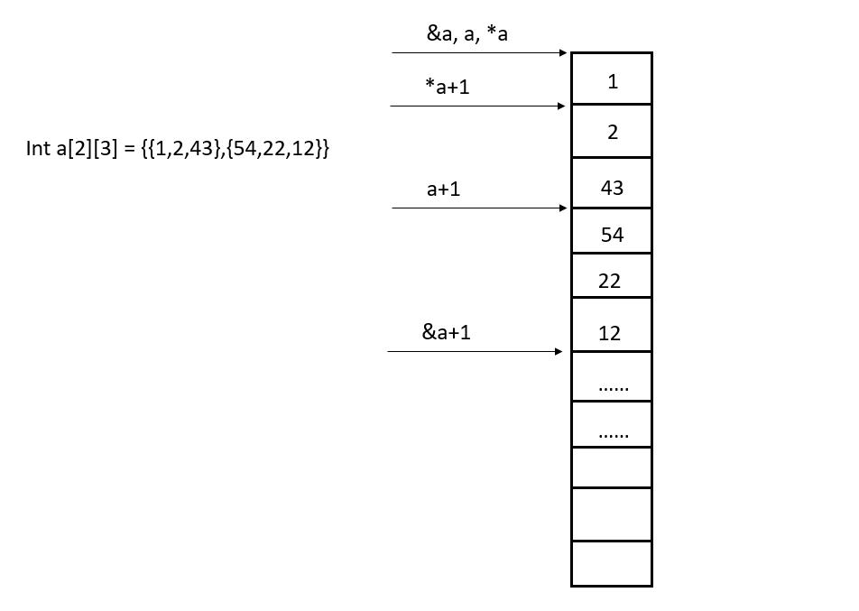

> 以下未特别申明的内容，均是指C。

> 推荐的编程环境为小熊猫C++

# 0 基本概念

## 0.1 左值与右值

左值是指可以出现在等号左边的变量或表达式，它最重要的特点就是**可写（可寻址）**。也就是说，它的值可以被修改，如果一个变量或表达式的值不能被修改，那么它就不能作为左值。
右值是指只可以出现在等号右边的变量或表达式。它最重要的特点是**可读**。一般的使用场景都是把一个右值赋值给一个左值。
通常，**左值可以作为右值，但是右值不一定是左值。**

1. 左值可以寻址，而右值不可以。  
2. 左值可以被赋值，右值不可以被赋值，可以用来给左值赋值。  
3. 左值可变,右值不可变（仅对基础类型适用，用户自定义类型右值引用可以通过成员函数改变）。  

## 0.2 短路求值

1. 对于或运算（`||`）来说，只要前一个条件为真，则可以不去考虑后一个条件，直接返回真；
2. 对于与运算（`&&`）来说，只要前一个条件为假，则可以不去考虑后一个条件，直接返回假。

## 0.3 ++a与a++

```c
a++的运算过程可以类比为
int temp = a;
a=a+1;
return temp;
++a的具体运算过程为
a=a+1;
return a;
```

因此前置自增运算符的效率更高。

## 0.4 原码、反码、补码

整型数值在计算机的存储里，最左边的一位代表符号位，0 代表正数，1 代表负数。

1. 原码：为二进制的数，如： 10 原码为 0000 1010
2. **反码：正数的反码与原码相同**，如10 原码为 0000 1010，反码为0000 1010，负数为原码 0 变 1， 1 变 0，（符号位不变），如 -10 原码为 1000 1010，反码为 1111 0101
3. 补码：正数的补码与原码相同，如 10 原码为 0000 1010，补码为0000 1010，负数的补码为反码加 1，如 -10 反码为 1111 0101，补码为 1111 0110

**反码的作用：**实现减法变加法，通过加法器实现减法功能

1. **正数**的**反码保持**原码**不变**
2. **负数除最高位**（正负符号位）外，**全部取反**

**补码的作用**：除了使计算机不用区分加减法以外，在加、减运算的时候，硬件层面上还可以不用区分正负数（符号位没有特殊处理）。

1. **因为**“0”**这个特殊数字的存在，**对于反码来说`0_0000000 = +0`，`1_1111111 = -0`，这两者是相同的
2. 补码的作用就是把0作为正数，`0_0000000 = +0`表示0，`1_1111111 = -128`

## 0.5 C/C++有几种传值方式  

C：

1. 值传递：传入是实参的一个拷贝，形参；
2. 指针传递（本质就是值传递，或可以称为传址传递）：传入一个指针形参，指针的实参指向不会发生变化，但可以通过指针形参来修改指针的实参指向的值；

C++相比C多了一个引用传递：

1. 引用传递：形参在函数体内值发生变化，同时会影响实参的值。

## 0.6 int main(int argc, char ** argv)  

类比RTThread的MSH命令行

1.  `int` 型的 `argc`，为整型，用来统计程序运行时发送给`main`函数的命令行参数的个数。
2.  `char*`型的 `argv[]`，为字符串数组，用来存放指向字符串的指针元素，每一个指针元素指向一个字符串参数。各成员含义如下：
    - `argv[0]`指向程序运行的全路径名
    - `argv[1]`指向在 DOS 命令行中执行程序名后的第一个字符串  
    - `argv[2]`指向执行程序名后的第二个字符串  
    - ……
    - `argv[argc-1]`指向执行程序名后的最后一个字符串  
    - `argv[argc]`为 `NULL`  

# 1 关键字

## 1.1 #define 替换

### # 字符串化操作符  

作用：

1. 预处理器标识符
2. 把一个宏的参数转换成字符串。其只能用于有传入参数的宏定义中，且必须置于宏定义体中的参数名前。

```c
#define example(insr)	printf("the intput string is: %s\n", #insr)

example(abc);
```

### ## 符号连接操作符

作用：把位于两边的符号连接成一个符号

1. 当用##连接形参时，##前后的空格可有可无；
2. 连接后的实际参数名，必须为实际存在的参数名或是编译器已知的宏定义；
3. 如果##后的参数本身也是一个宏的话，##会阻止这个宏的展开。

```c
#define STRCPY(a, b) strcpy(a ## _p, #b)

int main()
{
    char var1_p[20];
    char var2_p[30];
    strcpy(var1_p, "aaaa");
    strcpy(var2_p, "bbbb");
    STRCPY(var1, var2);
    STRCPY(var2, var1);
    printf("var1 = %s\n", var1_p);
    printf("var2 = %s\n", var2_p);
    //STRCPY(STRCPY(var1,var2),var2);
    //这里是否会展开为： strcpy(strcpy(var1_p,"var2")_p,"var2“）？答案是否定的：
    //展开结果将是： strcpy(STRCPY(var1,var2)_p,"var2")
    //## 阻止了参数的宏展开!如果宏定义里没有用到 # 和 ##, 宏将会完全展开
    // 把注释打开的话，会报错:implicit declaration of function 'STRCPY'
    return 0;
}
```

## 1.2 volatile

volatile提醒编译器它后面所定义的变量随时都有可能改变，因此编译后的程序每次需要存储或读取这个变量的时候，告诉编译器对该变量不做优化，都会直接从变量内存地址中读取数据，从而可以提供对特殊地址的稳定访问。。如果没有volatile关键字，则编译器可能优化读取和存储，可能暂时使用寄存器中的值，如果这个变量由别的程序更新了的话，将出现不一致的现象。（简洁的说就是：volatile关键词影响编译器编译的结果，用volatile声明的变量表示该变量随时可能发生变化，与该变量有关的运算，不要进行编译优化，以免出错）

> 频繁地使用volatile很可能会增加代码尺寸和降低性能,因此要合理的使用volatile。

### 1.2.1 一个中断服务程序中修改的供其他程序检测的变量

volatile的作用是作为指令关键字，确保本条指令不会因编译器的优化而省略，且要求每次直接读值。如果没有volatile关键字，则编译器可能优化读取和存储，可能暂时使用寄存器中的值，如果这个变量由别的程序更新了的话，将出现不一致的现象。在单片机开发中等待某个时间的触发并相应经常会有如下程序：

```c
Boolean flag=0;
void test()
{
	do1();
	while(flag==0);
	do2();
}
```

这段程序等待内存变量flag的值变为1之后才运行do2()。变量flag的值由别的程序更改，这个程序可能是某个硬件中断服务程序。例如

```c
void EXTI2_IRQHandler(void)
{
	delay_ms(10);	//消抖
	if(KEY2==0)	  
	{				 
   flag=1; 
	}		 
	 EXTI_ClearITPendingBit(EXTI_Line2);//清除LINE2上的中断标志位 
}
```

flag值被按键KEY2的中断服务函数修改成为1，一旦KEY2被按下则flag被置为1。如果flag变量不被声明为volatile，则编译器并不知道flag的值会被别的程序修改，因此在它进行优化的时候，可能会把flag的值先读入某个寄存器，然后等待那个寄存器变为1。如果不幸进行了这样的优化，那么while循环就变成了死循环，因为寄存器的内容不可能被中断服务程序修改。为了让程序每次都读取flag变量真正的值，应该定义为：`volatile Boolean flag=0;`

### 1.2.2 多线程环境下各任务间共享的标志应该加volatile

多线程环境下各任务间共享的标志应该加volatile。

### 1.2.3 存储器映射的硬件寄存器

并行设备的硬件寄存器，存储器映射的硬件寄存器通常也要加volatile说明，因为每次对它的读写都可能有不同意义（寄存器随时可以被外设硬件修改）

### 1.2.4 一个参数既可以是const还可以是volatile吗？

可以。一个例子是**只读（对程序来说只读）的状态寄存器，**它是volatile，因为它可能被意想不到地改变，它是const，是因为程序不应该试图去修改它。

这种情况通常指向存储器映射的硬件寄存器。

### 1.2.5 正确使用volatile

```c
int square(volatile int *ptr)
{
    return *ptr * *ptr;
}
```

对于以上函数来说，该程序的目的是用来返指针\*ptr指向值的平方，但是，由于*ptr指向一个volatile型参数，编译器将产生类似下面的代码：

```c
int square(volatile int *ptr)
{
    int a,b;
    a = *ptr;
    b = *ptr;
    return a * b;
}
```

**由于*ptr的值可能被意想不到地该变，因此a和b可能是不同的。**结果，这段代码可能返不是你所期望的平方值！正确的代码如下：

```c
long square(volatile int *ptr)
{
    int a;
    a = *ptr;
    return a * a;
}
```

## 1.3 static

1. 作用于全局变量，限制其作用域，只能被当前文件使用；
2. 作用于函数内部的局部变量，**只会初始化一次**。当一个函数返回后，下一次再调用时，该变量还会保持上一回的值，函数内部的静态变量只开辟一次空间，且不会因为多次调用产生副本，也不会因为函数返回而失效；
3. 作用于类的成员，解决同一个类的不同对象之间数据和函数共享问题。静态成员在每一个类中只有一个副本，由该类所有对象共同维护和使用，从而实现同一个类的不同对象数据和函数共享。

### 1.3.1 static 变量为什么只初始化一次

**对于所有的对象（不仅仅是静态对象），初始化都只有一次**，而由于静态变量具有“记忆”功能，初始化后，一直都没有被销毁，都会保存在内存区域中，所以不会再次初始化。存放在静态区的变量的生命周期一般比较长，它与整个程序“同生死、共存亡”，所以它只需初始化一次。而auto变量，即自动变量，由于它存放在栈区，一旦函数调用结束，就会立刻被销毁。

> 一般存放在.bss段（未初始化）或.data段（初始化），不在堆栈区。

## 1.4 extern”C”  

extern "C"的主要作用就是为了能够正确实现C++代码调用其他C语言代码。加上extern "C"后，会指示编译器这部分代码按C语言的进行编译，而不是C++的。  

## 1.5 const

1. 定义变量（局部变量或全局变量）为常量；
2. 修饰函数的参数，表示在函数体内不能修改这个参数的值；
3. 修饰函数的返回值；
   - 如果给用 const修饰返回值的类型为指针，那么函数返回值（即指针）的内容是不能被修改的，而且这个返回值只能赋给被 const修饰的指针；
   - 如果用 const修饰普通的返回值，如返回int变量，由于这个返回值是一个临时变量，在函数调用结束后这个临时变量的生命周期也就结束了，因此把这些返回值修饰为 const是没有意义的。

4. 节省RAM空间，避免不必要的内存分配，存放在`.rodata段`或相应的ROM内。

## 1.6 new/delete与malloc/free的区别

1. new、delete是C++中的操作符，而malloc和free是标准库函数；
2. malloc仅仅分配内存空间，free仅仅释放内存空间，不调用构造和析构函数。new在动态分配内存的时候可以初始化对象，调用其构造函数，delete在释放内存时调用对象的析构函数；
3. malloc和free返回的是void类型指针（必须进行强制类型转换），new和delete返回的是具体类型指针；
4. new 自动计算要分配的空间大小，malloc需要手工计算。

## 1.7 sizeof和strlen

```c
strlen("\0") =0，sizeof("\0")=2
```

1. `sizeof`是**关键字，也是运算符，但不是函数**，`strlen`是标准库中的一个函数；
2. `sizeof`后如果是类型，则必须加括弧，如果是变量名，则可以不加括弧；
3. `sizeof`运算符的结果类型是 `size_t`，它的大小随CPU架构而变，一般而言，**该类型保证能够容纳实现所建立的最大对象的字节大小**；
4. `sizeof`可以用类型作为参数， `strlen`只能用`char*`作参数，而且必须是以`"\0"`结尾的，`sizeof`还可以以函数作为参数，如`int g()`，则`sizeof(g())`的值等于`sizeof(int)`的值，在32位计算机下，该值为4；
5. 大部分编译程序的 `sizeof`都是在编译的时候计算的，所以可以通过 `sizeof(x)`来定义数组维数。而 `strlen`则是在运行期计算的，用来计算字符串的实际长度，不是类型占内存的大小。例如，`char str[20] = "012345678"`，字符数组`str`是编译期大小已经固定的数组，在32位机器下，为`sizeof(char)*20=20`，而其 `strlen`大小则是在运行期确定的，所以其值为字符串的实际长度`10`；
6. 当数组作为参数传给函数时，传递的是指针，而不是数组，即传递的是数组的首地址，因此我们不能在其他函数（对局部变量数组名来说）或其他文件（对文件内全局变量来说）中使用sizeof(指针名)来计算数组长度。

### 1.7.1 不使用 sizeof，如何求int占用的字节数  

```c
#include <stdio.h>
#define MySizeof(Value) (char *)(&value+1)-(char*)&value
int main()
{
    int i ;
    double f;
    double *q;
    printf("%d\r\n",MySizeof(i));
    printf("%d\r\n",MySizeof(f));
    printf("%d\r\n",MySizeof(a));
    printf("%d\r\n",MySizeof(q));
    return 0;
}
```

## 1.8 struct 和 union对比

**同**

1. 由多个不同的数据类型成员组成，定义结构类似，都是常见的复合结构；

**异**

1. struct的所有成员都有各自的内存空间（在不考虑字节对齐的情况下，struct的长度为所有成员的总长度），union的所有成员共用内存空间（该内存空间的长度为最长的成员的长度）；
2. struct 的不同成员赋值互不影响，union 的不同成员赋值会影响其他成员的值（因为共用内存空间）。

## 1.9 size_t

使用size_t可能会提高代码的可移植性、有效性或者可读性，或许同时提高这三者。

​		在标准C库中的许多函数使用的参数或者返回值都是表示的用字节表示的对象大小，比如说malloc(n) 函数的参数n指明了需要申请的空间大小，还有memcpy(s1, s2, n)的最后一个参数，表明需要复制的内存大小，strlen(s)函数的返回值表明了以’\0’结尾的字符串的长度（不包括’\0’），其返回值并不是该字符串的实际长度，因为要去掉’\0’。
　　或许你会认为这些参数或者返回值应该被申明为int类型（或者long或者unsigned），但是事实上并不是。C标准中将他们定义为size_t。标准中记载malloc的申明应该出现在，定义为：

```c
void *malloc(size_t n);
```

memcpy和strlen的申明应该出现在中：

```c
void *memcpy(void *s1, void const *s2, size_t n);
size_t strlen(char const *s);
```

　　size_t还经常出现在C++标准库中，此外，C++库中经常会使用一个相似的类型size_type，用的可能比size_t还要多。
　　据我所知，大部分的C和C++程序员害怕这些库使用size_t，因为他们不知道size_t代表什么或者为什么这些库需要使用它，归根结底，原因在于他们什么时候什么地方需要用到它。

### 1.9.1 可移植性问题

　　早期的C语言（由Brian Kernighan 和 Dennis Ritchie 在The C Programming Language书中所写，Prentice-Hall, 1978）并没有提供size_t类型，C标准委员会为了解决移植性问题将size_t引入，举例如下：
　　让我们来写一个可移植的标准memcpy函数，我们将会看到一些不同的申明和它们在不同平台不同大小的地址空间上编译下的情况。
　　回忆memcpy(s1, s2, n)函数，它将s2指向地址开始的n个字节拷贝到s2指向的地址，返回s1，这个函数可以拷贝任何数据类型，所以参数和返回值的类型应该为可以指向任何类型的void*，同时，源地址不应该被改变，所以第二个参数s2类型应该为void const *，这些都不是问题。
　　真正的问题在于我们如何申明第三个参数，它代表了源对象的大小，我相信大部分程序员都会选择int：

```c
void *memcpy(void *s1, void const *s2, int n);
```

　使用int类型在大部分情况下都是可以的，但是并不是所有情况下都可以。int是有符号的，它可以表示负数，但是，大小不可能是复数。所以我们可以使用unsigned int代替它让第三个参数表示的范围更大。
　　在大部分机器上，unsigned int的最大值要比int的最大值大两倍，比如说再也给16位的机器上，unsigned int的最大值为65535，int的最大值为32767。
　　尽管int类型的大小依赖于C编译器的实现，但是在给定的平台上int对象的大小和unsigned int对象的大小是一样的。因此，使用unsigned int修饰第三个参数的代价与int是相同的：

```c
void *memcpy(void *s1, void const *s2, unsigned int n);  
```

​		这样似乎没有问题了，unsigned int可以表示最大类型的对象大小了，这种情况只有在整形和指针类型具有相同大小的情况下，比如说在IP16中，整形和指针都占2个字节（16位），而在IP32上面，整形和指针都占4个字节（32位）。（参见下面C数据模型表示法）

```markdown
C数据模型表示法
　　最近，我偶然发现几篇文章，他们使用简明的标记来表述不同目标平台下c语言数据的实现。我还没有找到这个标记的来源，正式的语法，甚至连名字都没有，但他似乎很简单，即使没有正规的定义也可以很容易使用起来。这些标记的一边形式形如：
　　I nI L nL LL nLL P nP。   
　　其中每个大写字母（或成对出现）代表一个C的数据类型，每一个对应的n是这个类型包含的位数。I代表int，L代表long，LL代表long long，以及P代表指针（指向数据，而不是函数）。每个字母和数字都是可选的。   
　　例如，I16P32架构支持16位int和32位指针类型，没有指明是否支持long或者long long。如果两个连续的类型具有相同的大小，通常省略第一个数字。例如，你可以将I16L32P32写为I16LP32，这是一个支持16位int，32位long，和32位指针的架构。  
　　标记通常把字母分类在一起，所以可以按照其对应的数字升序排列。例如，IL32LL64P32表示支持32位int，32位long，64位long long和32位指针的架构；然而，通常写作ILP32LL64。  
```

​		不幸的是，这种memcpy的申明在I16LP32架构上（整形是16-bit 长整形和指针类型时32-bits）显得不够用了，比如说摩托罗拉第一代处理器68000，在这种情况下，处理器可能拷贝的数据大于65535个字节，但是这个函数第三个参数n不能处理这么大的数据。
　　什么？你说很容易就可以改正？只需要把memcpy的第三个参数的类型修改一下：

```c
void *memcpy(void *s1, void const *s2, unsigned long  n); 
```

​		你可以在I16LP32目标架构上使用这个函数了，它可以处理更大的数据。而且在IP16和IP32平台上效果也还行，说明它确实给出了memcpy的一种移植性较好的申明。但是，在IP16平台上相比于使用`unsigned int`，你使用`unsigned long`可能会使你的代码运行效率大打折扣（代码量变大而且运行变慢）。
　　在标准C中规定，长整形（无论无符号或者有符号）至少占用32位，因此在IP16平台上支持标准C的话，那么它一定是IP16L32 平台。这些平台通常使用一对16位的字来实现32位的长整形。在这种情况下，移动一个长整形需要两条机器指令，每条移动一个16位的块。事实上，这个平台上的大部分的32位操作都需要至上两条指令。
　　因此，以可移植性为名将memcpy的第三个参数申明为unsigned long而降低某些平台的性能是我们所不希望看到的。使用size_t可以有效避免这种情况。
　　size_t类型是一个类型定义，**通常将一些无符号的整形定义为size_t**，比如说unsigned int或者unsigned long，甚至unsigned long long。每一个标准C实现应该选择足够大的无符号整形来代表该平台上最大可能出现的对象大小。

#### 1.9.2 使用size_t

　　size_t的定义在<stddef.h>, <stdio.h>, <stdlib.h>, <string.h>, <time.h>和<wchar.h>这些标准C头文件中，也出现在相应的C++头文件, 等等中，你应该在你的头文件中至少包含一个这样的头文件在使用size_t之前。 　　

​		包含以上任何C头文件（由C或C++编译的程序）表明将size_t作为全局关键字。包含以上任何C++头文件（当你只能在C++中做某种操作时）表明将size_t作为std命名空间的成员。 　　		

​		根据定义，size_t是sizeof关键字（注：sizeof是关键字，并非运算符）运算结果的类型。所以，应当通过适当的方式声明n来完成赋值：

```c
n = sizeof(thing);
```

　　考虑到可移植性和程序效率，n应该被申明为size_t类型。类似的，下面的foo函数的参数也应当被申明为sizeof：

```c
foo(sizeof(thing));
```

　　参数中带有size_t的函数通常会含有局部变量用来对数组的大小或者索引进行计算，在这种情况下，size_t是个不错的选择。
　　适当地使用size_t还会使你的代码变得如同自带文档。当你看到一个对象声明为size_t类型，你马上就知道它代表字节大小或数组索引，而不是错误代码或者是一个普通的算术值。

# 2 内存

## 2.1 内存分配方式

### 2.1.1 静态存储区分配

存放在`.rwdata`段和`.bss`段，内存分配在程序编译过程中完成，且在程序的整个运行期间都存在，例如初始化或未初始化的全局变量和静态变量等。

### 2.1.2 栈上分配

存放在栈区，局部变量。

### 2.1.3 堆上分配

malloc 或 new的对象。

## 2.2 堆和栈

1. **申请方式不同**：栈的空间由操作系统自动分配/释放，堆上的空间手动分配/释放（`malloc+free`，`new+delete`）；
2. 申请大小的限制：
   - 栈可以申请的空间有限，**栈是向低地址扩展的数据结构（向下增长）**，栈顶的地址和栈的最大容量是系统预先规定好的（通过链接脚本修改），如果申请的空间超过栈的剩余空间时，将会提示错误信息，因此，能栈获得的空间较小；
   - 堆是很大的自由存储区。堆是**向高地址扩展（向上增长）**的数据结构，是不连续的内存区域（**在32中一般是连续的**）。这是由于系统是用链表来存储的空闲内存地址的，自然是不连续的，而链表的遍历方向是由低地址向高地址。堆的大小受限于计算机系统中有效的虚拟内存。由此可见，堆获得的空间比较灵活，也比较大  

3. 申请效率：
   - 栈由系统自动分配，速度较快。但程序员是无法控制的；
   - 堆是由`new/malloc`分配的内存，一般速度比较慢，而且容易产生内存碎片，不过用起来最方便。

### 2.2.1 栈的作用

1. C语言中，栈用来存储临时变量，临时变量包括**函数参数**和**函数内部定义的局部变量**、函数调用中和函数调用相关的**函数返回地址**，函数中的**临时变量**，**寄存器**等，函数调动返回后从栈中恢复寄存器和临时变量等函数运行场景。
2. **栈是多线程编程的基石**，**每一个线程都有一个属于自己的栈**，**用来存放该线程运行时各个函数的临时变量**，**每个中断和异常出来也具有专属的栈**。

### 2.2.2 形参压栈顺序

从右至左，因为从左到右的入栈方式会使得最前面的参数压在栈底，无法通过指针的移动取得最左边的参数。

C语言参数入栈顺序的好处就是可以动态变化参数个数。自左向右的入栈方式，最前面的参数被压在栈底。除非知道参数个数，否则是无法通过栈指针的相对位移求得最左边的参数。这样就变成了左边参数的个数不确定，正好和动态参数个数的方向相反。因此，Ｃ语言函数参数采用自右向左的入栈顺序，**主要原因是为了支持可变长参数形式。**  

## 2.3 内存泄漏

申请了一块内存空间，使用完毕后没有释放掉。

它的一般表现方式是程序运行时间越长，占用内存越多，最终用尽全部内存，整个系统崩溃。由程序申请的一块内存，且没有任何一个指针指向它（**与野指针的概念相关**），那么这块内存就泄露了。

### 2.3.1 如何判断内存泄漏

1. 自身写程序有规范，使用到内存分配后一定要进行释放；
2. 用链表的形式管理分配的内存的指针，使用后从链表删除，程序结束后还可以检查链表（**有这种需求直接上RTOS吧**）；
3. Boost 中的smart pointer；
4. 一些常见的工具插件，如ccmalloc、Dmalloc、Leaky等等。

> 后两点应该针对的都是C++

# 3 指针

**使用指针的注意点**

1. 定义指针时，先初始化为`NULL`；
2. 用`malloc`申请内存之后，应该立即检查指针值是否为`NULL`，防止使用指针值为`NULL`的内存；
3. 不要忘记为数组和动态内存赋初值，防止将未被初始化的内存作为右值使用；
4. 避免数字或指针的下标越界，特别要当心发生“多1”或者“少1”操作；
5. 动态内存的申请与释放必须配对，防止内存泄漏；
6. 用`free`或`delete`释放了内存之后，立即将指针设置为`NULL`，防止“野指针”。

## 3.1 数组名与指针

1. **数组名是个指针常量，指向数组第一个元素的地址**。而指针保存的也是目标数据地址，因此可以将数组名赋给一个指针。
2. 数组名是指针常量，**数组名只有可读权限**，没有可写权限，即`a++, a=p`这些操作都是不可以的。`sizeof`数组名，得到的是数组大小，而`sizeof`指针，在32位计算机下，大小一直为4；
3. 只有对数组名取地址（&数组名）时，**数组名才表示整个数组**，内存偏移量是整个数组的大小（sizeof(数组名)）；
4. 指针对数据的访问方式是间接访问，需要用到解引用符号`(*数组名)`，数组对数据的访问则是直接访问，可通过下标访问或数组名+元素偏移量的方式。

## 3.2 数组指针与指针数组

1. 数组指针：是指针，指针变量a指向一维数组，`int(*a)[4]`，a也是行指针

2. 指针数组：是数组，存储的是指针变量，`int *a[4]`

## 3.3 指针运算

### 3.3.1 `指针 ± 整数`

需要记住一点，`指针加减一个整数是另一个指针`，这中间的间隔由指针的类型决定，间隔的数量由整数的大小决定。



```c
#include "stdio.h"

int main()
{
	int a[2][3] = {
		{1, 2, 43},
		{54, 22, 12},
	};
	
	int *p = &a + 1;
	
	printf("&a: %ld\r\n", &a);
	printf("a: %ld\r\n", a);
	printf("*a: %ld\r\n", *a);
	
	printf("*a + 1: %ld\r\n", *a + 1);
	printf("a + 1: %ld\r\n", a + 1);
	
	printf("*(*a + 1): %ld\r\n", *(*a + 1));
	printf("**(a + 1): %ld\r\n", **(a + 1));
	printf("(p - 1): %ld\r\n", (p - 1));
	printf("*(p - 1): %ld\r\n", *(p - 1));
	
	while(1);
	
	return 1;
}
```

### 3.4 指针函数与函数指针

1. 定义不同：指针函数本质是函数，返回一个指针，函数指针是指针，指向一个函数；
2. 写法不同：指针函数`int *func(int x, int y);`，函数指针`int (*func)(int x, int y);`
3. 用法不同：指针函数返回返回一个指针，函数指针使用过程中指向一个函数。通常用于函数回调（Callback）的应用场景。

> 回调函数的目的就是为了解耦（理论上的意义），实际上回调函数的作用有两点：
>
> 1. 底层调用上层的方法去实现其他组合的逻辑（比如利用上层提供的打快门方法去实现做fnd，这里的fnd可以理解为一个包含了打快门的复杂的方法，打快门的实际操作函数是上层提供的，底层并不关心上层是如何实现的，只需要定义好格式调用即可，这也方便了解耦）。
> 2. 底层返回一些必要的数据给上层使用（比如usb摄像头在usb捕获到摄像头的数据回传给上层应用去显示等），这样，上层不用等底层的数据，有就接收数据，没有就做别的事情。
>
> 需要注意的是：
>
> **指向函数的指针变量没有 ++ 和 -- 运算。**

## 3.5 指针常量，常量指针，指向常量的常量指针  

```c
// 指针常量
int * const p;

// 常量指针
const int *p;
int const *p;

// 指向常量的常量指针
const int *const p;
int const *const p;
```

## 3.6 指针与引用（C++）

**相同**

1. 都是地址的概念，**指针指向某一内存、它的内容是所指内存的地址**，**引用则是某块内存的别名**；
2. 从内存分配上看：两者都占内存，程序为指针会分配内存，一般是4个字节；而**引用的本质是指针常量，指向对象不能变，但指向对象的值可以变**，两者都是地址概念，所以本身都会占用内存。

**不同**

1. **指针是实体，而引用是别名；**
2. 指针和引用的自增（++）运算符意义不同，指针是对内存地址自增，而引用是对值的自增；
3. 引用使用时无需解引用(*)，指针需要解引用；
4. 引用只能在定义时被初始化一次，之后不可变；指针可变；
5. 引用不能为空，指针可以为空；
6. **“sizeof 引用”得到的是所指向的变量(对象)的大小**，而“**sizeof 指针**”得到的是指针本身的大小，在32位系统指针变量一般占用4字节内存。

> 首先，要认识到在任何情况下都不能用指向空值的引用。一个引用必须总是指向某些对象。
> **变量指向的对象有可能是空的时候用指针，相反，变量指向的对象不可能为空，这时你就可以把变量声明为引用。**

> C++引用的引入是为了支持运算符重载。顺便提一句，既然C++引入了引用，那为什么C++不和Java一样抛弃指针呢？答：为了兼容C语言。用指针的使用经常犯得错：
>
> 1. 操作空指针
> 2. 操作野指针
> 3. 不知不觉改变了指针的值，而后还以为该指针正常。
>
> 如果我们要正确的使用指针，我们不得不人为地保证这三个条件。而引用的提出就解决了这个问题。引用区别于指针的特性是 ：
>
> 1. 不存在空引用（保证不操作空指针）
> 2. 必须初始化（保证不是野指针）
> 3. 一个引用永远指向他初始化的那个对象（保证指针值不变），人为保证变为了编译器来保证，更加安全。

**转换**

1. 指针转引用：把指针用*就可以转换成对象，可以用在引用参数当中。
2. 引用转指针：把引用类型的对象用&取地址就获得指针了。

## 3.7 野指针

1. 野指针是指向不可用内存的指针，当指针被创建时，指针不可能自动指向`NULL`，这时，默认值是随机的，此时的指针成为野指针；
2. 当指针被`free`或`delete`释放掉时，如果没有把指针设置为`NULL`，则会产生野指针，因为释放掉的仅仅是指针指向的内存，并没有把指针本身释放掉。
3. 第三个造成野指针的原因是指针操作超越了变量（申请的内存）的作用范围。

## 3.8 智能指针（C++）

智能指针是一个类，用来存储指针（指向动态分配对象的指针）。

C++程序设计中使用堆内存是非常频繁的操作，堆内存的申请和释放都由程序员自己管理。程序员自己管理堆内存可以提高了程序的效率，但是整体来说堆内存的管理是麻烦的，C++11中引入了智能指针的概念，方便管理堆内存。使用普通指针，容易造成堆内存泄露（忘记释放），二次释放，程序发生异常时内存泄露等问题等，使用智能指针能更好的管理堆内存。

### 3.8.1 智能指针的内存泄漏如何解决

为了解决循环引用导致的内存泄漏，引入了弱指针 `weak_ptr` ，`weak_ptr` 的构造函数不会修改引用计数的值，从而不会对对象的内存进行管理，其类似一个普通指针，但是不会指向引用计数的共享内存，但是可以检测到所管理的对象是否已经被释放，从而避免非法访问。

# 4 预处理

## 4.1 #error

`#error`预处理指令的作用是，编译程序时，只要遇到`#error`就会生成一个编译错误提示消息，并停止编译。其语法格式为：`#error error-message`。

```c
#ifdef XXX
...
#error "XXX has been defined"
#else
#endif
```

## 4.2 #define

### 4.2.1 与const的区别

`define`既可以替代常数值，又可以替代表达式，甚至是代码段，但是容易出错，而 `const`的引入可以增强程序的可读性，它使程序的维护与调试变得更加方便。

1. `define`只是用来进行单纯的文本替换， `define`常量的生命周期止于编译期，不分配内存空间，在实际程序中，它只是一个常数；而 `const`常量存在于程序的数据段（其实也会存储在`.rodata`段，并不会占用堆栈），并在堆栈中分配了空间， `const`常量在程序中确确实实存在，并且可以被调用、传递；
2. `const`常量有数据类型，而 `define`常量没有数据类型。编译器可以对 `const`常量进行类型安全检査，如类型、语句结构等，而 `define`不行；
3. 很多IDE支持调试 `const`定义的常量，而不支持 `define`定义的常量，由于 `const`修饰的变量可以排除程序之间的不安全性因素，保护程序中的常量不被修改，而且对数据类型也会进行相应的检查，极大地提高了程序的健壮性，所以一般更加倾向于用`const`来定义常量类型。

### 4.2.2 与typedef的区别

`typedef`与 `define`都是替一个对象取一个别名，以此来增强程序的可读性，但是它们在使用和作用上也存在着以下4个方面的不同。

1. **原理不同**
   - `#define`是C语言中定义的语法，它是预处理指令，在预处理时进行简单而机械的字符串替换，不做正确性检査，不管含义是否正确照样代入，只有在编译已被展开的源程序时，才会发现可能的错误并报错；
   - `typedef`是**关键字**，它在编译时处理，所以 `typedef`具有类型检查的功能。它在自己的作用域内给一个已经存在的类型一个别名，但是不能在一个函数定义里面使用标识符 `typedef`。用 typedef定义数组、指针、结构等类型将带来很大的方便，不仅使程序书写简单而且使意义更为明确，因而增强了可读性。  
2. **功能不同**
   - `typedef`用来定义类型的别名，这些类型不仅包含内部类型（`int`、`char`等），还包括自定义类型（如`struct`），可以起到使类型易于记忆的功能；
   - `#define`不只是可以为类型取别名，还可以定义常量、变量、编译开关等。

3. 作用域不同
   - `#define`没有作用域的限制，只要是之前预定义过的宏，在以后的程序中都可以使用，而 `typedef`有自己的作用域。

4. 对指针的操作不同
   - 两者修饰指针类型时，作用不同

```c
#define INTPTR1 int*
typedef int* INTPTR2;
INTPTR1 pl, p2;	// p1是指针, p2是整型
INTPTR2 p3, p4;// 都是指针

int a=1;
int b=2;
int c=3;
const INTPTR1 p1=&a;// 常量指针
const INTPTR2 p2=&b;// 指针常量
INTPTR2 const p3=&c;// 指针常量
```

### 4.2.3 宏MIN

```c
#include <stdio.h>
#define MIN(A, B) ((A) <= (B) ? (A) : (B))

int main()
{
	int i = 1;
	int j = 2;
	
	printf("min: %d\r\n", MIN(i, j));
	return 0;
}
```

### 4.2.4 不使用流程控制语句，如何打印出1~1000的整数

```c
#include <stdio.h>
#define B P,P,P,P,P,P,P,P,P,P
#define P L,L,L,L,L,L,L,L,L,L
#define L I,I,I,I,I,I,I,I,I,I,N
#define I printf("%3d ", i++)
#define N printf("\n")

int main()
{
	int i = 1;
	B;
	return 0;
}
```

嵌套结构

```
#include<stdio.h>
#define	A(x)	{x;x;x;x;x;x;x;x;x;}

int main()
{
	int n = 1;
	A(A(A(printf("%3d ", n++))));
	return 0;
}
```

## 4.3 \# include

### 4.3.1 \# include <filename. h>和# include "filename.h"  

对于 `include <filename.h>`，编译器先从标准库路径开始搜索 `filename.h`，使得系统文件调用较快。而对于`# include "filename.h"`，编译器先从用户的工作路径开始搜索 `filename.h`，然后去寻找系统路径，使得自定义文件较快。

### 4.3.2 在头文件定义静态变量是否可行

不可行，根据编译的步骤，对于每一个包含该头文件的源文件来说，都会**单独存在一个静态变量**，造成空间浪费或程序错误。

```c
In file included from ../User/a_app_src/app_system.c:1:
../User/a_app_src/app_src.h:23:12: warning: 'a' defined but not used [-Wunused-variable]
 static int a;
            ^
In file included from ../User/a_app_src/app_udisk.c:1:
../User/a_app_src/app_src.h:23:12: warning: 'a' defined but not used [-Wunused-variable]
 static int a;
            ^
```

# 5 变量

## 5.1 全局变量和局部变量的区别

1. **作用域**不同：全局变量的作用域为整个程序，全局变量在嵌套块以外声明，而局部变量在块作用域内声明，局部变量的作用域为当前函数或循环等**块作用域**；
2. **内存存储**方式不同：全局变量存储在全局数据区（data）中，局部变量存储在栈区（stack）；
3. **生命周期**不同：全局变量的生命期和主程序一样，随程序的销毁而销毁，局部变量在块作用域内，随函数的退出或循环结束就不存在了；
4. **使用方式**不同：全局变量在声明后程序的各个部分都可以用到，但是局部变量只能在局部使用。函数内部会优先使用局部变量再使用全局变量。

## 5.2 静态变量和全局变量的区别

1. **作用域**不同：全局变量的作用域为整个程序，静态变量的作用域取决于被定义的位置（文件作用域）；
2. 内存存储方式相同：都存储在全局数据区（data）；
3. 生命期相同：和主程序一样，随程序的销毁而销毁；
4. 定义方式不同：静态变量需要使用static来进行修饰。

## 5.3 局部变量能否和全局变量重名

可以，局部变量会屏蔽全局变量。

对于有些编译器而言，在同一个函数内可以定义多个同名的局部变量，比如在两个循环体内都定义一个同名的局部变量，而那个局部变量的作用域就在那个循环体内。  

# 6 编译器指令

## 6.1 \_\_attribute\_\_ 

该属性已在C23被并入**属性说明符序列（Attribute specifier sequence）**中，作为一种语言特性存在，以下为属性说明符的格式。

对类型、对象、表达式等引入实现定义的属性。

```
[[attr]] [[attr1, attr2, attr3(args)]] [[属性前缀::attr(arg)]]
```

正式而言，语法是

```
[[ 属性列表 ]]
```

以下是一个例子：

```c
[[gnu::always_inline]] [[gnu::hot]] [[gnu::const]] [[nodiscard]]
int f(void); // 声明 f 带四个属性
 
[[gnu::always_inline, gnu::const, gnu::hot, nodiscard]]
int f(void); // 同上，但用含四个属性的单个属性说明符
 
int f(void) { return 0; }
 
int main(void)
{
}
```

但对于C23之前的代码来说，该功能依赖于 \_\_attribute\_\_ 这类编译器提供的指令，在GCC、LLVM中广泛使用，用于告诉编译器声明的特性，或者让编译器进行更多的错误检查和高级优化。

\_\_attribute\_\_ 可以设置**函数属性（Function Attribute）、变量属性（Variable Attribute）和类型属性（Type Attribute）**。

当\_\_attribute\_\_用于修饰对象时，它就如同C 语言语法体系结构的类型限定符，跟const , volatile , restrict 等属一类。
当\_\_attribute\_\_用于修饰函数时，它就相当于一个函数说明符，跟inline，noreturn属同一类。
当\_\_attribute\_\_用于修饰一个结构体，联合体或者枚举类型，**该限定符只能放在类型标识符**之前。
语法格式如下：

```
__attribute__ ((attribute-list))
```


| 函数属性(Function Attribute) | **类型属性(Type Attributes)** | **变量属性(Variable Attribute)** | **Clang特有** |
| ---------------------------- | ----------------------------- | -------------------------------- | ------------- |
| noreturn                     | aligned                       | alias                            | availability  |
| noinline                     | packed                        | at(address)                      | overloadable  |
| always_inline                | bitband                       | aligned                          |               |
| flatten                      |                               | deprecated                       |               |
| pure                         |                               | noinline                         |               |
| const                        |                               | packed                           |               |
| constructor（构造）          |                               | weak                             |               |
| destructor（析构）           |                               | weakref(“target”)                |               |
| sentinel                     |                               | section(“name”)                  |               |
| format                       |                               | unused                           |               |
| format_arg                   |                               | used                             |               |
| section                      |                               | visibility(“visibility_type”)    |               |
| used                         |                               | zero_init                        |               |
| unused                       |                               |                                  |               |
| deprecated                   |                               |                                  |               |
| weak                         |                               |                                  |               |
| malloc                       |                               |                                  |               |
| alias                        |                               |                                  |               |
| warn_unused_result           |                               |                                  |               |
| nonnull                      |                               |                                  |               |
| nothrow (不抛出C++ 异常)     |                               |                                  |               |


```c
__attribute__((used)) int _write(int fd, char *buf, int size)
{
    int i;

    for(i = 0; i < size; i++)
    {
#if(DEBUG == DEBUG_UART1)
        while(USART_GetFlagStatus(USART1, USART_FLAG_TC) == RESET);
        USART_SendData(USART1, *buf++);
#elif(DEBUG == DEBUG_UART2)
        while(USART_GetFlagStatus(USART2, USART_FLAG_TC) == RESET);
        USART_SendData(USART2, *buf++);
#elif(DEBUG == DEBUG_UART3)
        while(USART_GetFlagStatus(USART3, USART_FLAG_TC) == RESET);
        USART_SendData(USART3, *buf++);
#endif
    }

    return size;
}
```


# 7 函数

## <span style="background:#FFFFBB;">7.1 写一个在main函数之前执行的函数</span>

说实话，下面这串代码是无法保证在嵌入式端可以正常运行的，因为`constructor`和`destructor`将程序存放在ELF文件的`.ctors`和`.dtors`段或`.init`和`.fini`段，在加载库或卸载库时调用，但对于一个嵌入式IDE来说，链接器按照链接脚本进行链接，`.ctors`和`.dtors`段或`.init`和`.fini`段未必存在于链接脚本的内存分布中。

> 具体意思可以再研究研究

```c
#include <stdio.h>
void before() __attribute__((constructor(101)));		// 程序运行在main函数之前
void after() __attribute__((destructor(102)));		// 程序运行在程序通过__exit终止之前，在main函数之后
void before() {
	printf("this is function %s\n",__func__);
	return;
}
void after(){
	printf("this is function %s\n",__func__);
	return;
}
int main(){
	printf("this is function %s\n",__func__);
	return 0;
}
```

## 7.2 析构函数为什么必须是虚函数（C++）

将可能会被继承的父类的析构函数设置为虚函数，可以保证当我们`new`一个子类，然后使用基类指针指向该子类对象，释放基类指针时可以释放掉子类的空间，防止内存泄漏。  

## 7.3 为什么C++默认的析构函数不是虚函数（C++）

C++默认的析构函数不是虚函数是因为虚函数需要额外的虚函数表和虚表指针，占用额外的内存。而对于不会被继承的类来说，其析构函数如果是虚函数，就会浪费内存。因此C++默认的析构函数不是虚函数，而是只有当需要当作父类时，设置为虚函数。

## 7.4  析构函数的作用（C++）

如果构造函数打开了一个文件，最后不需要使用时文件就要被关闭。析构函数允许类自动完成类似清理工作，不必调用其他成员函数。

析构函数也是特殊的类成员函数。简单来说，析构函数与构造函数的作用正好相反，它用来完成对象被删除前的一些清理工作，也就是专门的扫尾工作。

## 7.5 静态函数和虚函数的区别（C++）

静态函数在编译的时候就已经确定运行时机，虚函数在运行的时候动态绑定。虚函数因为用了虚函数表机制，调用的时候会增加一次内存开销。  

## 7.6 重载（overload）和覆盖（override）（C++）

1. 覆盖是子类和父类之间的关系，垂直关系；重载同一个类之间方法之间的关系，是水平关系；
2. 覆盖只能由一个方法或者只能由一对方法产生关系；重载是多个方法之间的关系；
3. 覆盖是根据对象类型（对象对应存储空间类型）来决定的；而重载关系是根据调用的实参表和形参表来选择方法的。

## 7.7 虚函数表具体是怎样实现运行时多态的（C++）

**原理：**虚函数表是一个类的虚函数的地址表，每个对象在创建时，都会有一个指针指向该类虚函数表，每一个类的虚函数表，按照函数声明的顺序，会将函数地址存在虚函数表中，当子类对象重写父类的虚函数的时候，父类的虚函数表中对应的位置会被子类的虚函数地址覆盖。

**作用：**在用父类的指针调用子类对象成员函数时，虚函数表会指明要调用的具体函数是哪个。

## 7.8 函数调用 

大多数CPU上的程序实现使用栈来支持函数调用操作，栈被用来传递函数参数、存储返回信息、临时保存寄存器原有的值以备恢复以及用来存储局部变量。

函数调用操作所使用的栈部分叫做**栈帧（Stack Frame）**结构，每个函数调用都有属于自己的栈帧结构，栈帧结构由两个指针指定，帧指针（指向起始），栈指针（指向栈顶），函数对大多数数据的访问都是基于帧指针。下面是结构图：


栈指针和帧指针一般都有专门的寄存器，通常使用`ebp`寄存器作为帧指针，使用`esp`寄存器做栈指针。（**嵌入式环境下的处理并不相同**，如`MSP`指针保存当前栈的栈指针）

> 帧指针指向栈帧结构的头，存放着上一个栈帧的头部地址，栈指针指向栈顶。

## 7.9 析构函数可以为虚函数，构造函数不行（C++）

构造函数不能声明为虚函数，析构函数可以声明为虚函数，而且有时是必须声明为虚函数。不建议在构造函数和析构函数里面调用虚函数。

构造函数不能声明为虚函数的原因是:
虚函数的主要意义在于被派生类继承从而产生多态。派生类的构造函数中，编译器会加入构造基类的代码，如果基类的构造函数用到参数，则派生类在其构造函
数的初始化列表中必须为基类给出参数，就是这个原因。虚函数的意思就是开启动态绑定，程序会根据对象的动态类型来选择要调用的方法。然而在构造函数运行的时候，这个对象的动态类型还不完整，没有办法确定它到底是什么类型，故构造函数不能动态绑定。（动态绑定是根据对象的动态类型而不是函数名，在调用构造函数之前，这个对象根本就不存在，它怎么动态绑定？）

## 7.10 空类默认产生哪些类成员函数（C++）

C++中空类默认会产生以下6个函数：默认构造函数、复制构造函数、析构函数、赋值运算符重载函数、取址运算法重载函数、const取址运算符重载函数等。

```c++
class Empty
{
    public:
    Empty(); // 缺省构造函数
    Empty( const Empty& ); // 拷贝构造函数
    ~Empty(); // 析构函数
    Empty& operator=( const Empty& ); // 赋值运算符
    Empty* operator&(); // 取址运算符
    const Empty* operator&() const; // 取址运算符 const
};
```

# 8 数组

## 8.1  `*(a[1]+1)、*(&a[1][1])、(*(a+1))[1]`  

1. 第二行第二列的值，`a[1][1]`；
2. `a[1][1]`取地址再取值，还是`a[1][1]`；
3. `a+1===>&a[1]`，所以`(*(a+1))[1]==a[1][1]`

## 8.2 数组下标可以为负数吗？

可以，因为下标只是给出了一个与当前地址的偏移量而已，只要根据这个偏移量能定位得到目标地址即可。

当数组下标为负数时，编译可以通过，而且也可以得到正确的结果，只是它表示的意思却是从当前地址向前寻址。

```c
#include <stdio.h>
int main()
{
	int i;
	int a[5]={0,1,2,3,4};
	int *p=&a[4];
	for(i=-4; i<=0; i++)
		printf("%d %x\n", p[i], &p[i]);
	for(i=-4; i<=0; i++)
		printf("%d %x\n", a[i], &a[i]);
	return 0;
}

// 运行结果，不同计算机计算结果不同，超出数组边界的值的结果不可预期
0 487ffdd0
1 487ffdd4
2 487ffdd8
3 487ffddc
4 487ffde0

16 487ffdc0
-3 487ffdc4
1216347616 487ffdc8
107 487ffdcc
0 487ffdd0
```

# 9 位操作  

## 9.1 求解整数型的二级制表示中1的个数

直接右移着写吧。

```c
#include <stdio.h>

int func(int x)
{
	int countx = 0;
	while(x)
	{
		countx++;
		x = x&(x-1);
	}
	return countx;
}
int main()
{
	printf("%d\n",func(9999));
	return 0;
}
```

## 9.2 求解整数型的二级制表示中0的个数

```c
#include <stdio.h>

int CountZeroBit(int num)
{
	int count = 0;
	while (num + 1)
	{
		count++;
		num |= (num + 1); //算法转换
	}
	return count;
}
int main()
{
	int value = 25;
	int ret = CountZeroBit(value);
	printf("%d的二进制位中0的个数为%d\n",value, ret);
	return 0;
}
```

## 9.3 交换两个变量的值，不使用第三个变量

```c
// 方法1
a = a + b;
b = a - b;
a = a - b;

// 方法2
a = a^b;// 只能对int,char..
b = a^b;
a = a^b;
or
a ^= b ^= a;
```

# 10 容器与算法（C++）

> 全部都是C++相关

## 10.1 map和set

### 10.1.1 相似处

**map和set都是C++的关联容器，其底层实现都是红黑树（RB-Tree）。**
由于 map 和set所开放的各种操作接口，RB-tree 也都提供了，所以几乎所有的 map 和set的操作行为，都只是调用 RB-tree 的操作行为。

### 10.1.2 区别

map中的元素是key-value（键值对）对：关键字起到索引的作用，值则表示与索引相关联的数据；set与之相对就是关键字的简单集合，set中每个元素只包含一个关键字。

**set的迭代器是const的，不允许修改元素的值；map允许修改value，但不允许修改key。**

其原因是因为map和set是根据关键字排序来保证其有序性的，如果允许修改key的话，那么首先需要删除该键，然后调节平衡，再插入修改后的键值，调节平衡，如此一来，严重破坏了map和set的结构，导致iterator失效，不知道应该指向改变前的位置，还是指向改变后的位置。所以STL中将set的迭代器设置成const，不允许修改迭代器的值；而map的迭代器则不允许修改key值，允许修改value值。

**map支持下标操作，set不支持下标操作。**

map可以用key做下标，map的下标运算符[ ]将关键码作为下标去执行查找，如果关键码不存在，则插入一个具有该关键码和mapped_type类型默认值的元素至map中，因此下标运算符[ ]在map应用中需要慎用，const_map不能用，只希望确定某一个关键值是否存在而不希望插入元素时也不应该使用，mapped_type类型没有默认值也不应该使用。如果find能解决需要，尽可能用find。

### 10.1.3 map如何存放

红黑树，unordered map底层结构是哈希表。

### 10.1.4 map与unordered_map

map在底层使用了红黑树来实现，unordered_map是C++11标准中新加入的容器，它的底层是使用hash表的形式来完成映射的功能，map是按照operator比较判断元素是否相同，以及比较元素的大小，然后选择合适的位置插入到树中。所以，如果对map进行遍历（中序遍历）的话，输出的结果是有序的。顺序就是按照operator< 定义的大小排序。

而unordered_map是计算元素的hash值，根据hash值判断元素是否相同。所以，对unordered_map进行遍历，结果是无序的。

使用map时，需要为key定义operator< 。 而unordered_map的使用需要定义hash_value函数并且重载operator==。对于内置类型，如string，这些都不用操心，可以使用默认的。对于自定义的类型做key，就需要自己重载operator< 或者hash_value()了。

所以说，当不需要结果排好序时，最好用unordered_map，插入删除和查询的效率要高于map。

## 10.2 STL的allocator

STL的分配器用于封装STL容器在内存管理上的底层细节。在C++中，其内存配置和释放如下：

new运算分两个阶段：(1)调用::operator new配置内存；(2)调用对象构造函数构造对象内容

delete运算分两个阶段：(1)调用对象希构函数；(2)调用::operator delete释放内存

为了精密分工，STL allocator将两个阶段操作区分开来：内存配置有alloc::allocate()负责，内存释放由alloc::deallocate()负责；对象构造由::construct()负责，对象析构由::destroy()负责。

同时为了提升内存管理的效率，减少申请小内存造成的内存碎片问题，SGI STL采用了两级配置器，当分配的空间大小超过128B时，会使用第一级空间配置器；当分配的空间大小小于128B时，将使用第二级空间配置器。第一级空间配置器直接使用malloc()、realloc()、free()函数进行内存空间的分配和释放，而第二级空间配置器采用了内存池技术，通过空闲链表来管理内存。

## 10.3 STL迭代器如何删除元素

对于序列容器vector,deque来说，使用erase(itertor)后，后边的每个元素的迭代器都会失效，但是后边每个元素都会往前移动一个位置，但是erase会返回下一个有效的迭代器；

对于关联容器map set来说，使用了erase(iterator)后，当前元素的迭代器失效，但是其结构是红黑树，删除当前元素的，不会影响到下一个元素的迭代器，所以在调用erase之前，记录下一个元素的迭代器即可。

对于list来说，它使用了不连续分配的内存，并且它的erase方法也会返回下一个有效的iterator，因此上面两种正确的方法都可以使用

## 10.4 vector和list

1. vector底层实现是数组；list是双向链表。
2. vector支持随机访问，list不支持。
3. vector是顺序内存，list不是。
4. vector在中间节点进行插入删除会导致内存拷贝，list不会。
5. vector一次性分配好内存，不够时才进行2倍扩容；list每次插入新节点都会进行内存申请。
6. vector随机访问性能好，插入删除性能差；list随机访问性能差，插入删除性能好

## 10.5 迭代器

### 10.5.1 迭代器

iterator（迭代器）模式又称cursor（游标）模式，用于提供一种方法顺序访问一个聚合对象中各个元素，而又不需暴露该对象的内部表示。或者这样说可能更容易理解：Iterator模式是运用于聚合对象的一种模式，通过运用该模式，使得我们可以在不知道对象内部表示的情况下，按照一定顺序（由iterator提供的方法）访问聚合对象中的各个元素。

由于iterator模式的以上特性：与聚合对象耦合，在一定程度上限制了它的广泛运用，一般仅用于底层聚合支持类，如STL的list、vector、stack等容器类及ostream_iterator等扩展iterator。

### 10.5.2 迭代器和指针的区别

迭代器不是指针，是类模板，表现的像指针。他只是模拟了指针的一些功能，通过重载了指针的一些操作符，->、*、++、--等。迭代器封装了指针，是一个“可遍历STL（ Standard Template Library）容器内全部或部分元素”的对象， 本质是封装了原生指针，**是指针概念的一种提升（lift）**，提供了比指针更高级的行为，**相当于一种智能指针**，他可以根据不同类型的数据结构来实现不同的**++，--**等操作。

迭代器返回的是对象引用而不是对象的值，所以cout只能输出迭代器使用*取值后的值而不能直接输出其自身。

### 10.5.3 产生的原因

iterator类的访问方式就是把不同集合类的访问逻辑抽象出来，使得不用暴露集合内部的结构而达到循环遍历集合的效果。

## 10.6 STL里resize和reserve的区别  

reserve的作用是更改vector的容量（capacity）：

1. vector至少可以容纳n个元素，如果n大于vector当前的容量，reserve会对vector进行扩容，其他情况下都不会重新分配vector的存储空间；
2. reserve是容器预留空间，但在空间内不真正创建元素对象，所以在没有添加新的对象之前，不能引用容器内的元素。加入新的元素时，要调用push_back()/insert()函数；
3. reserve()函数预分配出的空间没有被初始化，所以不可访问。

resize的作用是改变当前容器内含有元素的数量：

1. 调整容器的长度大小，使其能容纳n个元素，如果n<当前容器的size，则将元素减少到前n个，移除多余的元素(并销毁）；
2. 如果n>当前容器的size，则在容器中追加元素，如果val指定了，则追加的元素为val的拷贝，否则，默认初始化；
3. 如果n>当前容器容量，内存会自动重新分配。

# 11 类与数据抽象（Data Abstraction）

> 全部都是C++相关

## 11.1 类成员的访问权限  

C++通过 public、protected、private 三个关键字来控制成员变量和成员函数的访问权限，它们分别表示公有的、受保护的、私有的，被称为成员访问限定符。在类的内部（定义类的代码内部），无论成员被声明为 public、protected 还是 private，都是可以互相访问的，没有访问权限的限制。在类的外部（定义类的代码之外），只能通过对象访问成员，并且通过对象只能访问 public 属性的成员，不能访问private、protected 属性的成员。

### 11.2 struct和class的区别

在C++中，可以用struct和class定义类，都可以继承。区别在于：struct的默认继承权限和默认访问权限是**public**，而class的默认继承权限和默认访问权限是**private**。另外，class还可以定义模板类形参，比如template。

## 11.3 类内可以定义引用数据成员  

可以，必须通过成员函数初始化列表初始化。  

# 12 面向对象

> 全部都是C++相关

## 12.1 面向对象和面向过程

1. 出发点不同

   面向对象使用符合常规思维的方式来处理客观世界的问题，强调把解决问题领域的“动作”直接映射到对象之间的接口上。

   面向过程则强调的是过程的抽象化与模块化，是以过程为中心构造或处理客观世界问题。

2. 层次逻辑关系不同

   面向对象使用计算机逻辑来模拟客观世界中的物理存在，以对象的集合类作为处理问题的单位，尽可能地使计算机世界向客观世界靠拢，以使处理问题的方式更清晰直接，面向对象使用类的层次结构来体现类之间的继承与发展。

   面向过程处理问题的基本单位是能清晰准确地表达过程的模块，用模块的层次结构概括模块或模块间的关系与功能，把客观世界的问题抽象成计算机可以处理的过程。

3. 数据处理方式与控制程序方式不同

   面向对象将数据与对应的代码封装成一个整体，原则上其他对象不能直接修改其数据，即对象的修改只能由自身的成员函数完成，控制程序方式上是通过“事件驱动”来激活和运行程序的。

   面向过程是直接通过程序来处理数据，处理完毕后即可显示处理的结果，在控制方式上是按照设计调用或返回程序，不能自由导航，各模块之间存在着控制与被控制，调动与被调用的关系。

4. 分析设计与编码转换方式不同

   面向对象贯穿于软件生命周期的分析、设计及编码中，是一种平滑的过程，从分析到设计再到编码是采用一致性的模型表示，实现的是一种无缝连接。

   面向过程强调分析、设计及编码之间按规则进行转换贯穿于软件生命周期的分析、设计及编码中，实现的是一种有缝的连接。

## 12.2 面向对象的基本特征

1. **抽象**：就是忽略一个主题中与当前目标无关的方面，以便更充分地注意与当前目标有关的方面。抽象并不打算了解全部问题，而只是选择其中的一部分，暂时不用部分细节。抽象包括两个方面，一是过程抽象，二是数据抽象。

   **过程抽象**是指任何一个明确定义功能的操作都可被使用者看作单个的实体看待，尽管这个操作实际上可能由一系列更低级的操作来完成。

   **数据抽象**定义了数据类型和施加于该类型对象上的操作，并限定了对象的值，只能通过使用这些操作修改和观察。

2. **继承**：这是一种联结类的层次模型，并且允许和鼓励类的重用，它提供了一种明确表述共性的方法。对象的一个新类可以从现有的类中派生，这个过程称为**类继承**。新类继承了原始类的特性，新类称为原始类的派生类（子类），而原始类称为新类的基类（父类）。
   派生类可以从它的基类那里继承方法和实例变量，并且类可以修改或增加新的方法使之更适合特殊的需要。这也体现了大自然中一般与特殊的关系。继承性很好地解决了软件的可重用性问题。

3. **封装**：就是把过程和数据包围起来，对数据的访问只能通过已定义的接口。面向对象的计算始于这个基本概念，即现实世界可以被描绘成一系列完全自治、封装的对象，这些对象通过一个受保护的接口访问其他对象。一旦定义了一个对象的特性，则有必要决定这些特性的可见性，即哪些特性对外部世界是可见的，哪些特性用于表示内部状态。
   在这个阶段定义对象的接口。通常，应禁止直接访问一个对象的实际表示，而应通过操作接口访问对象，这称为信息隐藏。封装保证了模块具有较好的独立性，使得程序维护修改较为容易。对应用程序的修改仅限于类的内部，因而可以将应用程序修改带来的影响减少到最低限度。

4. **多态**：是指允许不同类的对象对同一消息做出响应。比如同样的复制-粘贴操作，在字处理程序和绘图程序中有不同的效果。多态性包括参数化多态性和包含多态性。多态性语言具有灵活、抽象、行为共享、代码共享的优势，很好地解决了应用程序函数同名问题。

## 12.3 深拷贝和浅拷贝

深拷贝是彻底的拷贝，两对象中所有的成员都是独立的一份，而且，成员对象中的成员对象也是独立一份。

浅拷贝中的某些成员变量可能是共享的，深拷贝如果不够彻底，就是浅拷贝。

## 12.4 友元

有成员只能在类的成员函数内部访问，如果想在别处访问对象的私有成员，只能通过类提供的接口（成员函数）间接地进行。这固然能够带来数据隐藏的好处，利于将来程序的扩充，但也会增加程序书写的麻烦。

C++是从结构化的C语言发展而来的，需要照顾结构化设计程序员的习惯，所以在对私有成员可访问范围的问题上不可限制太死。

C++ 设计者认为， 如果有的程序员真的非常怕麻烦，就是想在类的成员函数外部直接访问对象的私有成员，那还是做一点妥协以满足他们的愿望为好，这也算是眼前利益和长远利益的折中。因此，**C++ 就有了友元（friend）的概念**。打个比方，这相当于是说：朋友是值得信任的，所以可以对他们公开一些自己的隐私。
友元提供了一种 普通函数或者类成员函数 访问另一个类中的私有或保护成员 的机制。也就是说有两种形式的友元：

1. **友元函数**：普通函数对一个访问某个类中的私有或保护成员。
2. **友元类**：类A中的成员函数访问类B中的私有或保护成员。

## 12.5 基类的构造函数/析构函数是否能被派生类继承

**基类的构造函数、析构函数不能被派生类继承。**

基类的构造函数不能被派生类继承，派生类中需要声明自己的构造函数。设计派生类的构造函数时，不仅要考虑派生类所增加的数据成员初始化，也要考虑基类的数据成员的初始化。声明构造函数时，只需要对本类中新增成员进行初始化，对继承来的基类成员的初始化，需要调用基类构造函数完成。

基类的析构函数也不能被派生类继承，派生类需要自行声明析构函数。声明方法与一般（无继承关系时）类的析构函数相同，不需要显式地调用基类的析构函数，系统会自动隐式调用。需要注意的是，析构函数的调用次序与构造函数相反。

## 12.6 初始化列表和构造函数初始化

**构造函数初始化列表**以一个冒号开始，接着是以逗号分隔的数据成员列表，每个数据成员后面跟一个放在括号中的初始化式。例如：

```c++
Example::Example(): ival(0), dval(0.0) {} //ival 和dval是类的两个数据成员
```

上面的例子和下面不用初始化列表的构造函数看似没什么区别：  

```c++
Example::Example()
{
    ival = 0;
    dval = 0.0;
}
```

的确，这两个构造函数的结果是一样的。但区别在于：**上面的构造函数（使用初始化列表的构造函数）显示的初始化类的成员；而没使用初始化列表的构造函数是对类的成员赋值，并没有进行显示的初始化**。

**初始化和赋值对内置类型的成员没有什么大的区别**，像上面的任一个构造函数都可以。但有的时候必须用带有初始化列表的构造函数：

1. 成员类型是没有默认构造函数的类。若没有提供显示初始化式，则编译器隐式使用成员类型的默认构造函数，若类没有默认构造函数，则编译器尝试使用默认构造函数将会失败。
2. `const`成员或引用类型的员。因为`const`对象或引用类型只能初始化，不能对他们赋值。

## 12.7 有那些情况只能用初始化列表，而不能用赋值

构造函数初始化列表以一个冒号开始，接着是以逗号分隔的数据成员列表，每个数据成员后面都跟一个放在括号中的初始化式。例如， `Example:Example ival(o,dva（0.0){}`，其中`ival`与`dva`是类的两个数据成员。

在C++语言中，赋值与初始化列表的原理不一样，赋值是删除原值，赋予新值，初始化列表开辟空间和初始化是同时完成的，直接给予一个值所以，在C++中，赋值与初始化列表的使用情况也不一样，只能用初始化列表，而不能用赋值的情况一般有以下3种：

1. 当类中含有 const（常量）、 reference（引用）成员变量时，只能初始化，不能对它们进行赋值。常量不能被赋值，只能被初始化，所以必须在初始化列表中完成，C++的引用也一定要初始化，所以必须在初始化列表中完成。
2. 派生类在构造函数中要对自身成员初始化，也要对继承过来的基类成员进行初始化当基类没有默认构造函数的时候，通过在派生类的构造函数初始化列表中调用基类的构造函数实现。
3. 如果成员类型是没有默认构造函数的类，也只能使用初始化列表。若没有提供显式初始化时，则编译器隐式使用成员类型的默认构造函数，此时编译器尝试使用默认构造函数将会失败.

## 12.8 类的成员变量的初始化顺序

1. 成员变量在使用初始化列表初始化时，与构造函数中初始化成员列表的顺序无关，只与定义成员变量的顺序有关。因为成员变量的初始化次序是根据变量在内存中次序有关，而内存中的排列顺序早在编译期就根据变量的定义次序决定了。这点在`Effective C++`中有详细介绍。
2. 如果不使用初始化列表初始化，在构造函数内初始化时，此时与成员变量在构造函数中的位置有关。
3. 注意：类成员在定义时，是不能初始化的。
4. 注意：类中`const`成员常量必须在构造函数初始化列表中初始化。
5. 注意：类中`static`成员变量，必须在类外初始化。
6. 静态变量进行初始化顺序是基类的静态变量先初始化，然后是它的派生类。直到所有的静态变量都被初始化。这里需要注意全局变量和静态变量的初始化是不分次序的。这也不难理解，其实静态变量和全局变量都被放在公共内存区。可以把静态变量理解为带有“作用域”的全局变量。在一切初始化工作结束后，`main`函数会被调用，如果某个类的构造函数被执行，那么首先基类的成员变量会被初始化。

## 12.9 当一个类为另一个类的成员变量时，如何对其进行初始化

```c++
class ABC
{
    public:
    ABC(int x, int y, int z);
    private :
    int a;
    int b;
    int c;
};
class MyClass
{
public:
    MyClass():abc(1,2,3)
    {
    
    }
private:
	ABC abc;
};
```

上例中，因为ABC有了显式的带参数的构造函数，那么它是无法依靠编译器生成无参构造函数的，所以必须使用初始化列表：`abc(1,2,3)`，才能构造`ABC`的对象。

## 12.10 设计实现一个不能被继承的类

在Java 中定义了关键字final ，被final 修饰的类不能被继承。但在C++ 中没有final 这个关键字，要实现这个要求还是需要花费一些精力。

首先想到的是在C++ 中，子类的构造函数会自动调用父类的构造函数。同样，子类的析构函数也会自动调用父类的析构函数。要想一个类不能被继承，我们只要把它的构造函数和析构函 数都定义为私有函数。那么当一个类试图从它那继承的时候，必然会由于试图调用构造函数、析构函数而导致编译错误。

可是这个类的构造函数和析构函数都是私有函数了，我们怎样才能得到该类的实例呢？这难不倒我们，我们可以通过定义静态来创建和释放类的实例。

基于这个思路，我们可以写出如下的代码：

```c++
/// // Define a class which can't be derived from /// 
class FinalClass1
{
public :
    static FinalClass1* GetInstance()
    {
        return new FinalClass1;
    }
    static void DeleteInstance( FinalClass1* pInstance)
    {
        delete pInstance;
        pInstance = 0;
    }
private :
    FinalClass1() {}
    ~FinalClass1() {}
};
```

这个类是不能被继承，但在总觉得它和一般的类有些不一样，使用起来也有点不方便。比如，我们只能得到位于堆上的实例，而得不到位于栈上实例。能不能实现一个和一般类除了不能被继承之外其他用法都一样的类呢？办法总是有的，不过需要一些技巧。请看如下代码：

```c++
/// // Define a class which can't be derived from /// template <typename T> 
class MakeFinal
{
    friend T;
private :
    MakeFinal() {}
    ~MakeFinal() {}
};

class FinalClass2 :
virtual public MakeFinal<FinalClass2>
{
public :
    FinalClass2() {}
    ~FinalClass2() {}
};
```

这个类使用起来和一般的类没有区别，可以在栈上、也可以在堆上创建实例。尽管类 `MakeFinal<FinalClass2>` 的构造函数和析构函数都是私有的，但由于类 `FinalClass2` 是它的友元函数，因此在`FinalClass2` 中调用 `MakeFinal <FinalClass2>` 的构造函数和析构函数都不会造成编译错误。但当我们试图从 `FinalClass2` 继承一个类并创建它的实例时，却不能通过编译。

```c++
class Try : public FinalClass2
{
public :
    Try() {}
    ~Try() {}
}; 
Try temp;
```

由于类 `FinalClass2` 是从类 `MakeFinal <FinalClass2>` 虚继承过来的，在调用 `Try` 的构造函数的时候，会直接跳过 `FinalClass2` 而直接调用 `MakeFinal <FinalClass2>` 的构造函数。非常遗憾的是`Try`不是 `MakeFinal <FinalClass2>` 的友元，因此不能调用其私有的构造函数。
基于上面的分析，试图从 `FinalClass2` 继承的类，一旦实例化，都会导致编译错误，因此是 `FinalClass2`不能被继承。这就满足了我们设计要求。

## 12.11 构造函数没有返回值，那么如何得知对象是否构造成功

这里的“构造”不单指分配对象本身的内存，而是指在建立对象时做的初始化操作（如打开文件、连接数据库等）。

因为构造函数没有返回值，所以通知对象的构造失败的唯一方法就是在构造函数中抛出异常。构造函数中抛出异常将导致对象的析构函数不被执行，当对象发生部分构造时，已经构造完毕的子对象将会逆序地被析构。

## 12.12 Public继承、protected继承、private继承

public（公有）继承、 protected（保护）继承和 private（私有）继承是常见的3种继承方式。

1. 公有继承
   对于子类的对象而言，采用公有继承时，基类成员对子类对象的可见性与一般类成员对对象的可见性相同，公有成员可见，其他成员不可见。
   对于子类而言，基类的公有成员和保护成员可见；基类的公有成员和保护成员作为派生类的成员时，它们都维持原有的可见性（基类 public成员在子类中还是public，基类 protected成员在子类中还是protected）；基类的私有成员不可见，基类的私有成员依然是私有的，子类不可访问。
2. 保护继承
   保护继承的特点是：基类的所有公有成员和保护成员都成为派生类的保护成员，并且只能被它的派生类成员函数或友元访问。基类的私有成员仍然是私有的。由此可以看出，基类的所有成员对子类的对象都是不可见的。
3. 私有继承
   私有继承的特点是，基类的公有成员和保护成员都作为派生类的私有成员，并且不能被这个派生类的子类所访问。

## 12.13 C++提供默认参数的函数

C++可以给函数定义默认参数值。在函数调用时没有指定与形参相对应的实参时，就自动使用默认参数。

默认参数的语法与使用：

1. 在函数声明或定义时，直接对参数赋值，这就是默认参数。
2. 在函数调用时，省略部分或全部参数。这时可以用默认参数来代替。

通常调用函数时，要为函数的每个参数给定对应的实参。例如：

```c++
void delay(int loops=1000);		//函数声明
void delay(int loops) 			//函数定义
{
    if(loops==0)
    {
    return;
    }
    for(int i=0;i<loops;i++);
}
```

在上例中，如果将`delay()`函数中的`loops`定义成默认值`1000`，这样，以后无论何时调用`delay()`函数，都不用给`loops`赋值，程序都会自动将它当做值 `1000`进行处理。例如，当执行`delay(2500)`调用时，`loops`的参数值为显性化的，被设置为 `2500`，当执行`delay()`时，loops将采用默认值`1000`。

默认参数在函数声明中提供，当有声明又有定义时，定义中不允许默认参数。如果函数只有定义，则默认参数才可出现在函数定义中。例如：

```c++
void point(int=3，int=4);//声明中给出默认值
void point(int x，int y) //定义中不允许再给出默认值
{
    cout<<x<<endl;
    cout<<y<<endl;
}
```

如果一组重载函数（可能带有默认参数）都允许相同实参个数的调用，将会引起调用的二义性。例如：

```c++
void func(int);//重载函数之一
void func(int，int=4);//重载函数之二，带有默认参数
void func(int=3，int=4);//重载函数三，带有默认参数
func(7);//错误：到底调用3个重载函数中的哪个？
func(20,30);//错误：到底调用后面两个重载函数的哪个？
```

# 13 虚函数

> 全部都是C++相关

## 13.1 虚函数定义

指向基类的指针在操作它的多态类对象时，可以根据指向的不同类对象调用其相应的函数，这个函数就是虚函数。

虚函数的作用：在基类定义了虚函数后，可以在派生类中对虚函数进行重新定义，并且可以通过基类指针或引用，在程序的运行阶段动态地选择调用基类和不同派生类中的同名函数。（如果在派生类中没有对虚函数重新定义，则它继承其基类的虚函数。）

下面是一个虚函数的实例程序：

```c++
#include<iostream>
using namespace std;

class Base
{
public:
	virtual void Print()//父类虚函数
	{
		printf("This is Class Base!\n");
	}
};

class Derived1 :public Base
{
public:
	void Print()//子类1虚函数
	{
		printf("This is Class Derived1!\n");
	}
};

class Derived2 :public Base
{
public:
	void Print()//子类2虚函数
	{
		printf("This is Class Derived2!\n");
	}
};

int main()
{
	Base Cbase;
	Derived1 Cderived1;
	Derived2 Cderived2;
	Cbase.Print();
	Cderived1.Print();
	Cderived2.Print();
	cout << "---------------" << endl;
	Base *p1 = &Cbase;
	Base *p2 = &Cderived1;
	Base *p3 = &Cderived2;
	p1->Print();
	p2->Print();
	p3->Print();
	
	system("pause");	
	return 0;
}

/*
输出结果：
This is Class Base!
This is Class Derived1!
This is Class Derived2!
---------------
This is Class Base!
This is Class Derived1!
This is Class Derived2!
*/
```

需要注意的是，虚函数虽然非常好用，但是在使用虚函数时，并非所有的函数都需要定义成虚函数，因为实现虚函数是有代价的。在使用虚函数时，需要注意以下几个方面的内容：

1. 只需要在声明函数的类体中，使用关键字`virtual`将函数声明为虚函数，而定义函数时不需要使用关键字`virtual`。
2. 当将基类中的某一成员函数声明为虚函数后，派生类中的同名函数自动成为虚函数。
3. 非类的成员函数不能定义为虚函数，全局函数以及类的成员函数中静态成员函数和构造函数也不能定义为虚函数，但可以将析构函数定义为虚函数。
4. 基类的析构函数应该定义为虚函数，否则会造成内存泄漏。基类析构函数未声明`virtual`，基类指针指向派生类时，`delete`指针不调用派生类析构函数。有 `virtual`，则先调用派生类析构再调用基类析构。

## 13.2 多态

C++中通过虚函数实现多态。**虚函数的本质就是通过基类指针访问派生类定义的函数**。每个含有虚函数的类，其实例对象内部都有一个虚函数表指针。**该虚函数表指针被初始化为本类的虚函数表的内存地址**。所以，在程序中，不管对象类型如何转换，该对象内部的虚函数表指针都是固定的，这样才能实现动态地对对象函数进行调用，这就是C++多态性的原理。

## 13.3 纯虚函数

纯虚函数是一种特殊的虚函数，格式一般如下：

```c++
class <类名>
{
    virtual() 函数返回值类型 虚函数名（形参表）=0;
    ...
};
```

**由于在很多情况下，基类中不能对虚函数给出有意义的实现，只能把函数的实现留给派生类。**例如，动物作为一个基类可以派生出老虎、孔雀等子类，但是动物本身生成对象不合情理，此时就可以将动物类中的函数定义为纯虚函数，如果基类中有纯虚函数，那么在子类中必须实现这个纯虚函数，否则子类将无法被实例化，也无法实现多态。

含有纯虚函数的类称为抽象类，抽象类不能生成对象。纯虚函数永远不会被调用，它们主要用来统一管理子类对象。

## 13.4 什么函数不能声明为虚函数

常见的不能声明为虚函数的有：普通函数（非成员函数），静态成员函数，内联成员函数，构造函数，友元函数。

### 13.4.1 为什么C++不支持普通函数为虚函数？

普通函数（非成员函数）只能被overload（重载），不能被override（覆盖），声明为虚函数也没有什么意思，因此编译器会在编译时绑定函数。

### 13.4.2 为什么C++不支持构造函数为虚函数？

这个原因很简单，主要是从语义上考虑，所以不支持。因为构造函数本来就是为了明确初始化对象成员才产生的，然而virtual function主要是为了再不完全了解细节的情况下也能正确处理对象。另外，virtual函数是在不同类型的对象产生不同的动作，现在对象还没有产生，如何使用virtual函数来完成你想完成的动作。（这不就是典型的悖论）

### 13.4.3 为什么C++不支持内联成员函数为虚函数？

其实很简单，那内联函数就是为了在代码中直接展开，减少函数调用花费的代价，虚函数是为了在继承后对象能够准确的执行自己的动作，这是不可能统一的。（再说了，inline函数在编译时被展开，虚函数在运行时才能动态的绑定函数。

### 13.4.4 为什么C++不支持静态成员函数为虚函数？

这也很简单，静态成员函数对于每个类来说只有一份代码，所有的对象都共享这一份代码，他也没有要动态绑定的必要性。

### 13.4.5 为什么C++不支持友元函数为虚函数？

因为C++不支持友元函数的继承，对于没有继承特性的函数没有虚函数的说法。

## 13.5 C++中如何阻止一个类被实例化

C++中可以通过使用抽象类，或者将构造函数声明为`private`阻止一个类被实例化。抽象类之所以不能被实例化，是因为抽象类不能代表一类具体的事物，它是对多种具有相似性的具体事物的共同特征的一种抽象。例如，动物作为一个基类可以派生出老虎、孔雀等子类，但是动物本身生成对象不合情理。
