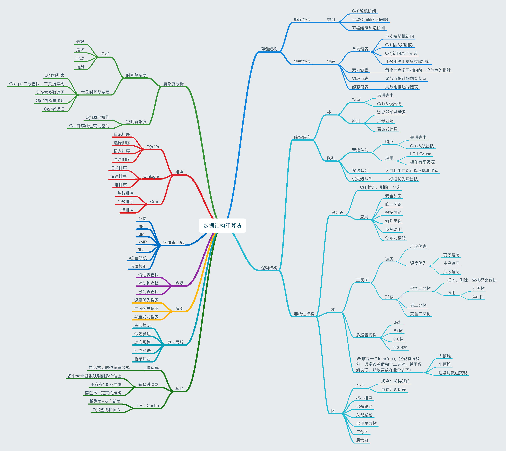
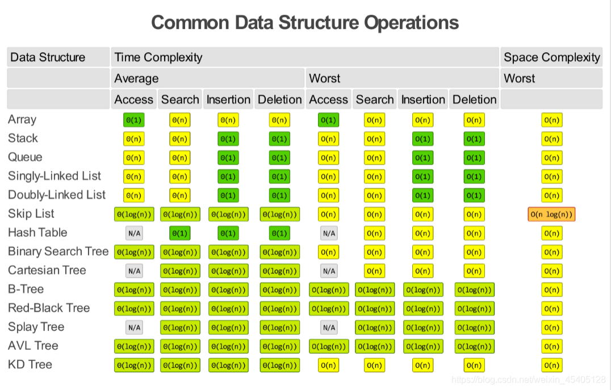

# 基础知识点

> 其实嵌软没必要看那么多，下面也是挑着写。



# 1 常用数据结构操作的复杂度



# 2 大O复杂度比较


# 3 常用C++处理函数

1. 判断是否为字母：`isalpha()`
2. 判断是否为数字：`isdigit()`
3. 判断是否是数字或字母：`isalnum()`
4. 判断是否是大/小写：`islower()`、`isupper()`
5. 大小写互转：`toupper`、`tolower()`

# 4 实现字符串相关的库函数

Reference: [C Programming/string.h - Wikibooks, open books for an open world](https://en.wikibooks.org/wiki/C_Programming/string.h)

[string.c source code linux/lib/string.c\] - Codebrowser](https://codebrowser.dev/linux/linux/lib/string.c.html#strlen)

## 4.1 strcpy

```c
char *strcpy(char *dest, const char *src)
{
	char *tmp = dest;
	while ((*dest++ = *src++) != '\0');
	return tmp;
}
```

## 4.2 strncpy

```c
char *strncpy(char *dest, const char *src, size_t n)
{
	char *tmp = dest;
	while (count--) 
    {
		if ((*tmp = *src) != 0)	src++;
		tmp++;
	}
	return dest;
}
```

## 4.3 strchr

```c
char *strchr(char *str, int c) 
{
    for(; *str != (char)c; ++str)
        if(*str == '\0')	return NULL;
    return str;
}
```

## 4.4 strcat

```c
char *strcat(char *dest, char *src)
{
    char *tmp = dest;
	while (*dest)	dest++;
	while ((*dest++ = *src++) != '\0');
	return tmp;
}
```

## 4.5 strncat

```c
char *strncat(char *dest, const char *src, size_t count)
{
	char *tmp = dest;
	if (count) 
    {
		while (*dest)	dest++;
		while ((*dest++ = *src++) != 0) 
        {
			if (--count == 0) 
            {
				*dest = '\0';
				break;
			}
		}
	}
	return tmp;
}
```

## 4.6 strncat

```c
int strcmp(const char *cs, const char *ct)
{
	unsigned char c1, c2;
	while (1) 
    {
		c1 = *cs++;
		c2 = *ct++;
		if (c1 != c2)
			return c1 < c2 ? -1 : 1;
		if (!c1)
			break;
	}
	return 0;
}
```

## 4.7 strncmp

```c
/**
 * strncmp - Compare two length-limited strings
 * @cs: One string
 * @ct: Another string
 * @count: The maximum number of bytes to compare
 */
int strncmp(const char *cs, const char *ct, size_t count)
{
	unsigned char c1, c2;
	while (count) 
    {
		c1 = *cs++;
		c2 = *ct++;
		if (c1 != c2)
			return c1 < c2 ? -1 : 1;
		if (!c1)
			break;
		count--;
	}
	return 0;
}
```

## 4.8 strchr

```c
/**
 * strchr - Find the first occurrence of a character in a string
 * @s: The string to be searched
 * @c: The character to search for
 *
 * Note that the %NUL-terminator is considered part of the string, and can
 * be searched for.
 */
char *strchr(const char *s, int c)
{
	for (; *s != (char)c; ++s)
		if (*s == '\0')
			return NULL;
	return (char *)s;
}
```

## 4.9 strchr

```c
/**
 * strrchr - Find the last occurrence of a character in a string
 * @s: The string to be searched
 * @c: The character to search for
 */
char *strrchr(const char *s, int c)
{
	const char *last = NULL;
	do 
    {
		if (*s == (char)c)
			last = s;
	} while (*s++);
	return (char *)last;
}
```

## 4.10 strlen

```
size_t strlen(const char *str)
{
    const char *s;
    for (s = str; *s; ++s);
    return(s - str);
}
```

## 4.11 strnlen

```c
size_t strnlen(const char *s, size_t count)
{
	const char *sc;
	for (sc = s; count-- && *sc != '\0'; ++sc);
	return sc - s;
}
```

## 4.12 strstr

```c
/**
 * strstr - Find the first substring in a %NUL terminated string
 * @s1: The string to be searched
 * @s2: The string to search for
 */
char *strstr(const char *s1, const char *s2)
{
	size_t l1, l2;
	l2 = strlen(s2);
	if (!l2)
		return (char *)s1;
	l1 = strlen(s1);
	while (l1 >= l2) {
		l1--;
		if (!memcmp(s1, s2, l2))
			return (char *)s1;
		s1++;
	}
	return NULL;
}
```

## 4.13 strnstr

```c
/**
 * strnstr - Find the first substring in a length-limited string
 * @s1: The string to be searched
 * @s2: The string to search for
 * @len: the maximum number of characters to search
 */
char *strnstr(const char *s1, const char *s2, size_t len)
{
	size_t l2;
	l2 = strlen(s2);
	if (!l2)
		return (char *)s1;
	while (len >= l2) {
		len--;
		if (!memcmp(s1, s2, l2))
			return (char *)s1;
		s1++;
	}
	return NULL;
}
```

## 4.14 memcmp

```c
/**
 * memcmp - Compare two areas of memory
 * @cs: One area of memory
 * @ct: Another area of memory
 * @count: The size of the area.
 */
int memcmp(const void *cs, const void *ct, size_t count)
{
	const unsigned char *su1, *su2;
	int res = 0;
#ifdef CONFIG_HAVE_EFFICIENT_UNALIGNED_ACCESS
	if (count >= sizeof(unsigned long)) 
    {
		const unsigned long *u1 = cs;
		const unsigned long *u2 = ct;
		do 
        {
			if (get_unaligned(u1) != get_unaligned(u2))
				break;
			u1++;
			u2++;
			count -= sizeof(unsigned long);
		} while (count >= sizeof(unsigned long));
		cs = u1;
		ct = u2;
	}
#endif
    for (su1 = cs, su2 = ct; 0 < count; ++su1, ++su2, count--)
		if ((res = *su1 - *su2) != 0)
			break;
	return res;		// 下面这种方法即可
}
```

## 4.15 memchr

```c
/**
 * memchr - Find a character in an area of memory.
 * @s: The memory area
 * @c: The byte to search for
 * @n: The size of the area.
 *
 * returns the address of the first occurrence of @c, or %NULL
 * if @c is not found
 */
void *memchr(const void *s, int c, size_t count)
{
	const unsigned char *p = s;
	while (count--)
		if ((unsigned char)c == *p++)
			return (void *)(p - 1);
	return NULL;
}
```

## 4.16 memset

```c
/**
 * memset - Fill a region of memory with the given value
 * @s: Pointer to the start of the area.
 * @c: The byte to fill the area with
 * @count: The size of the area.
 *
 * Do not use memset() to access IO space, use memset_io() instead.
 */
void *memset(void *s, int c, size_t count)
{
	char *xs = s;
	while (count--)
		*xs++ = c;
	return s;
}
```

## 4.17 memcpy

```c
/**
 * memcpy - Copy one area of memory to another
 * @dest: Where to copy to
 * @src: Where to copy from
 * @count: The size of the area.
 *
 * You should not use this function to access IO space, use memcpy_toio()
 * or memcpy_fromio() instead.
 */
void *memcpy(void *dest, const void *src, size_t count)
{
	char *tmp = dest;
	const char *s = src;
	while (count--)
		*tmp++ = *s++;
	return dest;
}
```

## 4.18 memchr

```c
/**
 * memchr - Find a character in an area of memory.
 * @s: The memory area
 * @c: The byte to search for
 * @n: The size of the area.
 *
 * returns the address of the first occurrence of @c, or %NULL
 * if @c is not found
 */
void *memchr(const void *s, int c, size_t n)
{
	const unsigned char *p = s;
	while (n-- != 0) {
        	if ((unsigned char)c == *p++) {
			return (void *)(p - 1);
		}
	}
	return NULL;
}
```

## 4.19 itoa

```c
char *itoa(int n, char *s)
{
    int sign, i = 0, j = 0;
	if((sign = n) < 0)	n = -n;	// 转换为正数
    do
    {
        s[i++] = n % 10 + '0';
    }while((n /= 10) > 0);
    
    s[i] = '\0';
    
    if(s[0] == '\0')
    {
        j = 1;
        ++i;
    }
    for(; j < i / 2; ++j)
    {
        s[j] = s[j] + s[i - 1 - j];
        s[i - 1 - j] = s[j] - s[i - 1 - j];
        s[j] = s[j] - s[i - 1 - j];
    }
    
    return s;
}

// 或
 /* reverse:  reverse string s in place */
void reverse(char s[])
{
    int i, j;
    char c;

    for (i = 0, j = strlen(s)-1; i<j; i++, j--) {
        c = s[i];
        s[i] = s[j];
        s[j] = c;
    }
}

 /* itoa:  convert n to characters in s */
 void itoa(int n, char s[])
 {
     int i, sign;
 
     if ((sign = n) < 0)  /* record sign */
         n = -n;          /* make n positive */
     i = 0;
     do {       /* generate digits in reverse order */
         s[i++] = n % 10 + '0';   /* get next digit */
     } while ((n /= 10) > 0);     /* delete it */
     if (sign < 0)
         s[i++] = '-';
     s[i] = '\0';
     reverse(s);
 }
```

## 4.20 atoi

```c
int atoi(const char *s)
{
    int i, n, sign = 1;
    while(isspace(*s++));
    
    if (*str == '+')	++str;
	else if(*str == '-')	
    {
        ++str;
        sign = -1;
    }
    
    int res = 0;
    for(; isdigit(*str); ++str)
    {
        int digit = *str - '0';
        res *= 10;
       	res += digit;
    }
    
    return sign * res;
}
```

