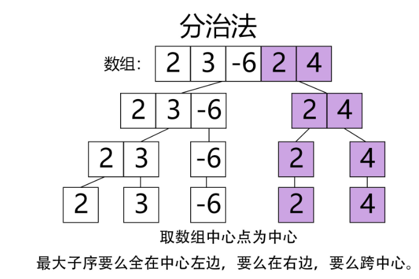
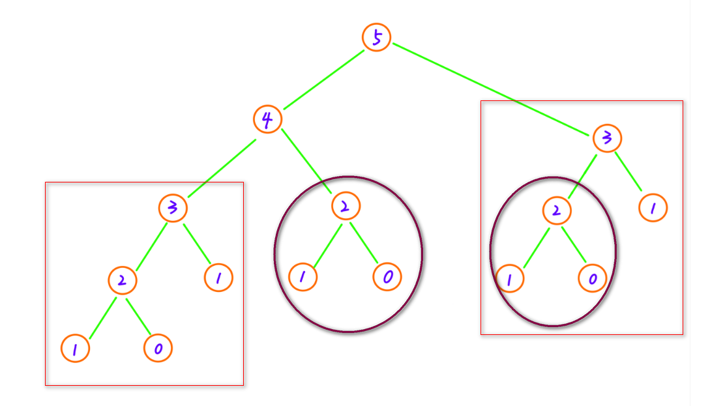

# 数组

# 1 最大子数组和（53）

[53. 最大子数组和 - 力扣（Leetcode）](https://leetcode.cn/problems/maximum-subarray/)

## 1.1 暴力解法

时间复杂度：$O(N^2)$

空间复杂度：$O(1)$

```c++
class Solution {
public:
    int maxSubArray(vector<int>& nums) {
        int sum(INT_MIN);
        int temp(0);

        for(int i = 0; i < nums.size(); ++i)
        {
            for(int j = i; j < nums.size(); ++j)
            {
                temp += nums.at(j);
                sum = sum > temp ? sum : temp;
            }
            temp = 0;
        }

        return sum;
    }
};
```

## 1.2 分治

1. 取数组中心点为中心；
2. 最大子序要么全在中心左边，要么在右边，要么跨中心；
3. 分三种情况进行考虑 跨中心的情况，再分治成中心点左侧和右侧的最大子序和问题。

时间复杂度：$O(Nlog(N))$

空间复杂度：$O(log(N))$



```c++
class Solution {
public:
    int maxSubArray(vector<int>& nums) {
        return maxSubArrayHelper(nums, 0, nums.size() - 1);
    }

    int maxSubArrayHelper(vector<int>& nums, int left, int right)
    {
        if(left == right)   return nums[left];

        int center = (left + right) / 2;
        int leftMax = maxSubArrayHelper(nums, left, center);
        int rightMax = maxSubArrayHelper(nums, center + 1, right);

        int leftCrossMax = INT_MIN; // 初始化一个值
        int leftCrossSum = 0;
        for (int i = center ; i >= left ; i --) 
        {
            leftCrossSum += nums[i];
            leftCrossMax = max(leftCrossSum, leftCrossMax);
        }

        // 计算包含右侧子序列最后一个元素的子序列最大值
        int rightCrossMax = nums[center + 1];
        int rightCrossSum = 0;
        for (int i = center + 1; i <= right ; i ++) 
        {
            rightCrossSum += nums[i];
            rightCrossMax = max(rightCrossSum, rightCrossMax);
        }
        
        int crossMax = leftCrossMax + rightCrossMax;
        return max(crossMax, max(leftMax, rightMax));
    }
};
```

## 1.3 贪心法

时间复杂度：$O(N)$

空间复杂度：$O(1)$

```c++
class Solution
{
public:
    int maxSubArray(vector<int> &nums)
    {
        //类似寻找最大最小值的题目，初始值一定要定义成理论上的最小最大值
        int result = INT_MIN;
        int numsSize = int(nums.size());
        int sum = 0;
        for (int i = 0; i < numsSize; i++)
        {
            sum += nums[i];
            result = max(result, sum);
            //如果sum < 0，重新开始找子序串
            if (sum < 0)
            {
                sum = 0;
            }
        }

        return result;
    }
};
```

## 1.4 动态规划

时间复杂度：$O(N)$

空间复杂度：$O(1)$

```c++
class Solution
{
public:
    int maxSubArray(vector<int> &nums)
    {
        //类似寻找最大最小值的题目，初始值一定要定义成理论上的最小最大值
        int result = INT_MIN;
        int numsSize = int(nums.size());

        int sum = nums[0];
        result = nums[0];
        for (int i = 1; i < numsSize; i++)
        {
            sum = max(sum + nums[i], nums[i]);
            result = max(result, sum);
        }

        return result;
    }
};
```

# 2 原地移除元素（27）

[27. 移除元素 - 力扣（Leetcode）](https://leetcode.cn/problems/remove-element/)

## 2.1 通用解法（双指针）

时间复杂度：$O(N)$

空间复杂度：$O(1)$

```c++
class Solution {
public:
    int removeElement(vector<int>& nums, int val) {
        int slow = 0;

        for(int i = 0; i < nums.size(); i++)
        {
            if(nums[i] != val)
            {
                nums[slow++] = nums[i];
            }
        }

        return slow;
    }
};
```

## 2.2 优化后的双指针

```c++
class Solution {
public:
    int removeElement(vector<int>& nums, int val) {
        int left = 0, right = nums.size();
        while (left < right) {
            if (nums[left] == val) {
                nums[left] = nums[right - 1];
                right--;
            } else {
                left++;
            }
        }
        return left;
    }
};
```

# 3 合并两个有序数组（88）

[88. 合并两个有序数组 - 力扣（Leetcode）](https://leetcode.cn/problems/merge-sorted-array/)

## 3.1 STL库

```c++
class Solution {
public:
    void merge(vector<int>& nums1, int m, vector<int>& nums2, int n) {
        for(int i = 0; i < n; ++i)  nums1[m + i] = nums2[i];
        sort(nums1.begin(), nums1.begin() + m + n);
    }
};
```

## 3.2 从后面开始确定

时间复杂度：$O(M+N)$

空间复杂度：$O(1)$

如果两个数组从结尾向开头（数字从大到小）进行比较，那么每次把比较之后的数字放置到 nums1 中的后面，由于后面的数字本身就是提供出来的多余的位置，都是 0，因此不需要对 nums1 进行移动。

1. 当 $m > 0$ 并且 $n > 0 $ 时，从后向前比较  $num1[m−1]$ 和  $nums2[n−1] $ ：
   - 如果是  $nums1[m−1]$ 大，则把   $num1[m−1]$ 放到 $num1$ 的第 $m+n−1$ 位置，并让 $m-=1$。
   - 如果是 $nums2[n−1] $ 大，则把 $nums2[n−1]$ 放到 $num1$ 的第 $m+n−1$ 位置，并让 $n-=1$。
2. 当上面的遍历条件结束的时候，此时 m 和 n 至少有一个为 0。
   - 当 $m == 0$ 时，说明 num1 的数字恰好用完了，此时 nums2 可能还剩元素，需要复制到 nums1 的头部；
   - 当 $n == 0$ 时，说明 num2 的数字恰好用完了，此时 nums1 可能还剩元素，由于剩余的这些元素一定是 nums1 和 nums2 中最小的元素，所以不用动，直接留在原地就行。

```c++
class Solution {
public:
    void merge(vector<int>& nums1, int m, vector<int>& nums2, int n) {
        int k = m + n - 1;
        while (m > 0 && n > 0) {
            if (nums1[m - 1] > nums2[n - 1]) {
                nums1[k] = nums1[m - 1];
                m --;
            } else {
                nums1[k] = nums2[n - 1];
                n --;
            }
            k --;
        }
        for (int i = 0; i < n; ++i) {
            nums1[i] = nums2[i];
        }
    }
};
```

## 3.3 从前面开始确定（归并排序）

时间复杂度：$O(M+N)$

空间复杂度：$O(M+N)$

```c++
class Solution {
public:
    void merge(vector<int>& nums1, int m, vector<int>& nums2, int n) {   
        vector<int> temp(nums1);       //初始化m为nums1的拷贝
        int i = 0, j = 0, k = 0;

        while(i <= m-1 && j <= n-1)
        {
            if(temp[i] < nums2[j])                nums1[k++] = temp[i++];
            else               nums1[k++] = nums2[j++];
        }
        while(i <= m-1)         
        {
            nums1[n+i] = temp[i];
            i++;
        }
         while(j <= n-1)
        {
            nums1[m+j] = nums2[j];
            j++;
        }

    }
};
```

# 4 查找共用字符（1002）

[1002. 查找共用字符 - 力扣（Leetcode）](https://leetcode.cn/problems/find-common-characters/)

## 4.1 利用数组求解

```c++
class Solution {
public:
    vector<string> commonChars(vector<string>& A) {
        vector<string> out;
        int num[100][26]={0};                  //建立一个二维数组，标记所有出现的字母次数
        for(int i =0;i<A.size() ;i++)
            for(int j=0;j<A[i].size();j++)
                num[i][(A[i][j]-'a')]++;
        
        for(int j=0;j<26;j++)                  //将所有列的最小值存到第一行
            for(int i=1;i<A.size();i++)
                num[0][j] = min (num[0][j],num[i][j]);
                    
        string str;                           //按照第一行保存的次数输出相应字母
        for(int i=0;i<26;i++){
            while(num[0][i]--)
            {
                str.clear();
                str.push_back((char)('a'+i));
                out.push_back(str);
            }
        }
        return out;
    }
};

```

## 4.2 哈希

```c++
class Solution {
public:
    vector<string> commonChars(vector<string>& A) {
        vector<string> res;
        vector<unordered_map<char,int>> vum(A.size());
        for(int i = 0;i < A.size();++i)
            for(char c : A[i])
                vum[i][c]++;        // 对应key的value++
 
        for(pair<char, int> pair : vum[0])     // 将所有key的value的最小值选择出来放在第一个向量中
        {
            int n = pair.second;
            for(int i = 1;i < vum.size();++i)
                n = min(n,vum[i][pair.first]);
            while(n--) res.push_back(string(1, pair.first));       
        }
        return res;
    }
};
```

# 5 寻找数组的中心下标（寻找数组的中心下标）

[724. 寻找数组的中心下标 - 力扣（Leetcode）](https://leetcode.cn/problems/find-pivot-index/)

## 5.1 暴力解法

时间复杂度：$O(N^2)$

空间复杂度：$O(1)$

```c++
class Solution {
public:
    int pivotIndex(vector<int>& nums) {
        int middle_index(-1);
        int temp_index(0);

        while(temp_index < nums.size())
        {
            int left_sum(0), right_sum(0);
            for(int i = 0; i < temp_index; ++i)
                left_sum += nums.at(i);
            
            for(int i = temp_index + 1; i < nums.size(); ++i)
                right_sum += nums.at(i);

            if(left_sum == right_sum)   
            {
                middle_index = temp_index;
                return middle_index;
            }

            cout << "left_sum: " << left_sum << endl;
            cout << "right_sum: " << right_sum << endl;

            ++temp_index;
        }

        return middle_index;
    }
};
```

## 5.2 转换思想的简单思路（前缀和，类似滑动窗口）

时间复杂度：$O(N)$

空间复杂度：$O(1)$

```c++
class Solution {
public:
    int pivotIndex(vector<int>& nums) {
        int sumleft = 0, sumTotal = 0;
        for(int n : nums)   
            sumTotal += n;
        for(int i = 0; i < nums.size(); ++i)
        {
            if(sumleft * 2  == sumTotal - nums[i])  
                return i;       //如果i此时满足中心索引要求，return
            sumleft += nums[i];
        }
        return -1;
    }
};

// 另一种解法，原理上是一样的
class Solution {
public:
    int pivotIndex(vector<int>& nums) {
        int sumLeft = 0, sumRight = accumulate(nums.begin(), nums.end(), 0);
        for (int i = 0; i < nums.size(); i++) {
            sumRight -= nums[i];
            // 若左侧元素和等于右侧元素和，返回中心下标 i
            if (sumLeft == sumRight)
                return i;
            sumLeft += nums[i];
        }
        return -1;
    }
};
```

# 6 数组中数字出现的次数

[剑指 Offer 56 - I. 数组中数字出现的次数 - 力扣（Leetcode）](https://leetcode.cn/problems/shu-zu-zhong-shu-zi-chu-xian-de-ci-shu-lcof/)

## <span style="background:#FFFFBB;">6.1 位运算</span>

**参考题解：**[剑指 Offer 56 - I. 数组中数字出现的次数 - 力扣（Leetcode）](https://leetcode.cn/problems/shu-zu-zhong-shu-zi-chu-xian-de-ci-shu-lcof/solutions/572857/jian-zhi-offer-56-i-shu-zu-zhong-shu-zi-tykom/)

时间复杂度：$O(N)$

空间复杂度：$O(1)$

1. **遍历执行异或：**

   - 设整型数组 $nums = [a,a,b,b,...,x,y]$ ，对 $nums$ 中所有数字执行异或，得到的结果为 $x⊕y$

2. **循环左移计算 $m$** ：

   - 根据异或运算定义，若整数 $x⊕y$ 某二进制位为 $1$ ，则 $x$ 和 $y$ 的此二进制位一定不同。换言之，找到 $x⊕y$ 某位为 $1$ 的二进制位，即可将数组 $nums$ 拆分为上述的两个子数组。根据与运算特点，可知对于任意整数 $a$ 有：
     - 若 $a \& 0001=1$，则  $a$ 的第一位为 $1$  ；
     - 若 $a \& 0010=1$，则 $a$ 的第二位为 $1$ ；
     - 以此类推……
   - 因此，初始化一个辅助变量 $m=1$，通过与运算从右向左循环判断，可 获取整数 $x⊕y$首位 $1$  ，记录于 $m$ 中，代码如下：

   ```c++
   while(n & m == 0) // m 循环左移一位，直到 z & m ！= 0
       m <<= 1
   ```

3. **拆分 $nums$ 为两个子数组；**

4. 分别遍历两个子数组执行异或：

   - 通过遍历判断 $nums$ 中各数字和 $m$ 做与运算的结果，可将数组拆分为两个子数组，并分别对两个子数组遍历求异或，则可得到两个只出现一次的数字，代码如下：

   ```c++
   for(int num : nums) {
       if(num & m) x ^= num;   // 若 num & m != 0 , 划分至子数组 1 ，执行遍历异或
       else y ^= num;          // 若 num & m == 0 , 划分至子数组 2 ，执行遍历异或
   }
   return vector<int> {x, y};  // 遍历异或完毕，返回只出现一次的数字 x 和 y
   ```

5. **返回值**：返回只出现一次的数字 $x, y$ 即可。

```c++
class Solution {
public:
    vector<int> singleNumbers(vector<int>& nums) {
        int x = 0, y = 0, n = 0, mask(0);
        for(int num : nums)             // 1. 遍历异或
            n ^= num;         
        mask = n ^ (-n);                // 2. 获取mask，区分分别包含x和y的子数组
        for(int num : nums) {           // 3. 遍历 nums 分组
            if(num & mask) x ^= num;    // 4. 当 num & mask != 0
            else y ^= num;              // 5. 当 num & mask == 0
        }
        return vector<int> {x, y};      // 6. 返回出现一次的数字
    }
};

```

# 7 数组中数字出现的次数 II  

[剑指 Offer 56 - II. 数组中数字出现的次数 II - 力扣（Leetcode）](https://leetcode.cn/problems/shu-zu-zhong-shu-zi-chu-xian-de-ci-shu-ii-lcof/)

## 7.1 哈希

```c++
class Solution {
public:
    int singleNumber(vector<int>& nums) {
        unordered_map<int, int> hash;
        for(int i = 0; i < nums.size(); ++i)    ++hash[nums[i]];

        for(auto temp : hash)   if(temp.second == 1)   return temp.first;
        return 0;   // 结果必然不会走到这一步
    }
};
```

## 7.2 位运算

> 🫠🫠🫠🫠🫠🫠🫠，这到底是怎么用的位运算？什么脑子能想到啊？而且效率还真的nm的高。

时间复杂度：$O(N)$

空间复杂度：$O(1)$

```c++
class Solution {
public:
    int singleNumber(vector<int>& nums) {
        int ans = 0;
        for(int i = 0; i < 32; ++i){
            int cnt = 0;
            for(int n : nums){
                // n & 1 << i 的值大于0即为真
                if(n & (1 << i)) cnt++;
            }
            // 构造只出现一次的那个数字，采用异或的方法生成二进制中的每一位
            if(cnt % 3 == 1) ans ^= (1 << i);
        }
        return ans;
    }
};
```

# 8 剑指 Offer 53 - II. 0～n-1中缺失的数字

[剑指 Offer 53 - II. 0～n-1中缺失的数字 - 力扣（Leetcode）](https://leetcode.cn/problems/que-shi-de-shu-zi-lcof/)

## 8.1 二分法

时间复杂度：$O(logN)$

空间复杂度：$O(1)$

```c++
class Solution {
public:
    int missingNumber(vector<int>& nums) {
        int left = 0, right = nums.size();
        while(left < right){
            int mid = (left + right) / 2;
            if(mid == nums[mid]) left = mid + 1;
            else right = mid;
        }
        return left;
    }
};
```

## 8.2 问题转换法

时间复杂度：$O(N)$

空间复杂度：$O(1)$

```c++
class Solution {
public:
    int missingNumber(vector<int>& nums) {
        int n = nums.size();
        int sum = 0;
        for(int i = 0; i < n; i ++)
            sum += nums[i];
        return n*(n + 1)/2 - sum;
    }
};
```

## 8.3 哈希数组

```c++
class Solution {
public:
    int missingNumber(vector<int>& nums) {
        int hash[50000]{0};
        for(int i = 0; i < nums.size(); ++i)
        {
            ++hash[nums[i]];
        }
        for(int i = 0; i < nums.size(); ++i)
        {
            if(hash[i] == 0)
            {
                return i;
            }
        }

        return nums.size();
    }
};
```

# 9 按奇偶排序数组

[905. 按奇偶排序数组 - 力扣（Leetcode）](https://leetcode.cn/problems/sort-array-by-parity/)

## 9.1 暴力解法

```c++
class Solution {
public:
    vector<int> sortArrayByParity(vector<int>& nums) {
        vector<int> fore_res, back_res;
        for(int i = 0; i < nums.size(); ++i)
        {
            if(nums[i] % 2 == 0)    fore_res.emplace_back(nums[i]);
            else    back_res.emplace_back(nums[i]);
        }

        for(int i = 0; i < back_res.size(); ++i)
        {
            fore_res.emplace_back(back_res[i]);
        }

        return fore_res;
    }
};
```

## 9.2 左右指针

```c++
class Solution {
public:
    vector<int> sortArrayByParity(vector<int>& nums) {
        int left = 0, right = nums.size() - 1;

        while(left != right)
        {
            if(nums[left] % 2 != 0)
            {
                swap(nums[left], nums[right]);
                --right;
            }
            else    ++left;
        }

        return nums;
    }
};
```

# 10 存在重复元素 II

[219. 存在重复元素 II - 力扣（Leetcode）](https://leetcode.cn/problems/contains-duplicate-ii/)

## 10.1 哈希表

时间复杂度：$O(N)$

空间复杂度：$O(N)$

```c++
class Solution {
public:
    bool containsNearbyDuplicate(vector<int>& nums, int k) {
        unordered_map<int, int> map;
        int length = nums.size();
        for (int i = 0; i < length; i++) {
            int num = nums[i];
            if (map.count(num) && i - map[num] <= k) {
                return true;
            }
            map[num] = i;
        }
        return false;
    }
};
```

## 10.2 滑动窗口

时间复杂度：$O(N)$

空间复杂度：$O(k)$

```c++
class Solution {
public:
    bool containsNearbyDuplicate(vector<int>& nums, int k) {
        unordered_set<int> s;
        int length = nums.size();
        for (int i = 0; i < length; i++) {
            if (i > k) {
                s.erase(nums[i - k - 1]);   // 将该元素从滑动窗口移除，以保证滑动窗口恒定大小
            }
            if (s.count(nums[i])) {         
                return true;
            }
            s.insert(nums[i]);
        }
        return false;
    }
};
```

# 11 有序数组中出现次数超过25%的元素（1287）

[1287. 有序数组中出现次数超过25%的元素 - 力扣（Leetcode）](https://leetcode.cn/problems/element-appearing-more-than-25-in-sorted-array/)

## 11.1 哈希表

```c++
class Solution {
public:
    int findSpecialInteger(vector<int>& arr) {
        int size = arr.size();
        unordered_map<int, int> hash;
        for(int i = 0; i < size; ++i)
        {
            ++hash[arr[i]];
        }

        auto iter = hash.begin();
        while(iter != hash.end())
        {
            printf("iter%d: %d\r\n", iter->first, iter->second);
            if(iter->second * 100 > size * 25)  return iter->first;
            ++iter;
        }

        return -1;
    }
};
```

## 11.2 快慢指针

```c++
class Solution {
public:
    int findSpecialInteger(vector<int>& arr) {
        // 有序数组，无需sort
        int slow(0), fast(0), size(arr.size());
        while(fast < size)
        {
            if(arr[fast] == arr[slow])
            {
                ++fast;
                if(fast == size)    return arr[slow];       // 一定存在对应整数，到尾部则返回最后的元素
                continue;
            }

            if((fast - slow) * 100 > size * 25)    return arr[slow];
            slow = fast;
        }

        return -1;
    }
};
```

## 11.3 问题转换

> 思路牛逼：😰😰😰😰😰

1. 数组有序，且某元素出现次数超过25%
2. 那么对于此元素第1次出现位置，加25%数组长度，必定仍为它自身

```c++
class Solution {
public:
    int findSpecialInteger(vector<int>& arr) {
        for(int i = 0; i < arr.size(); ++i)
        {
            if(i + arr.size() / 4 < arr.size())
                if(arr[i] == arr[i + arr.size() / 4])   return arr[i];
        }

        return 0;  
    }
};
```

# 12 有效的山脉数组（941）

[941. 有效的山脉数组 - 力扣（Leetcode）](https://leetcode.cn/problems/valid-mountain-array/)

## 12.1 线性扫描（双指针）

时间复杂度：$O(N)$

空间复杂度：$O(1)$

```c++
class Solution {
public:
    bool validMountainArray(vector<int>& arr) {
        if(arr.size() < 3) return false;
        int slow(0), fast(0);

        for(fast = 0; fast < arr.size() - 1; ++fast)
        {
            if(slow == 0)
            {
                if(arr[fast] < arr[fast + 1])   continue;
                if(arr[fast] > arr[fast + 1])
                {
                    if(fast == 0)   return false;
                    slow = fast;
                    continue;
                }
               
                return false;
            }

            if(slow > 0)
            {
                if(arr[fast] > arr[fast + 1])   continue;
                return false;
            }
        }

        if(slow == 0)  return false;
        return true;
    }
};

// 换一种更简洁的写法
class Solution {
public:
    bool validMountainArray(vector<int>& arr) {
        int head(0), tail(arr.size() - 1);

        if(arr.size() < 3)  return false;
        for(; head < arr.size() - 1; ++head)
            if(arr[head] >= arr[head + 1])   break;
        for(; tail > 1; --tail)
            if(arr[tail] >= arr[tail - 1])  break;
        
        if(head == tail and head != 0 and tail != arr.size() - 1)    return true;
        return false;
    }
};
```

# 13 最长连续递增序列

[674. 最长连续递增序列 - 力扣（Leetcode）](https://leetcode.cn/problems/longest-continuous-increasing-subsequence/)

## 13.1 双指针（快慢指针、尺取法、贪心）

时间复杂度：$O(N)$

空间复杂度：$O(1)$

```c++
class Solution {
public:
    int findLengthOfLCIS(vector<int>& nums) {
        int slow(0), fast(0), size(nums.size()), max_size(1);
        
        while(fast < size - 1)
        {                
            if(nums[fast] < nums[fast + 1])
            {
                ++fast;
                max_size = max(max_size, fast - slow + 1);
                continue;
            }
            ++fast;
            slow = fast;
        }

        return max_size;
    }
};

// 更简洁的写法
class Solution {
public:
    int findLengthOfLCIS(vector<int>& nums) {
        int slow(0), fast(0), size(nums.size()), max_size(1);
        
        while(fast != size)
        {                
            while(fast != size - 1 and nums[fast] < nums[fast + 1])  ++fast;
            max_size = max(max_size, fast - slow + 1);
            slow = ++fast;
        }

        return max_size;
    }
};
```

## 13.2 动态规划

时间复杂度：$O(N)$

空间复杂度：$O(N)$

```c++
class Solution {
public:
    int findLengthOfLCIS(vector<int>& nums) {
        if (nums.size() == 0) return 0;
        int result = 1;
        vector<int> dp(nums.size() ,1);
        for (int i = 0; i < nums.size() - 1; i++) {
            if (nums[i + 1] > nums[i]) { // 连续记录
                dp[i + 1] = dp[i] + 1;
            }
            if (dp[i + 1] > result) result = dp[i + 1];
        }
        return result;
    }
};
```

# 14 爬楼梯（70）

[70. 爬楼梯 - 力扣（Leetcode）](https://leetcode.cn/problems/climbing-stairs/description/)

## 14.1 递归+优化

最简单的递归写法如下：

```c++
class Solution { 
    public int climbStairs(int n) {
        // 递归终止条件
        if(n <= 2) return n;

        // 当前递归层的逻辑处理 加法
        // 进入下一层递归 climbStairs(n - 1) 和 climbStairs(n - 2)
        return climbStairs(n - 1) + climbStairs(n - 2);
    }
}
```

时间复杂度：$O(2^N)$

空间复杂度：$O(N)$

提示超时，考虑到部分结果的解集相同，因此可以考虑将重复计算的结果存入哈希表中，以避免重复计算（重复递归）。



```c++
class Solution {
public:
    unordered_map<int, int> hash;
    int climbStairs(int n) {
        if(n < 3)   return n;  

        auto it = hash.find(n);
        if(it != hash.end())
            return it->second;

        int sum = climbStairs(n - 1) + climbStairs(n - 2);
        hash.insert(pair<int, int> (n, sum));
        return sum;
    }
};
```

## 14.2 动态规划

时间复杂度：$O(N)$

空间复杂度：$O(N)$

算法实现步骤：

1. 确定`dp`数组以及下标的含义

   - 定义 `dp[i]` 为爬上第 `i` 级台阶有多少种方案；
2. 确定状态转移方程
   - 因为每次只可以爬 1 或者 2 个台阶所以，爬上当前台阶的方案应该是前面两个状态的方案的和即，`dp[i]=dp[i−1]+dp[i−2]`。
3. 初始化状态
   - `i=0` 级开始爬的，所以从第 0 级爬到第 0 级我们可以看作只有一种方案，即 `dp(0)=1`；
   - `i=1` 代表从第 0 级到第 1 级也只有 1 种方案，一即爬一级，`dp(1)=1`。
4. 遍历顺序
   - 由状态转移方程知道 `dp[i]` 是从 `dp[i−1]` 和 `dp[i−2]` 转移过来所以从前往后遍历。
5. 返回值
   - 因为一共计算 n 阶楼梯有多少方案，所以返回 `dp[n]`。

```c++
class Solution {
public:
    /* 动态规划五部曲：
     * 1.确定dp[i]的下标以及dp值的含义： 爬到第i层楼梯，有dp[i]种方法；
     * 2.确定动态规划的递推公式：dp[i] = dp[i-1] + dp[i-2];
     * 3.dp数组的初始化：因为提示中，1<=n<=45 所以初始化值，dp[1] = 1, dp[2] = 2;
     * 4.确定遍历顺序：分析递推公式可知当前值依赖前两个值来确定，所以递推顺序应该是从前往后；
     * 5.打印dp数组看自己写的对不对；
    */
    int climbStairs(int n) {
        if (n <= 1) return n;
        /* 定义dp数组 */
        vector<int> dp(n+1);
        /* 初始化dp数组 */
        dp[1] = 1;
        dp[2] = 2;
        /* 从前往后遍历 */
        for(int i = 3; i <= n; i++) {
            dp[i] = dp[i-1] + dp[i-2];
        }
        return dp[n];
    }
};

// 进一步优化，空间复杂度到了O(1)
class Solution {
public:
    int climbStairs(int n) {
        int p = 0, q = 0, r = 1;
        for (int i = 1; i <= n; ++i) {
            p = q; 
            q = r; 
            r = p + q;
        }
        return r;
    }
};
```

## 14.3 矩阵快速幂

> 🫠实在不像是我能想到的解法

官方题解：[70. 爬楼梯 - 力扣（Leetcode）](https://leetcode.cn/problems/climbing-stairs/solutions/286022/pa-lou-ti-by-leetcode-solution/)

### 3.14.4 通项公式

由递推公式 $f(n)=f(n-1)+f(n-2)$ 写出特征方程：
$$
x^2=x+1
$$
求得$x_1=\frac{1+\sqrt{5} }{2} $，$x_2=\frac{1-\sqrt{5} }{2} $，设通解 $f\left ( n \right )=c_{1}  x_{1}^{n}+ c_{2} x_{2}^{n} $，代入初始条件$f\left ( 1 \right )=1$，$f\left ( 2 \right )=1$，得$c_{1} =\frac{1}{\sqrt{5} } $，$c_{2} =-\frac{1}{\sqrt{5} } $，接着我们就可以通过这个公式直接求第 $n$ 项了。

```c++
class Solution {
public:
    int climbStairs(int n) {
        double sqrt5 = sqrt(5);
        double fibn = pow((1 + sqrt5) / 2, n + 1) - pow((1 - sqrt5) / 2, n + 1);
        return (int)round(fibn / sqrt5);
    }
};
```

# 15 买卖股票的最佳时机（121）

[121. 买卖股票的最佳时机 - 力扣（Leetcode）](https://leetcode.cn/problems/best-time-to-buy-and-sell-stock/)

此题类似于[42. 接雨水 - 力扣（Leetcode）](https://leetcode.cn/problems/trapping-rain-water/)，但此题无法用双指针求解。

## 15.1 暴力解法

时间复杂度：$O(N^2)$

空间复杂度：$O(1)$

超时了。

```c
class Solution {
public:
    int maxProfit(vector<int>& prices) {
        if(prices.size() == 1)  return 0;

        int profile = 0;
        for(int i = 0; i < prices.size() - 1; ++i)
            for(int j = i + 1; j < prices.size(); ++j)
                profile = prices[j] - prices[i] > profile ? prices[j] - prices[i] : profile;
        
        return profile;
    }
};
```

## 15.2 动态规划

时间复杂度：$O(N)$

空间复杂度：$O(1)$

```c++
class Solution {
public:
    int maxProfit(vector<int>& prices) {
        int minprice = INT_MAX;
        int maxprofit = 0;
        for (auto price : prices){
            maxprofit = max(maxprofit, price - minprice);
            minprice = min(minprice, price);
        }
        return maxprofit;
    }
};

// 优化一下写法
class Solution {
public:
    int maxProfit(vector<int>& prices) {
        int min_prices = INT_MAX;
        int result = 0;
        for (int i = 0; i < prices.size(); i++) {
            min_prices = min(min_prices, prices[i]);  // 取最左最小价格
            result = max(result, prices[i] - min_prices); // 直接取最大区间利润
        }
        return result;
    }
};
```

或者采用标准的动态规划结构：

时间复杂度：$O(N)$

空间复杂度：$O(N)$

```c++
// 版本一
class Solution {
public:
    int maxProfit(vector<int>& prices) {
        int len = prices.size();
        if (len == 0) return 0;
        vector<vector<int>> dp(len, vector<int>(2));
        dp[0][0] -= prices[0];
        dp[0][1] = 0;
        for (int i = 1; i < len; i++) {
            dp[i][0] = max(dp[i - 1][0], -prices[i]);
            dp[i][1] = max(dp[i - 1][1], prices[i] + dp[i - 1][0]);
        }
        return dp[len - 1][1];
    }
};
```

时间复杂度：$O(N)$

空间复杂度：$O(1)$

```c++
// 版本二
int maxProfit(vector<int>& prices) {
    if (prices.size() <= 1) return 0;
    vector<int> diff(prices.size() - 1);
    for (int i = 0; i < prices.size() - 1; ++i) {
        diff[i] = prices[i+1] - prices[i];
    }
    
    int last = 0;
    int profit = last;
    for (int i = 0; i < diff.size(); ++i) {
        last = max(0, last + diff[i]);
        profit = max(profit, last);
    }
    return profit;
}
```

# 16 处理用时最长的那个任务的员工（2432）

[2432. 处理用时最长的那个任务的员工 - 力扣（Leetcode）](https://leetcode.cn/problems/the-employee-that-worked-on-the-longest-task/)

## 16.1 自定义排序算法+二分

> 气笑我🤡🤡🤡


```c++
class Solution {
public:
    int hardestWorker(int n, vector<vector<int>>& logs) {
        if(logs.size() == 1)    return logs[0][0];

        for(int i = logs.size() - 1; i >= 1; --i)
            logs[i][1] -= logs[i-1][1];
        
        
        sort(logs.begin(), logs.end(), [](vector<int> a, vector<int> b)->bool
        {
            if(a[1] != b[1]) return a[1] > b[1];
            return a[0] < b[0];
        });
        
        return logs[0][0];
    }
};
```

## 16.2 一次遍历

时间复杂度：$O(N)$

空间复杂度：$O(1)$

```c++
class Solution {
public:
    int hardestWorker(int n, vector<vector<int>>& logs) {
        int max_time = logs[0][1];
        int hardestworker = logs[0][0];
        for(int i = 1; i < logs.size(); ++i)
        {
            if(logs[i][1] - logs[i - 1][1] > max_time) 
            {
                hardestworker = logs[i][0];
                max_time = logs[i][1] - logs[i - 1][1];
            }

            if(logs[i][1] - logs[i - 1][1] == max_time and 
                logs[i][0] < hardestworker) 
            {
                hardestworker = logs[i][0];
            }
        }

        return hardestworker;
    }
};
```

# 17 可被 K 整除的最小整数（1015）

[1015. 可被 K 整除的最小整数 - 力扣（Leetcode）](https://leetcode.cn/problems/smallest-integer-divisible-by-k/)

## 17.1 遍历

此处写法可以参考算法一或二。

参考链接：[1015. 可被 K 整除的最小整数 - 力扣（Leetcode）](https://leetcode.cn/problems/smallest-integer-divisible-by-k/solutions/2263780/san-chong-suan-fa-you-hua-pythonjavacgo-tk4cj/)


时间复杂度：$O(k)$，每次都是 $mod k$，最多有 $k$ 个不同的余数，即 $0,1,2,...k-1$，所以循环找 $k$ 次，如果没找到，说明前面有余数重复出现，会进入循环节，一直找下去也不会找到。

空间复杂度：$O(1)$

首先，我们可以确定当 $k$ 为 $2$ 或者 $5$ 的倍数时，能够被 $k$ 整除的数字末尾一定不为 $1$，所以此时一定无解。

那么，当余数 $resid$ 随  $1$ 的个数增加时，最后一定会进入循环，使我们可以找到两个对 $k$ 同余的 $n$ 和 $m$。假设 $n> m$，那么以下等式一定成立：
$$
\left ( n−m \right ) ≡ 0  \bmod k
$$
$n - m$ 可以表示为 $11\dots 100 \dots 0$ 的形式，因此有 $\left ( 11\dots 100 \dots 0 \right ) ≡ 0  \bmod k$，并且此时 $k$ 不为 $2$ 或 $5$ 的倍数，则 $k$ 与 $10$ 没有公因数， $k$ 与 $10$ 互质，$n - m$ 末尾的  $0$ 可以除掉，因此  $\left ( 11\dots 100 \dots 0 \right ) ≡ 0  \bmod k$，此问题一定有解。

一开始，我们可以想到的暴力解法肯定如下： 

```c++
class Solution {
public:
    int smallestRepunitDivByK(int k) {
        if(k % 2 == 0 or k % 5 == 0)  return -1;

        int len = 1;
        for(int n = 1; n % k != 0; ++len)
        {
            n = n * 10 + 1;
        }

        return len;
    }
};
```

但考虑到 $n$ 的值可能非常大，不能用 int 或 long long 来进行表示。

因此，可以使用每次取余的方法，使数变小，此处我们需要用到以下公式：
$$
(n \times 10 + 1) \bmod k = ((n \bmod k) \times 10 + 1) \bmod k
$$
我们可以用 $n \bmod k$ 来判断 $n$ 是否能被 $k$ 整除，并用 $n \bmod k$ 的余数来降低  $n$ 的大小。

```c++
class Solution {
public:
    int smallestRepunitDivByK(int k) {
        if(k % 2 == 0 or k % 5 == 0)  return -1;        // k为2或5的倍数，肯定无解

        int len = 1;
        for(int n = 1; n % k != 0; ++len)   // 取余等于0则结束
        {
            n = n % k;          // 余数
            n = n * 10 + 1;     // 余数 * 10 + 1
        }

        return len;
    }
};
```

# 18 字符串转换整数 (atoi)

[8. 字符串转换整数 (atoi) - 力扣（Leetcode）](https://leetcode.cn/problems/string-to-integer-atoi/description/)

## 18.1 遍历

```c++
class Solution {
public:
    int myAtoi(string s) {
        int n(0), sign(1);

        while(isspace(s[n]))    ++n;

        if(s[n] == '+') ++n;
        else if(s[n] == '-')
        {
            ++n;
            sign = -1;
        }

        int res = 0;
        for(; isdigit(s[n]); ++n)
        {
            int digit = s[n] - '0';

            if (res > (INT_MAX - digit) / 10) 		// 判断数字是否过大
            {
                return sign == 1 ? INT_MAX : INT_MIN;
            }
            res *= 10;
            res += digit;

        }

        return sign * res;
    }
};
```

# 19 数青蛙（1419）

[1419. 数青蛙 - 力扣（Leetcode）](https://leetcode.cn/problems/minimum-number-of-frogs-croaking/)

## 19.1 哈希计数+模拟题

```c++
class Solution {
public:
    int minNumberOfFrogs(string croakOfFrogs) {
        if (croakOfFrogs.size() % 5 != 0)   return -1;

        int res = 0, frogNum = 0;
        vector<int> cnt(4);
        unordered_map<char, int> mp = {{'c', 0}, {'r', 1}, {'o', 2}, {'a', 3}, {'k', 4}};
        for (char c : croakOfFrogs) 
        {
            int t = mp[c];
            if (t == 0) 
            {
                cnt[t]++;
                frogNum++;
                if (frogNum > res)  res = frogNum;
            } 
            else 
            {
                if (cnt[t - 1] == 0)    return -1;
                cnt[t - 1]--;
                if (t == 4)     frogNum--;
                else    cnt[t]++;
            }
        }
        if (frogNum > 0) return -1;

        return res;
    }
};
```

# 20  最大子数组和（53）

https://leetcode.cn/problems/maximum-subarray/

## 20.1 暴力解法

```c++
class Solution
{
public:
    int maxSubArray(vector<int> &nums)
    {
        //类似寻找最大最小值的题目，初始值一定要定义成理论上的最小最大值
        int result = INT_MIN;
        int numsSize = int(nums.size());

        int sum = nums[0];
        result = nums[0];
        for (int i = 1; i < numsSize; i++)
        {
            sum = max(sum + nums[i], nums[i]);
            result = max(result, sum);
        }

        return result;
    }
};
```

# 21 总持续时间可被 60 整除的歌曲（1010）

[1010. 总持续时间可被 60 整除的歌曲 - 力扣（Leetcode）](https://leetcode.cn/problems/pairs-of-songs-with-total-durations-divisible-by-60/description/)

## 21.1 组合数学

题解：[1010. 总持续时间可被 60 整除的歌曲 - 力扣（Leetcode）](https://leetcode.cn/problems/pairs-of-songs-with-total-durations-divisible-by-60/solutions/2259343/liang-shu-zhi-he-de-ben-zhi-shi-shi-yao-bd0r1/)

太优雅了。

时间复杂度：$\mathcal{O}(n+U)$，其中 $n$ 为 $\textit{nums}$ 的长度，$U=60$。
空间复杂度：$\mathcal{O}(U)$。

```c++
class Solution {
public:
    int numPairsDivisibleBy60(vector<int> &time) {
        int ans = 0, cnt[60]{};
        for (int t : time) {
            // 先查询 cnt，再更新 cnt，因为题目要求 i<j
            // 如果先更新，再查询，就把 i=j 的情况也考虑进去了
            ans += cnt[(60 - t % 60) % 60];
            cnt[t % 60]++;
        }
        return ans;
    }
};
```

# 22 长度最小的子数组（209）

[209. 长度最小的子数组 - 力扣（Leetcode）](https://leetcode.cn/problems/minimum-size-subarray-sum/)

## 22.1 双指针+滑动窗口

`fast`指针向右扩展滑动窗口，`slow`指针用于收缩左侧窗口。

时间复杂度：$\mathcal{O} \left (  N\right ) $

空间复杂度：$\mathcal{O} \left (  1\right ) $

```c++
class Solution {
public:
    int minSubArrayLen(int target, vector<int>& nums) {
        int slow(0), fast(0), sum(0);
        int res(INT_MAX);
        int size = nums.size();

        while(fast < size)
        {
            sum += nums[fast];
            while(sum - nums[slow] >= target)     sum -= nums[slow++];
            if(sum >= target) res = min(fast - slow + 1, res);
            ++fast;
        }

        return res == INT_MAX ? 0 : res;
    }
};
```

# 23 跳跃游戏（55）

[55. 跳跃游戏 - 力扣（Leetcode）](https://leetcode.cn/problems/jump-game/)

## 23.1 转换问题/动态规划

解题思路：

1. 如果某一个作为 起跳点 的格子可以跳跃的距离是 3，那么表示后面 3 个格子都可以作为 起跳点
2. 可以对每一个能作为 起跳点 的格子都尝试跳一次，把 能跳到最远的距离 不断更新
3. 如果可以一直跳到最后，就成功了

时间复杂度：$\mathcal{O} \left (  N\right ) $

空间复杂度：$\mathcal{O} \left (  1\right ) $

```c++
class Solution {
public:
    bool canJump(vector<int>& nums) {
        int k = 0;
        for (int i = 0; i < nums.size(); i++) {
            if (i > k) return false;
            k = max(k, i + nums[i]);
        }
        return true;
    }
};
```

## 23.2 贪心

```c++
class Solution {
public:
    bool canJump(vector<int>& nums) {
        int cover = 0;
        if (nums.size() == 1) return true; // 只有一个元素，就是能达到
        for (int i = 0; i <= cover; i++) { // 注意这里是小于等于cover
            cover = max(i + nums[i], cover);
            if (cover >= nums.size() - 1) return true; // 说明可以覆盖到终点了
        }
        return false;
    }
};
```

# 24 二分查找（704）

[704. 二分查找 - 力扣（Leetcode）](https://leetcode.cn/problems/binary-search/description/)

## 24.1 二分查找

二分查找属于经典的算法，但是想要完全写对（这里指的不是整型溢出的问题）一个二分查找，实际上还是需要一定的基本功的。如果你没有真正的理解二分查找，你可能就会发现你的二分查找程序在处理边界条件上总是出问题， 例如 `<` 还是 `=<` ，用不用 `+1`, 总是会搞错。

实际上， 你之所以在这些边界条件上犯错误， 就是没有真正的定义清楚程序中的每一个变量。 对于二分查找， 最重要的就是要弄清楚 `r`, `l` 这两个分别指向 `nums` 左右两边的索引的定义。

```c++
// 常规写法 1
class Solution {
public:
    int search(vector<int>& nums, int target) {
        int l = 0, r = nums.size();
        while(l < r)
        {
            int m = (r + l) / 2;
            if(nums[m] < target)
            {
                l = m + 1;
                continue;
            }
            if(nums[m] > target)
            {
                r = m;
                continue;
            }
            return m;
        }

        return -1;
    }
};

// 常规写法2
class Solution {
public:
    int search(vector<int>& nums, int target) {
        int l = 0, r = nums.size() - 1;
        while(l <= r)
        {
            int m = (r + l) / 2;
            if(nums[m] < target)
            {
                l = m + 1;
                continue;
            }
            if(nums[m] > target)
            {
                r = m - 1;
                continue;
            }
            return m;
        }

        return -1;
    }
};
```

观察上面代码的异同处，主要存在于 3 个地方即： **`r` 的初始值** ， **循环条件**， **以及查找边界 `r` 的移动规则**, 之所以会在这三个地方有差别， 最主要的原因就是因为 `r` 的定义：

常规写法 1 中 `l` 和 `r` 所定义的出的数组范围为 `[l, r)`， 是 **左闭右开** 的。也就是在后续的循环中， **`r` 所指向的位置是 不被 包括在循环以内的**， `r` 所代表的位置实际上是要查找的数组的最后一个元素的后一个元素。

1. 因为是 **左闭右开** 的 `r` 初值为 `nums.size() `，因为数组的最后一个元素的索引为 `nums[nums.size() - 1]`, 根据 `r` 定义最后一个元素的后一个元素即为 `r = nums.size();`

2. 因为是 **左闭右开** 的循环结束条件的判断中为 `while(l < r)` 因为对于左闭右开的区间 `[2, 2)` 这种数值是无意义的， 所以当 `r = l` 的时候， 就该结束循环了， 所以只有在 `l < r` 才继续循环；
3. 因为是 **左闭右开** 的 `r` 的移动规则为 `r = m` ，因为当前循环查找的为索引为 `m` 位置的元素(即：（`nums[m] == target`）)， 下一次应该将查找范围的右边界设置为 `m` 位置的前一个元素（`[l, m - 1]`）， 因为 `r` 指向最后一个元素的后一个元素， 当 `r = m` ， 下次的查找范围就为 `[l, r)`即 `[l, m - 1]`

------

常规写法 2 中 `l` 和 `r` 的定义的范围为 `[l, r]`，是 左闭右闭 的也就是在后续的循环中， `r` 所指向的位置是 被 包括在循环以内的， `r` 所代表的位置实际上是要查找的数组的最后一个元素。

1. 因为是 **左闭右闭** 的 `r` 初值应为 `nums.size() - 1` ，因为数组的最后一个元素的索引为 `nums[nums.size() - 1]`, 根据 `r` 定义 最后一个元素 即为 `r = nums.size() - 1;`
2. 因为是 **左闭右闭** 循环结束条件的判断中为 `while(l < r)` ，因为对于左闭右闭的区间 `[2, 2]` 这种数值是有意义的（包含元素 2）， 所以当 `r = l` 的时候， 还有一个元素应该去查找， 所以 `l <= r` 继续循环
3. 因为是 **左闭右闭** `r` 的移动规则为 `r = m - 1` ，因为当前循环被查找的为索引为 m 位置的元素(即：（`nums[m] == target`）) ， 下一次应该将查找范围的右边界设置为 `m` 位置的前一个元素（`[l, m - 1]`）， 因为 `r` 指向最后一个元素 , 所以让 `r = m - 1` ， 下次的查找范就为 `[l, r - 1]` 即 `[l, m - 1]`

这两种写法的区别就在于 `r` 的定义， 一种是指向要查找数组的右边界元素的后一个元素（常规解法 1）， 一种就是指向要查找的数组的右边界元素（常规解法 2）， 每次循环中 `l` 和 `r` 共同约束了本次查找的范围， 要让本次循环与上一次循环查找的范围既不重复(重复了会引起死循环)， 也不遗漏， 并且要让 `l` 和 `r` 共同约束的查找的范围变得无意义时不再进行查找（即跳出 `while`）(否则会导致访问越界)， 这其实就是所谓的循环不变量。归根结底就是要明确你所设置的变量的具体含义， 究竟是开区间， 还是闭区间， 让每一次循环变得有意义， 很多边界问题实际上就是没有搞清楚变量的具体含有而造成的。

# 25 移动零（283）

[283. 移动零 - 力扣（Leetcode）](https://leetcode.cn/problems/move-zeroes/description/)

## 25.1 双指针

```c++
class Solution {
public:
    void moveZeroes(vector<int>& nums) {
        for(int i = 0; i < nums.size(); ++i)
        {
            if(nums[i] != 0) continue;
            int loc = i;
            for(int j = i + 1; j < nums.size(); ++j)
            {
                if(nums[j] == 0)    continue;
                swap(nums[loc], nums[j]);
                loc = j;
            }
        }
    }
};
```

## 25.2 快慢指针

```c++
void moveZeroes(int* nums, int numsSize){
    int fast = 0, slow = 0;
    for(fast = 0;fast<numsSize;fast++){
        if(nums[fast]!=0){
            nums[slow++] = nums[fast];
        }
    }
    for(;slow<numsSize;slow++){
        nums[slow] = 0;
    }
}
```

### 3.24.3 最简写法

```c++
class Solution {
public:
    void moveZeroes(vector<int>& nums) {
        int i = 0;
        for(int& x : nums)
            if(x) swap(x, nums[i++]);
    }
};
```

# 26 盛最多水的容器（11）

[11. 盛最多水的容器 - 力扣（Leetcode）](https://leetcode.cn/problems/container-with-most-water/)

## 26.1 双指针

使用了缩减空间的思想，题解：[11. 盛最多水的容器 - 力扣（Leetcode）](https://leetcode.cn/problems/container-with-most-water/solutions/94102/on-shuang-zhi-zhen-jie-fa-li-jie-zheng-que-xing-tu/)


```c++
class Solution {
public:
    int maxArea(vector<int>& height) {
        int l(0), r(height.size() - 1);
        int res(0);

        while(l < r)
        {
            int area = (r - l) * min(height[r], height[l]);
            res = max(res, area);
            if(height[l] < height[r])   ++l;
            else    --r;
        }

        return res;
    }
};
```

# 27 判断两个事件是否存在冲突（2446）

[2446. 判断两个事件是否存在冲突 - 力扣（Leetcode）](https://leetcode.cn/problems/determine-if-two-events-have-conflict/)

## 27.1 字符串直接比较

> C++的字符串可以直接比较大小。

```c++
class Solution {
public:
    bool haveConflict(vector<string> &event1, vector<string> &event2) {
        return event1[0] <= event2[1] && event1[1] >= event2[0];
    }
};
```

# 28 x 的平方根（69）

[69. x 的平方根 - 力扣（Leetcode）](https://leetcode.cn/problems/sqrtx/)

## 28.1 二分法

```c++
class Solution {
public:
    int mySqrt(int x) {
        int i = 0, j = x / 2 + 1;
        while(i <= j)
        {
            long mid = (i + j) / 2;
            long res = mid * mid;
            if(res == x)    return mid;
            else if (res < x)   i = mid + 1;
            else j = mid - 1;
        }

        return j;
    }
};

// 换个写法
class Solution {
public:
    int mySqrt(int x) {
        if(x <= 1)  return x;

        long l = 1, r = x;
        while(l < r)
        {
            long mid = (l + r) / 2;
            if(x / mid == mid)  return mid;
            else if(x / mid > mid)  l = mid + 1;
            else r = mid;
        }

        return l - 1;
    }
};
```

## 28.2 牛顿迭代法

```c++
class Solution {
public:
    int mySqrt(int x) {
        if (x == 0) {
            return 0;
        }

        double C = x, x0 = x;
        while (true) {
            double xi = 0.5 * (x0 + C / x0);
            if (fabs(x0 - xi) < 1e-7) {
                break;
            }
            x0 = xi;
        }
        return int(x0);
    }
};
```

# 29 二进制矩阵中的最短路径（1091）

[1091. 二进制矩阵中的最短路径 - 力扣（Leetcode）](https://leetcode.cn/problems/shortest-path-in-binary-matrix/)

## 29.1 BFS

求最短路径通常使用广度优先搜索，可以用队列实现。

从下标 `[0,0]` 开始遍历，每次寻找该点的八个方向是否可走，若可走就入队，继续执行该操作，最后走到 `[n-1,n-1]` 时，此时执行最外层循环的次数便是最短路径长度。（类似二叉树的层序遍历）

```c++
class Solution {
public:
    int shortestPathBinaryMatrix(vector<vector<int>>& grid) {
        if(grid[0][0]==1)	return -1;
        int n=grid.size(),ans=1;
        const int dire[8][2]={{1,0},{-1,0},{0,1},{0,-1},{1,1},{1,-1},{-1,-1},{-1,1}};
        queue<pair<int,int> > q;
        q.emplace(0,0);         //从0,0开始
        grid[0][0]=1;           //标记为1代表走过
        while(!q.empty()){      //bfs
            int m=q.size();
            while(m--){
                auto [x,y]=q.front();
                q.pop();
                if(x==n-1&&y==n-1)return ans;
                for(int i=0;i<8;i++){                       //遍历八个方向的
                    int nx=x+dire[i][0];
                    int ny=y+dire[i][1];
                    if(nx<0||ny<0||nx>=n||ny>=n)continue;   //判断是否越界
                    if(grid[nx][ny]==0){        //判断是否能走
                        q.emplace(nx,ny);
                        grid[nx][ny]=1;         //标记
                    }
                }
            }
            ans++;          //记录循环次数
        }
        return -1;
    }
};
```

