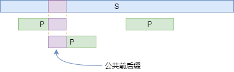

# 字符串

# 0 匹配算法

## 0.1 KMP算法

### 0.1.1 问题

KMP算法解决字符串模式匹配问题，给定字符串s和p，计算s中出现p的位置，p即pattern。实际上单就这个问题而言，完全可以采用暴力匹配的方式，假设s的长度为m，p的长度为n，则暴力匹配的时间复杂度为O(mn)，相比之下，KMP算法的时间复杂度为O(m+n)。

```
s: abxcabcycabcc
p:         cabcc
```

### 0.1.2 定义

先定义一些东西，方便后面阐释KMP算法背后的思想。

**定义1**：

- 前缀 prefix：字符串a是字符串b的前缀，意味着a是b的子串，且出现在开头。
- 后缀 suffix：字符串a是字符串b的后缀，意味着a是b的子串，且出现为尾部。

```
"abc" is prefix of "abcdefg"
"efg" is suffix of "abcdefg"
```

在本文中，我们只考虑真子串的情况，虽然按照定义，任意字符串自身也是自身的前缀，但这对于KMP来说没有意义。现在，我们可以定义一个有趣的东西：给定字符串s，如果字符串r既是s的前缀，也是s的后缀，它就是s的公共前后缀。



如上图，当我们用模式p匹配字符串s时，如果s中多次出现的p存在重叠的情况，那么重叠部分其实就是p的一个公共前后缀。

然后我们可以发现公共前后缀的两个有趣的性质：

**性质**：

1. 如果字符串r1，r2是s的两个不同的公共前后缀，且len(r1)>len(r2)，则r2是r1的公共前后缀。
2. 设s[0:i]的最长公共前后缀为s[0:k]，则s[0:k-1]必然是s[0:i-1]的一个公共前后缀。

这两个性质其实很trivial，读者自己画个图就能理解了，我懒得画图了，通过上面的性质1，我们很容易可以得出下面的结论：

**引理1**：

- 设r~1~,r~2~…是不同的字符串，r~i+1~是r~i~的最长公共前后缀，且r~1~是r~i~的最长公共前后缀，则r~1~,r~2依次是s长度递减的所有的公共前后缀。

### 0.1.3 next数组

现在我们先不谈KMP算法，先计算一个数组next，它的长度等于字符串p的长度（即pattern的长度），这个数组是这么定义的：

**定义2**：

- next[k]是p[0:k]的最长公共前后缀的长度，也即p[0:k]的最长公共前后缀为p[0:next[k]-1]。特别地，next[0]=0。注意：这里的p[0:k]是闭区间。

```cpp
vector<int> make_next(const string& p) {
    vector<int> next(p.size(), 0);
    int i = 0, j = 1;
    while (j < p.size()) {
        while (p[i] != p[j] && i > 0) {// 根据引理1，按长度递减的顺序尝试所有可能的p[0:i-1]的公共前后缀
            i = next[i - 1];
        }
        if (p[i] == p[j]) {// 找到了匹配的p[i]和p[j]，则p[0:j]的最长公共前后缀为p[0:i]
            next[j] = ++i;
        } else {
            next[j] = 0;// 否则为0
        }
        j++;
    }
    return next;
}
```

上面的代码计算next数组。实际上，循环中维护了如下的不变式：

> p[0:j-1]的最长公共前后缀为p[0:i-1]（i=0时特殊处理），且next[0:j-1]已ready。

当前循环的目标就是计算p[0:j]的最长公共前后缀，根据**性质1**，它等于p[0:j-1]的某一个公共前后缀加上p[j]，那显然我们要从p[0:j-1]的最长公共前后缀p[0:i-1]开始长度递减地尝试，如何按长度递减呢，参照**引理1**，我们只需迭代地拿p[0:i-1]的最长公共前后缀即可（这已经由next数组提供了）。

上面的思想在代码中的体现就是内层的while循环，经过while循环后只有两种结果，一是我们找到了一个最长的合适的p[0:j-1]的公共前后缀p[0:i-1]，且p[i]=p[j]，此时我们可以宣布，p[0:j]的最长公共前后缀就是p[0:i]，否则，就说明p[0:j]没有最长公共前后缀。

我们再分析一下上面算法的复杂度，注意到i和j都是整数，且循环内部变量i的增加必然伴随着j的增加，而j最多增大到len(p)，因此i的减少最多出现len(p)次，从而内部循环次数不超过2len(p)，时间复杂度为O(len(p))。

### 0.1.3 算法主体

终于可以开始介绍KMP算法的本体了：

```cpp
vector<int> kmp(const string& s, const string& p) {
    vector<int> res;
    if (s.size() < p.size()) return res;
    int i = 0, j = 0; 
    auto next = make_next(p);
    while (i != s.size()) {
        while (s[i] != p[j] && j > 0) {
            j = next[j - 1];
        }
        if (s[i] == p[j]) {
            i++; j++;
        } else {
            i++;
        }
        if (j == p.size()) {
            res.push_back(i - p.size());
            j = next[j - 1];
        }
    }
    return res;
}
```

依然通过循环不变式的思路来分析算法，这个循环维护了这样一个不变式：

> p[0:j-1]是p的所有前缀（这里包括p自身）中与s[i-j:i-1]匹配的最长的一个前缀。

那显然，我们按i走完一遍循环，一定能够把p在s中出现的所有位置给找到，因为只要出现了，p本身就会是最长前缀。现在我们看如何维持这个不变式，其实和计算next数组的方法很相似。



我们还是尝试匹配p[j]和s[i]，如果不匹配，由于p[0:j-1]已经和s[i-j:i-1]匹配好了，此时我们看p[0:j-1]的最长公共前后缀p[0:next[j-1]-1]，它也必然和s[i-next[j-1]:i-1]匹配好了，这说明我们可以直接尝试用p[next[j-1]]和s[i]尝试匹配，这是除p[0:j-1]以外最长的可能的前缀；如果还不匹配，迭代下去即可。

算法的时间复杂度分析与next数组构建异曲同工，j的增加依赖于i，而j最小为0，最高不超过i增加的次数，而i最大为len(s)，因此循环次数上线为2len(s)，从而复杂度为O(len(s))。加上`make_next`的O(len(p))，整个KMP算法的时间复杂度为O(len(s)+len(p))。

可以看到KMP算法的时间复杂度是线性的，但是我们可以看C++,Python等语言为字符串类实现的find方法，都没有采用KMP，而是使用传统的暴力搜索。这是因为KMP算法需要额外分配空间去计算前缀数组，在字符串较小的时候其实是不如直接暴力搜索的。KMP算法适用于对于一个固定的模式，需要对大量字符串进行匹配的情况，此时计算好next数组后我们就可以直接快速进行线性匹配。

# 1 有效的括号（20）

[20. 有效的括号 - 力扣（Leetcode）](https://leetcode.cn/problems/valid-parentheses/)

## 1.1 哈希与栈

时间复杂度：$O(N)$

空间复杂度：$O(N)$

```c++
class Solution {
public:
    bool isValid(string s) {
        unordered_map<char,int> m{{'(',1},{'[',2},{'{',3},
                                {')',4},{']',5},{'}',6}};
        stack<char> st;
        bool istrue=true;
        for(char c:s){
            int flag=m[c];
            if(flag>=1&&flag<=3) st.push(c);
            else if(!st.empty()&&m[st.top()]==flag-3) st.pop();
            else {istrue=false;break;}
        }
        if(!st.empty()) istrue=false;
        return istrue;
    }
};

// 另一种写法
class Solution {
public:
    bool isValid(string s) {
        stack<char> st;
        unordered_map<char, char>   hash{{'(', ')'}, {'[', ']'}, {'{', '}'}};
        for(int i(0); i < s.size(); ++i)
        {
            if(s[i] == '(' or s[i] == '[' or s[i] == '{')   st.push(s[i]);
            else if(!st.empty())
            {
                if(hash[st.top()] != s[i])  return false;
                st.pop();
            }
            else    return false;
        }
        if(!st.empty()) return false;
        return true;
    }
};
```

# 2 字符串相加（415）

[415. 字符串相加 - 力扣（Leetcode）](https://leetcode.cn/problems/add-strings/)

## 2.1 模拟

时间复杂度：$O(MAX(M, N))$

空间复杂度：$O(MAX(M, N))$

```c++
class Solution {
public:
    string addStrings(string num1, string num2) {
        int size1(num1.size() - 1), size2(num2.size() - 1);
        int carry(0);
        string res;

        while(size1 >= 0 or size2 >= 0)
        {
            int x = size1 >= 0 ? num1[size1] - '0' : 0;
            int y = size2 >= 0 ? num2[size2] - '0' : 0;
            int  temp = x + y + carry;

            res.push_back('0' + temp % 10);
            carry = temp / 10;
            --size1;
            --size2;
        }
        if(carry)   res.push_back('1');
        reverse(res.begin(), res.end());

        return res;
    }
};
```

# 3 二进制求和（67）

[67. 二进制求和 - 力扣（Leetcode）](https://leetcode.cn/problems/add-binary/)

## 3.1 模拟

```c++
class Solution {
public:
    string addBinary(string a, string b) {
        int size_a(a.size() - 1), size_b(b.size() - 1);
        int carry(0);
        string res;

        while(size_a >= 0 or size_b >= 0)
        {
            int temp_a = size_a >= 0 ? a[size_a] - '0' : 0;
            int temp_b = size_b >= 0 ? b[size_b] - '0' : 0;
            int temp = temp_a + temp_b + carry;
            if(temp >= 2)
            {
                temp = temp - 2;
                carry = 1;
            }
            else    carry = 0;

            res.push_back(temp + '0');
            --size_a, --size_b;
        }
        if(carry)   res.push_back('1');
        reverse(res.begin(), res.end());
        return res;
    }
};
```

# 4 反转字符串（344）

[344. 反转字符串 - 力扣（Leetcode）](https://leetcode.cn/problems/reverse-string/)

## 4.1 暴力解法（双指针）

时间复杂度：$O(N)$

空间复杂度：$O(1)$

```c++
class Solution {
public:
    void reverseString(vector<char>& s) {
        for(int i = 0; i < s.size() / 2; ++i)
            swap(s[i], s[s.size() - i - 1]);
    }
};

// 双指针
class Solution {
public:
    void reverseString(vector<char>& s) {
        int n = s.size();
        for (int left = 0, right = n - 1; left < right; ++left, --right) {
            swap(s[left], s[right]);
        }
    }
};
```

## 4.2 异或（可参考的写法，不使用STL库）

```c++
class Solution {
public:
    void reverseString(vector<char>& s) {
        for(int l = 0, r = s.size() - 1; l < r; ++l, --r)
        {
            s[l] ^= s[r];		//构造 a ^ b 的结果，并放在 a 中
        	s[r] ^= s[l];		//将 a ^ b 这一结果再 ^ b ，存入b中，此时 b = a, a = a ^ b
        	s[l] ^= s[r];		//a ^ b 的结果再 ^ a ，存入 a 中，此时 b = a, a = b 完成交换
        }
    }
};
```

# 5 反转字符串 II（541）

[541. 反转字符串 II - 力扣（Leetcode）](https://leetcode.cn/problems/reverse-string-ii/)

## 5.1 模拟

```c++
class Solution {
public:
    string reverseStr(string s, int k) {
        int n = s.length();
        for (int i = 0; i < n; i += 2 * k) {
            reverse(s.begin() + i, s.begin() + min(i + k, n));
        }
        return s;
    }
};
```

# 6 反转字符串中的单词 III（557）

[557. 反转字符串中的单词 III - 力扣（Leetcode）](https://leetcode.cn/problems/reverse-words-in-a-string-iii/)

## 6.1 快慢指针

时间复杂度：$O(N)$

空间复杂度：$O(1)$

```c++
class Solution {
public:
    string reverseWords(string s) {
        auto slow(s.begin());
        auto fast = s.begin();

        while(fast <= s.end())
        {
            if(*fast == ' ' || fast == s.end())
            {
                reverse(slow, fast);
                slow = fast + 1;
            }
            ++fast;
        }

        return s;
    }
};
```

## 6.2 使用额外空间

时间复杂度：$O(N)$

空间复杂度：$O(N)$

```c++
class Solution {
public:
    string reverseWords(string s) {
        string ret;
        int length = s.length();
        int i = 0;
        while (i < length) {
            int start = i;
            while (i < length && s[i] != ' ') {
                i++;
            }
            for (int p = start; p < i; p++) {
                ret.push_back(s[start + i - 1 - p]);
            }
            while (i < length && s[i] == ' ') {
                i++;
                ret.push_back(' ');
            }
        }
        return ret;
    }
};
```

# 7 反转字符串中的元音字母（345）

[345. 反转字符串中的元音字母 - 力扣（Leetcode）](https://leetcode.cn/problems/reverse-vowels-of-a-string/)

## 7.1 左右指针

```c++
class Solution {
    unordered_set<char> set{'a', 'e', 'i', 'o', 'u',
                            'A', 'E', 'I', 'O', 'U'};
public:
    string reverseVowels(string s) {
        int left(0), right(s.size() - 1);

        while(left < right)
        {
            if(set.count(s[left]) and set.count(s[right]))  
            {
                swap(s[left], s[right]);
                ++left;
                --right;
            }
                
            if(set.count(s[left]) == 0)     ++left;
            if(set.count(s[right]) == 0)    --right;
        }

        return s;
    }
};
```

# 8 验证回文串（125）

[125. 验证回文串 - 力扣（Leetcode）](https://leetcode.cn/problems/valid-palindrome/)

## 8.1 双指针

```c++
class Solution {
public:
    bool isPalindrome(string s) {
        int slow(0), fast(0);
        for(; fast < s.size(); ++fast)          // 快慢指针除去非字母符号
        {
            if((s[fast] <= 'z' and s[fast] >= 'a') or 
                (s[fast] <= 'Z' and s[fast] >= 'A'))
            {
                s[slow++] = tolower(s[fast]);
            }
            if((s[fast] <= '9' and s[fast] >= '0'))
            {
                s[slow++] = s[fast];
            }
        }

        int left(0), right(slow - 1);
        while(left < right)
        {
            if(s[left++] != s[right--]) return false;
        }
        return true;
    }
};

// 进一步优化
class Solution {
public:
    bool isPalindrome(string s) {
        int slow(0), fast(0);
        for(; fast < s.size(); ++fast)          // 快慢指针除去非字母数字符号
        {
            if(islower(s[fast]) or isupper(s[fast]) or isdigit(s[fast]))
            {
                s[slow++] = tolower(s[fast]);	// 对于数字，tolower会直接返回对应数字
            }
        }

        int left(0), right(slow - 1);
        while(left < right)
        {
            if(s[left++] != s[right--]) return false;
        }
        return true;
    }
};

// 更进一步
class Solution {
public:
    bool isPalindrome(string s) {
        int slow(0), fast(0);
        for(; fast < s.size(); ++fast)          // 快慢指针除去非字母数字符号
        {
            if(isalnum(s[fast]))				// 判断是否是字母或数字
            {
                s[slow++] = tolower(s[fast]); 	// 对于数字，tolower会直接返回对应数字
            }
        }

        int left(0), right(slow - 1);
        while(left < right)
        {
            if(s[left++] != s[right--]) return false;
        }
        return true;
    }
};
```

# 9 验证回文串 II（680）

[680. 验证回文串 II - 力扣（Leetcode）](https://leetcode.cn/problems/valid-palindrome-ii/)

## 9.1 动态规划

```c++
// 极低效率
class Solution {
public:
    bool validPalindrome(string s) {
        int left(0), right(s.size() - 1);
        int flag_l(0), flag_r(0);
        string temp;

        while(left < right)
        {
            if(s[left] != s[right])
            {
                if(left + 1 == right)   return true;
                else if(s[left + 1] == s[right] and s[left] == s[right - 1])
                {
                    flag_r = 1, flag_l = 1;
                    break;
                }
                else if(s[left + 1] == s[right])    
                {   
                    flag_l = 1;
                    break;
                }
                else if(s[left] == s[right - 1])    
                {
                    flag_r = 1;
                    break;
                }
                else    return false;
            }

            --right, ++left;
        }

        if(left >= right)  return true;  

        cout << "r: " << right << endl;
        cout << "l: " << left << endl;
        cout << "flagl: " << flag_l << endl;
        cout << "flagR: " << flag_r << endl;

        if(flag_l)
        {
            for(int i = 0; i < s.size(); ++i) 
                if(i != left)  temp.push_back(s[i]);
            
            int l = 0, r = temp.size() - 1;
            while(l < r)
            {
                if(temp[l] != temp[r]) break;
                ++l, --r;
            }

            if(l >= r)  return true;  
        }

        temp.clear();
        if(flag_r)
        {
            for(int i = 0; i < s.size(); ++i) 
                if(i != right)  temp.push_back(s[i]);
            
            int l = 0, r = temp.size() - 1;
            while(l < r)
            {
                if(temp[l] != temp[r]) break;
                ++l, --r;
            }

            if(l >= r)  return true;  
        }

        return false;
    }
};

// 参考别人的题解
class Solution {
public:
    bool check(string& ss, int left, int right){
        if (left >= right) return true;
        while (left < right){
            if (ss[left] != ss[right]) return false;
            ++ left, -- right;
        }
        return true;
    }

    bool validPalindrome(string s) {
        int l(0), r(s.size() - 1); 
        
        while (l < r){
            if (s[l] != s[r]){
                return check(s, l, r - 1) || check(s, l + 1, r);		// 这个处理很妙啊
            }
            ++ l, -- r;
        }

        return true;
    }
};
```

# 10 根据字符出现频率排序（451）

[451. 根据字符出现频率排序 - 力扣（Leetcode）](https://leetcode.cn/problems/sort-characters-by-frequency/)

## 10.1 使用Vector+自定义排序

```c++
// bool mysort(const pair<char, int> &p1, const pair<char, int> &p2)
// {
//     return p1.second > p2.second;
// }

class Solution {
public:
    static bool mysort(const pair<char, int> &p1, const pair<char, int> &p2)		
    {
        return p1.second > p2.second;
    }

    string frequencySort(string s) {
        unordered_map<char, int> map;
        for (const auto &c : s) {
            ++map[c];
        }
        vector<pair<char, int>> vec;
        for (const auto &m : map) {
            vec.push_back(m);
        }
        
        sort(vec.begin(), vec.end(), mysort);
        string ret;
        for (const auto &v : vec) {
            ret += string(v.second, v.first);
        }
        return ret;
    }
};
```

## 10.2 优先队列

```c++
class Solution {
public:
    string frequencySort(string s) {
        unordered_map<char, int> map;
        for (const auto &c : s) {
            ++map[c];
        }
        priority_queue<pair<int, char>> pq;     // 默认按第一个元素自动排序，从大到小
        for (const auto &m : map) {
            pq.push({m.second, m.first});
        }        
        string ret;
        while (!pq.empty()) {
            auto t = pq.top(); 
            pq.pop();
            ret.append(t.first, t.second);
        }
        return ret;
    }
};
```

## <span style="background:#FF9999;">10.3 利用lambda自定义排序</span>


```c++
class Solution {
public:
    string frequencySort(string s) {
        unordered_map<char, int> map;
        for (const auto &c : s) {
            ++map[c];
        }
        sort(s.begin(), s.end(), [&map](char &a, char &b)		// 此处只能用lambda的形式写 
             						{ return map[a] > map[b] || (map[a] == map[b] && a < b); });
        return s;
    }
};
```

## <span style="background:#FF9999;">10.4 数组下标索引</span>

> 🫥技不如人，甘拜下风

```c++
class Solution {
public:
    string frequencySort(string s) {
        unordered_map<char, int> map;
        for (const auto &c : s) {
            ++map[c];
        }
        vector<string> vec(s.size() + 1);
        string res;
        for (const auto &m : map) {
            vec[m.second].append(m.second, m.first);    // m.second个m.first
        }
        for (int i = s.size(); i > 0; --i) {
            if (!vec[i].empty()) {
                res.append(vec[i]);
            }
        }
        return res;
    }
};
```

## 10.5 哈希表

按理说，我觉得这个效率应该蛮低的，但实际还蛮高。


时间复杂度：$O(N^2)$

空间复杂度：$O(N)$

按理说，sort的效率应该比这个高，疑惑疑惑。

```c++
class Solution {
public:
    string frequencySort(string s) {
        int hash[128] = {0};
        
        if(s.size() <= 2)   return s;
        for(int i = 0; i < s.size(); ++i)   ++hash[s[i]];

        vector<pair<char, int>> p;   
        while(1)
        {
            int flag = 0;
            int max_size = 0;
            char max_ch = 0;
            for(int i = 0; i < 128; ++i)
            {
                if(hash[i]) flag = 1;
                if(max_size < hash[i])
                {
                    max_ch = i;
                    max_size = hash[i];
                }
            }

            if(flag == 1)   hash[max_ch] = 0;
            if(flag == 1)   p.emplace_back(pair{max_ch, max_size});    
            else    break;
        }

        s.clear();
        for(auto &iter : p)
        {
            while(iter.second--)
                s.push_back(iter.first);
        }

        return s;
    }
};
```

# 11 字符串中的单词数（434）

[434. 字符串中的单词数 - 力扣（Leetcode）](https://leetcode.cn/problems/number-of-segments-in-a-string/)

## 11.1 问题转换、

考虑到，最后一个字符后面跟的就是尾后迭代器，而不是`' '`，这会导致条件判断的复杂化，因此可以考虑直接在尾部添加一个`' '`。

```c++
class Solution {
public:
    int countSegments(string s) {
        int ans = 0;
        s += ' ';
        for (int i = 1; i < s.size(); i++) 
            if (s[i] == ' ' && s[i - 1] != ' ') ans++;
        return ans;
    }
};
```

## 11.2 原地法

满足单词的第一个下标有以下两个条件：

- 该下标对应的字符不为空格；
- 该下标为初始下标或者该下标的前下标对应的字符为空格；

```c++
class Solution {
public:
    int countSegments(string s) {
        int segmentCount = 0;

        for (int i = 0; i < s.size(); i++) {
            if ((i == 0 || s[i - 1] == ' ') && s[i] != ' ') {
                segmentCount++;
            }
        }

        return segmentCount;
    }
};
```

## <span style="background:#FF9999;">11.3 STL库</span>

```c++
class Solution {
public:
    int countSegments(string s) {
        /* 题目中的单词并不是严格意义上的单词, 说是一串连续的字符更合适。两种思路: 
        * 1、用空格做split, 把空的直接干掉, 剩下的统计一下数量. 
        * 2、使用istringstream处理
        */
        istringstream temp(s);   /* 类似于cin, 以空格(包括连续空格)为分隔符将原字符串中的子字符串保存 */
        int count = 0;
        while (temp >> s) 
            count++;
        
        return count;
    }
};
```

## 11.4 处理连续的0 + 基于split来做

> 想不到的，别看了。🐽

用空格做split, 把空的直接干掉, 剩下的统计一下数量。 C++中并没有库函数实现split, 故自己实现了一个split, 而Java、C#、Python等等可以使用库函数的split。

```c++
class Solution {
public:
    int countSegments(string s) {
        /* 题目中的单词并不是严格意义上的单词, 说是一串连续的字符更合适。思路2: 
        * 用空格做split, 把空的直接干掉, 剩下的统计一下数量. 
        */
        s.erase(s.find_last_not_of(' ')+1);         // 删除尾部连续空格
        s.erase(0, s.find_first_not_of(' '));       // 删除开头连续空格
        auto bothAreSpaces = [](char a, char b) 
        { 
            return isspace(a) && isspace(b); 
        };
        s.erase(unique(s.begin(), s.end(), bothAreSpaces), s.end());  /* 将中间连续的空格换成1个 */

        vector<string> parts = split(s, ' ');
        int len = parts.size();
        for (int i = 0; i < len; i++)
        {
            if (parts[i] == "") 
            {
                if (i < len - 1) parts.erase(parts.begin() + i);
                else parts.pop_back();
            }
        }
        
        return parts.size();
    }
    vector<string> split(const string& s, char separator)
    {
        vector<string> tokens;
        string token;
        istringstream tokenStream(s);
        while (getline(tokenStream, token, separator))
        {
            tokens.push_back(token);
        }
        return tokens;
    }
};
```

# 12 前K个高频单词（692）

[692. 前K个高频单词 - 力扣（Leetcode）](https://leetcode.cn/problems/top-k-frequent-words/)

## <span style="background:#FF9999;">12.1 利用lambda自定义排序</span>

```c++
class Solution {
public:
    vector<string> topKFrequent(vector<string>& words, int k) {
        unordered_map<string , int> hash;

        for(int i = 0; i < words.size(); ++i)
            ++hash[words[i]];

        sort(words.begin(), words.end(), [&hash](const string &a, const string &b) -> bool
                {
                    return (hash[a] > hash[b]) || (hash[a] == hash[b] && a < b);
                });

        vector<string> ans;
        int sum = 0;
        for(int i = 0; i < k; ++i)
        {
            ans.emplace_back(words[sum]);
            sum += hash[words[sum]];
        }
            

        return ans;
    }
};
```

## 12.2 使用Vector+自定义排序（待验证，做的时候给我报了超出内存限制，但理论上代码应该OK）


```c++
class Solution {
public:
    vector<string> topKFrequent(vector<string>& words, int k) {
        unordered_map<string, int> hash;
        for (const auto &c : words)     ++hash[c];
            
        vector<pair<string, int>> vec;
        for (const auto &h : hash)  vec.push_back(h);

        sort(vec.begin(), vec.end(), [](pair<string, int> &a, pair<string, int> &b) -> bool
                                    {
                                        return a.second > b.second || (a.second == b.second and a.first > b.first);
                                    });

        vector<string> res;
        for(int i = 0; i < k; ++k)  res.emplace_back(vec[i].first);

        return res;
    }
};
```

## 12.3 优先队列（堆排序+lambda表达式 + decltype）

```c++
class Solution {
public:
    vector<string> topKFrequent(vector<string>& words, int k) {
        unordered_map<string, int> hash;
        for (const auto &c : words)     ++hash[c];

        auto cmp = [](const pair<string, int>& a, const pair<string, int>& b) {
            return a.second == b.second ? a.first < b.first : a.second > b.second;
        };
            
        priority_queue<pair<string, int>, vector<pair<string, int>>, decltype(cmp)> pq(cmp);
        for(const auto &h: hash)
        {
            pq.push(h);
            if(pq.size() > k)   pq.pop();
        }

        vector<string> res(k);
        for (int i = k - 1; i >= 0; i--)
        {
            res[i] = pq.top().first;		// 先进先出，最大的在最前面
            pq.pop();
        }

        return res;
    }
};
```

### 12.3.1 为什么`priority_queue`的第三个参数是`decltype(cmp)`，而不是对应的类型，比如`bool`或其他内容？

自定义`priority_queue`排序规则的时候，如果用`lambda`, 就需要用 `priority_queue<pair<string, int>, vector<pair<string, int>>, decltype(cmp)> que(cmp);`的形式。也可以使用结构体重载`operator()`的方法，这时不需要`decltype`。

```c++
typedef pair<string, int> p;
struct comp {
    bool operator() (p& a, p& b) {
         return a.second == b.second ? a.first < b.first : a.second > b.second;//小顶堆
    }
};
priority_queue<p, vector<p>, comp> pq;
```

也可以参考：

> priority_queue takes the comparator as a template argument. Lambda functions are objects, and thus can't be used as template arguments (only very few types can be, among them integral types). From [StackOverflow](https://leetcode.cn/link/?target=https%3A%2F%2Fstackoverflow.com%2Fquestions%2F5807735%2Fc-priority-queue-with-lambda-comparator-error)
>
> [deduction guides for std::priority_queue - cppreference.com](https://en.cppreference.com/w/cpp/container/priority_queue/deduction_guides)

## 12.4 优先队列（堆排序+ struct + 重载操作符`()`）

```c++
class Solution {
public:
    struct cmp {
        bool operator()(const pair<string, int> &a, const pair<string, int> &b) {
			return a.second == b.second ? a.first < b.first : a.second > b.second;
        }
    };
    
    vector<string> topKFrequent(vector<string>& words, int k) {
        unordered_map<string, int> hash;
        for (const auto &c : words)     ++hash[c];
            
        priority_queue<pair<string, int>, vector<pair<string, int>>, cmp> pq;
        for(const auto &h: hash)
        {
            pq.push(h);
            if(pq.size() > k)   pq.pop();
        }

        vector<string> res(k);
        for (int i = k - 1; i >= 0; i--)
        {
            res[i] = pq.top().first;		// 先进先出，最大的在最前面
            pq.pop();
        }

        return res;
    }
};
```

# 13 检测大写字母（520）

[520. 检测大写字母 - 力扣（Leetcode）](https://leetcode.cn/problems/detect-capital/)

## 13.1 模拟法（根据题目要求实现）

```c++
class Solution {
public:
    bool detectCapitalUse(string word) {
        int count(0);
        
        for(int i = 0; i < word.size(); ++i)
            if(isupper(word[i]))  ++count;
        
        if(isupper(word[0]))
        {
            if(count == 1)  return true;
            if(word.size() == count)    return true;
            return false;
        }

        if(count >= 1)  return false;
        return true;
    }
};

//官方题解
class Solution {
public:
    bool detectCapitalUse(string word) {
        // 若第 1 个字母为小写，则需额外判断第 2 个字母是否为小写
        if (word.size() >= 2 && islower(word[0]) && isupper(word[1])) {
            return false;
        }
        
        // 无论第 1 个字母是否大写，其他字母必须与第 2 个字母的大小写相同
        for (int i = 2; i < word.size(); ++i) {
            if (islower(word[i]) ^ islower(word[1])) {
                return false;
            }
        }
        return true;
    }
};
```

### 4.13.2 转换问题

这种方法已经见过不止一次了，转换问题往往是一种行之有效的方法（前提是……）。

```c++
class Solution {
public:
    bool detectCapitalUse(string word) {
        int uc = 0;
        for (int i = 0; i < word.size(); i++) {
            if (isupper(word[i]) && uc++ < i) {
                return false;
            }
        }
        
        return uc == word.size() || uc <= 1;
    }
};
```

……前提是，you can really understand it and realize or achieve it.

# 14 最长公共前缀（14）

[14. 最长公共前缀 - 力扣（Leetcode）](https://leetcode.cn/problems/longest-common-prefix/)

## 14.1 纵向扫描

```c++
class Solution {
public:
    string longestCommonPrefix(vector<string>& strs) {
        string res = strs[0];             //选择第一个字符串作为对照标准
        for(int i = 1; i < strs.size(); i++)
        {
            for(int j = 0; j < res.length(); j++)
            {
                if(res[j] == strs[i][j])    continue;
                else    res.erase(j);       //找到第一个不符合的字符位置，从pos=j处开始删除直至结尾
                break;
            }
        }
        return res;
    }
};

class Solution {
public:
    string longestCommonPrefix(vector<string>& strs) {
        //字符串数组为空则置res为空，否则置为第一个字符串
        string res = strs.empty() ? "" : strs[0]; 
        //遍历字符串数组
        for (string s : strs)
        {
            /*
            在字符串s中查找res并返回首字母的位置（find函数）
            如果首地址不为零，每次令res-1以缩短公共前缀
            比如说再flow中查找flower，没有找到，返回值为迭代器结尾（非0）
            公共前缀会减掉最后一个字母，为flowe。继续循环直到为flow

            如果是首字母不一样则公共前缀会清空
            */ 
            while (s.find(res) != 0) 
            {
                res = res.substr(0, res.length() - 1);
            }
        }
        return res;
    }
};
```

# 15 最长特殊序列 Ⅰ（521）

[521. 最长特殊序列 Ⅰ - 力扣（Leetcode）](https://leetcode.cn/problems/longest-uncommon-subsequence-i/)

## 15.1 简单题解

其实这题最重要的是看明白题目的意思：

1. 两字符串长度不等，特殊序列即为较大字符串；
2. 若长度相等且字符串相同返回-1；
3. 若长度相等，字符串不同，返回a或b长度。

```c++
class Solution {
public:
    int findLUSlength(string a, string b) {
        return a != b ? max(a.length(), b.length()) : -1;
    }
};
```

# 16 最长特殊序列 II（522）

[522. 最长特殊序列 II - 力扣（Leetcode）](https://leetcode.cn/problems/longest-uncommon-subsequence-ii/)

## 16.1 双指针

```c++
class Solution {
public:
    int findLUSlength(vector<string>& strs) {
        int i, j;
        int res, flag;
        res = -1;
        for(i = 0;i < strs.size(); i++){
            flag = 1;
            for(j = 0; j < strs.size(); j++){
                if(i == j)  continue;
                if(isSubseq(strs[i], strs[j]) == 1) flag = 0;
            }
            if (flag == 1 && res < (int)strs[i].size()){
                res = strs[i].size();
            }
        }
        return res;
    }
    bool isSubseq(string& s1, string& s2){
        int i = 0, j = 0;
        while (i < s1.size() && j < s2.size()){
            if(s2[j] != s1[i]){
                j++;
            }
            else{
                i++;
                j++;
            }
        }
        return i >= s1.size();
    }
};
```

## 16.2 开拓思路（反证法）

性质： 若 s 的子串是特殊序列，则s也是特殊序列，因此只需看整体字符就可以。

反证法：若字符串 s 不是特殊序列的话，则该字符串一定是其它某个字符串 t 的子序列，那么就可以通过删除 t 的部分字符，使得 t 的某个子序列是 s1 ，s1 不是特殊序列，故 s一定是特殊序列。

性质的使用：特殊序列只需要考虑整个字符串即可，不需要枚举子串，因为如果子串是特殊序列，那么字符串 s 本身也是特殊序列，且更长，因此**只需要对每个字符串 s 进行判断，是否是其他字符串的子串即可**。

```c++
class Solution {
public:
    bool isSubStr(string &a, string &b){//判断a是否为b的子串
        int i = 0;
        for (auto c: b)
            if (i < a.size() && c == a[i]) i++ ;
        return i == a.size();
    }
    int findLUSlength(vector<string>& strs) {
        sort(strs.begin(),strs.end(),[](string a, string b){    //按照长度从大到小排 
            return a.size()>b.size();
        });
        for(int i = 0; i < strs.size(); i++){   //按照长度从大到小枚举串i 判断i会否是特殊序列
            bool isSub = false;                 //先假设i不是任何串的子串
            for(int j = 0; j < strs.size() && strs[i].size() <= strs[j].size(); j++){   //判断i是否为j的子串
                if(i != j && isSubStr(strs[i], strs[j])){   //若i是j的子串 则i不是特殊序列 跳出即可 
                    isSub = true;
                    break;
                }
            }
            if(!isSub) return strs[i].size();       //i不是任何串的子串 则为特殊序列 直接返回即可 
        }
        return -1;
    }
};
```

# 17 计数二进制子串（696）

[696. 计数二进制子串 - 力扣（Leetcode）](https://leetcode.cn/problems/count-binary-substrings/)

## 17.1 暴力解法

超时了

- 时间复杂度：$O(n^2)$。
- 空间复杂度：$O(1)$。

```c++
class Solution {
public:
    int countBinarySubstrings(string s) {
        int res(0);

        if(s.size() == 1)   return 0;
        for(int i(0); i < s.size() - 1; ++i)
        {
            int sum(0);
            int flag(0);
            int size1(1), size2(0);
            for(int j(i + 1); j < s.size(); ++j)
            {
                if(s[j] == s[i] and flag == 0)  size1++;
                if(s[j] == s[i] and flag == 1)  break;
                if(s[j] != s[i])
                {
                    flag = 1;
                    size2++;
                }
                if(flag == 1 and size1 == size2)    res++;  
            }
        }

        return res;
    }
};
```

## 17.2 按字符分组、一次遍历

- 时间复杂度：$O(n)$。
- 空间复杂度：$O(1)$。

```c++
class Solution {
public:
    int countBinarySubstrings(string s) {
        int ptr = 0, n = s.size(), last = 0, ans = 0;
        while (ptr < n) {
            char c = s[ptr];
            int count = 0;
            while (ptr < n && s[ptr] == c) {
                ++ptr;				// 此处实现了ptr的一次遍历
                ++count;
            }
            ans += min(count, last);	// 此处转换了问题, 将计数与匹配问题, 转换为了有多少个1或0的最小值
            last = count;
        }
        return ans;
    }
};

// 优化算法
class Solution {
public:
    int countBinarySubstrings(string s) {
        int i = 0, pre = 0, cur = 1, ans = 0;
        for (int i = 0; i < s.size() - 1; ++i) {
            if(s[i] == s[i + 1]) ++cur;
            else
            {
                pre = cur;
                cur = 1;
            }
            if(pre >= cur)  ++ans;
        }
        return ans;
    }
};
```

# 18 两数相加（2）

[2. 两数相加 - 力扣（Leetcode）](https://leetcode.cn/problems/add-two-numbers/)

## 18.1 模拟题

```c++
/**
 * Definition for singly-linked list.
 * struct ListNode {
 *     int val;
 *     ListNode *next;
 *     ListNode() : val(0), next(nullptr) {}
 *     ListNode(int x) : val(x), next(nullptr) {}
 *     ListNode(int x, ListNode *next) : val(x), next(next) {}
 * };
 */
class Solution {
public:
    ListNode* addTwoNumbers(ListNode* l1, ListNode* l2) {
        ListNode *dummy = new ListNode(0); // 辅助节点
        ListNode *pre = dummy;
        int carry = 0;
        while (l1 != nullptr || l2 != nullptr) {
            int n1 = l1 != nullptr ? l1->val : 0;
            int n2 = l2 != nullptr ? l2->val : 0;
            int sum = n1 + n2 + carry;
            pre->next = new ListNode(sum % 10);
            carry = sum / 10;
            
            pre = pre->next;
            if (l1 != nullptr) l1 = l1->next;
            if (l2 != nullptr) l2 = l2->next;
        }
        if (carry > 0) pre->next = new ListNode(carry);
        
        return dummy->next;
    }
};
```

# 19 移除元素（27）

## 19.1 双指针优化

```c++
class Solution {
public:
    int removeElement(vector<int>& nums, int val) {
        int slow = 0;

        for(int i = 0; i < nums.size(); i++)
            if(nums[i] != val)	nums[slow++] = nums[i];

        return slow;
    }
};
```

# 20 删除字符使频率相同

[2423. 删除字符使频率相同 - 力扣（Leetcode）](https://leetcode.cn/problems/remove-letter-to-equalize-frequency/)

## 20.1 排序+分类讨论

```c++
class Solution {
public:
  bool equalFrequency(string word) {
    std::vector<int> freq(26, 0);
    for (char ch : word) {
      freq[ch - 'a']++;
    }
    freq.erase(std::remove(freq.begin(), freq.end(), 0),
               freq.end());
    std::sort(freq.begin(), freq.end());

    int n = freq.size();
    if (n == 1) {
      return true;
    }
    if (freq[0] == 1 && freq[1] == freq.back()) {
      return true;
    }
    if (freq[n - 1] == freq[n - 2] + 1) {
      if (n == 2 || freq[0] == freq[n - 2]) {
        return true;
      }
    }
    return false;
  }
};

```

# 21 删除链表的倒数第 N 个结点（19）

[19. 删除链表的倒数第 N 个结点 - 力扣（Leetcode）](https://leetcode.cn/problems/remove-nth-node-from-end-of-list/)

## 21.1 双指针

```c++
/**
 * Definition for singly-linked list.
 * struct ListNode {
 *     int val;
 *     ListNode *next;
 *     ListNode() : val(0), next(nullptr) {}
 *     ListNode(int x) : val(x), next(nullptr) {}
 *     ListNode(int x, ListNode *next) : val(x), next(next) {}
 * };
 */
class Solution {
public:
    ListNode* removeNthFromEnd(ListNode* head, int n) {
        ListNode* dummy = new ListNode(0);  //哑节点
        if(!head)  return head;
        dummy->next = head;
        ListNode* p = dummy;
        ListNode* q = dummy;
        for(int i=0; i<n;i++)
        {
            q=q->next;
        }
        while(q->next)
        {
           p= p->next;
           q= q->next;
        }
        p->next = p->next->next;  //删除p->next的节点
   
        ListNode* res = dummy->next;
        delete dummy;   //删除哑节点
        return res;

    }
};
```

# 22 回文数（9）

[9. 回文数 - 力扣（Leetcode）](https://leetcode.cn/problems/palindrome-number/description/)

## 22.1 反转一半数字

```c++
class Solution {
public:
    bool isPalindrome(int x) {
        // 特殊情况：
        // 如上所述，当 x < 0 时，x 不是回文数。
        // 同样地，如果数字的最后一位是 0，为了使该数字为回文，
        // 则其第一位数字也应该是 0
        // 只有 0 满足这一属性
        if (x < 0 || (x % 10 == 0 && x != 0)) {
            return false;
        }

        int revertedNumber = 0;
        while (x > revertedNumber) {
            revertedNumber = revertedNumber * 10 + x % 10;
            x /= 10;
        }

        // 当数字长度为奇数时，我们可以通过 revertedNumber/10 去除处于中位的数字。
        // 例如，当输入为 12321 时，在 while 循环的末尾我们可以得到 x = 12，revertedNumber = 123，
        // 由于处于中位的数字不影响回文（它总是与自己相等），所以我们可以简单地将其去除。
        return x == revertedNumber || x == revertedNumber / 10;
    }
};
```

# 23 有效时间的数目（2437）

[2437. 有效时间的数目 - 力扣（Leetcode）](https://leetcode.cn/problems/number-of-valid-clock-times/)

## 23.1 乘法原理

```c++
class Solution {
    int count(string t, int period) {
        int ans = 0;
        for (int i = 0; i < period; i++)
            if ((t[0] == '?' || i / 10 == t[0] - '0') &&
                (t[1] == '?' || i % 10 == t[1] - '0'))
                ans++;
        return ans;
    }
public:
    int countTime(string time) {
        return count(time.substr(0, 2), 24) * count(time.substr(3), 60);
    }
};
```

## 23.2 枚举

枚举就是了，别惯着

```c++
class Solution {
    public int countTime(String time) {
        int ans = 1;
        char a = time.charAt(0), b = time.charAt(1), c = time.charAt(3), d = time.charAt(4);
        if (d == '?') ans *= 10;
        if (c == '?') ans *= 6;
        if (a == '?' && b == '?') {
            ans *= 24;
        } else if (b == '?') {
            if (a == '2') ans *= 4;
            else ans *= 10;
        } else if (a == '?') {
            if (b <= '9' && b >= '4') ans *= 2;
            else ans *= 3;
        }
        return ans;
    }
}
```

# 24 找出字符串中第一个匹配项的下标（28）

[28. 找出字符串中第一个匹配项的下标 - 力扣（Leetcode）](https://leetcode.cn/problems/find-the-index-of-the-first-occurrence-in-a-string/description/)

## 24.1 库函数

```c++
class Solution {
public:
    int strStr(string haystack, string needle) {
        if(needle.empty())
            return 0;
        int pos=haystack.find(needle);
        return pos;
    }
};
```

## 24.2 暴力解法

```c++
class Solution {
public:
    int strStr(string haystack, string needle) {
        char n_1 = needle[0];
        int i = 0;
        int j = 0;

        if(needle.size() > haystack.size()) return -1;
        for(i = 0; i < haystack.size(); i++)
        {
            if(haystack[i] == n_1)
            {
                for(j = i; j < haystack.size() && (j - i < needle.size()); j++)
                {
                    if(haystack[j] == needle[j - i])
                    {
                        continue;
                    }
                    break;
                }
                if(j - i == needle.size())    return i;
            }
        }

        return -1;
    }
};
```

## 24.3 KMP

```c++
class Solution {
public:
    vector<int> getnext(string str)
        {
            int len = str.size();
            vector<int> next;
            next.push_back(-1);//next数组初值为-1
            int j = 0, k = -1;
            while(j < len - 1)
            {
                if(k == -1 || str[j] == str[k])//str[j]后缀 str[k]前缀
                {
                    j++;
                    k++;
                    next.push_back(k);
                }
                else
                {
                    k = next[k];
                }
            }
            return next;
        }
    int strStr(string haystack, string needle) {
        if(needle.empty())  return 0;

        int i = 0;      //源串
        int j = 0;      //子串
        int len1 = haystack.size();
        int len2 = needle.size();
        vector<int> next;
        next = getnext(needle);
        while((i < len1) && (j < len2))
        {
            if((j == -1) || (haystack[i] == needle[j]))
            {
                i++;
                j++;
            }
            else
            {
                j = next[j];    //获取下一次匹配的位置
            }
        }
        if(j == len2)
            return i - j;
        
        return -1;
    }
};
```

# 25 打家劫舍（198）

[198. 打家劫舍 - 力扣（Leetcode）](https://leetcode.cn/problems/house-robber/description/)

## 25.1 动态规划

```c++
class Solution {
public:
    int rob(vector<int>& nums) {
        if (nums.empty()) {
            return 0;
        }
        int size = nums.size();
        if (size == 1) {
            return nums[0];
        }
        vector<int> dp = vector<int>(size, 0);
        dp[0] = nums[0];
        dp[1] = max(nums[0], nums[1]);
        for (int i = 2; i < size; i++) {
            dp[i] = max(dp[i - 2] + nums[i], dp[i - 1]);
        }
        return dp[size - 1];
    }
};
```

