# 八大排序算法

Reference: 数据结构（C++语言版）	邓俊辉第三版

[OI Wiki - OI Wiki (oi-wiki.org)](https://oi-wiki.org/)

排序算法可以参考此题：

[912. 排序数组 - 力扣（Leetcode）](https://leetcode.cn/problems/sort-an-array/description/)

# 0 排序算法对比

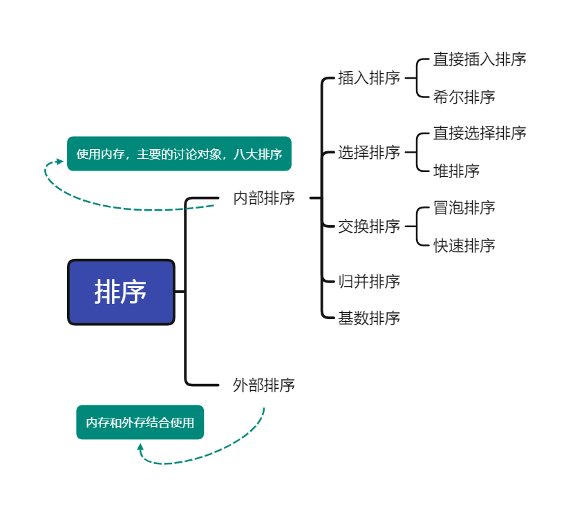


以下是几种排序算法的比较。


# 1 直接插入排序

## 1.1 定义

插入排序（英语：Insertion sort）是一种简单直观的排序算法。

**适用性：**适用于包括向量与列表在内的任何序列结构。

**稳定性：**如果碰见一个和插入元素相等的，那么插入元素把想插入的元素放在相等元素的后面。所以，**相等元素的前后顺序没有改变（因为从前往后插入）**，从原无序序列出去的顺序就是排好序后的顺序，所以插入排序是稳定的。

## 1.2 基本思想

算法的思路可简要描述为： 始终将整个序列视作并切分为两部分： 有序的前缀， 无序的后缀；通过迭代，反复地将后缀的首元素转移至前缀中。 由此亦可看出插入排序算法的不变性：  

> 在任何时刻， 相对于当前节点`e = S[r]`， 前缀`S[0, r)`总是业已有序。

算法开始时该前缀为空，不变性自然满足。  

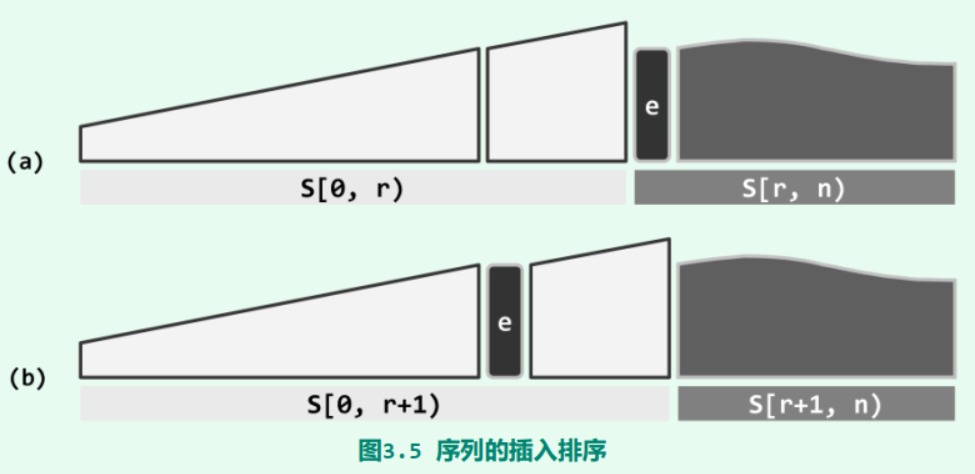

假设如图3.5(a)所示， 前缀`S[0, r)`已经有序。接下来， 借助有序序列的查找算法， 可在该前缀中定位到不大于e的最大元素。于是只需将e从无序后缀中取出， 并紧邻于查找返回的位置之后插入，即可如图(b)所示，使得有序前缀的范围扩大至`S[0, r]`。
如此，该前缀的范围可不断拓展。 当其最终覆盖整个序列时， 亦即整体有序。

一个与插入排序相同的操作是打扑克牌时，从牌桌上抓一张牌，按牌面大小插到手牌后，再抓下一张牌。


## 1.3 实现

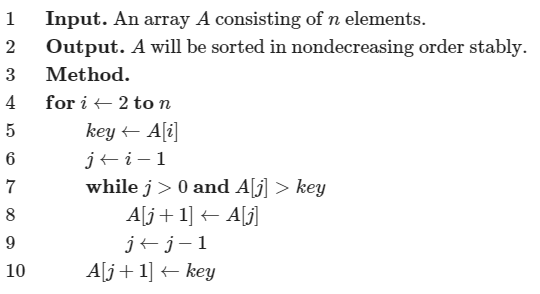

```c++
void insertion_sort(int arr[], int len) {
  for (int i = 1; i < len; ++i) {
    int key = arr[i];
    int j = i - 1;
    while (j >= 0 && arr[j] > key) {
      arr[j + 1] = arr[j];
      j--;
    }
    arr[j + 1] = key;
  }
}
```

# 2 Shell排序

> 😰声明：我觉得真不至于考那么难的，除非面向华子、大疆面试。

## 2.1 定义

希尔排序（英语：Shell sort），也称为缩小增量排序法，是插入排序的一种改进版本。希尔排序以它的发明者希尔（英语：Donald Shell）命名。

最优时间复杂度为$O(n)$，平均时间复杂度与最坏时间复杂度与增量序列的选择息息相关。

**适用场景：**适用于包括向量与列表在内的任何序列结构。（待补充）

**稳定性：**不稳定。

## 2.2 递减增量策略

### 2.2.1 增量

希尔排序（Shell sort） 算法首先将整个待排序向量`A[]`等效地视作一个二维矩阵`B[][]`。（注意：此处只是看作，实际上希尔排序的空间复杂度仍然是$O(1)$）


于是如图12.14所示，若原一维向量为`A[0, n)`，则对于任一固定的矩阵宽度`w`， `A`与`B`中元素之间总有一一对应关系：

 `B[i][j] = A[i + jw]`  

或

`A[k] = B[k % w][k / w]`  

从秩的角度来看，矩阵`B`的各列依次对应于整数子集`[0, n)`关于宽度w的某一同余类。这也等效于从上到下、自左而右地将原向量`A`中的元素， 依次填入矩阵`B`的各个单元。
为简化起见， 以下不妨假设`w`整除`n`。如此， `B`中同属一列的元素自上而下依次对应于`A`中以`w`为间隔的`n/w`个元素。因此，矩阵的宽度`w`亦称作增量（increment） 。

### 2.2.2 算法框架

希尔排序的算法框架， 可以扼要地描述如下：  

```c++
Shellsort(A, n)
输入：规模为n的无序向量A
输出：A对应的有序向量
{
    取一个递增的增量序列: H = {w1 = 1, w2, w3, ..., wk, ...}
    设k = max{i | wi < n}, 即wk为增量序列H中小于n的最后一项
    for(t = k; t > 0; t--)
    {
        将向量A视作以wt为宽度的矩阵Bt
        对Bt的每一项分别排序: Bt[i], i = 0, 1, ..., wt-1
    }
}
```

### 2.2.3 增量序列

如图12.15所示，希尔排序是个迭代式重复的过程。  


每一步迭代中，都从事先设定的某个整数序列中取出一项，并以该项为宽度， 将输入向量重排为对应宽度的二维矩阵，然后逐列分别排序。当然，各步迭代并不需要真地从物理上重排原向量。 事实上， 借助以上一一对应关系， 即可便捷地从逻辑上根据其在`B`[][]中的下标， 访问统一保存于`A[]`中的元素。
不过，为便于对算法的理解，以下我们不妨仍然假想地进行这一重排转换。
因为增量序列中的各项是逆向取出的，所以各步迭代中矩阵的宽度呈缩减的趋势，直至最终使用$w_1 = 1$。矩阵每缩减一次并逐列排序一轮，向量整体的有序性就得以进一步改善。当增量缩减至1时，如图12.15最右侧所示，矩阵退化为单独的一列，故最后一步迭代中的“逐列排序”等效于对整个向量执行一次排序。这种通过不断缩减矩阵宽度而逐渐逼近最终输出的策略，称作**递减增量（diminishing increment） 算法**， 这也是希尔排序的另一名称。

以长度为13的向量：
{ 80, 23, 19, 40, 85, 1, 18, 92, 71, 8, 96, 46, 12 }
为例，对应的希尔排序过程及结果如图12.16所示。


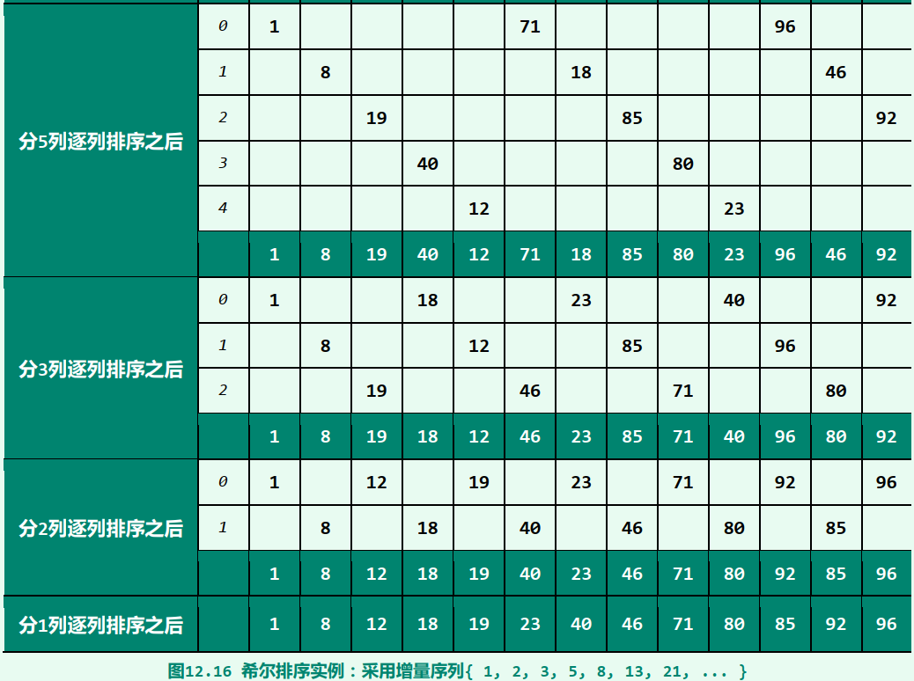

### 2.2.4 底层算法

最后一轮迭代等效于向量的整体排序， 故无论此前各步如何迭代，最终必然输出有序向量，希尔排序的正确性毋庸置疑。然而反过来， 我们却不禁有个疑问：既然如此，**此前各步迭代中的逐列排序又有何必要？为何不直接做最后一次排序呢？** 这涉及到底层排序算法的特性。**能够有效支持希尔排序的底层排序算法， 必须是输入敏感的，比如插入排序算法。**尽管该算法在最坏情况下需要运行$O(n^2)$时间，但随着向量的有序性不断提高（即逆序对的不断减少），运行时间将会锐减。 具体地，根据习题[3-11]的结论（数据结构（C++语言版）	邓俊辉第三版），当逆序元素的间距均不超过$k$时，插入排序仅需$O(kn)$的运行时间。 仍以图12.16为例，最后一步迭代（整体排序）之前，向量仅含两对逆序元素（40和23、 92和85），其间距为1，故该步迭代仅需线性时间。

正是得益于这一特性，各步迭代对向量有序性的改善效果，方能不断积累下来，后续各步迭代的计算成本也能得以降低，并最终将总体成本控制在足以令人满意的范围。

## 2.3 增量序列

希尔排序算法的主体框架已经固定，唯一可以调整的只是增量序列的设计与选用。事实上这一点也的确十分关键，不同的增量序列对插入排序以上特性的利用程度各异，算法的整体效率也相应地差异极大。 

为改进希尔排序的总体性能，首先必须尽可能减少不同增量值之间的公共因子。  

以下将介绍几种典型的增量序列。

### 2.3.1 Shell序列

Shell本人在提出希尔算法之初所使用的序列：
$$
Hshell = { 1, 2, 4, 8, 16, 32, ..., 2k, ... }
$$
若使用这一序列， 希尔排序算法在最坏情况下的性能并不好，时间复杂度为$O(N^2)$。

### 2.3.2 Papernov-Stasevic序列

Papernov和Stasevic于1965年提出了另一增量序列：
$$
Hps = { 1, 3, 7, 15, 31, 63, ..., 2k - 1, ... }
$$
采用这一增量序列，希尔排序算法的性能可以改进至$O(n^{3/2})$，其中n为待排序向量的规模。

### 2.3.3 Pratt序列

Pratt于1971年也提出了自己的增量序列：
$$
Hpratt = { 1, 2, 3, 4, 6, 8, 9, 12, 16, ..., 2p3q, ... }
$$
可以证明， 采用$Hpratt$序列，希尔排序算法至多运行$O(nlog2n)$时间。

### 2.3.4 Sedgewick序列

尽管$Pratt$序列的效率较高，但因其中各项的间距太小， 会导致迭代趟数过多。为此，$Sedgewick$综合$Papernov-Stasevic$序列与$Pratt$序列的优点，提出了以下增量序列：
$$
Hsedgewick = { 1, 5, 19, 41, 109, 209, 505, 929, 2161, 3905, 8929, ... }
$$
其中各项，均为：
$$
9∙4k - 9∙2k + 1
$$
或
$$
4k - 3∙2k + 1
$$
的形式。

如此改进之后，希尔排序算法在最坏情况下的时间复杂度为$O(n4/3)$，平均复杂度为$O(n7/6)$。更重要的是，在通常的应用环境中， 这一增量序列的综合效率最佳。

## 2.4 实现

```c++
template <typename T>
void shell_sort(T array[], int length) {
  int h = 1;
  while (h < length / 3) {
    h = 3 * h + 1;
  }
  while (h >= 1) {
    for (int i = h; i < length; i++) {
      for (int j = i; j >= h && array[j] < array[j - h]; j -= h) {
        std::swap(array[j], array[j - h]);
      }
    }
    h = h / 3;
  }
}
```

# 3 直接选择排序

## 3.1 定义

选择排序（英语：Selection sort）是一种简单直观的排序算法。它的工作原理是每次找出第$i$小的元素（也就是$A_{i...n}$中最小的元素），然后将这个元素与数组第  个位置上的元素交换。


**适用场景：**选择排序（selection sort） 也适用于向量与列表之类的序列结构。

**稳定性：**不稳定。

## 3.2 基本思想

与插入排序类似， 该算法也将序列划分为无序前缀和有序后缀两部分；此外，还要求前缀不大于后后缀。如此，每次只需从前缀中选出最大者，并作为最小元素转移至后缀中，即可使有序部分的范围不断扩张。


## 3.4 稳定性分析

**由于 swap（交换两个元素）操作的存在，选择排序是一种不稳定的排序算法。**

上述描述也给出了选择排序算法过程所具有的不变性：

> 在任何时刻，后缀`S[r, n)`已经有序，且不小于前缀`S[0, r)`

在算法的初始时刻，后缀为空，不变性自然满足。如图3.6(a)所示，假设不变性已满足。于是，可调用无序序列的查找算法， 从前缀中找出最大者M。接下来， 只需将M从前缀中取出并作为首元素插入后缀，即可如图(b)所示，使得后缀的范围扩大，并继续保持有序。如此，该后缀的范围可不断拓展。 当其最终覆盖整个序列时， 亦即整体有序。

## 3.5 实现

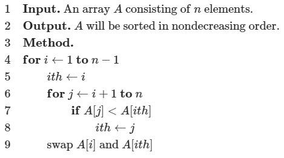

```c++
void selection_sort(int* a, int n) {
  for (int i = 1; i < n; ++i) {
    int ith = i;
    for (int j = i + 1; j <= n; ++j) {
      if (a[j] < a[ith]) {
        ith = j;
      }
    }
    std::swap(a[i], a[ith]);
  }
}
```

# 4 就地堆排序

## 4.1 定义

堆排序（英语：Heap sort）是指利用 [二叉堆](https://oi-wiki.org/ds/binary-heap/) 这种数据结构所设计的一种排序算法，本质是建立在堆上的选择排序。

**适用场景：**适用于向量与列表之类的序列结构。

**稳定性：**同选择排序一样，由于其中交换位置的操作，所以是不稳定的排序算法。

## 4.2 基本思想

算法的总体思路和策略与选择排序算法基本相同：**将所有词条分成未排序和已排序两类，不断从前一类中取出最大者，顺序加至后一类中。**算法启动之初，所有词条均属于前一类； 此后， 后一类不断增长；当所有词条都已转入后一类时，即完成排序。

这里的待排序词条既然已组织为向量，不妨将其划分为前缀H和与之互补的后缀S，分别对应于上述未排序和已排序部分。与常规选择排序算法一样，在算法启动之初`H`覆盖所有词条，而`S`为空。新算法的不同之处在于，整个排序过程中，无论H包含多少词条，始终都组织为一个堆。另外，整个算法过程始终满足如下不变性： `H`中的最大词条不会大于`S`中的最小词条——除非二者之一为空，比如算法的初始和终止时刻。 算法的迭代过程如图10.9所示。


首先如图(a)，取出首单元词条`M`，将其与末单元词条`X`交换。 `M`既是当前堆中的最大者，同时根据不变性也不大于`S`中的任何词条，故如此交换之后`M`必处于正确的排序位置。 故如图(b)，此时可等效地认为`S`向前扩大了一个单元， `H`相应地缩小了一个单元。请注意，如此重新分界之后的`H`和`S`依然满足以上不变性。至此，唯一尚未解决的问题是，词条`X`通常不能“胜任” 堆顶的角色。

好在这并非难事。仿照词条删除算法，只需对`X`实施一次下滤调整，即可使`H`整体的堆序性重新恢复，结果如图(c)所示。好在这并非难事。仿照词条删除算法，只需对`X`实施一次下滤调整，即可使`H`整体的堆序性重新恢复，结果如图(c)所示。

## 4.3 实现

```c++
void sift_down(int arr[], int start, int end) {				// 下滤调整算法
  // 计算父结点和子结点的下标
  int parent = start;
  int child = parent * 2 + 1;
  while (child <= end) {  // 子结点下标在范围内才做比较
    // 先比较两个子结点大小，选择最大的
    if (child + 1 <= end && arr[child] < arr[child + 1]) child++;
    // 如果父结点比子结点大，代表调整完毕，直接跳出函数
    if (arr[parent] >= arr[child])
      return;
    else {  // 否则交换父子内容，子结点再和孙结点比较
      swap(arr[parent], arr[child]);
      parent = child;
      child = parent * 2 + 1;
    }
  }
}

void heap_sort(int arr[], int len) {
  // 从最后一个节点的父节点开始 sift down 以完成堆化 (heapify)
  for (int i = (len - 1 - 1) / 2; i >= 0; i--) sift_down(arr, i, len - 1);
  // 先将第一个元素和已经排好的元素前一位做交换，再重新调整（刚调整的元素之前的元素），直到排序完毕
  for (int i = len - 1; i > 0; i--) {
    swap(arr[0], arr[i]);
    sift_down(arr, 0, i - 1);
  }
}

```

# 5 冒（起）泡排序

## 5.1 定义

冒泡排序（英语：Bubble sort）是一种简单的排序算法。由于在算法的执行过程中，较小的元素像是气泡般慢慢「浮」到数列的顶端，故叫做冒泡排序。

**适用场景：**适用于向量与列表之类的序列结构。

**稳定性：**冒泡排序是一种稳定的排序算法。起泡排序算法的不变性和单调性可分别概括为：<span style="background:#FFDBBB;"> 经过k趟扫描交换之后，最大的前k个元素必然就位；经过k趟扫描交换之后，待求解问题的有效规模将缩减至n - k。  </span>

## 5.2 基本思想

它的工作原理是每次检查相邻两个元素，如果前面的元素与后面的元素满足给定的排序条件，就将相邻两个元素交换。当没有相邻的元素需要交换时，排序就完成了。

经过 $i$ 次扫描后，数列的末尾 $i$ 项必然是最大的 $i$ 项，因此冒泡排序最多需要扫描 $n-1$ 遍数组就能完成排序。

## 5.3 局部有序与整体有序

在由一组整数组成的序列$A[0, n-1]$中，满足$A[i - 1] < A[i]$的相邻元素称作顺序的；否则是逆序的。不难看出，有序序列中每一对相邻元素都是顺序的，亦即，对任意$1 ≤ i < n$都有$A[i - 1] < A[i]$；反之，所有相邻元素均顺序的序列，也必然整体有序。

## 5.4 扫描交换

由有序序列的上述特征，我们可以通过不断改善局部的有序性实现整体的有序：**从前向后依次检查每一对相邻元素，一旦发现逆序即交换二者的位置。**对于长度为`n`的序列，共需做`n-1`次比较和不超过`n-1`次交换，这一过程称作一趟扫描交换。

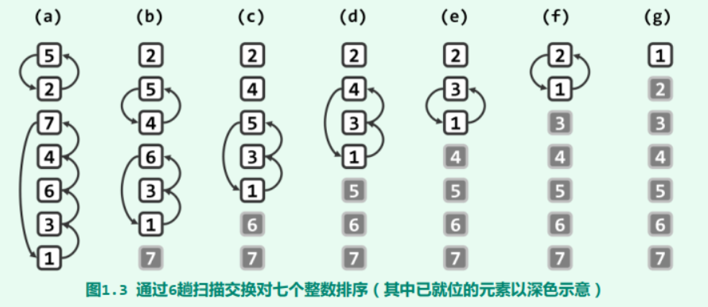

以图1.3(a)中由7个整数组成的序列`A[0, 6] = { 5, 2, 7, 4, 6, 3, 1 }`为例。在第一趟扫描交换过程中， `{ 5, 2 }`交换位置， `{ 7, 4, 6, 3, 1 }`循环交换位置，扫描交换后的结果如图(b)所示。

## 5.5 冒（起）泡排序

可见，经过这样的一趟扫描，序列未必达到整体有序。果真如此，则可对该序列再做一趟扫描交换，比如，图(b)再经一趟扫描交换的结果如图(c)。事实上，很有可能如图(c~f)所示， 需要反复进行多次扫描交换，直到如图(g)所示， 在序列中不再含有任何逆序的相邻元素。多数的这类交换操作，都会使得越小（大）的元素朝上（下）方移动（习题[1-3]），直至它们抵达各自应处的位置。
**排序过程中， 所有元素朝各自最终位置亦步亦趋的移动过程，犹如气泡在水中的上下沉浮，起泡排序（bubblesort） 算法也因此得名。**

## 5.6 实现

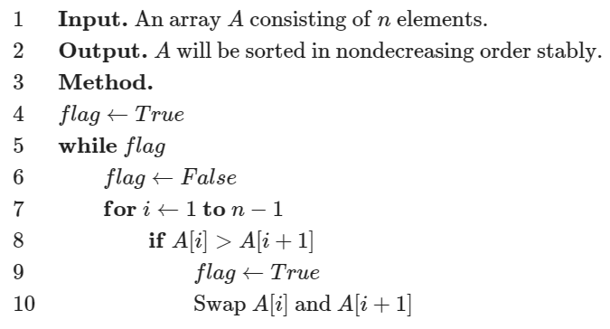

```c++
void bubblesort1A ( int A[], int n ) { 		//起泡排序算法（版本1A）： 0 <= n
	bool flag = true; 						//整体排序标志，首先假定尚未排序
	while ( !flag ) { 						//在尚未确认已全局排序之前，逐躺进行扫描交换
		sorted = true; 						//假定已经排序
        for ( int i = 1; i < n; i++ ) { 	//自左向右逐对检查当前范围A[0, n)内的各相邻元素
            if ( A[i - 1] > A[i] ) { 		//一旦A[i - 1]不A[i]逆序，则
                swap ( A[i - 1], A[i] ); 	//交换之，并
                flag = false; 				//因整体排序不能保证，需要清除排序标志
            }
        }
		n--; 	//至此末元素必然就位，故可以缩短待排序序列的有效长度
	}
} //借助布尔型标志位flag，可及时提前退出，而不至于总是蛮力地做n - 1趟扫描交换
```

# 6 快速排序

## 6.1 定义

快速排序（英语：Quicksort），又称分区交换排序（英语：partition-exchange sort），简称「快排」，是一种被广泛运用的排序算法。

与归并排序算法一样，快速排序（quicksort） 算法也是分治策略的典型应用，但二者之间也有本质区别。 

归并排序的计算量主要消耗于有序子向量的归并操作， 而子向量的划分却几乎不费时间。快速排序恰好相反，它可以在$O(1)$时间内， 由子问题的解直接得到原问题的解； 但为了将原问题划分为两个子问题， 却需要$O(n)$时间。

快速排序算法虽然能够确保，划分出来的子任务彼此独立，并且其规模总和保持渐进不变，却不能保证两个子任务的规模大体相当——实际上， 甚至有可能极不平衡。因此， 该算法并不能保证最坏情况下的$O(nlogn)$时间复杂度。尽管如此，它仍然受到人们的青睐，并在实际应用中往往成为首选的排序算法。究其原因在于，快速排序算法易于实现，代码结构紧凑简练，而且对于按通常规律随机分布的输入序列，快速排序算法实际的平均运行时间较之同类算法更少。

**适用场景：**适用于包括向量与列表在内的任何序列结构。

**稳定性：**不稳定。

## 6.2 基本思想

快速排序的工作原理是通过 [分治](https://oi-wiki.org/basic/divide-and-conquer/) 的方式来将一个数组排序。

快速排序分为三个过程：

1. 将数列划分为两部分（要求保证相对大小关系）；
2. 递归到两个子序列中分别进行快速排序；
3. 不用合并，因为此时数列已经完全有序。

和归并排序不同，第一步并不是直接分成前后两个序列，而是在分的过程中要保证相对大小关系。具体来说，第一步要是要把数列分成两个部分，然后保证前一个子数列中的数都小于后一个子数列中的数。**为了保证平均时间复杂度，一般是随机选择一个数 $m$ 来当做两个子数列的分界。**

之后，维护一前一后两个指针 $p$ 和 $q$ ，依次考虑当前的数是否放在了应该放的位置（前还是后）。如果当前的数没放对，比如说如果后面的指针 $q$ 遇到了一个比 $m$  小的数，那么可以交换 $p$ 和 $q$ 位置上的数，再把 $p$ 向后移一位。当前的数的位置全放对后，再移动指针继续处理，直到两个指针相遇。

其实，**快速排序没有指定应如何具体实现第一步，不论是选择 $m$ 的过程还是划分的过程，都有不止一种实现方法。**

第三步中的序列已经分别有序且第一个序列中的数都小于第二个数，所以直接拼接起来就好了。

## 6.3 轴点

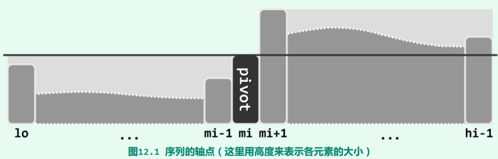

如图12.1所示， 考查任一向量区间 $S[lo, hi)$ 。对于任何 $lo ≤ mi < hi$ ，以元素 $S[mi]$ 为界， 都可分割出前、后两个子向量 $S[lo, mi)$ 和 $S(mi, hi)$。若 $S[lo, mi)$ 中的元素均不大于 $S[mi]$，且 $S(mi, hi)$ 中的元素均不小于 $S[mi]$，则元素 $S[mi]$ 称作向量 $S$ 的一个轴点（pivot） 。设向量 $S$ 经排序可转化为有序向量 $S'$。不难看出，轴点位置 $mi$ 必然满足如下充要条件：

1. $S[mi] = S'[mi]$  
2. $S[lo, mi)$和$S'[lo, mi)$的成员完全相同  
3. $S(mi, hi)$和$S'(mi, hi)$的成员完全相同  

因此，不仅以轴点$S[mi]$为界，前、后子向量的排序可各自独立地进行，而且更重要的是，一旦前、后子向量各自完成排序，即可立即（在$O(1)$时间内）得到整个向量的排序结果。
采用分治策略，递归地利用轴点的以上特性， 便可完成原向量的整体排序。

因此，按照以上思路，我们可以简单地写出快速排序算法的代码如下：

```c++
template <typename T> //向量快速排序
void Vector<T>::quickSort ( Rank lo, Rank hi ) { //0 <= lo < hi <= size
	if ( hi - lo < 2 ) return; //单元素区间自然有序，否则...
	Rank mi = partition ( lo, hi - 1 ); //在[lo, hi - 1]内构造轴点
	quickSort ( lo, mi ); //对前缀递归排序
	quickSort ( mi + 1, hi ); //对后缀递归排序
}
```

可见，轴点的位置一旦确定，则只需以轴点为界， 分别递归地对前、后子向量实施快速排序；子向量的排序结果就地返回之后，原向量的整体排序即告完成。算法的核心与关键在于：

<span style="background:#FFDBBB;">轴点构造算法`partition()`应如何实现？可以达到多高的效率？</span>

## 6.4 快速划分算法

为在区间$[lo, hi]$内构造出一个轴点， 首先需要任取某一元素$m$作为“培养对象” 。  

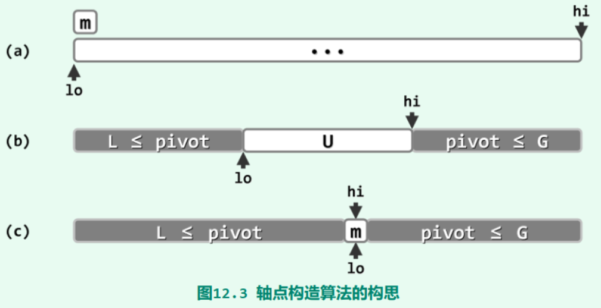

如图12.3(a)所示， 不妨取首元素$m = S[lo]$作为候选， 将其从向量中取出并做备份，腾出的空闲单元便于其它元素的位置调整。 然后如图(b)所示，不断试图移动$lo$和$hi$， 使之相互靠拢。当然，整个移动过程中， 需始终保证$lo(hi)$左侧（右侧）的元素均不大于（不小于） $m$。
最后如图(c)所示，当$lo$与$hi$彼此重合时，只需将原备份的m回填至这一位置，则$S[lo = hi]= m$便成为一个名副其实的轴点。
以上过程在构造出轴点的同时，也按照相对于轴点的大小关系，将原向量划分为左、右两个子向量，故亦称作快速划分（quick partitioning） 算法。

实现如下：

```c++
template <typename T> //轴点构造算法：通过调整元素位置构造区间[lo, hi]的轴点，并返回其秩
Rank Vector<T>::partition ( Rank lo, Rank hi ) { //版本A：基本形式
	swap ( _elem[lo], _elem[lo + rand() % ( hi - lo + 1 ) ] ); //任选一个元素与首元素交换
	T pivot = _elem[lo]; //以首元素为候选轴点——经以上交换，等效于随机选取
	while ( lo < hi ) { //从向量的两端交替地向中间扫描
		while ( ( lo < hi ) && ( pivot <= _elem[hi] ) ) //在不小于pivot的前提下
			hi--; //向左拓展右端子向量
		_elem[lo] = _elem[hi]; //小于pivot者归入左侧子序列
		while ( ( lo < hi ) && ( _elem[lo] <= pivot ) ) //在不大于pivot的前提下
			lo++; //向右拓展左端子向量
		_elem[hi] = _elem[lo]; //大于pivot者归入右侧子序列
	} //assert: lo == hi
	_elem[lo] = pivot; //将备份的轴点记录置于前、后子向量之间
	return lo; //返回轴点的秩
}
```

可见，算法的主体框架为循环迭代；主循环的内部，通过两轮迭代交替地移动 $lo$ 和 $hi$。

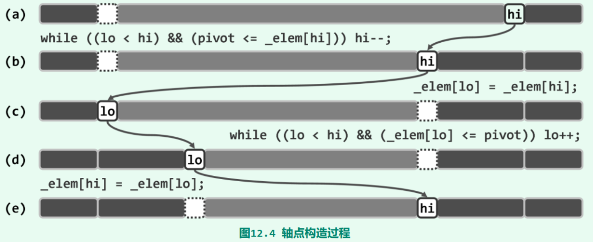

各迭代的初始状态如图12.4(a)所示。反复地将候选轴点$pivot$与当前的$_elem[hi]$做比较，只要前者不大于后者， 就不断向左移动$hi$（除非$hi$即将越过$lo$）。 $hi$无法移动继续时，当如图(b)所示。于是接下来如图(c)所示，将$_elem[hi]$转移至$_elem[lo]$， 并归入左侧子向量。
随后对称地， 将$_elem[lo]$与$pivot$做比较， 只要前者不大于后者， 就不断向右移动$lo$（除非$lo$即将越过$hi$）。 $lo$无法继续移动时，当如图(d)所示。于是接下来如图(e)所示， 将$_elem[lo]$转移至$_elem[hi]$， 并归入右侧子向量。
每经过这样的两轮移动，$lo$与$hi$的间距都会缩短， 故该算法迟早会终止。当然， 若如图(e)所示$lo$与$hi$仍未重合，则可再做两轮移动。不难验证，在任一时刻，在以$lo$和$hi$为界的三个子向量中， 左、右子向量分别满足所列的轴点充要条件2)和3)。 而随着算法的持续推进，中间子向量的范围则不断压缩。当主循环退出时$lo$和$hi$重合，充要条件1)也随即满足。 至此，只需将$pivot$“镶嵌” 于左、右子向量之间，即实现了对原向量的一次轴点划分。
该算法的运行时间线性正比于被移动元素的数目，线性正比于原向量的规模$O(hi - lo)$。

一个实例操作步骤如下：


## 6.5 实现

```c++
// 写法1
int Paritition1(int A[], int low, int high) {
    int pivot = A[low];
    while (low < high) {
        while (low < high && A[high] >= pivot) {
        	--high;
        }
        A[low] = A[high];
        while (low < high && A[low] <= pivot) {
        	++low;
        }
    	A[high] = A[low];
    }
    A[low] = pivot;
    return low;
}

void QuickSort(int A[], int low, int high) //快排母函数
{
    if (low < high) {
        int pivot = Paritition1(A, low, high);
        QuickSort(A, low, pivot - 1);
        QuickSort(A, pivot + 1, high);
    }
}

// 写法2
struct Range {
  int start, end;

  Range(int s = 0, int e = 0) { start = s, end = e; }
};

template <typename T>
void quick_sort(T arr[], const int len) {
  if (len <= 0) return;
  Range r[len];
  int p = 0;
  r[p++] = Range(0, len - 1);
  while (p) {
    Range range = r[--p];
    if (range.start >= range.end) continue;
    T mid = arr[range.end];
    int left = range.start, right = range.end - 1;
    while (left < right) {
      while (arr[left] < mid && left < right) left++;
      while (arr[right] >= mid && left < right) right--;
      std::swap(arr[left], arr[right]);
    }
    if (arr[left] >= arr[range.end])
      std::swap(arr[left], arr[range.end]);
    else
      left++;
    r[p++] = Range(range.start, left - 1);
    r[p++] = Range(left + 1, range.end);
  }
}
```

### 6.5.1 单向分割操作

[912. 排序数组 - 力扣（Leetcode）](https://leetcode.cn/problems/sort-an-array/description/)

```c++
class Solution {
public:
	vector<int> sortArray(vector<int>& nums) {
		quicksort(nums, 0, nums.size()-1);
		return nums;
	}
	void quicksort(vector<int>& nums,int l,int r) {
		if (l >= r)     return;

        int mid = partition(nums, l, r);
        quicksort(nums, l, mid - 1);    // 划分成2个部分
        quicksort(nums, mid + 1, r);
	}
	int partition(vector<int>& nums, int l, int r){
		//选取不同的轴点，交换方式不一样，选取左轴点，得从右向左遍历，且判断该pivot是否小于当前元素，小于则交换
		//下面以右轴点为例
		int pivot = nums[r];
		//两个指针,一者移动
		int i = l, j = l;
		//遍历序列，找轴点应该插入的位置
		while(j < r)
		{
			if (nums[j] < pivot)    swap(nums[i++], nums[j]);
            ++j;
		}
		nums[r] = nums[i];
		nums[i] = pivot;
		return i;//返回分割位置
	}
};
```

### 6.5.2 双向分割操作

```c++
class Solution {
public:
	vector<int> sortArray(vector<int>& nums) {
		quicksort(nums, 0, nums.size()-1);
		return nums;
	}
	void quicksort(vector<int>& nums,int l,int r) {
		if (l >= r)     return;

        int mid = partition(nums, l, r);
        quicksort(nums, l, mid - 1);    // 划分成2个部分
        quicksort(nums, mid + 1, r);
	}
	int partition(vector<int>& nums, int l, int r){
		int pivot = nums[l];
		int i = l + 1, j = r;
		//遍历序列，找轴点应该插入的位置
		while(true)
		{
			while(i <= j and nums[i] <= pivot)    ++i;  // 寻找比pivot大的元素
            while(i <= j and nums[j] >= pivot)    --j;  // 寻找比pivot小的元素
            if(i > j)   break;
            swap(nums[i], nums[j]);
		}
        swap(nums[j], nums[l]);
		return j;   // 返回分割位置, 为什么返回j而不是i，因为swap是先执行i++的while语句，如果和下面的替换顺序，则返回i
	}
};
```

### 6.5.3 双向分割操作+随机取值以保证平均时间复杂度

```c++
class Solution {
public:
	vector<int> sortArray(vector<int>& nums) {
		quicksort(nums, 0, nums.size()-1);
		return nums;
	}
    void quicksort(vector<int>& nums,int l,int r) {
        if (l >= r)     return;     // 这句必加

        int random = (rand() % (r - l + 1)) + l;//产生[a,b]的随机整数
		swap(nums[random], nums[l]);
        int loc = partition(nums, l, r);

        quicksort(nums, l, loc - 1);    // 划分成2个部分
        quicksort(nums, loc + 1, r);
	}
	int partition(vector<int>& nums, int l, int r){
		int pivot = nums[l];
		int i = l + 1, j = r;
		//遍历序列，找轴点应该插入的位置
		while(true)
		{
			while(i <= j and nums[i] <= pivot)    ++i;  // 寻找比pivot大的元素
            while(i <= j and nums[j] >= pivot)    --j;  // 寻找比pivot小的元素
            if(i > j)   break;
            swap(nums[i], nums[j]);
		}
        swap(nums[j], nums[l]);
		return j;   // 返回分割位置, 为什么返回j而不是i，因为swap是先执行i++的while语句，如果和下面的替换顺序，则返回i
	}
};
```

# 7 归并排序

## 7.1 定义

归并排序（[merge sort](https://en.wikipedia.org/wiki/Merge_sort)）是高效的基于比较的稳定排序算法。

归并排序基于分治思想将数组分段排序后合并，时间复杂度在最优、最坏与平均情况下均为$O(nlogn)$，空间复杂度为$O(n)$。

归并排序可以只使用$O(1)$的辅助空间，但为便捷通常使用与原数组等长的辅助数组。

**适用场景：**适用于包括向量与列表在内的任何序列结构。（待补充）

**稳定性：**不稳定。

## 7.2 基本思想

归并排序最核心的部分是**合并（merge）过程**：将两个有序的数组 `a[i]` 和 `b[j]` 合并为一个有序数组 `c[k]`。

1. 从左往右枚举 `a[i]` 和 `b[j]`，找出最小的值并放入数组 `c[k]`；
2. 重复上述过程直到 `a[i]` 和 `b[j]` 有一个为空时，将另一个数组剩下的元素放入 `c[k]`。

为保证排序的稳定性，前段首元素小于或等于后段首元素时（`a[i] <= b[j]`）而非小于时（`a[i] < b[j]`）就要作为最小值放入 `c[k]`。

## 7.3 合并

我们不放先给出合并的实现过程：

```c++
template <typename T> //有序向量的归并
void Vector<T>::merge(Rank lo, Rank mi, Rank hi){	// 各自有序的子向量[lo, mi)和[mi, hi)
    T* A = _elem + lo; //合并后的向量A[0, hi - lo) = _elem[lo, hi)
    int lb = mi - lo; T* B = new T[lb]; //前子向量B[0, lb) = _elem[lo, mi)
    for ( Rank i = 0; i < lb; B[i] = A[i++] ); //复制前子向量
    int lc = hi - mi; T* C = _elem + mi; //后子向量C[0, lc) = _elem[mi, hi)
	for ( Rank i = 0, j = 0, k = 0; ( j < lb ) || ( k < lc ); ) { //B[j]和C[k]中的小者续至A末尾
    	if ( ( j < lb ) && ( ! ( k < lc ) || ( B[j] <= C[k] ) ) ) A[i++] = B[j++];
        if ( ( k < lc ) && ( ! ( j < lb ) || ( C[k] < B[j] ) ) ) A[i++] = C[k++];
    }
    delete [] B; //释放临时空间B
}//归并后得到完整的有序向量[lo, hi)


```

这里约定，参与归并的子向量在原向量中总是前、后相邻的，故借助三个入口参数即可界定其范围`[lo, mi)`和`[mi, hi)`。另外，为保证归并所得的子向量能够原地保存以便继续参与更高层的归并，这里使用了临时数组`B[]`存放前一向量`[lo, mi)`的副本。

```c++
// 或数组写法
void merge(const int *a, size_t aLen, const int *b, size_t bLen, int *c) {
    size_t i = 0, j = 0, k = 0;
    while (i < aLen && j < bLen) {
    	if (b[j] < a[i]) {  // <!> 先判断 b[j] < a[i]，保证稳定性
    		c[k] = b[j];
    		++j;
    	} else {
    		c[k] = a[i];
            ++i;
            }
    	++k;
    }
  	// 此时一个数组已空，另一个数组非空，将非空的数组并入 c 中
    for (; i < aLen; ++i, ++k) c[k] = a[i];
    for (; j < bLen; ++j, ++k) c[k] = b[j];
}

// 或指针写法
void merge(const int *aBegin, const int *aEnd, const int *bBegin, const int *bEnd, int *c) {
    while (aBegin != aEnd && bBegin != bEnd) {
        if (*bBegin < *aBegin) {
            *c = *bBegin;
            ++bBegin;
        } else {
            *c = *aBegin;
            ++aBegin;
        }
    	++c;
    }
  	for (; aBegin != aEnd; ++aBegin, ++c) *c = *aBegin;
	for (; bBegin != bEnd; ++bBegin, ++c) *c = *bBegin;
}
```

> 也可使用 <algorithm> 库的 merge 函数，用法与上述指针式写法的相同。

## 7.4 有序向量的二路归并

与起泡排序通过反复调用单趟扫描交换类似，归并排序也可以理解为是通过**反复调用**所谓二路归并**（2-way merge）** 算法而实现的。所谓二路归并，就是将两个有序序列合并成为一个有序序列。这里的序列既可以是向量，**这里首先考虑有序向量**。 归并排序所需的时间， 也主要决定于各趟二路归并所需时间的总和。

**二路归并属于迭代式算法。**每步迭代中，只需比较两个待归并向量的首元素，将小者取出并追加到输出向量的末尾， 该元素在原向量中的后继则成为新的首元素。 如此往复，直到某一向量为空。最后，将另一非空的向量整体接至输出向量的末尾。

如图2.18(a)所示，设拟归并的有序向量为`{ 5, 8, 13, 21 }`和`{ 2, 4, 10, 29 }`。


第一步迭代经比较，取出右侧向量首元素2并归入输出向量，同时其首元素更新为4（图(b)）。此后各步迭代均与此类似， 都需比较首元素，将小者取出，并更新对应的首元素（图(c~h)）。如此，即可最终实现整体归并（图(i)）。
可见，二路归并算法在任何时刻只需载入两个向量的首元素， 故除了归并输出的向量外，仅需要常数规模的辅助空间。 另外，该算法始终严格地按顺序处理输入和输出向量， 故特别适用于使用磁带机等顺序存储器的场合。

## 7.5 分治法实现归并排序

归并排序的主体结构属典型的分治策略，可递归地描述和实现：

```c++
template <typename T> //向量归并排序
void Vector<T>::mergeSort ( Rank lo, Rank hi ) { //0 <= lo < hi <= size
    if ( hi - lo < 2 ) return; //单元素区间自然有序，否则...
    int mi = ( lo + hi ) >> 1; 
    mergeSort ( lo, mi ); 
    mergeSort ( mi, hi ); //以中点为界分别排序
    merge ( lo, mi, hi ); //归并
}

// 或指针形式
void merge_sort(int *a, int l, int r) {
    if (r - l <= 1) return;
    // 分解
    int mid = l + ((r - l) >> 1);
    merge_sort(a, l, mid), merge_sort(a, mid, r);
    // 合并
    int tmp[1024] = {};  	// 请结合实际情况设置 tmp 数组的长度（与 a 相同），或使用
                   			// vector；先将合并的结果放在 tmp 里，再返回到数组 a
    merge(a + l, a + mid, a + mid, a + r, tmp + l);  // pointer-style merge
    for (int i = l; i < r; ++i) a[i] = tmp[i];
}

```

可见， 为将向量`S[lo, hi)`转换为有序向量，可以均匀地将其划分为两个子向量：

`S[lo, mi)`
`S[mi, hi)`

以下，只要通过递归调用将二者分别转换为有序向量，即可借助以上的二路归并算法，得到与原向量S对应的整个有序向量。
请注意，这里的递归终止条件是当前向量长度：
$$
n = hi - lo = 1
$$
既然仅含单个元素的向量必然有序，这一处理分支自然也就可以作为递归基。

## 7.6 倍增法实现归并排序

已知当数组长度为 $1$ 时，该数组就已经是有序的。

将数组全部切成长度为 $1$ 的段。

从左往右依次合并两个长度为 $1$ 的有序段，得到一系列长度  $≤2$ 的有序段；

从左往右依次合并两个长度 $≤2$ 的有序段，得到一系列长度 $≤4$ 的有序段；

从左往右依次合并两个长度 $≤4$ 的有序段，得到一系列长度 $≤8$ 的有序段；

……

重复上述过程直至数组只剩一个有序段，该段就是排好序的原数组。

> 为什么是 $≤n$ 而不是 $==n$
>
> 数组的长度很可能不是 $2^x$，此时在最后就可能出现长度不完整的段，可能出现最后一个段是独立的情况。

代码实现如下：

```c
void merge_sort(int *a, size_t n) {
	int tmp[1024] = {};  	// 请结合实际情况设置 tmp 数组的长度（与 a 相同），或使用
							// vector；先将合并的结果放在 tmp 里，再返回到数组 a
	for (size_t seg = 1; seg < n; seg <<= 1) {
    for (size_t left1 = 0; left1 < n - seg; left1 += seg + seg) {  // n - seg: 如果最后只有一个段就不用合并
        size_t right1 = left1 + seg;
        size_t left2 = right1;
        size_t right2 = std::min(left2 + seg, n);  // <!> 注意最后一个段的边界
        merge(a + left1, a + right1, a + left2, a + right2,
       		tmp + left1);  // pointer-style merge
      	for (size_t i = left1; i < right2; ++i) a[i] = tmp[i];
    }
  }
}
```

## 7.7 逆序对

逆序对是 $i<j$ 且 $a_i<a_j$ 的有序数对 $(i,j)$ 。

排序后的数组无逆序对，归并排序的合并操作中，每次后段首元素被作为当前最小值取出时，前段剩余元素个数之和即是合并操作减少的逆序对数量；故归并排序计算逆序对数量的额外时间复杂度为 $O(nlogn)$，对于 C/C++ 代码将 `merge` 过程的 `if(b[j] < a[i])` 部分加上 `cnt += aLen - i` 或 `cnt += aEnd - aBegin` 即可。

此外，逆序对计数即是将元素依次加入数组时统计当前大于其的元素数量，将数组离散化后即是区间求和问题，使用树状数组或线段树解决的时间复杂度为 $O(nlogn)$且空间复杂度为 $O(n)$。

## 7.8 实现

```c++
void merge(const int *aBegin, const int *aEnd, const int *bBegin, const int *bEnd, int *c) {
    while (aBegin != aEnd && bBegin != bEnd) {
        if (*bBegin < *aBegin) {
            *c = *bBegin;
            ++bBegin;
        } else {
            *c = *aBegin;
            ++aBegin;
        }
    	++c;
    }
  	for (; aBegin != aEnd; ++aBegin, ++c) *c = *aBegin;
	for (; bBegin != bEnd; ++bBegin, ++c) *c = *bBegin;
}

void merge_sort(int *a, int l, int r) {
    if (r - l <= 1) return;
    // 分解
    int mid = l + ((r - l) >> 1);
    merge_sort(a, l, mid), merge_sort(a, mid, r);
    // 合并
    int tmp[1024] = {};  	// 请结合实际情况设置 tmp 数组的长度（与 a 相同），或使用
                   			// vector；先将合并的结果放在 tmp 里，再返回到数组 a
    merge(a + l, a + mid, a + mid, a + r, tmp + l);  // pointer-style merge
    for (int i = l; i < r; ++i) a[i] = tmp[i];
}
```

# 8 基数排序

## 8.1 定义

基数排序（英语：Radix sort）是一种非比较型的排序算法，最早用于解决卡片排序的问题。基数排序将待排序的元素拆分为 $k$ 个关键字，逐一对各个关键字排序后完成对所有元素的排序。

如果是从第 $1$ 关键字到第 $k$ 关键字顺序进行比较，则该基数排序称为 MSD（Most Significant Digit first)基数排序；

如果是从第 $k$ 关键字到第 $1$ 关键字顺序进行比较，则该基数排序称为 LSD（Least Significant Digit first)基数排序。

**适用场景：**适用于包括向量与列表在内的任何序列结构，适用于需要字典序或基于其他关键字的非自然数序列的排序，时间复杂度随着位数的线性增长，因此对于小型数据集的效率不高。

**稳定性：**稳定。

## 8.2 字典序

实际应用环境中词条的关键码，未必都是整数。比如， 一种常见的情形是，关键码由多个域（字段）组合而成，并采用所谓的字典序（lexicographical order）确定大小次序：任意两个关键码之间的大小关系，取决于它们第一个互异的域。

注意， 同一关键码内各字段的类型也未必一致。例如日期型关键码， 可分解为year（年）、month（月）和day（日）三个整数字段，并按常规惯例，以“年-月-日”的优先级定义字典序。

再如扑克牌所对应的关键码，可以分解为枚举型的suite（花色）和整型的number（点数）。于是， 若按照桥牌的约定，以“花色-点数”为字典序， 则每副牌都可按大小排列为：

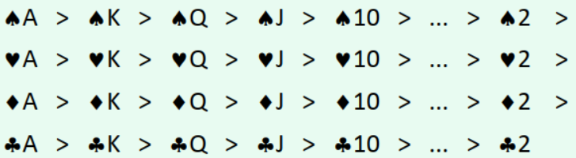

主要需要研究的是， 对于任意一组此类关键码，该如何高效地排序。

## 8.3 k - 关键字元素的比较

下面用 $a_i$ 表示元素 $a$ 的第 $i$ 关键字。

假如元素有 $k$ 个关键字，对于两个元素 $a$ 和 $b$，默认的比较方法是：

比较两个元素的第 $1$ 关键字 $a_1$ 和 $b_1$，如果 $a_1$ < $b_1$ 则 $a < b$，如果 $a_1$ > $b_1$ 则 $a > b$，如果 $a_1 = b_1$ 则进行下一步；
比较两个元素的第 $2$ 关键字 $a_2$ 和 $b_2$，如果 $a_2 < b_2$ 则 $a < b$，如果 $a_2 > b_2$ 则 $a > b$，如果 $a_2 = b_2$ 则进行下一步；
……
比较两个元素的第 $k$ 关键字 $a_k$ 和 $b_k$，如果 $a_k < b_k$ 则 $a < b$，如果 $a_k > b_k$ 则 $a > b$，如果 $a_k = b_k$ 则 $a = b$。

例子：

- 如果对自然数进行比较，将自然数按个位对齐后往高位补齐 $0$，则一个数字从左往右数第 $i$ 位数就可以作为第 $i$ 关键字；
- 如果对字符串基于字典序进行比较，一个字符串从左往右数第 $i$ 个字符就可以作为第 $i$ 关键字；
- C++ 自带的 `std::pair` 与 `std::tuple` 的默认比较方法与上述的相同。

## 8.4 MSD 基数排序

基于 k - 关键字元素的比较方法，可以想到：先比较所有元素的第 $1$ 关键字，就可以确定出各元素大致的大小关系；然后对 具有相同第 $1$ 关键字的元素，再比较它们的第 $2$ 关键字……以此类推。

由于是从第 $1$ 关键字到第 $k$ 关键字顺序进行比较，由上述思想导出的排序算法称为 MSD（Most Significant Digit first）基数排序。

### 8.4.1 算法流程

将待排序的元素拆分为 $k$ 个关键字，先对第 $1$ 关键字进行稳定排序，然后对于每组 具有相同关键字的元素 再对第 $2$ 关键字进行稳定排序（递归执行）……最后对于每组具有相同关键字的元素，再对第 $k$ 关键字进行稳定排序。

MSD 基数排序需要借助一种 稳定算法 完成内层对关键字的排序，通常使用计数排序来完成。

正确性参考上文 k - 关键字元素的比较。

### 8.4.2 实现

##### 对自然数排序

下面是使用迭代式 MSD 基数排序对 `unsigned int` 范围内元素进行排序的 C++ 参考代码，可调整 $W$ 和 $\log_2 W$ 的值（建议将 $\log_2 W$ 设为 $2^k$ 以便位运算优化）。

```c++
#include <algorithm>
#include <stack>
#include <tuple>
#include <vector>

using std::copy;  // from <algorithm>
using std::make_tuple;
using std::stack;
using std::tie;
using std::tuple;
using std::vector;

typedef unsigned int u32;
typedef unsigned int* u32ptr;

void MSD_radix_sort(u32ptr first, u32ptr last) {
  const size_t maxW = 0x100000000llu;
  const u32 maxlogW = 32;  // = log_2 W

  const u32 W = 256;  // 计数排序的值域
  const u32 logW = 8;
  const u32 mask = W - 1;  // 用位运算替代取模，详见下面的 key 函数

  u32ptr tmp =
      (u32ptr)calloc(last - first, sizeof(u32));  // 计数排序用的输出空间

  typedef tuple<u32ptr, u32ptr, u32> node;
  stack<node, vector<node>> s;
  s.push(make_tuple(first, last, maxlogW - logW));

  while (!s.empty()) {
    u32ptr begin, end;
    size_t shift, length;

    tie(begin, end, shift) = s.top();
    length = end - begin;
    s.pop();

    if (begin + 1 >= end) continue;  // elements <= 1

    // 计数排序
    u32 cnt[W] = {};
    auto key = [](const u32 x, const u32 shift) { return (x >> shift) & mask; };

    for (u32ptr it = begin; it != end; ++it) ++cnt[key(*it, shift)];
    for (u32 value = 1; value < W; ++value) cnt[value] += cnt[value - 1];

    // 求完前缀和后，计算相同关键字的元素范围
    if (shift >= logW) {
      s.push(make_tuple(begin, begin + cnt[0], shift - logW));
      for (u32 value = 1; value < W; ++value)
        s.push(make_tuple(begin + cnt[value - 1], begin + cnt[value],
                          shift - logW));
    }

    u32ptr it = end;
    do {
      --it;
      --cnt[key(*it, shift)];
      tmp[cnt[key(*it, shift)]] = *it;
    } while (it != begin);

    copy(tmp, tmp + length, begin);
  }
}

```

##### 对字符串排序

下面是使用迭代式 MSD 基数排序对 [空终止字节字符串](https://zh.cppreference.com/w/cpp/string/byte) 基于字典序进行排序的 C++ 参考代码：

```c++
#include <algorithm>
#include <stack>
#include <tuple>
#include <vector>

using std::copy;  // from <algorithm>
using std::make_tuple;
using std::stack;
using std::tie;
using std::tuple;
using std::vector;

typedef char* NTBS;  // 空终止字节字符串
typedef NTBS* NTBSptr;

void MSD_radix_sort(NTBSptr first, NTBSptr last) {
  const size_t W = 128;
  const size_t logW = 7;
  const size_t mask = W - 1;

  NTBSptr tmp = (NTBSptr)calloc(last - first, sizeof(NTBS));

  typedef tuple<NTBSptr, NTBSptr, size_t> node;
  stack<node, vector<node>> s;
  s.push(make_tuple(first, last, 0));

  while (!s.empty()) {
    NTBSptr begin, end;
    size_t index, length;

    tie(begin, end, index) = s.top();
    length = end - begin;
    s.pop();

    if (begin + 1 >= end) continue;  // elements <= 1

    // 计数排序
    size_t cnt[W] = {};
    auto key = [](const NTBS str, const size_t index) { return str[index]; };

    for (NTBSptr it = begin; it != end; ++it) ++cnt[key(*it, index)];
    for (char ch = 1; value < W; ++value) cnt[ch] += cnt[ch - 1];

    // 求完前缀和后，计算相同关键字的元素范围
    // 对于 NTBS，如果此刻末尾的字符是 \0 则说明这两个字符串相等，不必继续迭代
    for (char ch = 1; ch < W; ++ch)
      s.push(make_tuple(begin + cnt[ch - 1], begin + cnt[ch], index + 1));

    NTBSptr it = end;
    do {
      --it;
      --cnt[key(*it, index)];
      tmp[cnt[key(*it, index)]] = *it;
    } while (it != begin);

    copy(tmp, tmp + length, begin);
  }

  free(tmp);
}
```

由于两个字符串的比较很容易冲上 $O(n)$ 的线性复杂度，因此在字符串排序这件事情上，MSD 基数排序比大多数基于比较的排序算法在时间复杂度和实际用时上都更加优秀。

### 8.4.3 与桶排序的关系

前置知识：[桶排序](https://oi-wiki.org/basic/bucket-sort/)

桶排序需要其它的排序算法来完成对每个桶内部元素的排序。但实际上，完全可以对每个桶继续执行桶排序，直至某一步桶的元素数量 $\le 1$。

因此 MSD 基数排序的另一种理解方式是：使用桶排序实现的桶排序。

也因此，可以提出 MSD 基数排序在时间常数上的一种优化方法：假如到某一步桶的元素数量 $\le B$（$B$ 是自己选的常数），则直接执行插入排序然后返回，降低递归次数。

## 8.5 LSD 基数排序

MSD 基数排序从第 $1$ 关键字到第 $k$ 关键字顺序进行比较，为此需要借助递归或迭代来实现，时间常数还是较大，而且在比较自然数上还是略显不便。

而将递归的操作反过来：从第 $k$ 关键字到第 $1$ 关键字顺序进行比较，就可以得到 LSD（Least Significant Digit first）基数排序，不使用递归就可以完成的排序算法。

### 8.5.1 算法流程

将待排序的元素拆分为 $k$ 个关键字，然后先对 所有元素 的第 $k$ 关键字进行稳定排序，再对 所有元素 的第 $k-1$ 关键字进行稳定排序，再对 所有元素 的第 $k-2$ 关键字进行稳定排序……最后对 所有元素 的第 $1$ 关键字进行稳定排序，这样就完成了对整个待排序序列的稳定排序。


LSD 基数排序也需要借助一种 稳定算法 完成内层对关键字的排序。同样的，通常使用计数排序来完成。

LSD 基数排序的正确性可以参考 《算法导论（第三版）》第 8.3-3 题的解法 或参考下面的解释：

### 8.5.2 正确性

回顾一下 k - 关键字元素的比较方法，

- 假如想通过 $a_1$ 和 $b_1$ 就比较出两个元素 $a$ 和 $b$ 的大小，则需要提前知道通过比较 $a_2$ 和 $b_2$ 得到的结论，以便于应对 $a_1 = b_1$ 的情况；

- 而想通过 $a_2$ 和 $b_2$ 就比较出两个元素 $a$ 和 $b$ 的大小，则需要提前知道通过比较 $a_3$ 和 $b_3$ 得到的结论，以便于应对 $a_2 = b_2$ 的情况；
- ……
- 而想通过 $a_{k-1}$ 和 $b_{k-1}$ 就比较出两个元素 $a$ 和 $b$ 的大小，则需要提前知道通过比较 $a_k$ 和 $b_k$ 得到的结论，以便于应对 $a_{k-1} = b_{k-1}$ 的情况；
- $a_k$ 和 $b_k$ 可以直接比较。

现在，将顺序反过来：

- $a_k$ 和 $b_k$ 可以直接比较；
- 而知道通过比较 $a_k$ 和 $b_k$ 得到的结论后，就可以得到比较 $a_{k-1}$ 和 $b_{k-1}$ 的结论；
- ……
- 而知道通过比较 $a_2$ 和 $b_2$ 得到的结论后，就可以得到比较 $a_1$ 和 $b_1$ 的结论；
- 而知道通过比较 $a_1$ 和 $b_1$ 得到的结论后，就最终得到了比较 $a$ 和 $b$ 的结论。
- 在这个过程中，对每个关键字边比较边重排元素的顺序，就得到了 LSD 基数排序。

### 8.5.3 实现

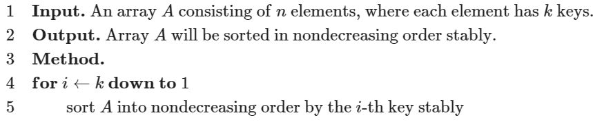

使用 LSD 基数排序实现的对 k - 关键字元素的排序（LSD的多趟桶排序）：

```c++
const int N = 100010;
const int W = 100010;
const int K = 100;

int n, w[K], k, cnt[W];

struct Element {
  int key[K];

  bool operator<(const Element& y) const {
    // 两个元素的比较流程
    for (int i = 1; i <= k; ++i) {
      if (key[i] == y.key[i]) continue;
      return key[i] < y.key[i];
    }
    return false;
  }
} a[N], b[N];

void counting_sort(int p) {
  memset(cnt, 0, sizeof(cnt));
  for (int i = 1; i <= n; ++i) ++cnt[a[i].key[p]];
  for (int i = 1; i <= w[p]; ++i) cnt[i] += cnt[i - 1];
  // 为保证排序的稳定性，此处循环i应从n到1
  // 即当两元素关键字的值相同时，原先排在后面的元素在排序后仍应排在后面
  for (int i = n; i >= 1; --i) b[cnt[a[i].key[p]]--] = a[i];
  memcpy(a, b, sizeof(a));
}

void radix_sort() {
  for (int i = k; i >= 1; --i) {
    // 借助计数排序完成对关键字的排序
    counting_sort(i);
  }
}

```

> 实际上并非必须从后往前枚举才是稳定排序，只需对 `cnt` 数组进行**等价于 `std::exclusive_scan`** 的操作即可。