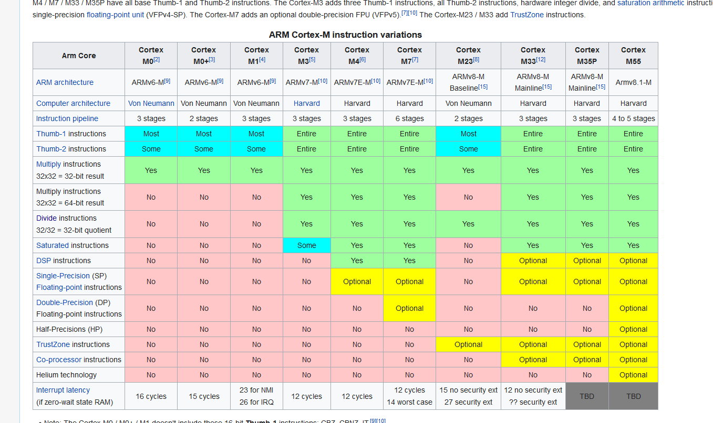
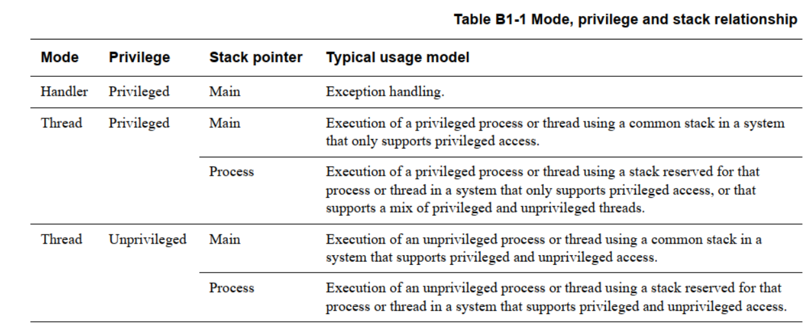
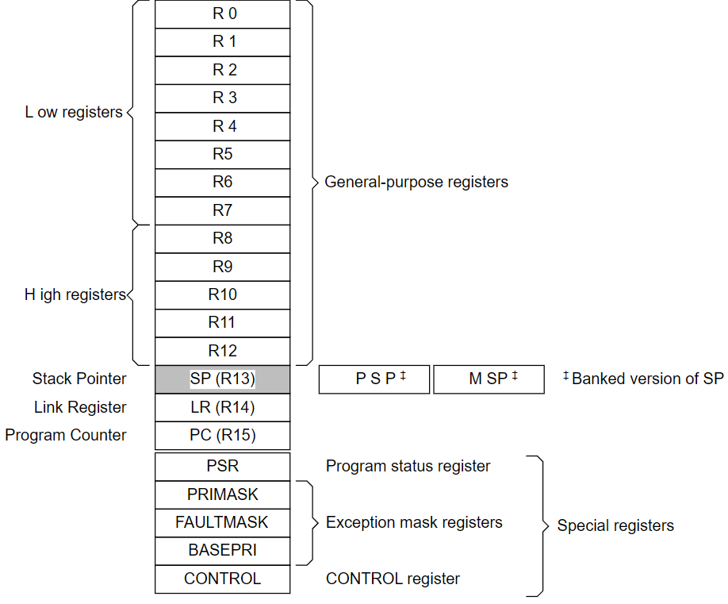
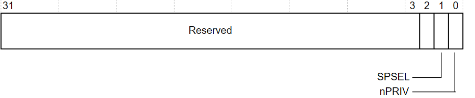
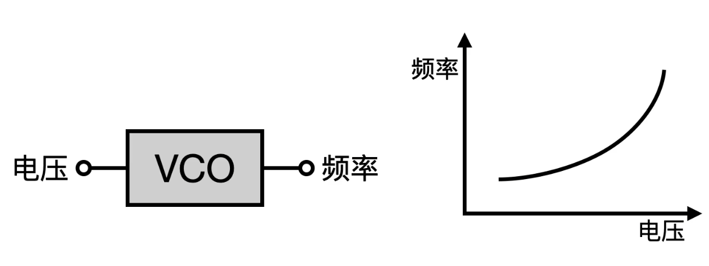

# 1 ARM处理器

## 1.1 哈佛结构（ARM）和冯诺依曼结构（x86）

1. 冯诺依曼结构釆用**指令和数据统一编址**，**使用同条总线传输**，**CPU读取指令和数据的操作无法重叠**。哈佛结构釆用**指令和数据独立编址**，使用两条独立的总线传输，**CPU读取指令和数据的操作可以重叠**。
2. 冯诺依曼结构主要用于通用计算机领域，**需要对存储器中的代码和数据频繁的进行修改，统一编址有利于节约资源**。哈佛结构主要用于**嵌入式计算机（MCU）**，程序固化在硬件中，有较高的可靠性、运算速度和较大的吞吐。

> 实际上，如今的内核开发已经没有分的那么细了，MCU也未必一定是哈佛架构或冯诺依曼架构（见上图），很容易见到混用哈佛结构后和冯诺依曼结构的ARM内核，如部分Cortex-A系列的CPU，甚至部分Cortex-M系列的MCU。

## 1.2 流水线技术

流水线技术**通过多个功能部件并行工作**来**缩短程序执行**时间，提高处理器核的效率和吞吐率，从而成为微处理器设计中最为重要的技术之一。

> 流水线虽好，但流水线越多，功耗越大，占用的体积越大，所以在实际中厂商往往会选择功耗、体积和性能的平衡点。

### 1.2.0 2级流水线

Cortex-M0+ 中使用的是两级流水线（**取指+预译码，译码+执行**），减少了寄存器的数量及对应的面积和功耗，也减少了跳转指令带来的性能损失。

### 1.2.1 3级流水线

1. **Fetch** – 指令从内存中取出并放置在流水线中；
2. **Decode** – 指令解码，并为下一个周期准备数据信号；
3. **Execute** – 贮备好的数据路径中的指令从注册表组中读取，将操作数移位到ALU，并将生成的结果写入主寄存器。

**流水线是在硬件级别实现的**，流水线是线性的，这意味着在简单的数据处理中，处理器在一个时钟周期内执行一条指令，而单个指令需要三个时钟周期。但是，当程序结构有分支时，管道会面临困难，因为它无法预测下一个命令是哪个。在这种情况下，管道会刷新并必须重新填充，这意味着执行速度将降至每3个时钟周期1条指令。但事实并非如此。ARM指令具有很好的功能，可以使代码中的小分支具有平滑的性能，从而确保最佳性能。**这是在硬件级别上实现的，其中PC（程序计数器）比当前指令提前8字节计算。**（PC+8）

参考这篇文章：[汇编 - 为什么 ARM PC 寄存器指向下一个要执行的指令之后的指令？- 堆栈溢出 (stackoverflow.com)](https://stackoverflow.com/questions/24091566/why-does-the-arm-pc-register-point-to-the-instruction-after-the-next-one-to-be-e)

PC 的值总是当前执行指令的下一个指令的下一个指令，因此PC的值往往是当前正在执行的指令的地址+8，具体可以参考下图（该图为一个5-Stage Pipeline的示意图）。

> 如果发生中断，理论上，当前指令应当在原子时间内执行完，并转入中断，因此，此时记录的中断返回PC值为当前指令的地址+4。（欢迎纠错）

### 1.2.1 5级流水线

参考上图，5级流水线上多了内存访问和寄存器回写阶段。

## 1.3 ARM的9种工作模式

| 工作模式        | 模式编码 | 模式介绍                                                     | 架构                           |
| --------------- | -------- | ------------------------------------------------------------ | ------------------------------ |
| User Mode       | 0b10000  | 应用程序正常运行时的工作模式                                 | ALL                            |
| FIQ Mode        | 0b10001  | 快速中断模式，中断优先级比IRQ高，用于高速数据传输            | ALL                            |
| IRQ Mode        | 0b10010  | 中断模式                                                     | ALL                            |
| Supervisor Mode | 0b10011  | 管理模式，保护模式，适用于运行绝大多数内核代码 **复位和软中断时一般进入该模式** | ALL                            |
| Abort Mode      | 0b10111  | 数据存储异常，指令读取失败会进入该模式，用于虚拟内存和存储保护 | ALL                            |
| Undefined Mode  | 0b11011  | CPU遇到无法识别、未定义的指令时，会进入该状态                | ALL                            |
| System Mode     | 0b11111  | 类似用户模式，但可以运行特权OS任务，如切换到其他模式 具有与User Mode相同的寄存器，并且不会因为任何异常进入 系统模式旨在提供必须访问系统资源，但不使用异常入口机制和关联的附加寄存器的机制，供操作系统任务使用 此外，操作系统必须访问用户模式寄存器时，也会使用该模式 | ARMv4 and later                |
| Monitor Mode    | 0b10110  | 作为安全拓展的一部分实现，一种安全模式，支持在安全和非安全状态之间切换，始终处于安全状态，无视SCR.NS位的值，参见[*The Security Extensions*](https://developer.arm.com/documentation/ddi0406/b/System-Level-Architecture/The-System-Level-Programmers--Model/The-Security-Extensions?lang=en) 还可以用于处理FIQ、IRQ和外部中断 在执行安全监视调用指令（Secure Monitor Call, SMC）时进入  | Security Extensions only       |
| Hyp Mode        | 0b11010  | 虚拟机监控程序模式                                           | Virtualization Extensions only |

应用程序正常运行时，ARM处理器工作在用户模式（User mode），当程序运行出错或有中断发生时，ARM处理器就会切换到对应的特权工作模式。用户模式属于普通模式，有些特权指令是运行不了的，需要切换到特权模式下才能运行。在ARM处理器中，除了用户模式是普通模式，剩下的几种工作模式都属于特权模式。  

主要分为用户模式、特权模式、异常模式：

1. 用户模式以外的模式称为**特权模式**，在安全状态下，特权模式对系统资源具有完全的访问权限，并可以自由更改模式，并具备以下权限：
   - MRS（把状态寄存器的内容放到通用寄存器）；
   - MSR（把通用寄存器的内容放到状态寄存器中）。
2. FIQ、IRQ、Supervisor、Abort、Undefined、Monitor称为**异常模式**，每一种模式处理相应的异常，且都有一些存储寄存器，以避免在发生异常时损坏正在使用的模式的寄存器。

安全和非安全模式：在实现安全扩展的处理器中，模式描述可以限定为“安全”或“不安全”，以指示处理器是否也处于安全状态或“非安全”状态。例如：

1. 如果处理器处于特权模式和安全状态，则处于安全特权模式；
2. 如果处理器处于用户模式和不安全状态，则处于非安全用户模式。

> 对于ARMv7-M来说，有所不同，处理器运行在以下两种模式下。

## 1.4 ARM处理器有多少32位寄存器？

> Reference：Armv7-M Architecture Reference Manual P516
>
> [Cortex-M3 Devices Generic User Guide (arm.com)](https://developer.arm.com/documentation/dui0552/a/the-cortex-m3-processor/programmers-model/core-registers?lang=en)

### 1.4.1 核心寄存器

对Cortex-M3和Cortex-M4来说，存在以下这些核心寄存器：

1. **寄存器组**

   - 13个通用寄存器R0-R12
   - 栈指针SP（R13，对应MSP和PSP）：0 = *主堆栈指针* （MSP），复位值，1 = *进程堆栈指针* （PSP），复位时，处理器使用地址 `0x00000000` 中的值加载 MSP
   - 链接寄存器LR（R14）：It stores the return information for subroutines, function calls, and exceptions.   
   - 程序寄存器PC（R15）：初始值为Vector Table Offset Register (VTOR) + 0x00000004。

   以上几种寄存器可以分为三类：

   - **未分组寄存器R0-R7：**

     在所有运行模式下，未分组寄存器都指向同一个物理寄存器，他们未被系统用作特殊的用途。因此在中断或异常处理进行异常模式转换时，由于不同的处理器运行模式均使用相同的物理寄存器，所以可能造成寄存器中数据的破坏。  

   - **分组寄存器R8-R14：**

     对于分组寄存器，他们每次所访问的物理寄存器都与当前的处理器运行模式相关。
     R13常用作存放堆栈指针，用户也可以使用其他寄存器存放堆栈指针，但在Thumb指令集下，某些指令强制要求使用R13存放堆栈指针。
     R14称为链接寄存器（LR，Link Register），当执行子程序时，R14可得到R15（PC）的备份，执行完子程序后，又将R14的值复制回PC，即使用R14保存返回地址。

   - **程序计数器PC（R15） ：**

     指令必须对齐到半字或字地址，因此，PC的LSB为0，但Thumb模式下，LSB需要设置为1，以表示使用Thumb模式。

     寄存器R15用作程序计数器（PC），在ARM状态下，位0为0，位[31:2]用于保存PC；在Thumb状态下,位[0]为1，位[31:1]用于保存PC。  
     
     > 因此，我们在PC寄存器的描述中，看到：
     >
     > Bit[0] of the value is loaded into the EPSR T-bit at reset and must be 1.  
     >
     > 这个标志也就指代了是 ARM 状态 或 Thumb 状态。

2. **专用程序状态寄存器xPSR**

   - 应用程序状态寄存器APSR：标志设置指令修改APSR标志N、Z、C、V和Q，处理器使用这些标志来评估IT和条件分支指令中的条件执行。

     - 整数运算的状态标志（N-Z-C-V）
     - 饱和运算的状态标志（Q）
     - SIMD运算的状态标志（GE，在Cortex-M3中不可用）

   - 中断程序状态寄存器IPSR：处理器在异常进入和退出时写入IPSR，软件可以使用MRS指令来读取IPSR，但处理器会忽略MSR指令对IPSR的写入。

     - 线程模式下，为0；
     - 处理模式下，保存当前执行异常的异常编号；

     > 异常编号表示当前正在执行的异常及其入口向量，复位时，处理器处于线程模式，IPSR的异常编号字段被清除为0。因此，值1（用于重置的异常编号）是一个暂时值，软件无法将其视为有效的IPSR异常编号。

   - 执行程序状态寄存器EPSR：包含T位，T位为1表示处理器执行的是Thumb指令，以及重叠的ICI/IT字段，该字段支持中断继续加载/存储指令和IT指令。

     - EPSR.T位用以支持Arm体系结构互通模型，但**由于Armv7-M仅支持Thumb指令的执行，因此必须始终将其保持为值1。**对符合Thumb指令交互工作规则的PC指针的更新必须相应地更新EPSR.T。在EPSR.T设置为0的情况下执行指令会导致无效状态 UsageFault 和 INVSTATE。一个复位：

       1. 将T位设置为重置矢量的位[0]的值。如果处理器要执行由复位矢量指示的代码，则该位必须是1。如果此位为0，则处理器将执行HardFault异常并进入HardFault处理程序，堆栈 ReturnAddress() 值指向重置处理程序，并且堆栈 xPSR 值的T位设置为0。
       2. 将IT/ICI位清除为0。

     - ICI/IT位用于保存的异常可持续指令状态或保存的IT状态：

       1. 当用作ICI位时，它们为中断的异常可持续多周期加载或存储指令提供有关未完成寄存器列表的信息。
       2. 当用作IT位时，它们为IT块中指令序列的条件执行提供上下文信息，以便在适当的时候中断和重新启动。

       如果在IT结构中使用异常可持续指令，则IT功能优先于ICI功能。在这种情况下，多周期加载或存储指令被视为可重新启动。

   

   > Cortex-A和Cortex-R体系结构配置文件有两个可供选择的指令集，Arm和Thumb。指令集状态标识当前指令集，PSR T位标识该状态。**M配置文件仅支持Thumb指令集**，因此只有当T位设置为1时，处理器才能执行指令。
   >
   > 所有字段使用MRS指令读取为零，处理器忽略MSR指令对EPSR的写入。

3. **用于异常或中断屏蔽的特殊目的寄存器**

- PRIMASK：异常屏蔽寄存器，设置为1来提高执行的优先级为0（可编程异常和中断的最高优先级）；
- FAULTMASK：错误屏蔽寄存器，只有优先级低于-1的特权软件才能将FAULTMASK设置为1，设置为1来提高执行的优先级为-1，相比PRIMASK还可以屏蔽HardFault异常。从除NMI以外的任何异常返回时，将FAULTMASK清除为0。
- BASEEPRI：基本优先级屏蔽寄存器，根据优先级等级来屏蔽异常和中断，只有当BASEPRI的值低于当前执行的软件的未屏蔽优先级时，它才会生效。该寄存器的最长长度为8位，实际长度取决于设计实现的优先级数量，在Cortex-M3和Cortex-M4中，都有8个（3位）或16个（4位）可编程的异常优先级。

****

4. CONTROL寄存器：
   - 定义了栈指针的选择（主栈指针MSP/进程栈指针PSP）；
   - 定义了线程模式的访问等级（特权/非特权）；
   - 对包含浮点单元的Cortex-M4处理器，还有表示当前上下文（正在执行的代码）是否使用浮点单元的标志位。

| **Bits** | Name  | **Function**                                                 |
| -------- | ----- | ------------------------------------------------------------ |
| [31:2]   | -     | Reserved.                                                    |
| [1]      | SPSEL | Defines the currently active stack pointer: In Handler mode this bit reads as zero and ignores writes. The Cortex-M3 updates this bit automatically on exception return. 0 = MSP is the current stack pointer 1 = PSP is the current stack pointer. |
| [0]      | nPRIV | Defines the Thread mode privilege level: 0 = Privileged 1 = Unprivileged. |

处理模式始终使用MSP，因此处理器在处理模式下会忽略对 CONTROL 寄存器的活动堆栈指针位的显式写入。异常输入和返回机制根据`EXC_RETURN`值自动更新 CONTROL 寄存器，参阅[表2.17](https://developer.arm.com/documentation/dui0552/a/the-cortex-m3-processor/exception-model/exception-entry-and-return?lang=en)。

在操作系统环境中，ARM 建议在线程模式下运行的线程使用进程堆栈，内核和异常处理程序使用主堆栈。默认情况下，线程模式使用 MSP，要将线程模式下使用的堆栈指针切换到 PSP，请执行以下任一操作：

1. 使用 `MSR` 指令将活动堆栈指针位设置为 1，请参阅[*LS3*](https://developer.arm.com/documentation/dui0552/a/the-cortex-m3-instruction-set/miscellaneous-instructions/msr?lang=en).
2. 使用适当的 `EXC_RETURN` 值执行异常返回到线程模式，请参阅[表2.17](https://developer.arm.com/documentation/dui0552/a/the-cortex-m3-processor/exception-model/exception-entry-and-return?lang=en).

### 1.4.2 其他寄存器

除 ARMv6-M and ARMv7-M以外的ARM处理器，总共有37个寄存器，如果设计中，实现了安全扩展，则增加3个寄存器，仅在ARMv7-A 中，如果实现了虚拟化扩展，则再添加3个寄存器。对于每种处理器模式，都有不同的寄存器组，这些寄存器提供了处理快速上下文切换，用于处理处理器异常和特权操作。

特权软件执行中可用的其他寄存器（除 ARMv6-M and ARMv7-M以外）包括：

1. 两个Supervisor mode 寄存器用于存储 SP 和 LR；
2. 两个Abort mode 寄存器用于存储 SP 和 LR；
3. 两个Undefined mode 寄存器用于存储 SP 和 LR；
4. 两个IRQ mode 寄存器用于存储 SP 和 LR；
5. 七个 FIQ mode 寄存器用于存储 R8-R12、SP 和 LR；
6. 两个Monitor mode 寄存器用于存储 SP 和 LR，仅在安全扩展实现中存在；
7. 两个Hyp mode 寄存器用于存储 SP ，保存Hyp mode的返回地址，仅在虚拟化扩展实现中存在；
8. 一个 Saved Program Status Register (SPSR)用于每个异常模式。

下图表示了在除ARMv6-M and ARMv7-M的ARM架构中，寄存器存储的方式。

此外，还存在可选的浮点单元可用的寄存器：

1. S0\~S31（32位）/D0\~D15（64位），浮点处理使用的寄存器；
2. FPSCR，浮点状态和控制寄存器；
3. 经过存储器映射的浮点单元控制寄存器。

## 1.5 ARM指令集

分为Thumb指令集，ARM指令集，ARM指令长度为32位，Thumb指令长度为16位，Cortex-M内核的MCU只运行在Thumb模式下，以压缩代码密度，对于Cortex-A或Cortex-M的处理器来说，代码可以运行在两种模式下，但通常都只会选择一种，以减少编程难度。

## 1.6 函数调用时，参数的传递方式

**当参数小于等于4的时候是通过`R0~R3`寄存器来进行传递的，当参数大于4的时候是通过压栈的方式（从左往右）进行传递。**

## 1.7 什么是锁相环（PLL，Phase Locked Loop）

[让频率提升几十倍的电路！锁相环的工作原理！_哔哩哔哩_bilibili](https://www.bilibili.com/video/BV1yS4y1n7vV/?spm_id_from=333.337.search-card.all.click&vd_source=b2294685dcc4b104a99f116c1c175bce)

简单来说，锁相环的作用就是将晶振的频率加倍，相位不变，并提供给CPU。

鉴相器控制频率之间的相位，保证相位不变。

滤波器使信号变得平滑。

压控振荡器（VCO）将不同的电压转换成不同的频率。

加入分频器，以达到倍频效果。

# 2 中断与异常

## 2.1 中断与异常的区别

中断是指外部硬件产生的一个电信号从CPU的中断引脚进入，打断CPU的运行。

异常是指软件运行过程中发生了一些必须作出处理的事件，CPU自动产生一个陷入来打断CPU的运行。异常在处理的时候必须考虑与处理器的时钟同步，实际上异常也称为同步中断，在处理器执行到因编译错误而导致的错误指令时，或者在执行期间出现特殊错误，必须靠内核处理的时候，处理器就会产生一个异常。

**中断是异常的一个子集（至少在ARM架构下是这样描述的）。**所有异常都可以中断当前软件的执行（不仅仅是中断）。所有中断都是异常，但并非所有异常都是中断。

对于Cortex-M3和Cortex-M4来说，异常编号1~15为系统异常，16以上属于外部中断。

## 2.2 中断响应流程（这里写的其实是Linux内核处理中断的方式）

中断的响应流程：CPU接受中断->保存中断上下文跳转到中断处理程序->执行中断上半部->执行中断下半部->恢复中断上下文。

## 2.3 当一个异常出现以后，ARM微处理器会执行哪几步操作？

1. **将下一条指令的地址存入相应连接寄存器LR，以便程序在处理异常返回时能从正确的位置重新开始执行。**若异常是从ARM状态进入，则LR寄存器中保存的是下一条指令的地址（当前PC＋4或PC＋8，与异常的类型有关）；若异常是从Thumb状态进入，则在LR寄存器中保存当前PC的偏移量，这样，异常处理程序就不需要确定异常是从何种状态进入的。例如：在软件中断异常SWI，指令MOV PC，R14_svc总是返回到下一条指令，不管SWI是在ARM状态执行，还是在Thumb状态执行。
2. 将CPSR复制到相应的SPSR中。
3. 根据异常类型，强制设置CPSR的运行模式位。
4. 强制PC从相关的异常向量地址取下一条指令执行，从而跳转到相应的异常处理程序处。

## 2.4 中断处理程序应该如何编写

1. 写一个中断服务程序要注意**快进快出**，在中断服务程序里面**尽量快速采集信息**，包括**硬件信息，然后退出中断**，要做其它事情可以使用工作队列或者tasklet方式，也就是中断上半部和下半部（这种思想也可以应用到裸机编程中）。
2. **中断服务程序中不能有阻塞操作**。应为中断期间是完全占用CPU的（即不存在内核调度），中断被阻塞住，其他进程将无法操作。
3. **中断服务程序注意返回值**，要用操作系统定义的宏做为返回值，而不是自己定义的。（中断服务函数是无法返回值的，考虑使用全局变量）
4. 如果要做的事情较多，应将这些任务放在后半段(tasklet，等待队列等)处理。