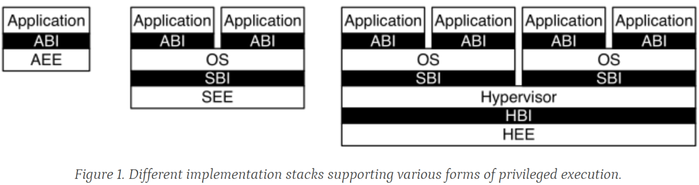

# 1 RISC-V Privileged Software Stack Terminology

Figure 1 shows some of the possible software stacks that can be supported by the RISC-V architecture. 

1. The left-hand side shows a simple system that supports only a single application running on an application execution environment (AEE). The application is coded to run with a particular application binary interface (ABI). The ABI includes the supported **user-level ISA** plus a set of ABI calls to interact with the AEE. The ABI hides details of the AEE from the application to allow greater flexibility in implementing the AEE. The same ABI could be implemented natively on multiple different host OSs, or could be supported by a user-mode emulation environment running on a machine with a different native ISA.
2. The middle configuration shows a conventional operating system (OS) that can support multiprogrammed execution of multiple applications. Each application communicates over an ABI with the OS, which provides the AEE. Just as applications interface with an AEE via an ABI, RISC-V operating systems interface with a supervisor execution environment (SEE) via a supervisor binary interface (SBI). An SBI comprises **the user-level and supervisor-level** ISA together with a set of SBI function calls. Using a single SBI across all SEE implementations allows a single OS binary image to run on any SEE. The SEE can be a simple boot loader and BIOS-style IO system in a low-end hardware platform, or a hypervisor-provided virtual machine in a high-end server, or a thin translation layer over a host operating system in an  architecture simulation environment.
3. The rightmost configuration shows a virtual machine monitor configuration where multiple multiprogrammed OSs are supported by a single hypervisor. Each OS communicates via **an SBI with the hypervisor**, which provides the SEE. The hypervisor communicates with the hypervisor execution environment (HEE) using a hypervisor binary interface (HBI), to isolate the hypervisor from details of the hardware platform.  

# 2 Privilege Levels

At any time, a RISC-V hardware thread (hart) is running at some privilege level encoded as a mode in one or more CSRs (control and status registers). Three RISC-V privilege levels are currently defined as shown.

| Level | Encoding | Name             | Abbreviation |
| ----- | -------- | ---------------- | ------------ |
| 0     | 00       | User/Application | U            |
| 1     | 01       | Supervisor       | S            |
| 2     | 10       | Reserved         |              |
| 3     | 11       | Machine          | M            |

Privilege levels are used to **provide protection between different components of the software stack**, and attempts to **perform operations not permitted by the current privilege mode will cause an exception to be raised**. These exceptions will normally **cause traps** into an underlying execution environment. 

**The machine level** has the **highest privileges** and is the only mandatory privilege level for a RISC-V hardware platform. **Code run in machine-mode (M-mode) is usually inherently trusted**, as it has low-level access to the machine implementation. **M-mode can be used to manage secure execution environments on RISC-V**. **User-mode (U-mode) and supervisor-mode (S-mode)** are intended for **conventional application and operating system usage** respectively.

Implementations might provide anywhere from **1 to 3 privilege modes** trading off reduced isolation for lower implementation cost, as shown.  

| Number of levels | Supported Modes | Intended Usage                              |
| ---------------- | --------------- | ------------------------------------------- |
| 1                | M               | Simple embedded systems                     |
| 2                | M, U            | Secure embedded systems                     |
| 3                | M, S, U         | Systems running Unix-like operating systems |

All hardware implementations **must provide M-mode**, as this is the only mode that has unfettered access to the whole machine. The simplest RISC-V implementations may provide only M-mode, though this will provide no protection against incorrect or malicious application code.  

Many RISC-V implementations will **also support at least user mode (U-mode)** to **protect the rest of the system from application code**. Supervisor mode (S-mode) can be added to provide isolation between a supervisor-level operating system and the SEE.  

A hart normally **runs application code in U-mode** until some trap (e.g., a supervisor call or a timer interrupt) forces a switch to a trap handler, which usually runs in a more privileged mode. The hart will then execute the trap handler, which will eventually resume execution at or after the original trapped instruction in U-mode. Traps that increase privilege level are termed vertical traps, while traps that remain at the same privilege level are termed horizontal traps. The RISC-V privileged architecture provides flexible routing of traps to different privilege layers.  