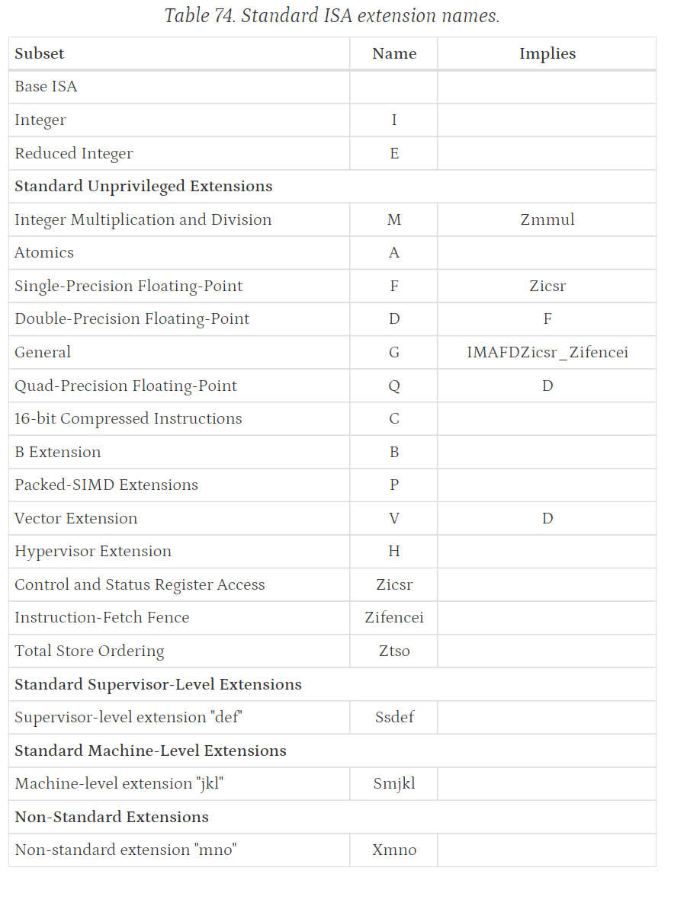

# 1 RISC-V Introduction

## 1.1 Common Terminology

| terminology | meaning                                                      |
| ----------- | ------------------------------------------------------------ |
| RISC-V      | Reduced Instruction Set Computer - Five，Compared to the now complex and redundant ARM(Advanced RISC Machine) architecture, RISC-V offers a **clearer and more customizable architecture**. |
| **core**    | A component  contains an independent instruction fetch unit. |
| **hart**    | A RISC-V compatible core might support multiple RISC-V-compatible **hardware threads**. |
| accelerator | a non-programmable fixed-function unit or a core that can operate autonomously but is specialized for certain tasks. |
| coprocessor | a unit that is attached to a RISC-V core and is mostly sequenced by a RISC-V instruction stream, but which contains additional architectural state and instruction-set extensions, and possibly some limited autonomy relative to the primary RISC-V instruction stream. |
| **XLEN**    | RISC-V uses **XLEN** to represent the word width of the corresponding architecture. |

## 1.2 Memory

A RISC-V hart has a single byte-addressable address space of 2^XLEN^ bytes for all memory accesses.

> XLEN will be defined in compiler header files commonly.

## 1.3 Unprivileged Instruction Sets Summary

The following mainly introduces the **bolded** content.

| Instruction Set                                              | introduction                                                 |
| ------------------------------------------------------------ | ------------------------------------------------------------ |
| **RV32I Base Integer Instruction Set**                       | 32-bit RISC-V                                                |
| RV32E and RV64E Base Integer Instruction Sets                | reduced versions of RV32I and RV64I<br />reduce the number of integer registers to 16 |
| RV64I Base Integer Instruction Set                           | 64-bit RISC-V                                                |
| RV128I Base Integer Instruction Set                          | 128-bit RISC-V                                               |
| **"Zifencei" Extension for Instruction-Fetch Fence**         | the FENCE.I instruction that provides explicit synchronization between writes to instruction memory and instruction fetches on the same hart |
| **"Zicsr", Extension for Control and Status Register (CSR) Instructions** | 4096 Control and Status registers associated with each hart  |
| "Zicntr" and "Zihpm" Extensions for Counters                 | a set of up to thirty-two 64-bit performance counters and timers |
| "Zihintntl" Extension for Non-Temporal Locality Hints        |                                                              |
| "Zihintpause" Extension for Pause Hint                       |                                                              |
| "Zimop" Extension for May-Be-Operations                      |                                                              |
| "Zicond" Extension for Integer Conditional Operations        |                                                              |
| **"M" Extension for Integer Multiplication and Division**    | the standard integer multiplication and division instruction extension |
| **"A" Extension for Atomic Instructions**                    | atomically read-modify-write memory to support synchronization between multiple RISC-V harts running in the same memory space |
| "Zawrs" Extension for Wait-on-Reservation-Set instructions   |                                                              |
| "Zacas" Extension for Atomic Compare-and-Swap (CAS) Instructions |                                                              |
| RVWMO Memory Consistency Model                               |                                                              |
| "Ztso" Extension for Total Store Ordering                    |                                                              |
| "CMO" Extensions for Base Cache Management Operation ISA     |                                                              |
| **"F" Extension for Single-Precision Floating-Point**        | single-precision floating-point                              |
| "D" Extension for Double-Precision Floating-Point            |                                                              |
| "Q" Extension for Quad-Precision Floating-Point              |                                                              |
| "Zfh" and "Zfhmin" Extensions for Half-Precision Floating-Point |                                                              |
| "Zfa" Extension for Additional Floating-Point Instructions   |                                                              |
| "Zfinx", "Zdinx", "Zhinx", "Zhinxmin" Extensions for Floating-Point in Integer Registers |                                                              |
| **"C" Extension for Compressed Instructions**                | the RISC-V standard compressed instruction-set extension<br />reduces static and dynamic code size by adding short 16-bit instruction encodings for common operations |
| "Zc*" Extension for Code Size Reduction                      |                                                              |
| "B" Extension for Bit Manipulation                           | Zba, Zbb, and Zbs extensions                                 |
| "J" Extension for Dynamically Translated Languages           |                                                              |
| "P" Extension for Packed-SIMD Instructions                   |                                                              |
| "V" Standard Extension for Vector Operations                 | provides general support for data-parallel execution within the 32-bit encoding space, with later vector extensions supporting richer functionality for certain domains |
| Cryptography Extensions: Scalar & Entropy Source Instructions |                                                              |
| Cryptography Extensions: Vector Instructions                 |                                                              |

The brief name is as below:



### 1.3.1 RV32I Base Integer Instruction Set

1. 40 unique instructions;
2. 32 x registers each 32 bits wide:
   - Register **x0** is hardwired with all bits equal to 0.
   - General purpose registers **x1- x31** hold values that various instructions interpret as a collection of Boolean values, or as two’s complement signed binary integers or unsigned binary integers.
3. one additional unprivileged register: the program counter **pc** holds the address of the current instruction.

> **Note:**
>
> 1. any x register can be stack pointer or subroutine return address link register;
> 2. generally, the standard software calling convention uses register **x1** to **hold the return address for a call**, with register **x5** available as **an alternate link register**. The standard calling convention uses register **x2** as the **stack pointer**.

| XLEN-1                                                                                                                 0 |
| :----------------------------------------------------------: |
|                           x0/zero                            |
|                              x1                              |
|                              x2                              |
|                              x3                              |
|                              x4                              |
|                              x5                              |
|                              x6                              |
|                              x7                              |
|                              x8                              |
|                              x9                              |
|                             x10                              |
|                             x11                              |
|                             x12                              |
|                             x13                              |
|                             x14                              |
|                             x15                              |
|                             x16                              |
|                             x17                              |
|                             x18                              |
|                             x19                              |
|                             x20                              |
|                             x21                              |
|                             x22                              |
|                             x23                              |
|                             x24                              |
|                             x25                              |
|                             x26                              |
|                             x27                              |
|                             x28                              |
|                             x29                              |
|                             x30                              |
|                             x31                              |
|                             XLEN                             |
| **XLEN-1                                                                                                                   0** |
|                              pc                              |
|                           **XLEN**                           |

### 1.3.2 "Zifencei" Extension for Instruction-Fetch Fence

> Fence Instructions have a lot variants.

`FENCE.I` instruction that provides explicit synchronization between writes to instruction memory and instruction fetches on the same hart. 

The FENCE.I instruction was designed to support a wide variety of implementations. A simple implementation can flush the local instruction cache and the instruction pipeline when the FENCE.I is executed.   

### 1.3.3 "Zicsr", Extension for Control and Status Register (CSR) Instructions

> While CSRs are primarily used by the privileged architecture, there are several uses in unprivileged code including for counters and timers, and for floating-point status.   

### 1.3.4 "M" Extension for Integer Multiplication and Division

### 1.3.5 "A" Extension for Atomic Instructions

> 原子操作（Atomic operation）是指一种不可分割的操作，要么完全执行成功，要么完全不执行。原子操作的执行过程中不允许有任何中断，如果出现了中断，那么操作的结果就无法保证。原子操作通常用于多线程编程中，保证多个线程之间的并发执行不会出现数据竞争等问题。在实现原子操作时，通常使用硬件指令或者操作系统提供的原子操作函数来保证操作的原子性。 在应用层面，原子操作可以用于实现一些高级的同步和并发控制机制。

| RT-Thread 原子操作 API                                       | 作用                                                         |
| ------------------------------------------------------------ | ------------------------------------------------------------ |
| rt_atomic_t rt_hw_atomic_load(volatile rt_atomic_t *ptr)     | 原子的从 ptr 地址加载一个字                                  |
| void rt_atomic_store(volatile rt_atomic_t *ptr, rt_atomic_t val) | 原子的将 val 写入 ptr 地址                                   |
| rt_atomic_t rt_atomic_exchange(volatile rt_atomic_t *ptr, rt_atomic_t val) | 原子的将 ptr 地址处的值替换为 val                            |
| rt_atomic_t rt_atomic_add(volatile rt_atomic_t *ptr, rt_atomic_t val) | 原子的将 ptr 地址处的值与 val 相加                           |
| rt_atomic_t rt_atomic_sub(volatile rt_atomic_t *ptr, rt_atomic_t val) | 原子的将 ptr 地址处的值与 val 相减                           |
| rt_atomic_t rt_atomic_xor(volatile rt_atomic_t *ptr, rt_atomic_t val) | 原子的将 ptr 地址处的值与 val 按位异或                       |
| rt_atomic_t rt_atomic_and(volatile rt_atomic_t *ptr, rt_atomic_t val) | 原子的将 ptr 地址处的值与 val 按位与                         |
| rt_atomic_t rt_atomic_or(volatile rt_atomic_t *ptr, rt_atomic_t val) | 原子的将 ptr 地址处的值与 val 按位或                         |
| rt_atomic_t rt_atomic_flag_test_and_set(volatile rt_atomic_t *ptr) | 原子的将 ptr 地址处的值置 1                                  |
| void rt_atomic_flag_clear(volatile rt_atomic_t *ptr)         | 原子的将 ptr 地址处的值清 0                                  |
| rt_atomic_t rt_atomic_compare_exchange_strong(volatile rt_atomic_t *ptr, rt_atomic_t *old, rt_atomic_t new) | 原子的将 ptr 地址处的值与 val 进行比较与交换，并返回比较结果 |

```C
/*
 * Copyright (c) 2006-2023, RT-Thread Development Team
 *
 * SPDX-License-Identifier: Apache-2.0
 *
 * Change Logs:
 * Date           Author       Notes
 * 2023-03-14     WangShun     first version
 */

#include <rtthread.h>

rt_atomic_t rt_hw_atomic_exchange(volatile rt_atomic_t *ptr, rt_atomic_t val)
{
    rt_atomic_t result = 0;
#if __riscv_xlen == 32
    asm volatile ("amoswap.w %0, %1, (%2)" : "=r"(result) : "r"(val), "r"(ptr) : "memory");
#elif __riscv_xlen == 64
    asm volatile ("amoswap.d %0, %1, (%2)" : "=r"(result) : "r"(val), "r"(ptr) : "memory");
#endif
    return result;
}

rt_atomic_t rt_hw_atomic_add(volatile rt_atomic_t *ptr, rt_atomic_t val)
{
    rt_atomic_t result = 0;
#if __riscv_xlen == 32
    asm volatile ("amoadd.w %0, %1, (%2)" : "=r"(result) : "r"(val), "r"(ptr) : "memory");
#elif __riscv_xlen == 64
    asm volatile ("amoadd.d %0, %1, (%2)" : "=r"(result) : "r"(val), "r"(ptr) : "memory");
#endif
    return result;
}

rt_atomic_t rt_hw_atomic_sub(volatile rt_atomic_t *ptr, rt_atomic_t val)
{
    rt_atomic_t result = 0;
    val = -val;
#if __riscv_xlen == 32
    asm volatile ("amoadd.w %0, %1, (%2)" : "=r"(result) : "r"(val), "r"(ptr) : "memory");
#elif __riscv_xlen == 64
    asm volatile ("amoadd.d %0, %1, (%2)" : "=r"(result) : "r"(val), "r"(ptr) : "memory");
#endif
    return result;
}

rt_atomic_t rt_hw_atomic_xor(volatile rt_atomic_t *ptr, rt_atomic_t val)
{
    rt_atomic_t result = 0;
#if __riscv_xlen == 32
    asm volatile ("amoxor.w %0, %1, (%2)" : "=r"(result) : "r"(val), "r"(ptr) : "memory");
#elif __riscv_xlen == 64
    asm volatile ("amoxor.d %0, %1, (%2)" : "=r"(result) : "r"(val), "r"(ptr) : "memory");
#endif
    return result;
}

rt_atomic_t rt_hw_atomic_and(volatile rt_atomic_t *ptr, rt_atomic_t val)
{
    rt_atomic_t result = 0;
#if __riscv_xlen == 32
    asm volatile ("amoand.w %0, %1, (%2)" : "=r"(result) : "r"(val), "r"(ptr) : "memory");
#elif __riscv_xlen == 64
    asm volatile ("amoand.d %0, %1, (%2)" : "=r"(result) : "r"(val), "r"(ptr) : "memory");
#endif
    return result;
}

rt_atomic_t rt_hw_atomic_or(volatile rt_atomic_t *ptr, rt_atomic_t val)
{
    rt_atomic_t result = 0;
#if __riscv_xlen == 32
    asm volatile ("amoor.w %0, %1, (%2)" : "=r"(result) : "r"(val), "r"(ptr) : "memory");
#elif __riscv_xlen == 64
    asm volatile ("amoor.d %0, %1, (%2)" : "=r"(result) : "r"(val), "r"(ptr) : "memory");
#endif
    return result;
}

rt_atomic_t rt_hw_atomic_load(volatile rt_atomic_t *ptr)
{
    rt_atomic_t result = 0;
#if __riscv_xlen == 32
    asm volatile ("amoxor.w %0, x0, (%1)" : "=r"(result) : "r"(ptr) : "memory");
#elif __riscv_xlen == 64
    asm volatile ("amoxor.d %0, x0, (%1)" : "=r"(result) : "r"(ptr) : "memory");
#endif
    return result;
}

void rt_hw_atomic_store(volatile rt_atomic_t *ptr, rt_atomic_t val)
{
    rt_atomic_t result = 0;
#if __riscv_xlen == 32
    asm volatile ("amoswap.w %0, %1, (%2)" : "=r"(result) : "r"(val), "r"(ptr) : "memory");
#elif __riscv_xlen == 64
    asm volatile ("amoswap.d %0, %1, (%2)" : "=r"(result) : "r"(val), "r"(ptr) : "memory");
#endif
}

rt_atomic_t rt_hw_atomic_flag_test_and_set(volatile rt_atomic_t *ptr)
{
    rt_atomic_t result = 0;
    rt_atomic_t temp = 1;
#if __riscv_xlen == 32
    asm volatile ("amoor.w %0, %1, (%2)" : "=r"(result) : "r"(temp), "r"(ptr) : "memory");
#elif __riscv_xlen == 64
    asm volatile ("amoor.d %0, %1, (%2)" : "=r"(result) : "r"(temp), "r"(ptr) : "memory");
#endif
    return result;
}

void rt_hw_atomic_flag_clear(volatile rt_atomic_t *ptr)
{
    rt_atomic_t result = 0;
#if __riscv_xlen == 32
    asm volatile ("amoand.w %0, x0, (%1)" : "=r"(result) :"r"(ptr) : "memory");
#elif __riscv_xlen == 64
    asm volatile ("amoand.d %0, x0, (%1)" : "=r"(result) :"r"(ptr) : "memory");
#endif
}

rt_atomic_t rt_hw_atomic_compare_exchange_strong(volatile rt_atomic_t *ptr, rt_atomic_t *old, rt_atomic_t desired)
{
    rt_atomic_t tmp = *old;
    rt_atomic_t result = 0;
#if __riscv_xlen == 32
    asm volatile(
            " fence iorw, ow\n"
            "1: lr.w.aq  %[result], (%[ptr])\n"
            "   bne      %[result], %[tmp], 2f\n"
            "   sc.w.rl  %[tmp], %[desired], (%[ptr])\n"
            "   bnez     %[tmp], 1b\n"
            "   li  %[result], 1\n"
            "   j 3f\n"
            " 2:sw  %[result], (%[old])\n"
            "   li  %[result], 0\n"
            " 3:\n"
            : [result]"+r" (result), [tmp]"+r" (tmp), [ptr]"+r" (ptr)
            : [desired]"r" (desired), [old]"r"(old)
            : "memory");
#elif __riscv_xlen == 64
    asm volatile(
            " fence iorw, ow\n"
            "1: lr.d.aq  %[result], (%[ptr])\n"
            "   bne      %[result], %[tmp], 2f\n"
            "   sc.d.rl  %[tmp], %[desired], (%[ptr])\n"
            "   bnez     %[tmp], 1b\n"
            "   li  %[result], 1\n"
            "   j 3f\n"
            " 2:sd  %[result], (%[old])\n"
            "   li  %[result], 0\n"
            " 3:\n"
            : [result]"+r" (result), [tmp]"+r" (tmp), [ptr]"+r" (ptr)
            : [desired]"r" (desired), [old]"r"(old)
            : "memory");
#endif
    return result;
}
```

### 1.3.6 "F" Extension for Single-Precision Floating-Point

The F extension adds 32 floating-point registers, f0-f31, each 32 bits wide, and a floating-point control and status register fcsr, which contains the operating mode and exception status of the floating-point unit.

| FLEN-1                                                                                                                 0 |
| :----------------------------------------------------------: |
|                              f0                              |
|                              f1                              |
|                              f2                              |
|                              f3                              |
|                              f4                              |
|                              f5                              |
|                              f6                              |
|                              f7                              |
|                              f8                              |
|                              f9                              |
|                             f10                              |
|                             f11                              |
|                             f12                              |
|                             f13                              |
|                             f14                              |
|                             f15                              |
|                             f16                              |
|                             f17                              |
|                             f18                              |
|                             f19                              |
|                             f21                              |
|                             f22                              |
|                             f23                              |
|                             f24                              |
|                             f25                              |
|                             f26                              |
|                             f27                              |
|                             f28                              |
|                             f29                              |
|                             f30                              |
|                             f31                              |
|                             FLEN                             |
| **31                                                                                                             0** |
|                             fcsr                             |
|                              32                              |

### 1.3.7 "C" Extension for Compressed Instructions

short 16-bit instruction encodings for common operations. Typically, 50%-60% of the RISC-V instructions in a program can be replaced with RVC instructions, resulting in a 25%-30% code-size reduction.

RVC uses a simple compression scheme that offers shorter 16-bit versions of common 32-bit RISC-Vinstructions when:

1. the **immediate or address offset is small**, or
2. **one of the registers is the zero register (x0), the ABI link register (x1), or the ABI stack pointer (x2)**, or 
3. the **destination register and the first source register are identical**, or
4. the **registers used are the 8 most popular ones**.

## 1.4 RISC-V Privileged Intruction Sets Summary

### 1.4.1 Software Stack Terminology

Figure 1 shows some of the possible software stacks that can be supported by the RISC-V architecture. 

1. The left-hand side shows a simple system that supports only a single application running on an application execution environment (AEE). The application is coded to run with a particular application binary interface (ABI). The ABI includes the supported **user-level ISA** plus a set of ABI calls to interact with the AEE. The ABI hides details of the AEE from the application to allow greater flexibility in implementing the AEE. The same ABI could be implemented natively on multiple different host OSs, or could be supported by a user-mode emulation environment running on a machine with a different native ISA.
2. The middle configuration shows a conventional operating system (OS) that can support multiprogrammed execution of multiple applications. Each application communicates over an ABI with the OS, which provides the AEE. Just as applications interface with an AEE via an ABI, RISC-V operating systems interface with a supervisor execution environment (SEE) via a supervisor binary interface (SBI). An SBI comprises **the user-level and supervisor-level** ISA together with a set of SBI function calls. Using a single SBI across all SEE implementations allows a single OS binary image to run on any SEE. The SEE can be a simple boot loader and BIOS-style IO system in a low-end hardware platform, or a hypervisor-provided virtual machine in a high-end server, or a thin translation layer over a host operating system in an  architecture simulation environment.
3. The rightmost configuration shows a virtual machine monitor configuration where multiple multiprogrammed OSs are supported by a single hypervisor. Each OS communicates via **an SBI with the hypervisor**, which provides the SEE. The hypervisor communicates with the hypervisor execution environment (HEE) using a hypervisor binary interface (HBI), to isolate the hypervisor from details of the hardware platform.  


### 1.4.2 Privilege Levels

At any time, a RISC-V hardware thread (hart) is running at some privilege level encoded as a mode in one or more CSRs (control and status registers). Three RISC-V privilege levels are currently defined as shown.

| Level | Encoding | Name             | Abbreviation |
| ----- | -------- | ---------------- | ------------ |
| 0     | 00       | User/Application | U            |
| 1     | 01       | Supervisor       | S            |
| 2     | 10       | Reserved         |              |
| 3     | 11       | Machine          | M            |

Privilege levels are used to **provide protection between different components of the software stack**, and attempts to **perform operations not permitted by the current privilege mode will cause an exception to be raised**. These exceptions will normally **cause traps** into an underlying execution environment. 

**The machine level** has the **highest privileges** and is the only mandatory privilege level for a RISC-V hardware platform. **Code run in machine-mode (M-mode) is usually inherently trusted**, as it has low-level access to the machine implementation. **M-mode can be used to manage secure execution environments on RISC-V**. **User-mode (U-mode) and supervisor-mode (S-mode)** are intended for **conventional application and operating system usage** respectively.

Implementations might provide anywhere from **1 to 3 privilege modes** trading off reduced isolation for lower implementation cost, as shown.  

| Number of levels | Supported Modes | Intended Usage                              |
| ---------------- | --------------- | ------------------------------------------- |
| 1                | M               | Simple embedded systems                     |
| 2                | M, U            | Secure embedded systems                     |
| 3                | M, S, U         | Systems running Unix-like operating systems |

All hardware implementations **must provide M-mode**, as this is the only mode that has unfettered access to the whole machine. The simplest RISC-V implementations may provide only M-mode, though this will provide no protection against incorrect or malicious application code.  

Many RISC-V implementations will **also support at least user mode (U-mode)** to **protect the rest of the system from application code**. Supervisor mode (S-mode) can be added to provide isolation between a supervisor-level operating system and the SEE.  

A hart normally **runs application code in U-mode** until some trap (e.g., a supervisor call or a timer interrupt) forces a switch to a trap handler, which usually runs in a more privileged mode. The hart will then execute the trap handler, which will eventually resume execution at or after the original trapped instruction in U-mode. Traps that increase privilege level are termed vertical traps, while traps that remain at the same privilege level are termed horizontal traps. The RISC-V privileged architecture provides flexible routing of traps to different privilege layers.

## 1.5 Register Convention

### 1.5.1 Integer Register Convention

| Name      | ABI Mnemonic | Meaning                    | Preserved across calls? |
| --------- | ------------ | -------------------------- | ----------------------- |
| x0        | zero         | Zero                       | —(Immutable)            |
| x1        | ra           | Return address             | No                      |
| x2        | sp           | Stack pointer              | Yes                     |
| x3        | gp           | Global pointer             | —(Unallocatable)        |
| x4        | tp           | Thread pointer             | —(Unallocatable)        |
| x5 - x7   | t0 - t2      | Temporary registers        | No                      |
| x8 - x9   | s0 - s1      | **Callee-saved registers** | Yes                     |
| x10 - x17 | a0 - a7      | Argument registers         | No                      |
| x18 - x27 | s2 - s11     | **Callee-saved registers** | Yes                     |
| x28 - x31 | t3 - t6      | Temporary registers        | No                      |

In the standard ABI, procedures should not modify the integer registers **tp** and **gp**, because signal handlers may rely upon their values.

The presence of a frame pointer is optional. If a frame pointer exists, it must reside in **x8 (s0)**; the register remains callee-saved.

### 1.5.2 Floating-point Register Convention

| Name      | ABI Mnemonic | Meaning                | Preserved across calls? |
| --------- | ------------ | ---------------------- | ----------------------- |
| f0 - f7   | ft0 - ft7    | Temporary registers    | No                      |
| f8 - f9   | fs0 - fs1    | Callee-saved registers | Yes*                    |
| f10 - f17 | fa0 - fa7    | Argument registers     | No                      |
| f18 - f27 | fs2 - fs11   | Callee-saved registers | Yes*                    |
| f28 - f31 | ft8 - ft11   | Temporary registers    | No                      |

*: Floating-point values in callee-saved registers are only preserved across calls if they are no larger than the width of a floating-point register in the targeted ABI. Therefore, these registers can always be considered temporaries if targeting the base integer calling convention.

The Floating-Point Control and Status Register (fcsr) **must have thread storage duration** in accordance with C11 section 7.6 "Floating-point environment <fenv.h>".  

### 1.5.3 Procedure Calling Convention

#### 1.5.3.1 Integer Calling Convention

8个字节以内的都可以通过寄存器传递。

The base integer calling convention provides eight **argument registers**, **a0-a7**, **the first two of which are also used to return values**.  

**Scalars** that are at most **XLEN bits wide** are passed in **a single argument register**, **or on the stack by value if none is available**. When passed in registers or on the stack, integer scalars narrower than XLEN bits are widened according to the sign of their type up to 32 bits, then sign-extended to XLEN bits. When passed in registers or on the stack, floating-point types narrower than XLEN bits are widened to XLEN bits, with the upper bits undefined.

**Scalars** that are **2×XLEN bits wide** are passed in **a pair of argument registers**, with the low-order XLEN bits in the lower-numbered register and the high-order XLEN bits in the higher-numbered register. If no argument registers are available, the scalar is **passed on the stack by value**. **If exactly one register is available, the low-order XLEN bits are passed in the register and the high-order XLEN bits are passed on the stack.**

**Scalars wider than 2×XLEN bits are passed by reference and are replaced in the argument list with the address.**

Aggregates whose total size is no more than XLEN bits are passed in a register, with the fields laid out as though they were passed in memory. If no register is available, the aggregate is passed on the stack. Aggregates whose total size is no more than 2×XLEN bits are passed in a pair of registers; if only one register is available, the first XLEN bits are passed in a register and the remaining bits are passed on the stack. If no registers are available, the aggregate is passed on the stack. Bits unused due to padding, and bits past the end of an aggregate whose size in bits is not divisible by XLEN, are undefined.

**Aggregates or scalars passed on the stack are aligned to the greater of the type alignment and XLEN bits, but never more than the stack alignment.**  

Aggregates larger than 2×XLEN bits are passed by reference and are replaced in the argument list with the address, as are C++ aggregates with nontrivial copy constructors, destructors, or vtables.

Empty structs or union arguments or return values are ignored by C compilers which support  a non-standard extension. This is not the case for C++, which requires them to be sized types.

Bitfields are packed in little-endian fashion. A bitfield that would span the alignment boundary ofits integer type is padded to begin at the next alignment boundary. For example, `struct { int x :10; int y : 12; }` is a 32-bit type with x in bits 9-0, y in bits 21-10, and bits 31-22 undefined. Bycontrast, `struct { short x : 10; short y : 12; }` is a 32-bit type with x in bits 9-0, y in bits 27-16,and bits 31-28 and bits 15-10 undefined.

Bitfields may larger than its integer type, bits excess than its integer type will treat as padding bits,then padding to begin at the next alignment boundary. For example`struct { char x : 9; char y; }` is a 24 byte type with x in bits 7-0, y in bit 23-16, and bits 15-8 undefined, `struct { char x : 9; chary : 2 }` is a 16-bit type with x in bits 7-0, y in bit 10-9, and bit 8, bits 15-11 is undefined.

**Arguments passed by reference may be modified by the callee.**

Floating-point reals are passed the same way as aggregates of the same size; complex floating-point numbers are passed the same way as a struct containing two floating-point reals. (This constraintchanges when the integer calling convention is augmented by the hardware floating-point callingconvention.)

In the base integer calling convention, **variadic arguments**(可变参数列表) are passed in the same manner as named arguments, with one exception. Variadic arguments with 2×XLEN-bit alignment and size atmost 2×XLEN bits are passed in an aligned register pair (i.e., the first register in the pair is evennumbered), or on the stack by value if none is available. **After a variadic argument has been passed on the stack,** all future arguments will also be passed on the stack (i.e. the last argument registermay be left unused due to the aligned register pair rule).

Values are returned in the same manner as a first named argument of the same type would be passed. If such an argument would have been passed by reference, the caller allocates memory for the return value, and **passes the address** as an implicit first parameter.

> There is no requirement that the address be returned from the function and so software should not assume that a0 will hold the address of the return value on return.  

**The stack grows downwards (towards lower addresses)** and the stack pointer shall be aligned to a **128-bit boundary upon procedure entry.** The first argument passed on the stack is located at offset zero of the **stack pointer** on function entry; following arguments are stored at correspondingly higher addresses.

**In the standard ABI, the stack pointer must remain aligned through out procedure execution. Nonstandard ABI code must realign the stack pointer prior to invoking standard ABI procedures.** The operating system must **realign the stack pointer prior to invoking a signal handler**; hence, POSIX signal handlers need not realign the stack pointer. In systems that **service interrupts using the interruptee’s stack**, the interrupt service routine must realign the stack pointer if linked with any code that uses a non-standard stack-alignment discipline, but need not realign the stack pointer if all code adheres to the standard ABI.

Procedures must not rely upon the persistence of stack-allocated data whose addresses lie below the stack pointer.

**Registers s0-s11 shall be preserved across procedure calls.** No floating-point registers, if present, are preserved across calls. (This property changes when the integer calling convention is augmented by the hardware floating-point calling convention.)

# 2 Vector Mode & Non-Vector(Directed) Mode

# 3 ABI Convention

[RISC-V - 🐏🐒 suda-morris 个人博客 🐇](https://suda-morris.github.io/blog/cs/riscv.html)

## 3.1 Register Convention

### 3.1.1 Integer Register Convention

| Name      | ABI Mnemonic | Meaning                    | Preserved across calls? |
| --------- | ------------ | -------------------------- | ----------------------- |
| x0        | zero         | Zero                       | —(Immutable)            |
| x1        | ra           | Return address             | No                      |
| x2        | sp           | Stack pointer              | Yes                     |
| x3        | gp           | Global pointer             | —(Unallocatable)        |
| x4        | tp           | Thread pointer             | —(Unallocatable)        |
| x5 - x7   | t0 - t2      | Temporary registers        | No                      |
| x8 - x9   | s0 - s1      | **Callee-saved registers** | Yes                     |
| x10 - x17 | a0 - a7      | Argument registers         | No                      |
| x18 - x27 | s2 - s11     | **Callee-saved registers** | Yes                     |
| x28 - x31 | t3 - t6      | Temporary registers        | No                      |

In the standard ABI, procedures should not modify the integer registers **tp** and **gp**, because signal handlers may rely upon their values.

The presence of a frame pointer is optional. If a frame pointer exists, it must reside in **x8 (s0)**; the register remains callee-saved.

### 3.1.2 Floating-point Register Convention

| Name      | ABI Mnemonic | Meaning                | Preserved across calls? |
| --------- | ------------ | ---------------------- | ----------------------- |
| f0 - f7   | ft0 - ft7    | Temporary registers    | No                      |
| f8 - f9   | fs0 - fs1    | Callee-saved registers | Yes*                    |
| f10 - f17 | fa0 - fa7    | Argument registers     | No                      |
| f18 - f27 | fs2 - fs11   | Callee-saved registers | Yes*                    |
| f28 - f31 | ft8 - ft11   | Temporary registers    | No                      |

*: Floating-point values in callee-saved registers are only preserved across calls if they are no larger than the width of a floating-point register in the targeted ABI. Therefore, these registers can always be considered temporaries if targeting the base integer calling convention.

The Floating-Point Control and Status Register (fcsr) **must have thread storage duration** in accordance with C11 section 7.6 "Floating-point environment <fenv.h>".  

## 3.2 Procedure Calling Convention

### 3.2.1 Integer Calling Convention

The base integer calling convention provides eight **argument registers**, **a0-a7**, **the first two of which are also used to return values**.  

**Scalars** that are at most **XLEN bits wide** are passed in **a single argument register**, **or on the stack by value if none is available**. When passed in registers or on the stack, integer scalars narrower than XLEN bits are widened according to the sign of their type up to 32 bits, then sign-extended to XLEN bits. When passed in registers or on the stack, floating-point types narrower than XLEN bits are widened to XLEN bits, with the upper bits undefined.

**Scalars** that are **2×XLEN bits wide** are passed in **a pair of argument registers**, with the low-order XLEN bits in the lower-numbered register and the high-order XLEN bits in the higher-numbered register. If no argument registers are available, the scalar is **passed on the stack by value**. **If exactly one register is available, the low-order XLEN bits are passed in the register and the high-order XLEN bits are passed on the stack.**

**Scalars wider than 2×XLEN bits are passed by reference and are replaced in the argument list with the address.**

Aggregates whose total size is no more than XLEN bits are passed in a register, with the fields laid out as though they were passed in memory. If no register is available, the aggregate is passed on the stack. Aggregates whose total size is no more than 2×XLEN bits are passed in a pair of registers; if only one register is available, the first XLEN bits are passed in a register and the remaining bits are passed on the stack. If no registers are available, the aggregate is passed on the stack. Bits unused due to padding, and bits past the end of an aggregate whose size in bits is not divisible by XLEN, are undefined.

**Aggregates or scalars passed on the stack are aligned to the greater of the type alignment and XLEN bits, but never more than the stack alignment.**  

Aggregates larger than 2×XLEN bits are passed by reference and are replaced in the argument list with the address, as are C++ aggregates with nontrivial copy constructors, destructors, or vtables.

Empty structs or union arguments or return values are ignored by C compilers which support  a non-standard extension. This is not the case for C++, which requires them to be sized types.

Bitfields are packed in little-endian fashion. A bitfield that would span the alignment boundary ofits integer type is padded to begin at the next alignment boundary. For example, `struct { int x :10; int y : 12; }` is a 32-bit type with x in bits 9-0, y in bits 21-10, and bits 31-22 undefined. Bycontrast, `struct { short x : 10; short y : 12; }` is a 32-bit type with x in bits 9-0, y in bits 27-16,and bits 31-28 and bits 15-10 undefined.

Bitfields may larger than its integer type, bits excess than its integer type will treat as padding bits,then padding to begin at the next alignment boundary. For example`struct { char x : 9; char y; }` is a 24 byte type with x in bits 7-0, y in bit 23-16, and bits 15-8 undefined, `struct { char x : 9; chary : 2 }` is a 16-bit type with x in bits 7-0, y in bit 10-9, and bit 8, bits 15-11 is undefined.

**Arguments passed by reference may be modified by the callee.**

Floating-point reals are passed the same way as aggregates of the same size; complex floating-point numbers are passed the same way as a struct containing two floating-point reals. (This constraintchanges when the integer calling convention is augmented by the hardware floating-point callingconvention.)

In the base integer calling convention, **variadic arguments**(可变参数列表) are passed in the same manner as named arguments, with one exception. Variadic arguments with 2×XLEN-bit alignment and size atmost 2×XLEN bits are passed in an aligned register pair (i.e., the first register in the pair is evennumbered), or on the stack by value if none is available. **After a variadic argument has been passed on the stack,** all future arguments will also be passed on the stack (i.e. the last argument registermay be left unused due to the aligned register pair rule).

Values are returned in the same manner as a first named argument of the same type would be passed. If such an argument would have been passed by reference, the caller allocates memory for the return value, and **passes the address** as an implicit first parameter.

> There is no requirement that the address be returned from the function and so software should not assume that a0 will hold the address of the return value on return.  

**The stack grows downwards (towards lower addresses)** and the stack pointer shall be aligned to a **128-bit boundary upon procedure entry.** The first argument passed on the stack is located at offset zero of the **stack pointer** on function entry; following arguments are stored at correspondingly higher addresses.

**In the standard ABI, the stack pointer must remain aligned through out procedure execution. Nonstandard ABI code must realign the stack pointer prior to invoking standard ABI procedures.** The operating system must **realign the stack pointer prior to invoking a signal handler**; hence, POSIX signal handlers need not realign the stack pointer. In systems that **service interrupts using the interruptee’s stack**, the interrupt service routine must realign the stack pointer if linked with any code that uses a non-standard stack-alignment discipline, but need not realign the stack pointer if all code adheres to the standard ABI.

Procedures must not rely upon the persistence of stack-allocated data whose addresses lie below the stack pointer.

**Registers s0-s11 shall be preserved across procedure calls.** No floating-point registers, if present, are preserved across calls. (This property changes when the integer calling convention is augmented by the hardware floating-point calling convention.)

### 3.2.2 Hardware Floating-point Calling Convention

The hardware floating-point calling convention adds eight floating-point argument registers, fa0-fa7, the first two of which are also used to return values. Values are passed in floating-pointregisters whenever possible, whether or not the integer registers have been exhausted.

The remainder of this section applies only to named arguments. Variadic arguments are passedaccording to the integer calling convention.

ABI_FLEN refers to the width of a floating-point register in the ABI. The ABI_FLEN must be no widerthan the ISA’s FLEN. The ISA might have wider floating-point registers than the ABI.

For the purposes of this section, "struct" refers to a C struct with its hierarchy flattened, includingany array fields. That is, struct { struct { float f[1]; } g[2]; } and struct { float f; float g; }are treated the same. Fields containing empty structs or unions are ignored while flattening, evenin C++, unless they have nontrivial copy constructors or destructors. Fields containing zero-lengthbit-fields are ignored while flattening. Attributes such as aligned or packed do not interfere with astruct’s eligibility for being passed in registers according to the rules below, i.e. struct { int i;double d; } and struct __attribute__((__packed__)) { int i; double d } are treated the same, as are struct { float f; float g; } and struct { float f; float g __attribute__ ((aligned (8))); }.

A real floating-point argument is passed in a floating-point argument register if it is no more thanABI_FLEN bits wide and at least one floating-point argument register is available. Otherwise, it ispassed according to the integer calling convention. When a floating-point argument narrower thanFLEN bits is passed in a floating-point register, it is 1-extended (NaN-boxed) to FLEN bits.

A struct containing just one floating-point real is passed as though it were a standalone floatingpoint real.

A struct containing two floating-point reals is passed in two floating-point registers, if neither real ismore than ABI_FLEN bits wide and at least two floating-point argument registers are available.(The registers need not be an aligned pair.) Otherwise, it is passed according to the integer callingconvention.

A complex floating-point number, or a struct containing just one complex floating-point number, ispassed as though it were a struct containing two floating-point reals.

A struct containing one floating-point real and one integer (or bitfield), in either order, is passed ina floating-point register and an integer register, provided the floating-point real is no more thanABI_FLEN bits wide and the integer is no more than XLEN bits wide, and at least one floating-pointargument register and at least one integer argument register is available. If the struct is passed inthis manner, and the integer is narrower than XLEN bits, the remaining bits are unspecified. If the struct is not passed in this manner, then it is passed according to the integer calling convention. 

Unions are never flattened and are always passed according to the integer calling convention.

Values are returned in the same manner as a first named argument of the same type would be passed.

Floating-point registers fs0-fs11 shall be preserved across procedure calls, provided they hold values no more than ABI_FLEN bits wide.