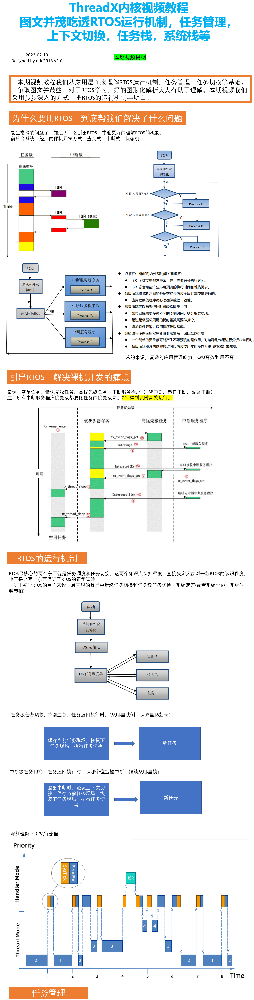
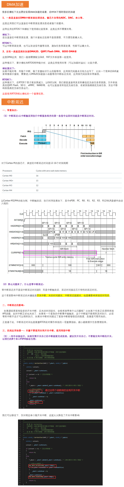
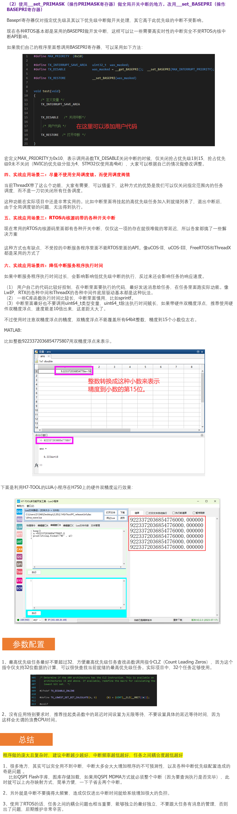
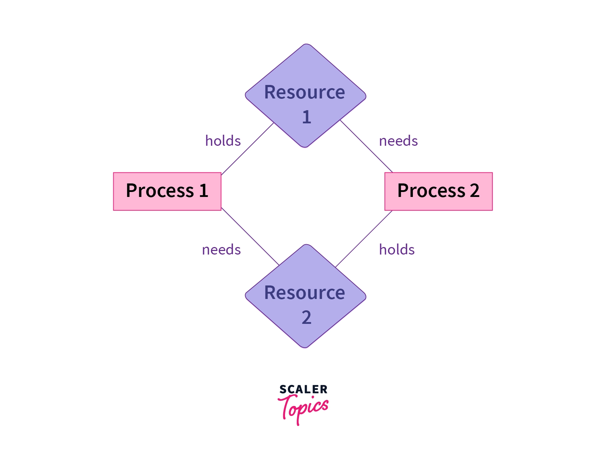
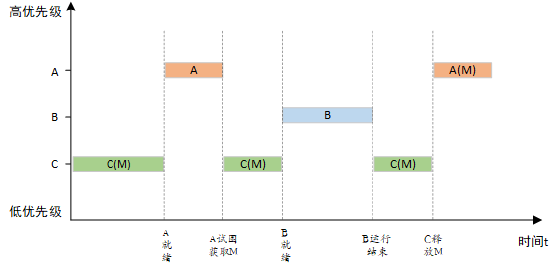
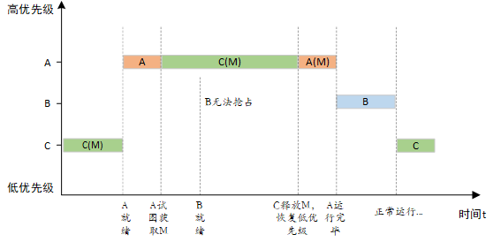

参考链接：[第6期ThreadX视频教程：图文并茂吃透RTOS运行机制，任务管理，上下文切换，任务栈，系统栈等_哔哩哔哩_bilibili](https://www.bilibili.com/video/BV1bv4y1W7vQ/?spm_id_from=333.337.search-card.all.click&vd_source=b2294685dcc4b104a99f116c1c175bce)

# 1 内核

## 1.1 RTOS和裸机的区别

裸机编程是直接在硬件上进行编程的方法，直接与硬件交互，访问寄存器和内存位置以控制系统行为，往往是是前后台系统，一个超级循环，配合查询式、中断式、状态机的任务执行方法，来进行实现。

RTOS 是在硬件上运行的软件层，提供任务调度、任务切换、资源管理和任务间通信服务，RTOS 的开发往往遵循抢占式和时间片轮转的设计思路。

RTOS 优点：

1. 提供资源管理管理的机制，使任务间通信和同步；
2. RTOS 促使开发模块化代码，以便于维护和扩展系统，提高代码重用性；
3. RTOS 提供了系统内部的可见性，配合应用程序，可以实现比裸机更简易的任务调试功能；
4. RTOS 可以最大化 DMA 的性能，在中断内通过信号量等消息，通知任务处理，避免程序死等，最大化性能。

RTOS 缺点：

1. RTOS 会给系统带来额外的开销，无论是任务切换还是资源的分配和释放以及任务间通信服务，都需要一定的 CPU 周期和内存；
2. RTOS 会带来一定的复杂度，对 RTOS 的开发和调试，需要开发人员熟悉 RTOS API，了解任务、资源和任务间通信原理，对开发人员提出了一定要求；
3. 部分商业 RTOS 是收费的。

裸机优点：

1. 没有 RTOS 需要的系统开销，拥有更高的性能，对于实时响应要求非常高、资源极其有限的系统来说，是有利的；
2. 开发人员只需要了解具体硬件即可，无需了解 RTOS API 、资源分配和释放、任务管理等知识点。

裸机缺点：

1. 缺乏抽象，对硬件的特定功能和限制了解需要深入；
2. 可伸缩性有限，在复杂应用程序中，增减代码、维护和管理代码都会变得非常复杂，不适合复杂应用开发；
3. 必须依赖断点等低级调试技术，耗时且难以使用。

### 1.1.1 RTOS

RTOS 是在硬件上运行的软件层，提供调度、资源管理和任务间通信服务。RTOS 的主要目的是支持开发需要确定性行为、低延迟和高可靠性的复杂实时应用程序。RTOS 通过为开发人员提供一个框架来实现这一点，该框架将其代码组织成独立的并发执行任务，这些任务可以相互通信并以受控和可预测的方式访问共享资源。

RTOS优点：

1. 任务管理：使用RTOS的显著优势之一是它提供了一个任务管理系统，简化了复杂应用程序的开发。RTOS处理任务的调度，确保它们以可预测和确定性的方式执行。可以创建、删除和挂起任务，并且可以在运行时更改其优先级。这种灵活性使开发人员能够设计能够处理多个并发任务并快速响应不断变化的系统条件的应用程序。
2. 资源管理：RTOS 提供了一种管理系统资源（如内存、I/O 和外设）的机制。RTOS确保以可控和可预测的方式分配和释放资源，防止资源冲突并提高系统可靠性。RTOS还提供了任务间通信和同步的机制，使任务能够共享资源并协调其活动。
3. 模块化：RTOS鼓励开发模块化代码，其中系统的不同部分封装在单独的任务中。这种模块化使维护和扩展系统变得更加容易，并提高了代码的可重用性。开发人员可以通过创建新任务向系统添加新功能，而不会中断现有任务。
4. 调试：调试基于 RTOS 的应用程序比调试裸机代码更容易。RTOS 提供对系统内部状态的可见性，包括任务调度、资源分配和任务间通信。开发人员可以使用此信息来诊断系统问题并优化系统性能。

RTOS缺点：

1. 开销：RTOS 会给系统带来开销，这会降低性能并增加内存使用量。RTOS必须管理任务调度，分配和释放系统资源，并提供任务间通信服务，所有这些都需要CPU周期和内存。在较小的RTOS上，这种开销可能很小，无关紧要。
2. 复杂性：RTOS会给系统带来复杂性，这可能会使其更难理解和调试。开发人员必须熟悉 RTOS API，并了解任务、资源和任务间通信的工作原理。这些知识可能需要一些时间才能获得，从而增加开发时间和成本。
3. 成本：使用RTOS会增加系统的成本。许多商业RTOS供应商收取许可费，这对于小型项目来说可能很昂贵。此外，与裸机编程相比，RTOS需要更多的内存和处理能力，这可能会增加系统的硬件成本。

#### 1.1.2 裸机

裸机编程是直接在硬件上进行编程的做法，无需使用操作系统或中间件。在这种方法中，开发人员编写直接与硬件交互的代码，访问寄存器和内存位置以控制系统行为。裸机编程通常用于低级任务，例如设备驱动程序开发和硬件初始化。

裸机优点：

1. 性能：裸机编程可以提供比RTOS更好的性能，因为操作系统没有开销。开发人员可以直接控制硬件，从而可以针对特定硬件功能优化代码并减少处理时间。这种方法在速度和实时响应至关重要的应用中特别有用。
2. 效率：就内存使用而言，裸机编程可能比使用RTOS更有效。没有操作系统消除了与管理系统资源相关的开销，从而减少了代码占用量和内存使用量。此方法在内存资源有限的应用程序中很有用。
3. 简单性：裸机编程比使用RTOS更简单，因为开发人员可以完全控制系统。无需学习 RTOS API 或了解任务管理和资源分配的复杂性。此方法在需要最小化代码大小和复杂性的应用程序中非常有用。

裸机缺点：

1. 缺乏抽象：裸机编程要求开发人员直接与硬件交互，这可能具有挑战性且容易出错。开发人员必须了解硬件的特定功能和限制，并编写利用这些功能的代码，同时避免潜在的陷阱。这种方法可能很耗时，并且会增加出错的风险。
2. 可伸缩性有限：裸机编程不可扩展，这使得开发复杂的应用程序变得困难。随着系统变得越来越复杂，代码也变得越来越难以管理和维护。这种方法在要求相对简单的应用中很有用，但不适用于更复杂的系统。
3. 调试：调试裸机代码可能具有挑战性，因为代码和硬件之间没有抽象层。开发人员必须依赖低级调试技术，例如硬件断点和内存转储，这可能既耗时又难以使用。

常用的裸机设计思路有查询式、事件驱动式、中断式、状态机。这些设计都存在相同的问题：

1. 时间关键处理必须放在中断中
2. 超级循环与ISR间的数据交换主要通过全局变量
3. 超级循环内超过循环周期的耗时函数需要做出拆分
4. 超级循环会使得应用程序变复杂
5. CPU利用效率往往不高
6. 难以控制每个任务的运行时间，难以消除任务与任务之间的相互影响

这些问题往往可以在 RTOS 中得到解决。

### 1.1.3 比较

1. 性能：裸机编程可以提供比RTOS更好的性能，因为操作系统没有开销。但是，RTOS仍然可以提供整体高性能，特别是在具有实时要求的复杂应用中。
2. 复杂性：使用RTOS会给系统带来复杂性，这会使系统更难理解和调试。裸机编程更简单，但它需要开发人员直接与硬件交互，这可能具有挑战性且容易出错。
3. 可扩展性：RTOS 比裸机编程更具可扩展性，因此更容易开发和维护复杂的应用程序。裸机编程适用于相对简单的系统，但在更复杂的应用程序中可能会变得笨拙。
4. 模块化：RTOS鼓励模块化，这使得维护和扩展系统变得更加容易。裸机编程要求开发人员手动管理系统的复杂性，这可能会使其更难维护和扩展。
5. 调试：调试基于 RTOS 的应用程序比调试裸机代码更容易，因为 RTOS 提供了对系统内部状态的可见性。裸机编程要求开发人员依赖低级调试技术，这可能既耗时又具有挑战性。
6. 成本：使用RTOS会增加系统的成本，特别是如果商业RTOS供应商收取许可费。裸机编程可能更具成本效益，但它可能需要更多的硬件资源和更深层次的技术技能，这可能会增加项目成本。

# 2 高效任务管理设计

# 3 死锁

## 3.1 4个必要条件

1. 互斥使用：至少一个资源必须以不可共享模式保存，这意味着它不能同时被多个进程使用。
2. 占有且等待：一个进程必须至少持有一个资源，同时等待另一个进程释放另一个资源。
3. 不可抢占：不能从进程中强行夺走资源，必须由进程自愿释放。
4. 循环等待：存在两个或多个进程的循环链，其中每个进程都在等待链中另一个进程持有的资源。

## 3.2 死锁的原因

**多个并发进程因争夺系统资源而产生相互等待的现象。**即：一组进程中的每个进程都在等待某个事件发生，而只有这组进程中的其他进程才能触发该事件，这就称这组进程发生了死锁。

**产生死锁的本质原因：**

1. 系统资源有限。
2. 进程推进顺序不合理。

上图中，有两个进程和两个资源。进程 1 保存“资源 1”并需要“资源 2”，而进程 2 保存“资源 2”并需要“资源 1”。这会造成死锁的情况，因为两个进程都无法执行。由于资源是不可共享的，因此一次只能由一个进程使用（互斥）。每个进程都持有一个资源，并等待另一个进程释放它所需的资源。这两个进程在执行之前都不会释放其资源，这会产生循环等待。因此，所有四个条件都满足。

## 3.3 处理方式

死锁的处理方式主要从**预防死锁**、**避免死锁**、**检测与解除死锁**这四个方面来进行处理，前两种方法用于确保系统永远不会进入死锁。

1. 预防死锁：这是通过限制发出请求的方式来完成的，由于当满足上述所有四个条件时才会发生死锁，因此我们尝试防止其中任何一个，从而防止死锁。

   - 资源一次性分配：（破坏占有且等待条件）  
   - 可剥夺资源：当某进程新的资源未满足时，释放已占有的资源（破坏不可抢占条件）
   -  资源有序分配法：系统给每类资源赋予一个编号，每一个进程按编号递增的顺序请求资源，释放则相反（循环等待）

2. 避免死锁：预防死锁的几种策略，会严重地损害系统性能。因此在避免死锁时，要施加较弱的限制，从而获得较满意的系统性能。由于在避免死锁的策略中，允许进程动态地申请资源。当进程请求资源时，死锁避免算法会检查资源分配状态。如果分配该资源会使系统进入不安全状态，则不会授予请求。因此，它需要其他信息，例如进程需要多少每种类型的资源。如果系统进入不安全状态，则必须后退一步以避免死锁。其中最具有代表性的避免死锁算法是**银行家算法**。

3. 检测死锁：首先为每个进程和每个资源指定一个唯一的号码；然后建立资源分配表和进程等待表。

4. 解除死锁：当发现有进程死锁后，便应立即把它从死锁状态中解脱出来，常采用的方法有：

   - 中止所有死锁的进程；
   - 撤消进程：可以直接撤消死锁进程或撤消代价最小的进程，直到系统从死锁中恢复；
   - 资源抢占：从进程中逐个获取资源，并将其分配给优先级更高的进程，直到解决死锁。

5. 无视死锁：在该方法中，系统假定死锁永远不会发生。由于死锁情况的问题并不常见，因此某些系统干脆忽略了它。UNIX和Windows等操作系统遵循这种方法。但是，如果发生死锁，我们可以重新启动系统并自动解决死锁。

  > 注：上述方法是鸵鸟算法的一个例子。这是一种忽视潜在问题的策略，因为它们极为罕见。

## 3.4 死锁与饥饿

死锁是饥饿的最终状态。

| Deadlock                                   | Starvation                                       |
| ------------------------------------------ | ------------------------------------------------ |
| 所有进程都在等待彼此完成，没有一个被执行   | 高优先级进程保持执行，低优先级进程被阻止         |
| 资源被进程阻塞                             | 资源被高优先级流程持续利用                       |
| 必要条件：互斥、持有等待、无抢占、循环等待 | 为流程分配优先级                                 |
| 也称为循环等待                             | 也称为活锁                                       |
| 可以通过避免死锁的必要条件来防止           | 可以通过调度策略的改进，确保所有进程都有机会执行 |

# 4 优先级翻转

所谓优先级翻转，即当一个高优先级线程试图通过信号量机制访问共享资源时，如果该信号量已被一低优先级线程持有，而这个低优先级线程在运行过程中可能又被其它一些中等优先级的线程抢占，因此造成高优先级线程被许多具有较低优先级的线程阻塞，实时性难以得到保证。

如下图所示：有优先级为 A、B 和 C 的三个线程，优先级 A> B > C。线程 A，B 处于挂起状态，等待某一事件触发，线程 C 正在运行，此时线程 C 开始使用某一共享资源 M。在使用过程中，线程 A 等待的事件到来，线程 A 转为就绪态，因为它比线程 C 优先级高，所以立即执行。但是当线程 A 要使用共享资源 M 时，由于其正在被线程 C 使用，因此线程 A 被挂起切换到线程 C 运行。如果此时线程 B 等待的事件到来，则线程 B 转为就绪态。由于线程 B 的优先级比线程 C 高，且线程B没有用到共享资源 M ，因此线程 B 开始运行，直到其运行完毕，线程 C 才开始运行。只有当线程 C 释放共享资源 M 后，线程 A 才得以执行。在这种情况下，优先级发生了翻转：线程 B 先于线程 A 运行。这样便不能保证高优先级线程的响应时间。

在 RT-Thread 操作系统中，**互斥量可以解决优先级翻转问题**，实现的是**优先级继承协议 (Sha, 1990)**。**优先级继承是通过在线程 A 尝试获取共享资源而被挂起的期间内，将线程 C 的优先级提升到线程 A 的优先级别，从而解决优先级翻转引起的问题。**这样能够防止 C（间接地防止 A）被 B 抢占，如下图所示。优先级继承是指，提高某个占有某种资源的低优先级线程的优先级，使之与所有等待该资源的线程中优先级最高的那个线程的优先级相等，然后执行，而当这个低优先级线程释放该资源时，优先级重新回到初始设定。因此，继承优先级的线程避免了系统资源被任何中间优先级的线程抢占。

> 注：在获得互斥量后，请尽快释放互斥量，并且在持有互斥量的过程中，不得再行更改持有互斥量线程的优先级，否则可能人为引入无界优先级反转的问题。
>
> 使用互斥量来保证优先级翻转的问题。

有三种不同的方法可防止 ThreadX 中出现不确定的优先级反转。首先，**在设计应用程序优先级选择和运行时行为时，可以采用能够防止出现优先级反转问题的方式。** 其次，优先级较低的线程可以利用抢占阈值来阻止中等优先级线程在其与优先级较高的线程共享资源时执行抢占。 最后，**使用 ThreadX 互斥对象保护系统资源的线程**可以利用可选的互斥优先级继承来消除不确定的优先级反转。

