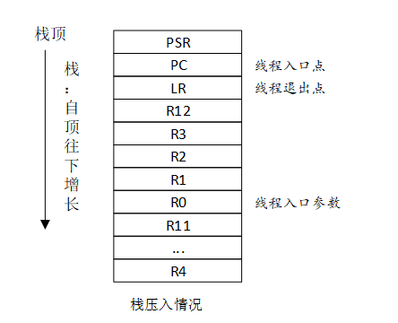
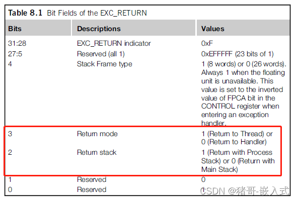
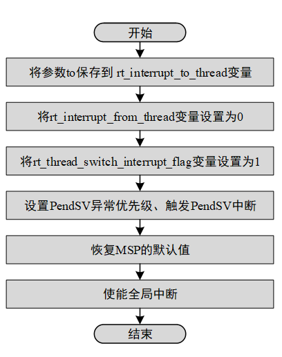
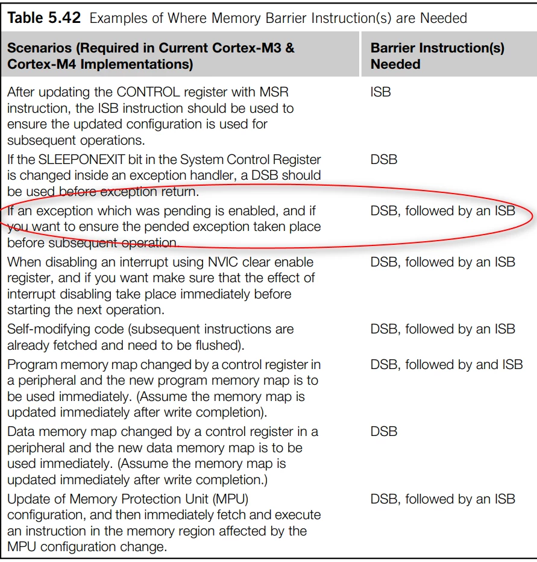
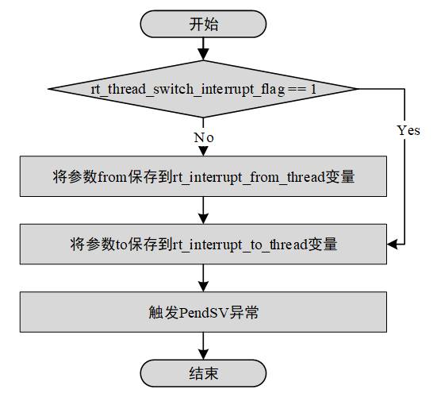
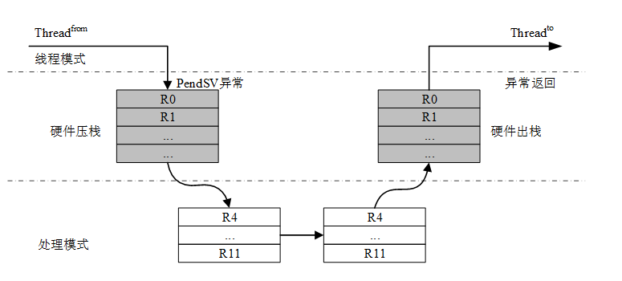
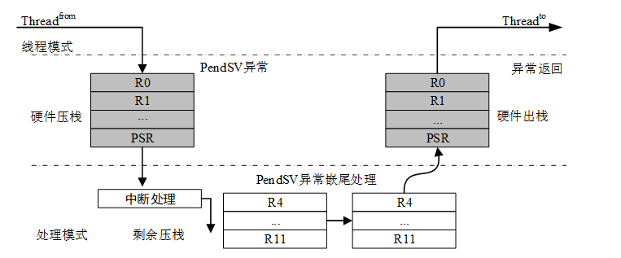

# RTOS 调度器

这篇文章的主要目的，希望从汇编、线程间通信机制、时间片轮等角度，讲解 RTOS 的调度器原理。

基于 RT-Thread 进行讲述。

# 1 前置知识

## 1.1 PendSV

PendSV 是非精确异常，尽管你挂起了一个 PendSV 异常并开启了中断，但是实际执行异常之前，可能还有几个指令会被继续执行。

# 2 线程切换的方式

主要参考这部分内容：[Cortex-M 移植 (rt-thread.org)](https://www.rt-thread.org/document/site/#/rt-thread-version/rt-thread-standard/application-note/porting/cortex-m/port-cortex-m?id=cortex-m-移植)

RT-Thread 中有三个线程切换函数，分别是：

1. `rt_hw_context_switch_to()`：没有来源线程，切换到目标线程，在调度器启动第一个线程的时候被调用。
2. `rt_hw_context_switch()`：在线程环境下，从当前线程切换到目标线程。
3. `rt_hw_context_switch_interrupt ()`：在中断环境下，从当前线程切换到目标线程。

统一使用 PendSV 异常来实现。

## 2.0 线程栈初始化

在动态创建线程和初始化线程的时候，会使用到内部的线程初始化函数`_rt_thread_init()`，`_rt_thread_init()` 函数会调用栈初始化函数 `rt_hw_stack_init()`，在栈初始化函数里会手动构造一个上下文内容，这个上下文内容将被作为每个线程第一次执行的初始值。上下文在栈里的排布如下图所示：



```c
rt_uint8_t *rt_hw_stack_init(void       *tentry,
                             void       *parameter,
                             rt_uint8_t *stack_addr,
                             void       *texit)
{
    struct stack_frame *stack_frame;
    rt_uint8_t         *stk;
    unsigned long       i;

    stk  = stack_addr + sizeof(rt_uint32_t);
    stk  = (rt_uint8_t *)RT_ALIGN_DOWN((rt_uint32_t)stk, 8);
    stk -= sizeof(struct stack_frame);

    stack_frame = (struct stack_frame *)stk;

    /* init all register */
    for (i = 0; i < sizeof(struct stack_frame) / sizeof(rt_uint32_t); i ++)
    {
        ((rt_uint32_t *)stack_frame)[i] = 0xdeadbeef;
    }

    /* 根据 ARM  APCS 调用标准，将第一个参数保存在 r0 寄存器 */
    stack_frame->exception_stack_frame.r0  = (unsigned long)parameter; /* r0 : argument */
    /* 其他参数寄存器初始化为 0 */
    stack_frame->exception_stack_frame.r1  = 0;                        /* r1 */
    stack_frame->exception_stack_frame.r2  = 0;                        /* r2 */
    stack_frame->exception_stack_frame.r3  = 0;                        /* r3 */
    /* 将 IP(Intra-Procedure-call scratch register.) 设置为 0 */
    stack_frame->exception_stack_frame.r12 = 0;                        /* r12 */
    /* 将线程退出函数的地址保存在 lr 寄存器 */
    stack_frame->exception_stack_frame.lr  = (unsigned long)texit;     /* lr */
    /* 将线程入口函数的地址保存在 pc 寄存器 */
    stack_frame->exception_stack_frame.pc  = (unsigned long)tentry;    /* entry point, pc */
    /* 设置 psr 的值为 0x01000000L，表示默认切换过去是 Thumb 模式 */
    stack_frame->exception_stack_frame.psr = 0x01000000L;              /* PSR */

    /* return task's current stack address */
    return stk;
}
```

## 2.1 `PendSV_Handler`

产生 PendSV 异常时，Cortex-M 系列处理器硬件会自动将 from 线程的 PSR、PC、LR、R12、R3-R0 压栈，因此在 PendSV_Handler 中，我们需要把 from 线程的 R11-R4 压栈，并把 to 线程的 R11-R4 弹出。修改 PSP 为 to 线程的栈地址，在退出 PendSV 中断时，硬件会自动弹出 to 线程的 R3-R0、R12、LR、PC、PSR 寄存器。

```assembly
/* R0 --> switch from thread stack
 * R1 --> switch to thread stack
 * psr, pc, LR, R12, R3, R2, R1, R0 are pushed into [from] stack
 */
    .global PendSV_Handler
    .type PendSV_Handler, %function
PendSV_Handler:
    /* disable interrupt to protect context switch */
    MRS     R2, PRIMASK
    CPSID   I

    /* get rt_thread_switch_interrupt_flag */
    LDR     R0, =rt_thread_switch_interrupt_flag
    LDR     R1, [R0]
    CBZ     R1, pendsv_exit         /* pendsv aLReady handled */    ; 判断是否已经在 rt_hw_context_switchx 中置位

    /* clear rt_thread_switch_interrupt_flag to 0 */
    MOV     R1, #0
    STR     R1, [R0]

    LDR     R0, =rt_interrupt_from_thread
    LDR     R1, [R0]
    CBZ     R1, switch_to_thread    /* skip register save at the first time */
                                    ; 判断 from 线程是否为空 (判断是否是 rt_hw_context_switch_to)
    MRS     R1, PSP                 /* get from thread stack pointer */    ; 将 from 线程的堆栈地址读入 R1
    STMFD   R1!, {R4 - R11}         /* push R4 - R11 register */    ; 将 from 线程的数据寄存器 R4-R11 压栈
    LDR     R0, [R0]                ; 将最新的栈指针存回 rt_interrupt_from_thread
    STR     R1, [R0]                /* update from thread stack pointer */

switch_to_thread:
    LDR     R1, =rt_interrupt_to_thread
    LDR     R1, [R1]
    LDR     R1, [R1]                /* load thread stack pointer */

    LDMFD   R1!, {R4 - R11}         /* pop R4 - R11 register */    ; 将 to 线程的数据寄存器 R4-R11 弹出
    MSR     PSP, R1                 /* update stack pointer */

pendsv_exit:
    /* restore interrupt */
    MSR     PRIMASK, R2

    ORR     LR, LR, #0x04
    BX      LR
```

### 2.1.1 `pendsv_exit`

`pendsv_exit` 中主要做的一件事是，将 LR 寄存器的 `bit[2]` 置位，这个操作的目的是为了实现从 MSP 指针到 PSP 指针的切换，CONTROL 寄存器的 `SPSEL` 位也会做相应的更改。



## 2.2 `rt_hw_context_switch_to`

源码如下，其中 `to` 为 下文线程的堆栈指针，该参数会赋给 `R0`。

> 赋给 `R0` 的原因：C语言函数形参少于4个时，优先将形参赋给 `R0~R3` 寄存器，超过4个时，从右往左压入栈中。



```assembly
/*
 * void rt_hw_context_switch_to(rt_uint32 to);
 * R0 --> to
 */
    .global rt_hw_context_switch_to
    .type rt_hw_context_switch_to, %function
rt_hw_context_switch_to:
    LDR     R1, =rt_interrupt_to_thread        ; 将传入的目标线程栈存入 rt_interrupt_to_thread
    STR     R0, [R1]

    /* set from thread to 0 */
    LDR     R1, =rt_interrupt_from_thread
    MOV     R0, #0
    STR     R0, [R1]

    /* set interrupt flag to 1 */
    LDR     R1, =rt_thread_switch_interrupt_flag    ; 设置 rt_thread_switch_interrupt_flag, PendSV 中会判断该标志来确定是否进行上下文切换
    MOV     R0, #1
    STR     R0, [R1]

    /* set the PendSV and SysTick exception priority */
    LDR     R0, =SHPR3    ;System handler priority register 3 (SCB_SHPR3)，其中 Bits[23:16] 为 Priority of system handler 14, PendSV
    LDR     R1, =PENDSV_PRI_LOWEST ;PENDSV_PRI_LOWEST 即 0xFFFF0000，作为其 mask
    LDR.W   R2, [R0,#0]             /* read */
    ORR     R1, R1, R2              /* modify */
    STR     R1, [R0]                /* write-back */

    LDR     R0, =ICSR               /* trigger the PendSV exception (causes context switch) */
    LDR     R1, =PENDSVSET_BIT        ;0x10000000，ICSR 的第 28 位为 PendSV set-pending bit.
    STR     R1, [R0]                ;Writing 1 to this bit is the only way to set the PendSV exception state to pending.

    /* restore MSP */
    LDR     r0, =SCB_VTOR    ; 设置 SCB_VTOR 的地址
    LDR     r0, [r0]        ; 读取中断向量表的位置
    LDR     r0, [r0]        ; 读取 SP 初始值
    NOP
    MSR     msp, r0            ; 将 SP 初始值赋给 MSP

    /* enable interrupts at processor level */
    CPSIE   F
    CPSIE   I
    
    /* ensure PendSV exception taken place before subsequent operation */
    DSB
    ISB

    /* never reach here! */
```

### 2.2.1 `DSB`/`ISB`

```assembly
    /* ensure PendSV exception taken place before subsequent operation */
    DSB
    ISB
```

参考链接：[RT-Thread-关于STM32 PendSV非精确异常触发第一个任务的问题RT-Thread问答社区 - RT-Thread](https://club.rt-thread.org/ask/article/75d632b1a6dd513b.html)

在上述参考链接以后的 RTT 版本才引入这段代码，PendSV 是非精确异常，尽管你挂起了一个 PendSV 异常并开启了中断，但是实际执行异常之前，可能还有几个指令会被继续执行。因此此处加上这段代码可以保证 PendSV 异常在下一个操作发生前产生。



## 2.3 `rt_hw_context_switch` / `rt_hw_context_switch_interrupt`



```assembly
/*
 * void rt_hw_context_switch(rt_uint32 from, rt_uint32 to);
 * R0 --> from
 * R1 --> to
 */
    .global rt_hw_context_switch_interrupt
    .type rt_hw_context_switch_interrupt, %function
    .global rt_hw_context_switch
    .type rt_hw_context_switch, %function
rt_hw_context_switch_interrupt:
rt_hw_context_switch:
    /* set rt_thread_switch_interrupt_flag to 1 */
    LDR     R2, =rt_thread_switch_interrupt_flag
    LDR     R3, [R2]
    CMP     R3, #1        ; 判断 rt_thread_switch_interrupt_flag 是否已经被置位
    BEQ     _reswitch    ; 如果已经被置位，则跳转到_reswitch
    MOV     R3, #1
    STR     R3, [R2]    ;rt_thread_switch_interrupt_flag = 1

    LDR     R2, =rt_interrupt_from_thread   /* set rt_interrupt_from_thread */
    STR     R0, [R2]    ; 将传入的 from 线程存入 rt_interrupt_from_thread 变量

_reswitch:
    LDR     R2, =rt_interrupt_to_thread     /* set rt_interrupt_to_thread */
    STR     R1, [R2]

    LDR     R0, =ICSR           /* trigger the PendSV exception (causes context switch) */
    LDR     R1, =PENDSVSET_BIT
    STR     R1, [R0]
    BX      LR
```

线程间的上下文切换可以表示为：



硬件在进入 PendSV 中断之前自动保存了 from 线程的 PSR、PC、LR、R12、R3-R0 寄存器，然后 PendSV 里保存 from 线程的 R11~R4 寄存器，以及恢复 to 线程的 R4~R11 寄存器，最后硬件在退出 PendSV 中断之后，自动恢复 to 线程的 R0~R3、R12、LR、PC、PSR 寄存器。

中断到线程的上下文切换可以表示为：



硬件在进入中断之前自动保存了 from 线程的 PSR、PC、LR、R12、R3-R0 寄存器，然后触发了 PendSV 异常。在 PendSV 异常处理函数里保存 from 线程的 R11~R4 寄存器，以及恢复 to 线程的 R4~R11 寄存器，最后硬件在退出 PendSV 中断之后，自动恢复 to 线程的 R0~R3、R12、PSR、PC、LR 寄存器。

# 3  线程切换的条件

## 3.1 资源的释放（以信号量为例）

```c
/**
 * @brief    This function will release a semaphore. If there is thread suspended on the semaphore, it will get resumed.
 *
 * @note     If there are threads suspended on this semaphore, the first thread in the list of this semaphore object
 *           will be resumed, and a thread scheduling (rt_schedule) will be executed.
 *           If no threads are suspended on this semaphore, the count value sem->value of this semaphore will increase by 1.
 *
 * @param    sem is a pointer to a semaphore object.
 *
 * @return   Return the operation status. When the return value is RT_EOK, the operation is successful.
 *           If the return value is any other values, it means that the semaphore release failed.
 */
rt_err_t rt_sem_release(rt_sem_t sem)
{
    rt_base_t level;
    rt_bool_t need_schedule;

    /* parameter check */
    RT_ASSERT(sem != RT_NULL);
    RT_ASSERT(rt_object_get_type(&sem->parent.parent) == RT_Object_Class_Semaphore);

    RT_OBJECT_HOOK_CALL(rt_object_put_hook, (&(sem->parent.parent)));

    need_schedule = RT_FALSE;

    /* disable interrupt */
    level = rt_hw_interrupt_disable();

    LOG_D("thread %s releases sem:%s, which value is: %d",
          rt_thread_self()->parent.name,
          sem->parent.parent.name,
          sem->value);

    if (!rt_list_isempty(&sem->parent.suspend_thread))
    {
        /* resume the suspended thread */
        _ipc_list_resume(&(sem->parent.suspend_thread));
        need_schedule = RT_TRUE;
    }
    else
    {
        if(sem->value < RT_SEM_VALUE_MAX)
        {
            sem->value ++; /* increase value */
        }
        else
        {
            rt_hw_interrupt_enable(level); /* enable interrupt */
            return -RT_EFULL; /* value overflowed */
        }
    }

    /* enable interrupt */
    rt_hw_interrupt_enable(level);

    /* resume a thread, re-schedule */
    if (need_schedule == RT_TRUE)
        rt_schedule();

    return RT_EOK;
}
RTM_EXPORT(rt_sem_release);
```

在进行信号量释放的过程中，检测到有挂载在信号量上的线程，则会恢复相应线程（`_ipc_list_resume`），并尝试进行线程的切换（`rt_schedule`，切换到最高优先级的就绪线程）。

> 互斥量会使用优先级翻转，将持有互斥量的较低优先级的线程的优先级提高到与等待互斥量释放的较高优先级的线程一致。

## 3.2 时间片轮

`SysTick_Handler` 中进行 OS 的计时操作，以及线程的时间片的统计。

```c
/**
 * This is the timer interrupt service routine.
 *
 */
void SysTick_Handler(void)
{
    /* enter interrupt */
    rt_interrupt_enter();

    if(SysTick->CTRL & SysTick_CTRL_COUNTFLAG_Msk)
        HAL_IncTick();

    rt_tick_increase();

    /* leave interrupt */
    rt_interrupt_leave();
}
```


```c
/**
 * @brief    This function will notify kernel there is one tick passed.
 *           Normally, this function is invoked by clock ISR.
 */
void rt_tick_increase(void)
{
    struct rt_thread *thread;
    rt_base_t level;

    RT_OBJECT_HOOK_CALL(rt_tick_hook, ());

    level = rt_hw_interrupt_disable();

    /* increase the global tick */
#ifdef RT_USING_SMP
    rt_cpu_self()->tick ++;
#else
    ++ rt_tick;
#endif /* RT_USING_SMP */

    /* check time slice */
    thread = rt_thread_self();

    -- thread->remaining_tick;
    if (thread->remaining_tick == 0)
    {
        /* change to initialized tick */
        thread->remaining_tick = thread->init_tick;
        thread->stat |= RT_THREAD_STAT_YIELD;

        rt_hw_interrupt_enable(level);
        rt_schedule();
    }
    else
    {
        rt_hw_interrupt_enable(level);
    }

    /* check timer */
    rt_timer_check();
}
```

当当前线程的时间片耗尽时，切换线程状态为 `RT_THREAD_STAT_YIELD` ，并调用`rt_schedule`，切换到最高优先级的就绪线程。
