# 0 环境要求

STM32 CubeIDE  + O0 优化 + 关闭链接时优化功能。

# 1 栈相关术语

1. `The stack pointer`：栈指针，用于寻址最后一个被压入栈的值；
2. `The stack base`：栈顶，栈从该地址向下生长，栈实际使用的最高位置是栈顶下方的第一个字，及 SP - 4；
3. `The stack limit`：栈底，栈允许当前进程使用的最低地址（满减栈模型）；
4. `The used stack`：栈指针与栈顶之间的内存区域，**包括栈指针所指向的地址，但不包括栈顶**；
5. `The unused stack`：栈指针与栈底之间的内存区域，**不包括栈指针所指向的地址，但包括栈底**；
6. `Stack Frame`：栈帧，例程在栈上分配的内存区域，用于**保存局部变量和寄存器**。

# 2 栈内存布局

在 Cortex-M 内核中，栈空间操作遵循满减栈（Full Descending）模型，栈指针指向上次填充的栈空间位置，如果要将新数据推送到栈中，则相应的栈指针递减，将数据存储到栈指针指向的新内存为止。因此，每个栈指针的初始值将设置为每个栈空间的顶部。

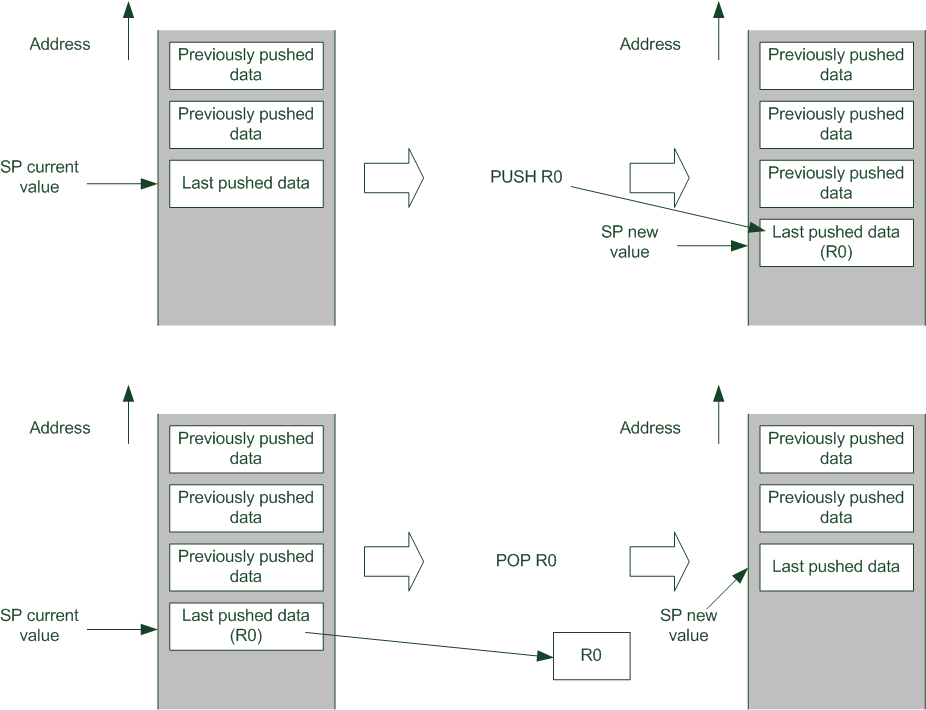


根据不同的启动文件与链接脚本以及编译器设计，堆栈的内存布局如下。

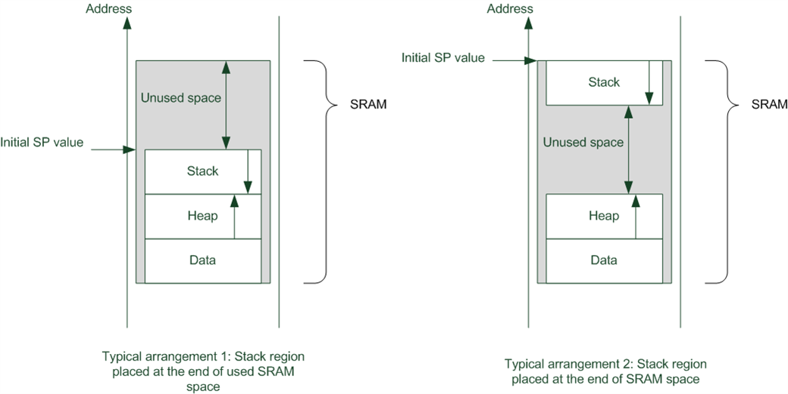

# 3 函数调用过程中的栈变化

## 3.0 栈帧初始化

关于栈帧：[6.9. Stack Frames — Runestone Interactive Overview (chemeketa.edu)](http://computerscience.chemeketa.edu/armTutorial/Functions/StackFrame.html)，该节可视为该内容的翻译与自我理解。

当我们在编译程序时，需要将**局部变量所需的内存空间**作为栈的一部分进行管理，为此，每个函数都需要保存一定的内存块，用以备份必要的寄存器和局部变量，这个内存块就被称为**栈帧**。

为了跟踪数据在堆栈中的位置，我们需要有一个固定的参考点，这个参考点用 SP 指针是很难实现的，因为 SP 指针是变化的，因此，在 ARM 中通常会使用 R11（Frame Pointer）指针来保存函数栈的开始地址。

> 但实际上，我们会发现 Cortex-M 内核的 MCU 似乎使用的是 R7 来实现相应的功能，**欢迎补充原因。**

以 `main` 函数为例，当调用一个函数时：

1. 我们需要压入 LR（函数返回地址） 和 R7（调用者栈指针 FP），以便在函数结束时，可以恢复，**SP - 8**；

2. 将 SP（此时指向栈顶） 减  16（需要八字节对齐以提升存取效率，如浮点数运算和 64 位数据计算），并存入 R7，**SP - 16**；

   > 此处明明定义的是 3个 int 类型的变量，为何需要减 16？
   >
   > 首先，我们需要明确一点，**栈任何时候都得4字节对齐，在公共接口处得8字节对齐。**（Refer to **ATPCS**）
   >
   > 因此，在汇编代码或链接脚本中，需要保证 8 字节对齐，在 MDK 中使用 **PRESERVE8** 来保证：
   >
   > 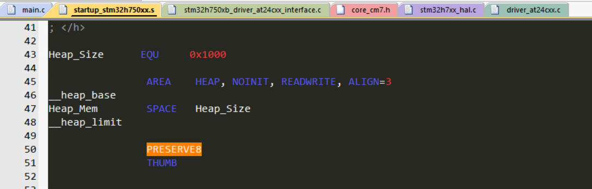
   >
   > 在 GCC 中，通过将 位置计数器 对齐到 8 字节对齐的地址上来实现：
   >
   > 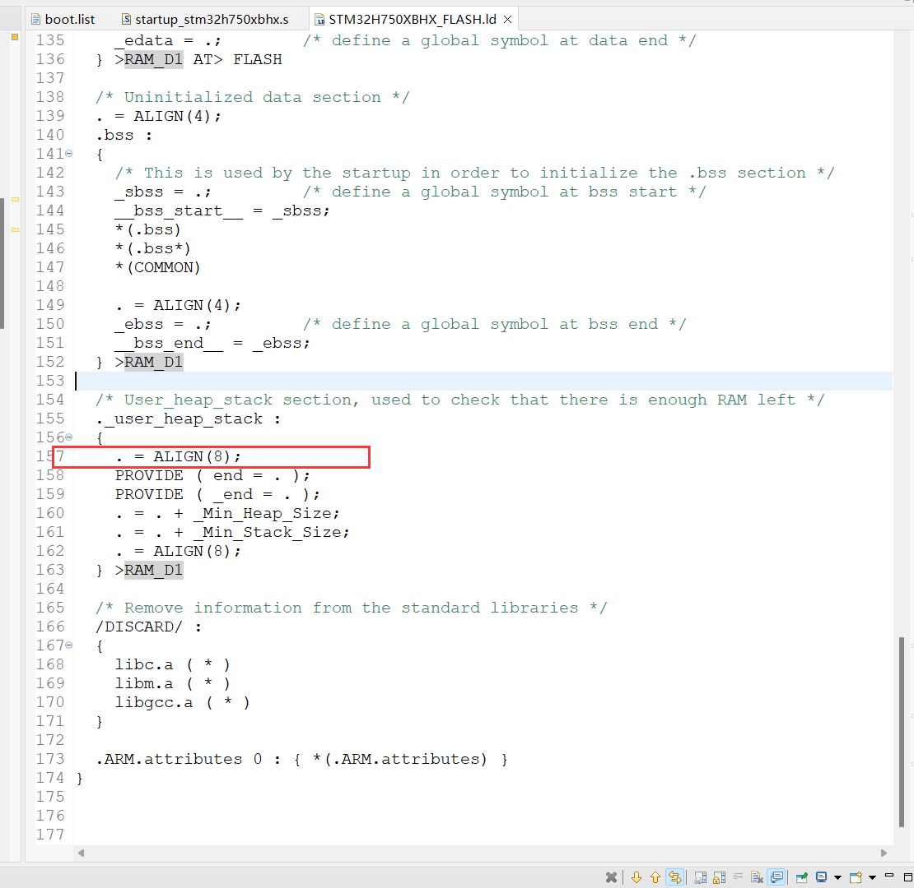
   >
   > 八字节对齐：[ARM Developer Suite Developer Guide](https://developer.arm.com/documentation/dui0056/d/using-the-procedure-call-standard/the-stack/eight-byte-alignment)
   >
   > [现在网上各种uCOS的移植工程，没有把握住栈空间8字节对齐的精髓 - uCOS & uCGUI & emWin & embOS & TouchGFX & ThreadX - 硬汉嵌入式论坛 - Powered by Discuz! (armbbs.cn)](https://www.armbbs.cn/forum.php?mod=viewthread&tid=99001&highlight=8%D7%D6%BD%DA)
   >
   > 在后续的内容中，我们会看到编译器在尽可能的保证 SP 按 8 字节对齐。
   >
   > 不过这是编译器的行为，很难保证在所有环境下都一致，仅做分析使用。

3. 按定义顺序，**先定义的局部变量，先定义的先入栈。**

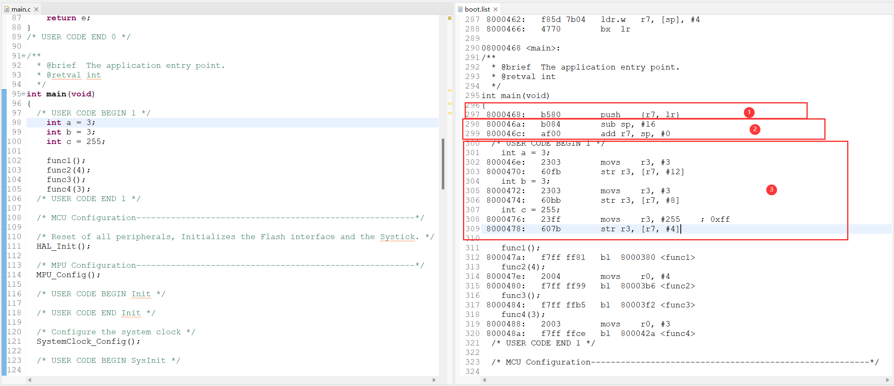

> 注：不同的编译器实现的结果未必相同，此处特指 Cortex-M。

根据局部变量、入参函数的数量，在进入函数之后，要做的第一件事是栈帧初始化，而 R7 和 SP 之间，就可以被称之为 **栈帧**。

## 3.1 无参数、无返回值的函数调用

上一节中，我们介绍了 `main` 函数的栈帧初始化，随后便是 `func1` 函数的调用，主要分为 5 步：

1. R7（FP） 入栈，**SP - 4**，由于 `func1` 函数不存在嵌套函数，LR 寄存器的值不会变，不需要入栈和出栈操作；

2. SP 移动，划分出栈帧空间，**SP - 28**，保证 8 字节对齐；

   > 我们在此处会有一定的疑惑，5 个 int 型变量 + 1 个通用寄存器 = 24 个字节，不是已经 8 字节对齐了么？为什么要去浪费这两个字节的存储空间呢？
   >
   > 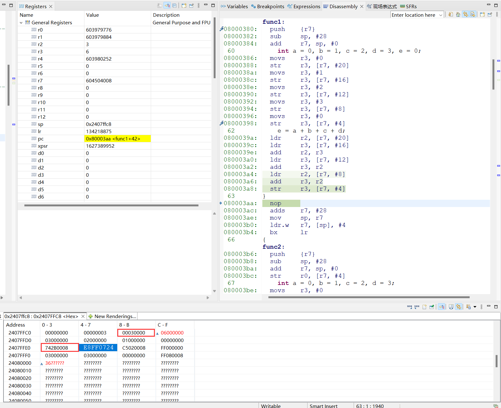
   >
   > 此处只能理解为编译器行为，当我们给  `func1` 函数增加一级嵌套时，需要多压入一个通用寄存器 LR，而我们申请的栈帧大小还是 32 个字节。
   >
   > 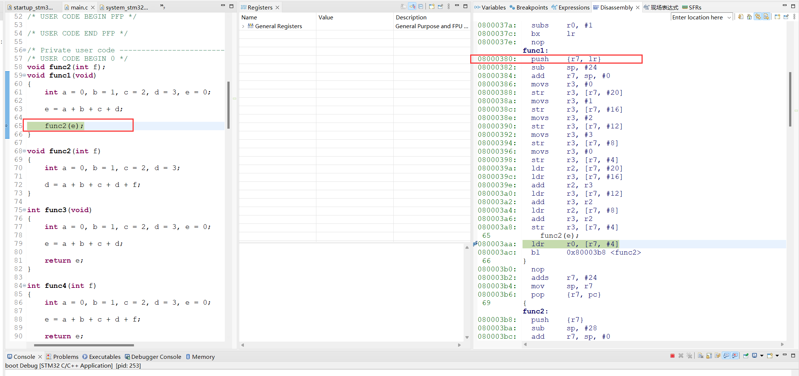

3. 初始化栈帧中的局部变量；

4. 计算；

5. 恢复栈帧，返回。

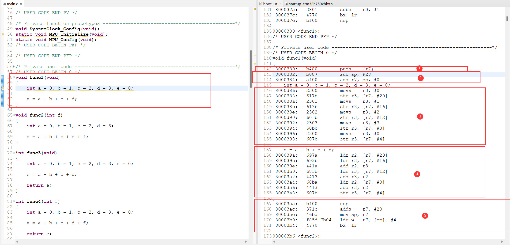

## 3.2 有四个以内参数，无返回值的函数调用

**ATPCS** 也有对不同数量形参传递的描述，当形参（32位以内，具体可以再看 ATPCS ）少于 4 个时，通过 通用寄存器 R0 ~ R3 来进行形参的传递。

顺序如下：

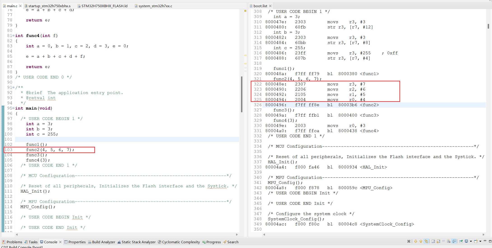

函数调用后的主要步骤也可以分为五步：

1. R7（FP） 入栈，**SP - 4**，由于 `func2` 函数不存在嵌套函数，LR 寄存器的值不会变，不需要入栈和出栈操作；
2. SP 移动，划分出栈帧空间，**SP - 36**，保证 8 字节对齐；
3. 存入形参，初始化栈帧中的局部变量；
4. 计算；
5. 恢复栈帧，返回。


## 3.3 有四个以内参数，有返回值的函数调用

**ATPCS** 也有对不同数量形参传递的描述，当形参（32位以内，具体可以再看 ATPCS ）少于 4 个时，通过 通用寄存器 R0 ~ R3 来进行形参的传递。

顺序如下：

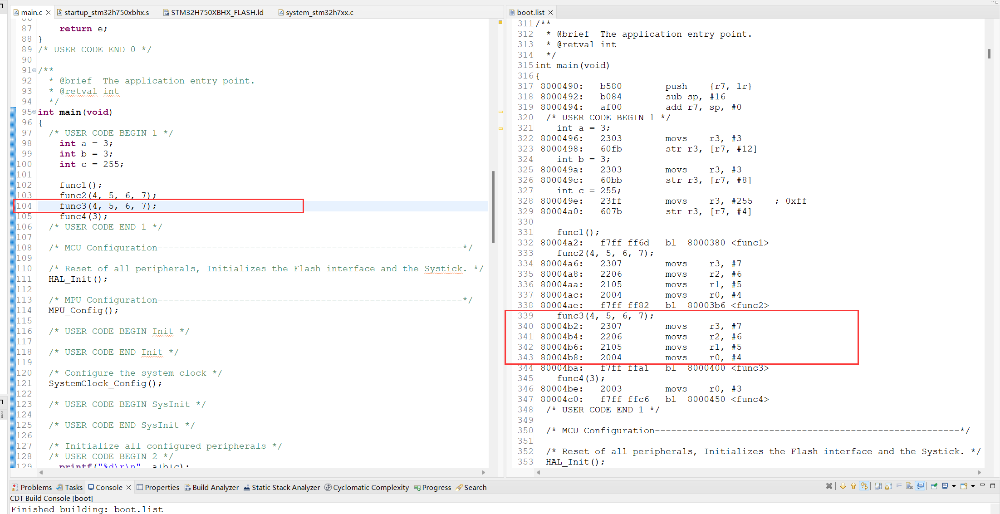

函数调用后的主要步骤也可以分为五步：

1. R7（FP） 入栈，**SP - 4**，由于 `func3` 函数不存在嵌套函数，LR 寄存器的值不会变，不需要入栈和出栈操作；
2. SP 移动，划分出栈帧空间，**SP - 44**，保证 8 字节对齐；
3. 存入形参，初始化栈帧中的局部变量；
4. 计算；
5. 恢复栈帧，**将结果保存在 R0 寄存器中**，并返回。

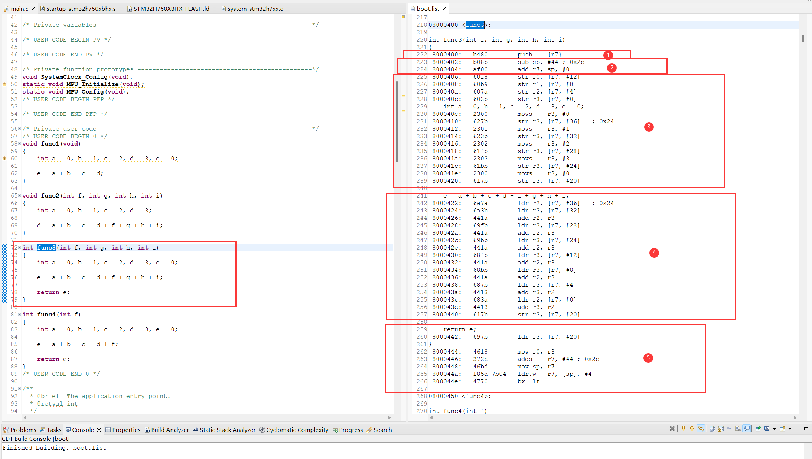

## 3.4 有四个以上参数，有返回值

**ATPCS** 也有对不同数量形参传递的描述，当形参（32位以内，具体可以再看 ATPCS ）多于 4 个时，**需要使用 栈 来实现形参的传递**，如下图，最后的两个参数**从右往左**入栈。

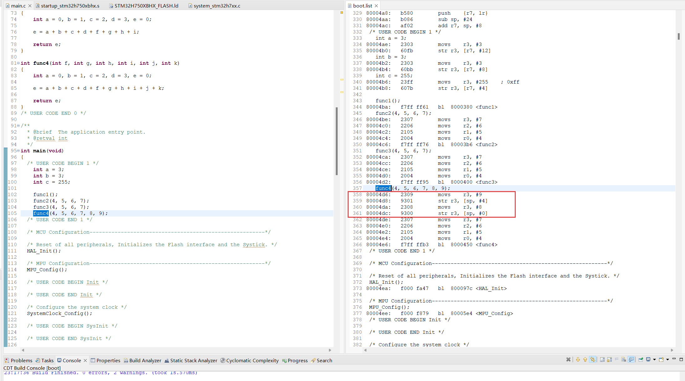

函数调用后的主要步骤可以分为六步：

1. R7（FP） 入栈，**SP - 4**，由于 `func4` 函数不存在嵌套函数，LR 寄存器的值不会变，不需要入栈和出栈操作；

2. SP 移动，划分出栈帧空间，**SP - 44**，保证 8 字节对齐；

3. 存入形参，我们可以发现，**已经入栈的变量无需重复入栈**，这里编译器也将其调整为了从右往左的入栈顺序；

   > 反正形参都是要入栈的，为什么不一开始就全部用入栈的方式解决？
   >
   > 首先，这是 **ATPCS** 规定的，其次，寄存器传递参数比入栈传递参数快了很多，当禁止优化时，寄存器传递的参数可以更快地被调用和处理，此外，可能也存在兼容性考虑。以下是来自 StackOverflow 的一个回答：
   >
   > [c - Why not store all formal parameters into stack but storing less than 4 parameters into R0~R3? - Stack Overflow](https://stackoverflow.com/questions/77181510/why-not-store-all-formal-parameters-into-stack-but-storing-less-than-4-parameter?noredirect=1#comment136067632_77181510)
   >
   > 这个回答可能解释地更好：[calling conventions - Are modern compilers passing parameters in registers instead of on the stack? - Programming Language Design and Implementation Stack Exchange](https://langdev.stackexchange.com/questions/2584/are-modern-compilers-passing-parameters-in-registers-instead-of-on-the-stack)
   >
   > Traditionally, compilers worked by passing all parameters on the stack. When optimizations are disabled, compilers for platforms like the ARM whose documented calling convention is specified as passing arguments in registers may on function entry store registers on a stack frame so they can process the remainder of the function as though the arguments had been passed on the stack.
   >
   > Note that if a compiler was generating code that would never be linked with code generated by other tools, it could simply pass all arguments on the stack. Doing so, however, would make generated code incompatible with code generated by other compilers. Accepting things in registers but storing them onto the stack immediately allows a compiler to be compatible with code produced by other compilers, while still using the code-generation logic associated with the "traditional" argument passing mechanisms.
   >
   > 一般来说，编译器通过在栈上传递参数来工作。而禁用优化后，像在 ARM 这种指定通过在寄存器中传递参数的平台上，编译器可能会在函数入口处将寄存器保存到栈帧上，以便其可以处理函数的剩余部分，就像参数是在栈上传递的一样。
   >
   > 注：如果编译器生成的代码永远不会与其他编译器生成的代码链接，则它可以简单地在栈上传递所有参数。但这么做，会使生成的代码可能与其他编译器可能不兼容。接受寄存器中的参数，将其存储在栈上，可以保证与其他编译器生成的代码的兼容性，同时可以使用与传统参数传递机制相关的代码生成逻辑。
   >
   > 总之以上内容都是根据相应平台的调用规定来约束的，参考[Calling convention - Wikipedia](https://en.wikipedia.org/wiki/Calling_convention)
   >
   > 最后，我想这方面也可能有**递归调用**的适配原因，函数递归调用决定了必须使用这种形参入栈的操作。
   >
   > 另外，EABI 里应该也指定了相关的内容，毕竟程序需要使用相关的嵌入式应用程序二进制接口（EABI）编译器来生成对应的代码。

4. 初始化栈帧中的局部变量；

5. 计算；

6. 恢复栈帧，**将结果保存在 R0 寄存器中**，并返回。

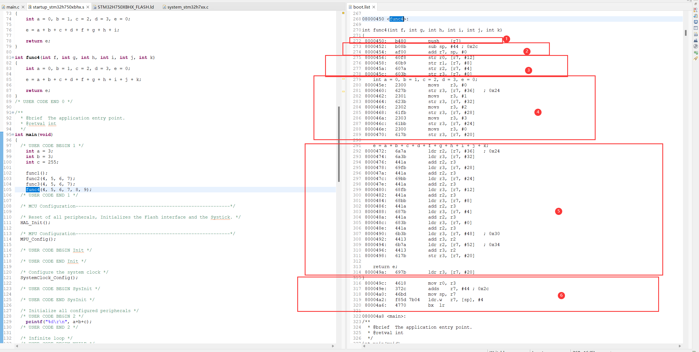

## 3.5 有嵌套的函数

函数调用上并没有区别。

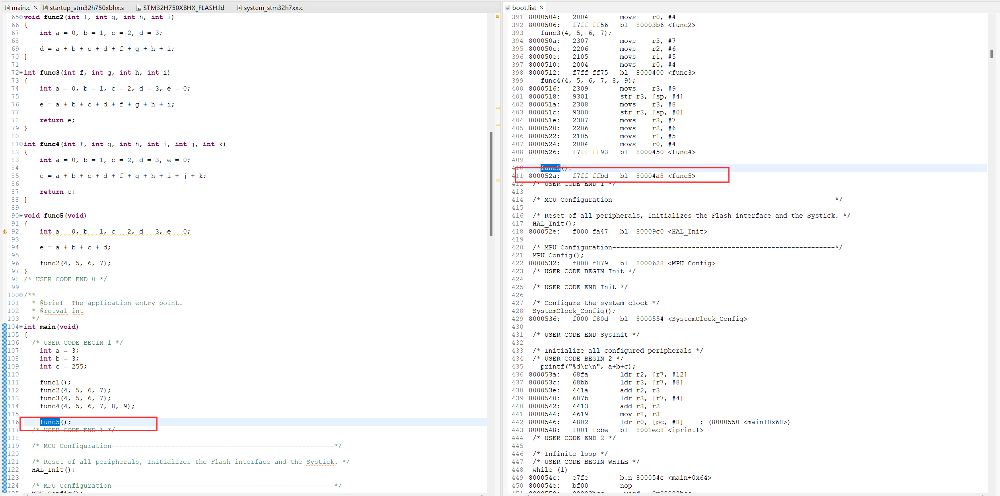

函数调用后的主要步骤与前文也没有太大的区别，主要区别在于，需要压入 LR 寄存器。

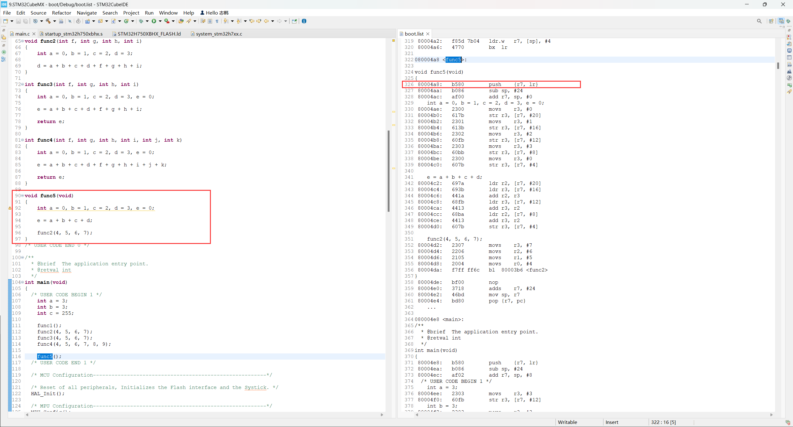

## 3.6 可变参数列表

前 4 个参数 使用 R0~R3 传递参数，后两个参数入栈，且由右向左入栈。

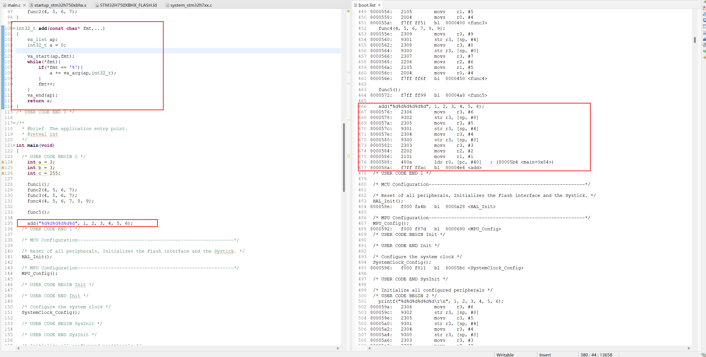

然后，在 `add` 函数中，最主要的区别是**将 R0~R3 压入栈，而非先初始化栈帧**，此处需要注意的是，在这种 PUSH 写法下，会按照寄存器序号大小**由大到小**入栈。

因此，结合上面的内容，我们可以发现一件事，参数是**从右往左**入栈的！

> 此处的从右往左入栈是有必要的，而上面几节中的从右往左入栈是可选的，是编译器行为。

在函数内部，主要的不同在于：

1. 在原本的栈帧初始化前，先压入形参；
2. 取出最左处（最后入栈）的形参，实现可变参数列表。

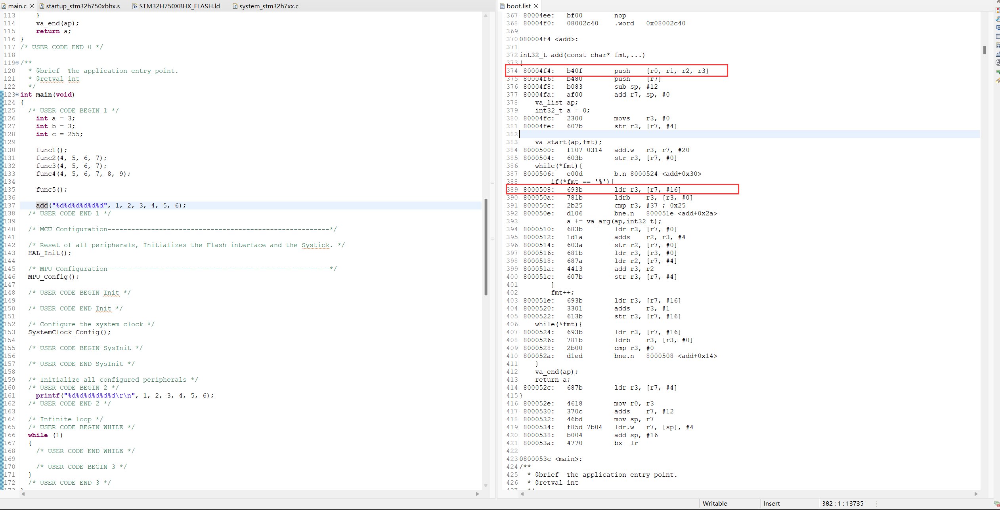

# 4  中断过程中的栈变化

Cortex-M 内核的 MCU 在进入中断之前自动保存了 PSR、PC、LR、R12、R3-R0 寄存器，自动恢复 R0~R3、R12、LR、PC、PSR 寄存器。

如下图，我们的栈指针指向的地址为 0x2407FFDB。

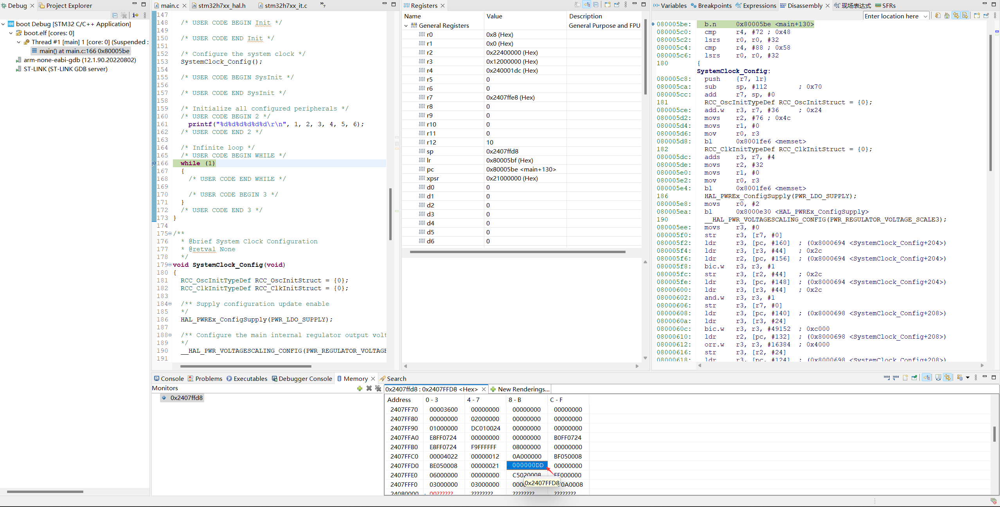

我们手动将从 0x2407FFDB 开始的 8 个 32 位字的地址中的内容清零，需要注意的是，我们这里的要使用的是 `The unused stack` ，也即不包含 SP 所指向的地址，也即红框内的内容。


然后，我们在 `void SysTick_Handler(void)` 处添加中断，STM32 HAL 库默认会配置一个时基，每 1 s 产生一次中断。

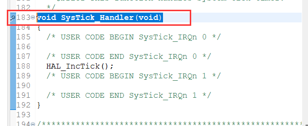

全速运行，程序停在断点处，我们可以发现 PSR、PC、LR、R12、R3-R0 寄存器被硬件自动入栈。

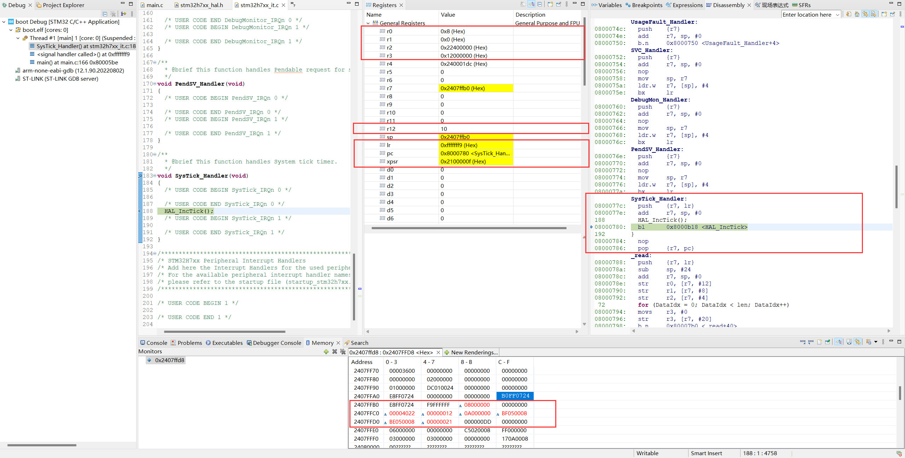

# 5 RTOS 中的栈的变化

## 5.1 线程切换与 PendSV

我们不防以 RT-Thread 的代码为例，当需要线程切换时，我们通常会调用 `rt_hw_context_switch` 或 `rt_hw_context_switch_to` 函数来实现线程的切换，其中最后一段代码的作用就是 **触发 PendSV 异常，将进入 PendSV 异常处理函数里完成上下文切换**。

```assembly
;/*
; * void rt_hw_context_switch(rt_uint32_t from, rt_uint32_t to);
; * r0 --> from
; * r1 --> to
; */
rt_hw_context_switch_interrupt
    EXPORT rt_hw_context_switch_interrupt
rt_hw_context_switch    PROC
    EXPORT rt_hw_context_switch

    ; 检查 rt_thread_switch_interrupt_flag 变量是否为 1
    ; 如果变量为 1 就跳过更新 from 线程的内容
    LDR     r2, =rt_thread_switch_interrupt_flag
    LDR     r3, [r2]
    CMP     r3, #1
    BEQ     _reswitch
    ; 设置 rt_thread_switch_interrupt_flag 变量为 1
    MOV     r3, #1
    STR     r3, [r2]

    ; 从参数 r0 里更新 rt_interrupt_from_thread 变量
    LDR     r2, =rt_interrupt_from_thread
    STR     r0, [r2]

_reswitch
    ; 从参数 r1 里更新 rt_interrupt_to_thread 变量
    LDR     r2, =rt_interrupt_to_thread
    STR     r1, [r2]

    ; 触发 PendSV 异常，将进入 PendSV 异常处理函数里完成上下文切换
    LDR     r0, =NVIC_INT_CTRL
    LDR     r1, =NVIC_PENDSVSET
    STR     r1, [r0]
    BX      LR

```

进入 PendSV 异常，我们已知 PSR、PC、LR、R12、R3-R0 已被自动入栈，但由于我们需要实现的是线程的切换，每个线程的 R0~R15（除 SP 指针）、XPSR、浮点数寄存器都是独立的，因此我们需要将剩余的寄存器**手动入栈**。至于 SP 指针的保存与更新，主要通过 R1 寄存器来实现。

```assembly
; r0 --> switch from thread stack
; r1 --> switch to thread stack
; psr, pc, lr, r12, r3, r2, r1, r0 are pushed into [from] stack
PendSV_Handler   PROC
    EXPORT PendSV_Handler

    ; 关闭全局中断
    MRS     r2, PRIMASK
    CPSID   I

    ; 检查 rt_thread_switch_interrupt_flag 变量是否为 0
    ; 如果为零就跳转到 pendsv_exit
    LDR     r0, =rt_thread_switch_interrupt_flag
    LDR     r1, [r0]
    CBZ     r1, pendsv_exit         ; pendsv already handled

    ; 清零 rt_thread_switch_interrupt_flag 变量
    MOV     r1, #0x00
    STR     r1, [r0]

    ; 检查 rt_thread_switch_interrupt_flag 变量
    ; 如果为 0，就不进行 from 线程的上下文保存
    LDR     r0, =rt_interrupt_from_thread
    LDR     r1, [r0]
    CBZ     r1, switch_to_thread

    ; 保存 from 线程的上下文
    MRS     r1, psp                 ; 获取 from 线程的栈指针
    STMFD   r1!, {r4 - r11}       ; 将 r4~r11 保存到线程的栈里
    LDR     r0, [r0]
    STR     r1, [r0]                ; 更新线程的控制块的 SP 指针

switch_to_thread
    LDR     r1, =rt_interrupt_to_thread
    LDR     r1, [r1]
    LDR     r1, [r1]                ; 获取 to 线程的栈指针

    LDMFD   r1!, {r4 - r11}       ; 从 to 线程的栈里恢复 to 线程的寄存器值
    MSR     psp, r1                 ; 更新 r1 的值到 psp

pendsv_exit
    ; 恢复全局中断状态
    MSR     PRIMASK, r2

    ; 修改 lr 寄存器的 bit2，确保进程使用 PSP 堆栈指针
    ORR     lr, lr, #0x04
    ; 退出中断函数
    BX      lr
    ENDP

```

## 5.2 MSP 到 PSP

需要注意的是 RTOS 下使用的是 PSP，那我们怎么从复位阶段的 MSP 切换为 PSP 呢？

我们主要是通过 LR 寄存器的配置来实现相应的功能的，在中断中，硬件自动更新 LR 寄存器为 **EXC_RETURN**，在上文中我们也可以发现其变化。

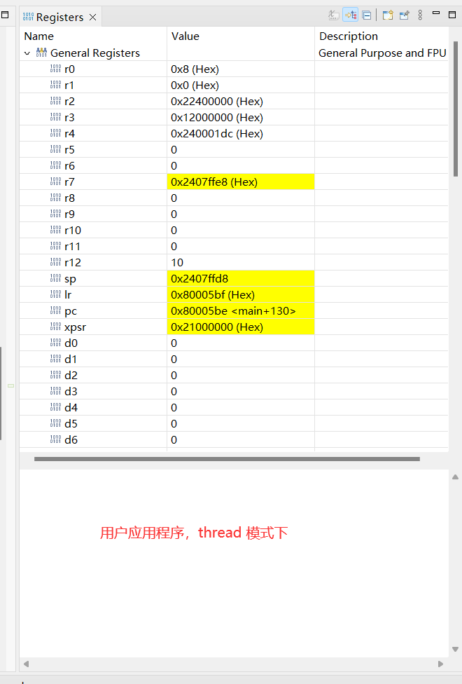

在无浮点数扩展下，其定义如下。

| EXC_RETURN   | Return to    | Return stack |
| ------------ | ------------ | ------------ |
| `0xFFFFFFF1` | Handler mode | Main         |
| `0xFFFFFFF9` | Thread mode  | Main         |
| `0xFFFFFFFD` | Thread mode  | Process      |

在有浮点数扩展下，其定义如下。

| EXC_RETURN   | Return to     | Return stack | Frame type |
| ------------ | ------------- | ------------ | ---------- |
| `0xFFFFFFE1` | Handler mode. | Main         | Extended   |
| `0xFFFFFFE9` | Thread mode   | Main         | Extended   |
| `0xFFFFFFED` | Thread mode   | Process      | Extended   |
| `0xFFFFFFF1` | Handler mode. | Main         | Basic      |
| `0xFFFFFFF9` | Thread mode   | Main         | Basic      |
| `0xFFFFFFFD` | Thread mode   | Process      | Basic      |

因此，通过修改 LR 寄存器的 bit2，可以确保进程使用 PSP 堆栈指针。

## 5.3 栈帧

以 RT-Thread 为例，在初始化线程时，会调用 `rt_hw_stack_init()` 函数来初始化线程栈，其栈帧表示如下。


以 ThreadX 为例，在初始化线程时，会调用 `_tx_thread_stack_build` 函数来初始化线程，初始化栈帧如下：

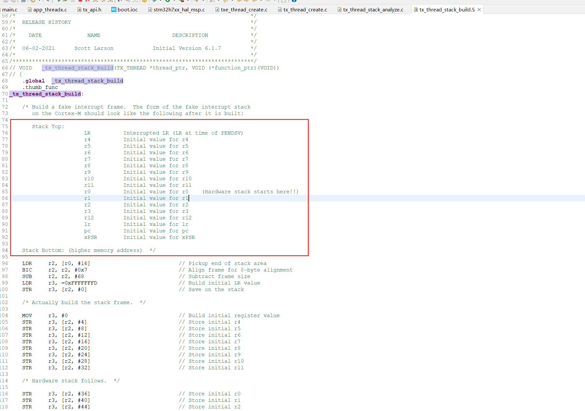

线程初次运行时，实现局部变量的入参：

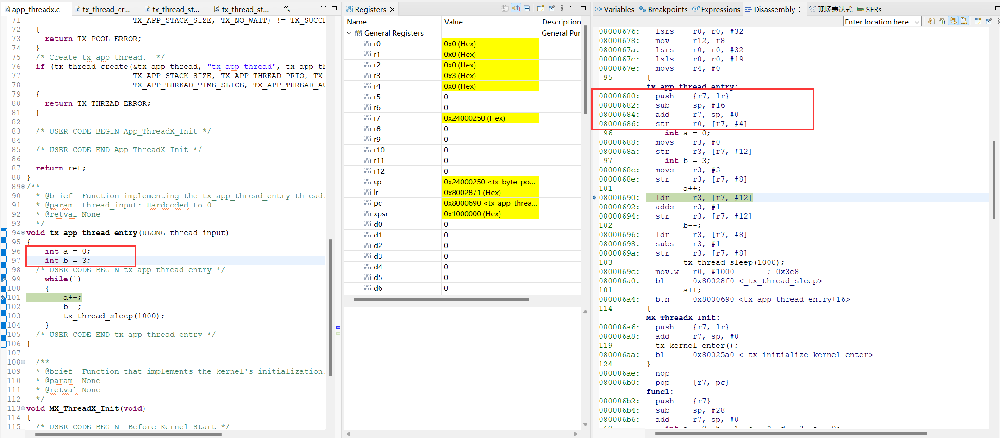

# 6 参考文档

1. [Cortex-M 要点总结 - 知乎 (zhihu.com)](https://zhuanlan.zhihu.com/p/473494886)

   > 写得很好，本篇可认为是他的洗稿。

2. ATPCS：[Documentation – Arm Developer](https://developer.arm.com/documentation/espc0002/latest/)

3. [ARM Tutorial — Runestone Interactive Overview (chemeketa.edu)](http://computerscience.chemeketa.edu/armTutorial/index.html)