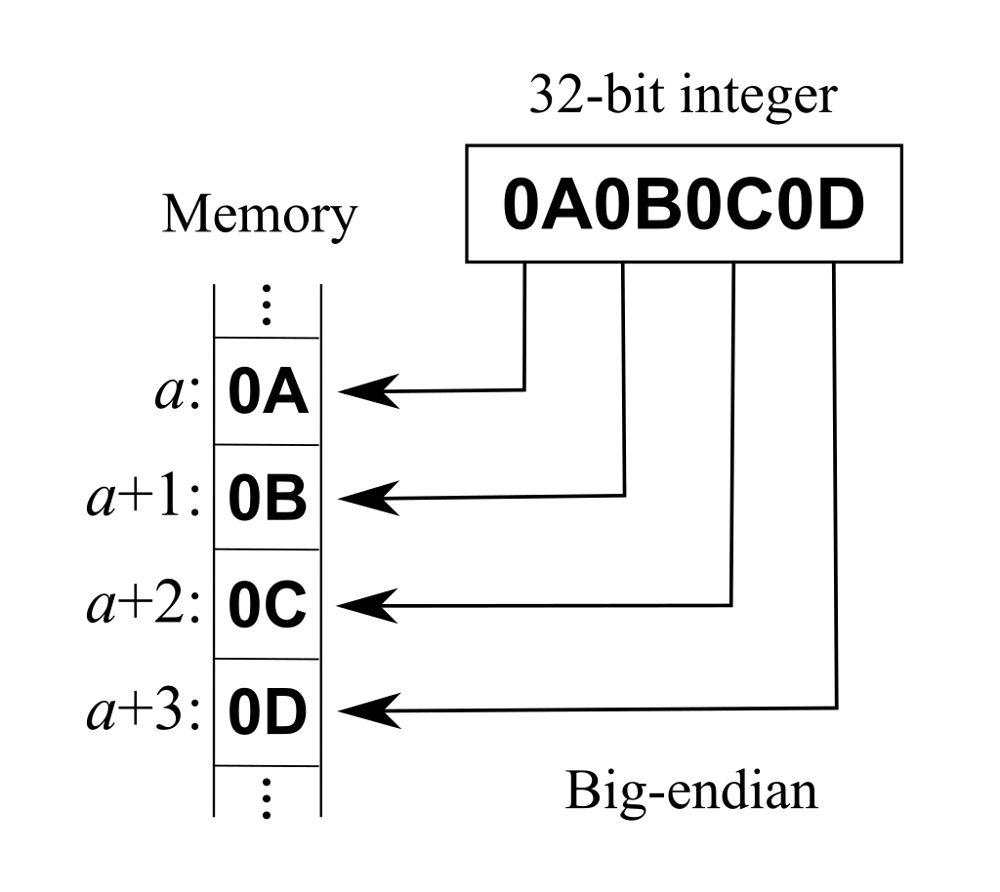

# 编程

# 1 大端和小端

大端模式：低位字节存在高地址上，高位字节存在低地址上。

小端模式：高位字节存在高地址上，低位字节存在低地址上。



STM32是小端模式，51一般是大端模式。对于0x1234，小端存放方式如下：

| 内存地址 | 存放内容 |
| -------- | -------- |
| 0x4000   | 0x34     |
| 0x4001   | 0x12     |

大端存放方式如下：

| 内存地址 | 存放内容 |
| -------- | -------- |
| 0x4000   | 0x12     |
| 0x4001   | 0x34     |

# 2 判断大端和小端

**联合体法**

```c
#include <stdio.h>
int checkCPU()
{
	union w
	{
		int a;
		char b;
	}c;
	c.a =1;
	return(c.b == 1);
}
int main()
{
	if(checkCPU())
		printf("小端\n");
	else
		printf("大端\n");
	return 0;
}
```

**指针法**

```c
#include <stdio.h>

int checkCPU()
{
	unsigned short usData = 0x1122;
	unsigned char*pucData = (unsigned char*)&usData;
	return (*pucData == 0x22);
}

int main()
{
	if(checkCPU())
		printf("小端\n");
	else
		printf("大端\n");
	return 0;
}
```

# 3 大小端转换

```c
/**
 * @brief   大小端互转
 * @param   data:       数据的指针
 *          size:       数据长度
 * @return  void
 */
void big_little_endian_conversion(void *data, size_t size)
{
    for(size_t i = 1; i < size; i++)
    {
        for(size_t j = 1; j < size - i + 1; j++)
        {
            uint8_t c = *(((uint8_t *)data) + j - 1);
            *(((uint8_t *)data) + j - 1) = *(((uint8_t *)data) + j);
            *(((uint8_t *)data) + j) = c;
        }
    }
}
```

# 4 对绝对地址赋值

嵌入式系统经常具有要求程序员去访问某特定的内存位置的特点。在某工程中，要求设置一绝对地址为0x67a9的整型变量的值为0xaa66。编译器是一个纯粹的ANSI编译器。写代码去完成这一任务。
这一问题测试你是否知道为了访问一绝对地址把一个整型数强制转换（typecast）为一指针是合法的。这一问题的实现方式随着个人风格不同而不同。典型的类似代码如下：

```c
int *ptr;
ptr = (int *)0x67a9;
*ptr = 0xaa55; 
```

A more obscure approach is:
 一个较晦涩的方法是： 

```c
*(int * const)(0x67a9) = 0xaa55; 
```

即使你的品味更接近第二种方案，但我建议你在面试时使用第一种方案。

# 5 函数指针跳转

对嵌软来说很有用。

```c
// 可以先定义一个函数指针
typedef void(*)() voidFuncPtr;		// 首先是一个指针，指向一个函数，返回类型是void，形参是void
*((voidFuncPtr)0x100000)();

// 或者
(*((void(*)())0x10000))();
```


```c
void Reset_test(void)
{
	typedef  void (*iapfun)(void);
	uint32_t JUMP_ADDR = 0x08004000;	// 程序跳转地址
	uint32_t STACK_ADDR = 0x20000000;
	uint32_t RESET_IRQ_ADDR = JUMP_ADDR + 4;
	iapfun jump2app;
	jump2app = (iapfun)*(volatile uint32_t *)RESET_IRQ_ADDR;
	__set_MSP(STACK_ADDR);
	__disable_irq();
	jump2app();
}
```

