# 常规硬件知识点

# 1 三极管和MOS管

MOS管的栅极 g、源极 s、漏极 d 对应三极管的基极 b、发射极 e、集电极 c，它们的作用相类似。

1. 场效应管用栅-源电压 $u_{GS}$ 控制漏极电流 $i_D$，栅极基本不取电流。而晶体管工作时基极总要索取一定的电流。因此，要求输入电阻高的电路应选用场效应管：而若信号源可以提供一定的电流，则可选用晶体管。
2. 场效应管只有多子参与导电。晶体管内既有多子又有少子参与导电，而少子数目受温度、辐射等因素影响较大，因而场效应管比晶体管的温度稳定性好、抗辐射能力强。所以在环境条件变化很大的情况下应选用场效应管。
3. 场效应管的噪声系数很小，所以低噪声放大器的输入级及要求信噪比较高的电路应选用场效应管。当然也可选用特制的低噪声晶体管。
4. 场效应管的漏极与源极可以互换使用，互换后特性变化不大。而晶体管的发射极与集电极互换后特性差异很大，因此只在特殊需要时才互换，成倒置状态，如在集成逻辑电路中。
5. 场效应管比晶体管的种类多，特别是耗尽型 MOS 管，栅 -源电压 $u_{GS}$ 可正、可负、可零，均能控制漏极电流。因而在组成电路时场效应管比晶体管更灵活。
6. 场效应管和晶体管均可用于放大电路和开关电路，它们构成了品种繁多的集成电路。但由于场效应管集成工艺更简单，且具有耗电省、工作电源电压范围宽等优点，因此场效应管越来越多地应用于大规模和超大规模集成电路中。

## 1.1 PNP

三极分别为**B：基极，C：集电极，E：发射极**。

三极管的伏安特性曲线如下：

以下为三种主要的工作模式：

1. 截止区：发射结电压小于开启电压，且集电结反偏；
2. 放大区：发射结正向偏置（电压大于开启电压），且集电结反向偏置；
3. 饱和区：发射结和集电结均正向偏置。

在模拟电路中，绝大多数应用下，应保证晶体管工作在放大状态下。

## 1.2 NPN

三极分别为**B：基极，C：集电极，E：发射极**。

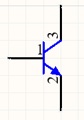                                                          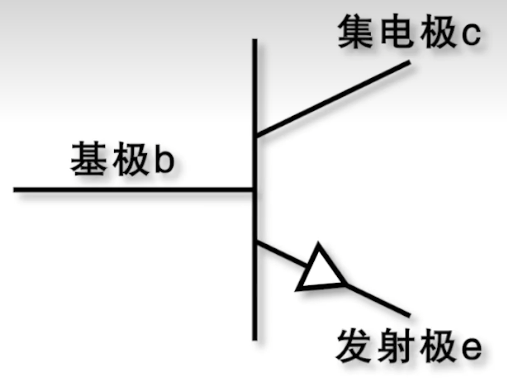

## 1.3 P-MOS

三极分别为**G：gate 栅极；S：source 源极；D：drain 漏极**。

                      

场效应管的输出特性如下：

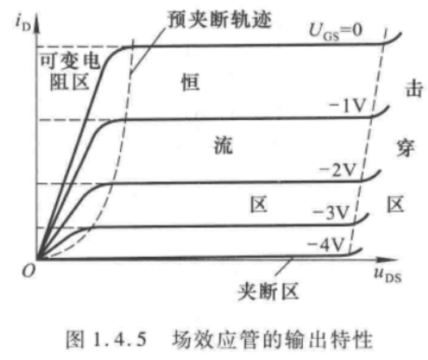

以下为三种主要的工作模式（针对结型MOS管）：

1. **可变电阻区：**预夹断轨迹是 $u_{DS} = u_{GS} - U_{GS(off)}$ 的点连接而成的， $u_{GS}$ 愈大，预夹断时额的  $u_{DS}$ 值也愈大。预夹断轨道的左边区域称为可变电阻区，该区域中曲线近似为不同斜率的直线。当 $u_{GS}$ 确定时，直线的斜率也唯一地被确定，直线斜率的倒数即为 $d-s$ 间等效电阻。因而在此区域中,可以通过改变 $u_{GS}$ 的大小(即压控的方式)来改变漏 -源等效电阻的阻值，也因此称之为可变电阻区。
2. **恒流区（也称饱和区）：**图中预夹断轨迹的右边区域为恒流区。当  $u_{DS}>u_{GS}-U_{GS(off)}$ （即 $u_{GD} < U_{GS(off)}$） 时，各曲线近似为一族横轴的平行线。当  $u_{DS}$ 增大时，$i_D$ 仅略有增大。因而可将 $i_D$ 近似为电压 $u_{GS}$ 控制的电流源，故称该区域为恒流区。利用场效应管作放大管时，应使其工作在该区域。
3. **夹断区（也称截止区）：**当 $u_{GS}<U_{GS(off)}$ 时， $i_D≈0$， 即图1.4.5 中靠近横轴的部分称为夹断区。一般将使 $i_D$ 等于某一个很小电流（如 $5μA$）时的 $u_{GS}$ 定义为夹断电压 $U_{GS(off)}$。

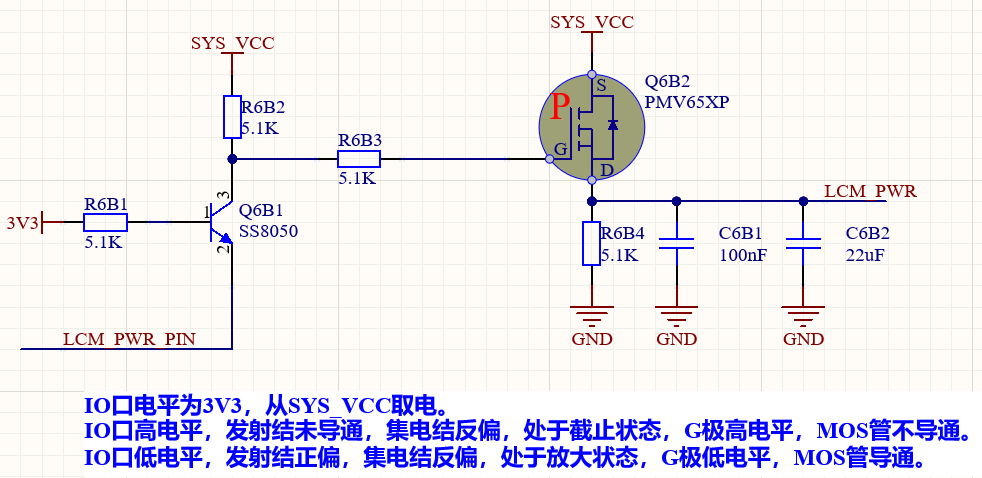

## 1.4 N-MOS

三极分别为**G：gate 栅极；S：source 源极；D：drain 漏极**。

# 2 IO口的输入输出方式

Refer：[单片机怎么输出高电平！推挽输出和开漏输出最本质的区别？_哔哩哔哩_bilibili](https://www.bilibili.com/video/BV1Pr4y1n74J/?spm_id_from=333.337.search-card.all.click&vd_source=b2294685dcc4b104a99f116c1c175bce)

[STM32IO口的八种工作模式超详细解析 - 知乎 (zhihu.com)](https://zhuanlan.zhihu.com/p/108541000)

[(107) 推挽 开漏 高阻 这都是谁想出来的词？？ - YouTube](https://www.youtube.com/watch?v=dgIyNq3TB_M)

单片机的内部引脚结构图：

每个引脚在芯片内部都有两只保护二极管，IO 口内部可分为输入和输出驱动模块。其中输入驱动有弱上下拉电阻可选，可连接到 AD 等模拟输入的外设；如果输入到数字外设，就需要经过一个 TTL 施密特触发器，再连接到 GPIO 输入寄存器或其他复用外设。而输出驱动有一对 MOS 管，可通过配置上下的 MOS 管是否使能来将 IO 口配置成开漏或推挽输出；输出驱动内部也可以配置成由 GPIO 控制输出还是由复用的其他外设控制输出。

以下时，两个MOS管状态与输出的关系：

| P-MOS | N-MOS | 输出             |
| ----- | ----- | ---------------- |
| 打开  | 关闭  | 高电平           |
| 关闭  | 打开  | 低电平           |
| 关闭  | 关闭  | 浮空/高阻态      |
| 打开  | 打开  | 不会启用这种方式 |

## 2.1 浮空输入、上拉输入和下拉输入

配置结构图见下图。

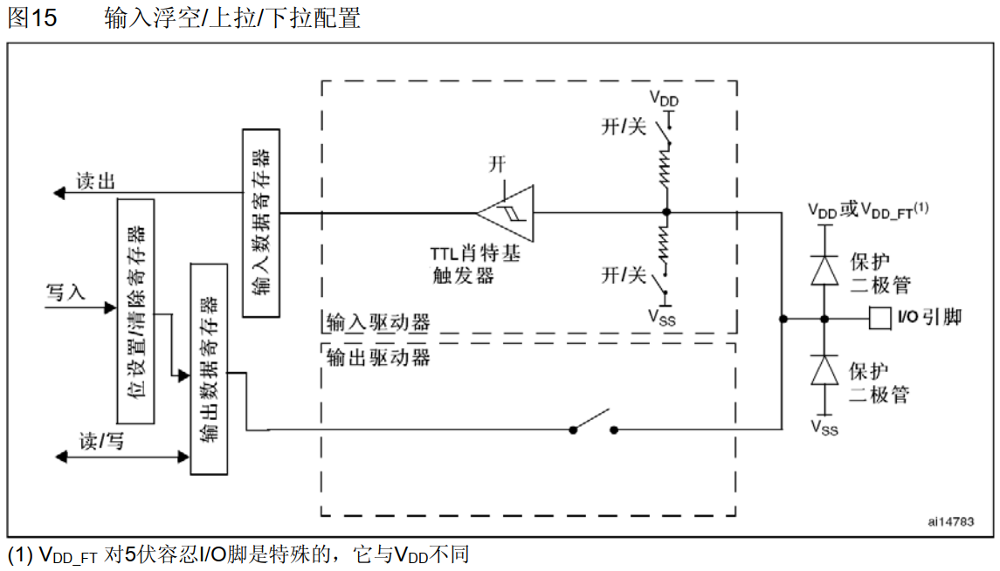

1. 浮空输入模式下，I/O端口的电平信号直接进入输入数据寄存器。也就是说，I/O的电平状态是不确定的，完全由外部输入决定；如果在该引脚悬空（在无信号输入）的情况下，读取该端口的电平是不确定的。
2. 上拉输入模式下，I/O端口的电平信号直接进入输入数据寄存器。但是在I/O端口悬空（在无信号输入）的情况下，输入端的电平可以保持在高电平；并且在I/O端口输入为低电平的时候，输入端的电平为低电平。
3. 下拉输入模式下，IO口工作方式刚好和上拉模式相反。I/O端口的电平信号直接进入输入数据寄存器。但是在I/O端口悬空（在无信号输入）的情况下，输入端的电平可以保持在低电平；并且在I/O端口输入为高电平的时候，输入端为高电平。

## 2.2 模拟输入

模拟输入模式下，I/O端口的模拟信号（电压信号，而非电平信号）**直接模拟输入到片上外设模块**，比如ADC模块等等。

## 2.3 推挽输出（Push-Pull Output）

推挽输出的结构如下图。推挽输出的结构一般是由两个三极管（PNP+NPN）或者MOS管（P-MOS+N-MOS）受到互补信号的控制，**两个管子始终保持一个处于截止，另一个处于导通的状态。**

> 注：此时，输入驱动器仍然可接收外部输入的信号。

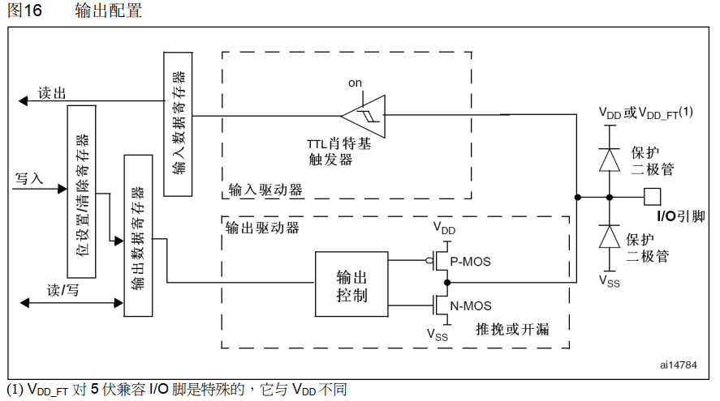

1. 输出高电平，P-MOS导通，N-MOS截止，输出的电压就是VDD的电压；
2. 输出低电平，P-MOS截止，N-MOS导通，输出低电平。

### 2.3.1 推挽输出的电流驱动能力

推挽输出的最大特点是**可以真正能真正的输出高电平和低电平，在两种电平下都具有驱动能力。**

> 所谓的驱动能力，就是指输出电流的能力。对于驱动大负载（即负载内阻越小，负载越大）时，例如IO输出为5V，驱动的负载内阻为10ohm，于是根据欧姆定律可以正常情况下负载上的电流为0.5A（推算出功率为2.5W）。显然一般的IO不可能有这么大的驱动能力，也就是没有办法输出这么大的电流。于是造成的结果就是输出电压会被拉下来，达不到标称的5V。
>
> 如果只是数字信号的传递，下一级的输入阻抗理论上最好是高阻，也就是只需要传电压，基本没有电流，也就没有功率，于是就不需要很大的驱动能力。

对于推挽输出，输出高、低电平时电流的流向如下图所示。所以相比于后面介绍的开漏输出，输出高电平时的驱动能力强很多。

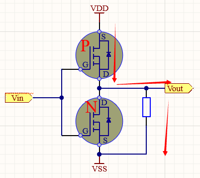

### 2.3.2 推挽输出不能实现" 线与"的原因

推挽输出的一个缺点是，如果当两个推挽输出结构相连在一起，一个输出高电平，即上面的MOS导通，下面的MOS闭合时；同时另一个输出低电平，即上面的MOS闭合，下面的MOS导通时。电流会从第一个引脚的VCC通过上端MOS再经过第二个引脚的下端MOS直接流向GND。整个通路上电阻很小，会发生短路，进而可能造成端口的损害。

## 2.4 开漏输出（Open Drain Output）

**P-MOS或者PNP永远截止。**这种方式若不接上拉电阻时，则可以输出高阻或低电平两种状态，作为输出是一般需要外接上拉电阻的。

> 注：此时，输入驱动器仍然可接收外部输入的信号。

与推挽输出相对的就是开漏输出，对于开漏输出和推挽输出的区别最普遍的说法就是**开漏输出无法真正输出高电平，即高电平时没有驱动能力，需要借助外部上拉电阻完成对外驱动。**

1. N-MOS导通时，输出低电平；
2. N-MOS截止时，输出高阻态，两个晶体管都是截止状态，电阻无穷大，需要**依赖外接上拉电阻输出高电平**。

### 2.4.1 开漏输出和开集输出

这两种输出的原理和特性基本是类似的，区别在于一个是使用MOS管，其中的"漏"指的就是MOS管的漏极；另一个使用三极管，其中的"集"指的就是MOS三极管的集电极。所谓开漏输出，也即输出时漏极开路，开集输出，也即输出时集电极开路。这两者其实都是和推挽输出相对应的输出模式，由于使用MOS管的情况较多，很多时候就用"开漏输出"这个词代替了开漏输出和开集输出。

开漏输出的原理图可以简化如下：

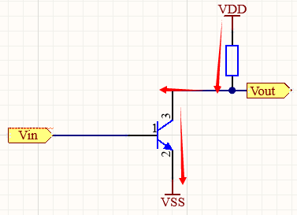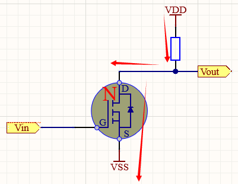

1. 输出高电平时，NPN或N-MOS截止，呈高阻态，输出电压被VDD拉高至对应电平。
2. 输出低电平时，NPN或N-MOS导通，输出电压拉至低电平。

### 2.4.2 线与

多个开漏模式引脚连接到一起时，只有当所有引脚都输出高阻态，才由上拉电阻提供高电平，此高电平的电压为外部上拉电阻所接的电源的电压。若其中一个引脚为低电平，那线路就相当于短路接地，使得整条线路都为低电平，0伏。

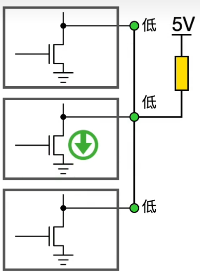

## 2.5 复用推挽输出

推挽复用输出模式，与推挽输出模式很是类似。只是输出的高低电平的来源，不是让CPU直接写输出数据寄存器，取而代之利用片上外设模块的复用功能输出来决定的。

复用输出功能，主要是由于部分信号的频率较高（如PWM、USB等），需借助芯片内置外设来实现对应的功能。

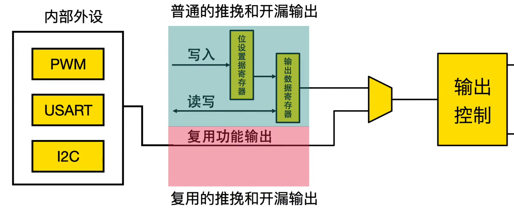

## 2.6 复用开漏输出

开漏复用输出模式，与开漏输出模式很是类似。只是输出的高低电平的来源，不是让CPU直接写输出数据寄存器，取而代之利用片上外设模块的复用功能输出来决定的。

