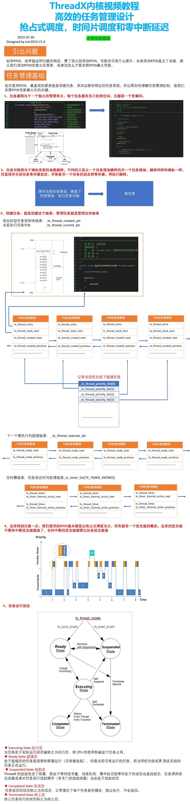
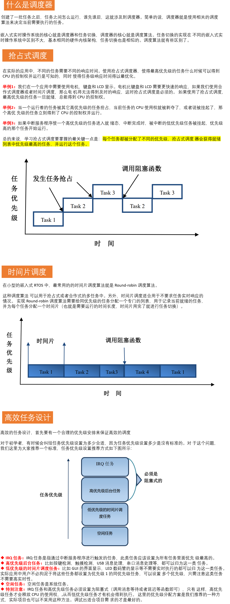

参考链接：[第6期ThreadX视频教程：图文并茂吃透RTOS运行机制，任务管理，上下文切换，任务栈，系统栈等_哔哩哔哩_bilibili](https://www.bilibili.com/video/BV1bv4y1W7vQ/?spm_id_from=333.337.search-card.all.click&vd_source=b2294685dcc4b104a99f116c1c175bce)

# 1 内核教程

# 2 高效任务管理设计

