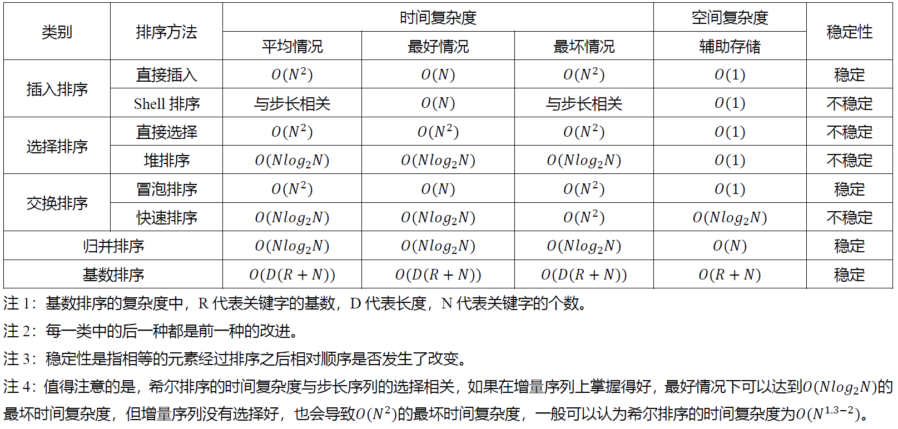
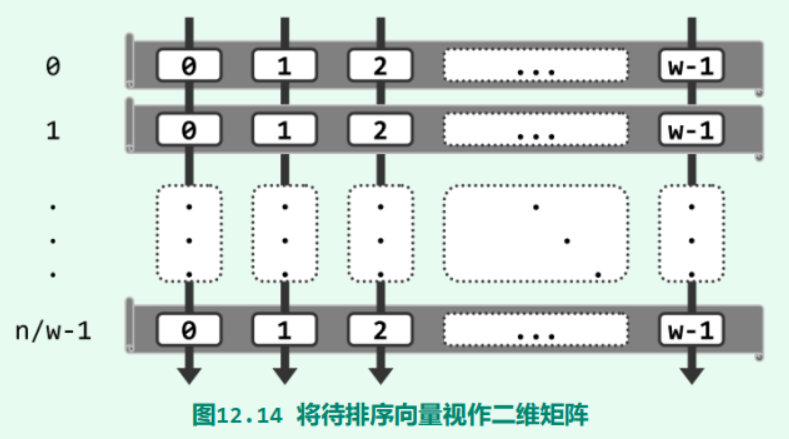
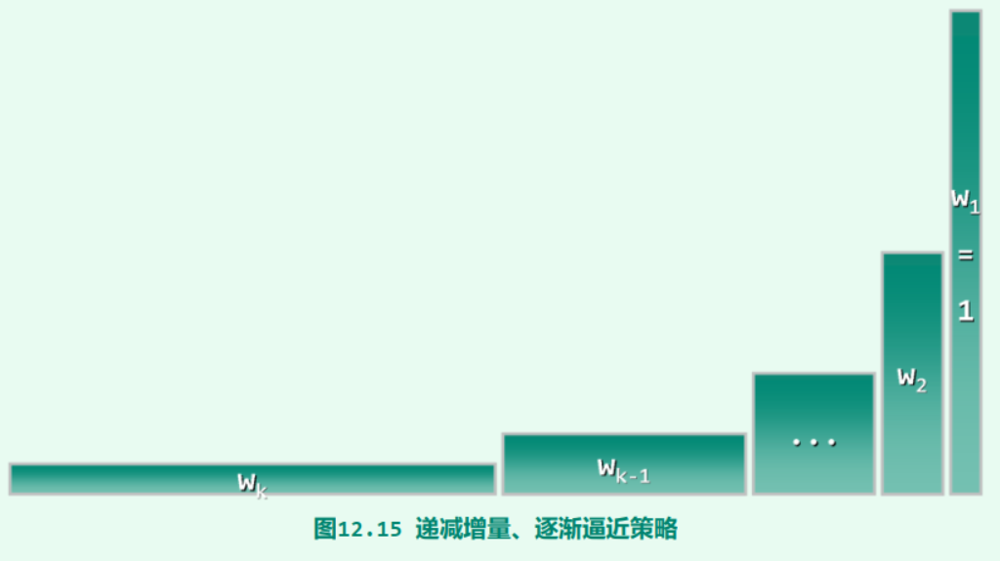
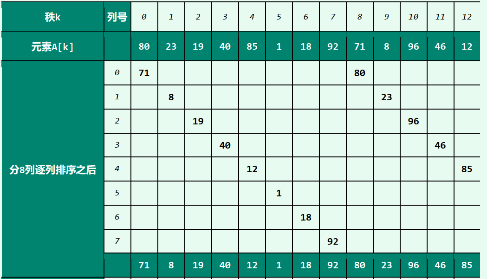
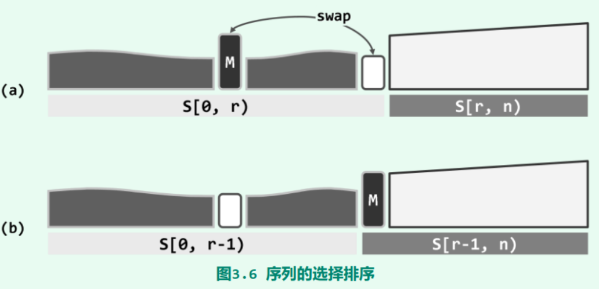
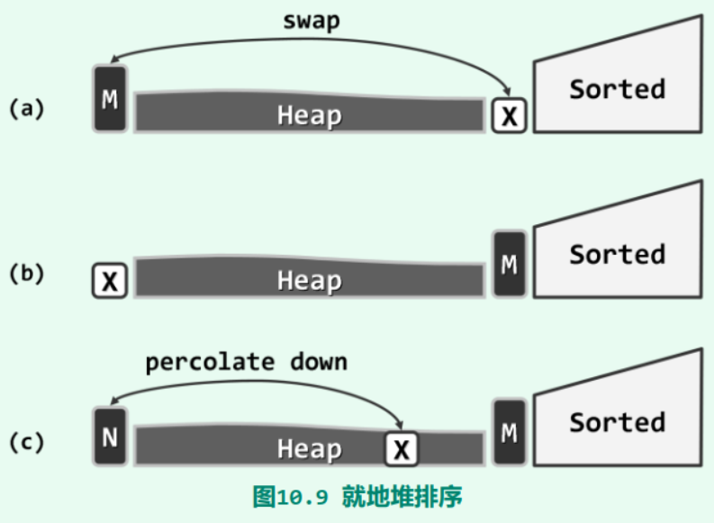
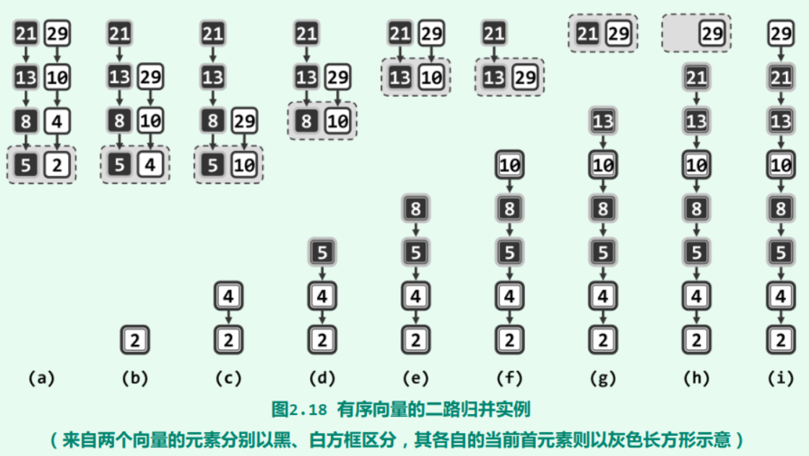

# 0 基础知识点

> 其实嵌软没必要看那么多，下面也是挑着写。


## 0.1 常用数据结构操作的复杂度


## 0.2 大O复杂度比较


## 0.3 常用C++处理函数

1. 判断是否为字母：`isalpha()`
2. 判断是否为数字：`isdigit()`
3. 判断是否是数字或字母：`isalnum()`
4. 判断是否是大/小写：`islower()`、`isupper()`
5. 大小写互转：`toupper`、`tolower()`

## 0.4 实现字符串相关的库函数

Reference: [C Programming/string.h - Wikibooks, open books for an open world](https://en.wikibooks.org/wiki/C_Programming/string.h)

[string.c source code linux/lib/string.c\] - Codebrowser](https://codebrowser.dev/linux/linux/lib/string.c.html#strlen)

### 0.4.1 strcpy

```c
char *strcpy(char *dest, const char *src)
{
	char *tmp = dest;
	while ((*dest++ = *src++) != '\0');
	return tmp;
}
```

### 0.4.2 strncpy

```c
char *strncpy(char *dest, const char *src, size_t n)
{
	char *tmp = dest;
	while (count--) 
    {
		if ((*tmp = *src) != 0)	src++;
		tmp++;
	}
	return dest;
}
```

### 0.4.3 strchr

```c
char *strchr(char *str, int c) 
{
    for(; *str != (char)c; ++str)
        if(*str == '\0')	return NULL;
    return str;
}
```

### 0.4.4 strcat

```c
char *strcat(char *dest, char *src)
{
    char *tmp = dest;
	while (*dest)	dest++;
	while ((*dest++ = *src++) != '\0');
	return tmp;
}
```

### 0.4.5 strncat

```c
char *strncat(char *dest, const char *src, size_t count)
{
	char *tmp = dest;
	if (count) 
    {
		while (*dest)	dest++;
		while ((*dest++ = *src++) != 0) 
        {
			if (--count == 0) 
            {
				*dest = '\0';
				break;
			}
		}
	}
	return tmp;
}
```

### 0.4.6 strncat

```c
int strcmp(const char *cs, const char *ct)
{
	unsigned char c1, c2;
	while (1) 
    {
		c1 = *cs++;
		c2 = *ct++;
		if (c1 != c2)
			return c1 < c2 ? -1 : 1;
		if (!c1)
			break;
	}
	return 0;
}
```

### 0.4.7 strncmp

```c
/**
 * strncmp - Compare two length-limited strings
 * @cs: One string
 * @ct: Another string
 * @count: The maximum number of bytes to compare
 */
int strncmp(const char *cs, const char *ct, size_t count)
{
	unsigned char c1, c2;
	while (count) 
    {
		c1 = *cs++;
		c2 = *ct++;
		if (c1 != c2)
			return c1 < c2 ? -1 : 1;
		if (!c1)
			break;
		count--;
	}
	return 0;
}
```

### 0.4.8 strchr

```c
/**
 * strchr - Find the first occurrence of a character in a string
 * @s: The string to be searched
 * @c: The character to search for
 *
 * Note that the %NUL-terminator is considered part of the string, and can
 * be searched for.
 */
char *strchr(const char *s, int c)
{
	for (; *s != (char)c; ++s)
		if (*s == '\0')
			return NULL;
	return (char *)s;
}
```

### 0.4.9 strchr

```c
/**
 * strrchr - Find the last occurrence of a character in a string
 * @s: The string to be searched
 * @c: The character to search for
 */
char *strrchr(const char *s, int c)
{
	const char *last = NULL;
	do 
    {
		if (*s == (char)c)
			last = s;
	} while (*s++);
	return (char *)last;
}
```

### 0.4.10 strlen

```
size_t strlen(const char *str)
{
    const char *s;
    for (s = str; *s; ++s);
    return(s - str);
}
```

### 0.4.11 strnlen

```c
size_t strnlen(const char *s, size_t count)
{
	const char *sc;
	for (sc = s; count-- && *sc != '\0'; ++sc);
	return sc - s;
}
```

### 0.4.12 strstr

```c
/**
 * strstr - Find the first substring in a %NUL terminated string
 * @s1: The string to be searched
 * @s2: The string to search for
 */
char *strstr(const char *s1, const char *s2)
{
	size_t l1, l2;
	l2 = strlen(s2);
	if (!l2)
		return (char *)s1;
	l1 = strlen(s1);
	while (l1 >= l2) {
		l1--;
		if (!memcmp(s1, s2, l2))
			return (char *)s1;
		s1++;
	}
	return NULL;
}
```

### 0.4.13 strnstr

```c
/**
 * strnstr - Find the first substring in a length-limited string
 * @s1: The string to be searched
 * @s2: The string to search for
 * @len: the maximum number of characters to search
 */
char *strnstr(const char *s1, const char *s2, size_t len)
{
	size_t l2;
	l2 = strlen(s2);
	if (!l2)
		return (char *)s1;
	while (len >= l2) {
		len--;
		if (!memcmp(s1, s2, l2))
			return (char *)s1;
		s1++;
	}
	return NULL;
}
```

### 0.4.14 memcmp

```c
/**
 * memcmp - Compare two areas of memory
 * @cs: One area of memory
 * @ct: Another area of memory
 * @count: The size of the area.
 */
int memcmp(const void *cs, const void *ct, size_t count)
{
	const unsigned char *su1, *su2;
	int res = 0;
#ifdef CONFIG_HAVE_EFFICIENT_UNALIGNED_ACCESS
	if (count >= sizeof(unsigned long)) 
    {
		const unsigned long *u1 = cs;
		const unsigned long *u2 = ct;
		do 
        {
			if (get_unaligned(u1) != get_unaligned(u2))
				break;
			u1++;
			u2++;
			count -= sizeof(unsigned long);
		} while (count >= sizeof(unsigned long));
		cs = u1;
		ct = u2;
	}
#endif
    for (su1 = cs, su2 = ct; 0 < count; ++su1, ++su2, count--)
		if ((res = *su1 - *su2) != 0)
			break;
	return res;		// 下面这种方法即可
}
```

### 0.4.15 memchr

```c
/**
 * memchr - Find a character in an area of memory.
 * @s: The memory area
 * @c: The byte to search for
 * @n: The size of the area.
 *
 * returns the address of the first occurrence of @c, or %NULL
 * if @c is not found
 */
void *memchr(const void *s, int c, size_t count)
{
	const unsigned char *p = s;
	while (count--)
		if ((unsigned char)c == *p++)
			return (void *)(p - 1);
	return NULL;
}
```

### 0.4.16 memset

```c
/**
 * memset - Fill a region of memory with the given value
 * @s: Pointer to the start of the area.
 * @c: The byte to fill the area with
 * @count: The size of the area.
 *
 * Do not use memset() to access IO space, use memset_io() instead.
 */
void *memset(void *s, int c, size_t count)
{
	char *xs = s;
	while (count--)
		*xs++ = c;
	return s;
}
```

### 0.4.17 memcpy

```c
/**
 * memcpy - Copy one area of memory to another
 * @dest: Where to copy to
 * @src: Where to copy from
 * @count: The size of the area.
 *
 * You should not use this function to access IO space, use memcpy_toio()
 * or memcpy_fromio() instead.
 */
void *memcpy(void *dest, const void *src, size_t count)
{
	char *tmp = dest;
	const char *s = src;
	while (count--)
		*tmp++ = *s++;
	return dest;
}
```

### 0.4.18 memchr

```c
/**
 * memchr - Find a character in an area of memory.
 * @s: The memory area
 * @c: The byte to search for
 * @n: The size of the area.
 *
 * returns the address of the first occurrence of @c, or %NULL
 * if @c is not found
 */
void *memchr(const void *s, int c, size_t n)
{
	const unsigned char *p = s;
	while (n-- != 0) {
        	if ((unsigned char)c == *p++) {
			return (void *)(p - 1);
		}
	}
	return NULL;
}
```

### 0.4.19 itoa

```c
char *itoa(int n, char *s)
{
    int sign, i = 0, j = 0;
	if((sign = n) < 0)	n = -n;	// 转换为正数
    do
    {
        s[i++] = n % 10 + '0';
    }while((n /= 10) > 0);
    
    s[i] = '\0';
    
    if(s[0] == '\0')
    {
        j = 1;
        ++i;
    }
    for(; j < i / 2; ++j)
    {
        s[j] = s[j] + s[i - 1 - j];
        s[i - 1 - j] = s[j] - s[i - 1 - j];
        s[j] = s[j] - s[i - 1 - j];
    }
    
    return s;
}

// 或
 /* reverse:  reverse string s in place */
void reverse(char s[])
{
    int i, j;
    char c;

    for (i = 0, j = strlen(s)-1; i<j; i++, j--) {
        c = s[i];
        s[i] = s[j];
        s[j] = c;
    }
}

 /* itoa:  convert n to characters in s */
 void itoa(int n, char s[])
 {
     int i, sign;
 
     if ((sign = n) < 0)  /* record sign */
         n = -n;          /* make n positive */
     i = 0;
     do {       /* generate digits in reverse order */
         s[i++] = n % 10 + '0';   /* get next digit */
     } while ((n /= 10) > 0);     /* delete it */
     if (sign < 0)
         s[i++] = '-';
     s[i] = '\0';
     reverse(s);
 }
```

### 0.4.20 atoi

```c
int atoi(const char *s)
{
    int i, n, sign = 1;
    while(isspace(*s++));
    
    if (*str == '+')	++str;
	else if(*str == '-')	
    {
        ++str;
        sign = -1;
    }
    
    int res = 0;
    for(; isdigit(*str); ++str)
    {
        int digit = *str - '0';
        res *= 10;
       	res += digit;
    }
    
    return sign * res;
}
```

# 1 基本输入输出练习

[牛客竞赛_ACM/NOI/CSP/CCPC/ICPC算法编程高难度练习赛_牛客竞赛OJ (nowcoder.com)](https://ac.nowcoder.com/acm/contest/5652#question)

## 1.1 A+B(1)

计算a+b

数据范围： 数据组数$1≤t≤100$，数据大小满足 $1≤n≤1000$
输入描述:

```
输入包括两个正整数a,b(1 <= a, b <= 1000),输入数据包括多组。
```

输出描述:

```
输出a+b的结果
```

代码：

```c++
#include<iostream>
using namespace std;

int main()
{
	int m, n;
	while(cin >> m >> n)
	{
		cout << m + n << endl;
	}
	return 0;
}
```

## 1.2 A+B(2)

计算a+b

数据范围：数据组数满足$1 <= t <= 100$，数据大小满足 $1 <= a, b <= 1000$

输入描述:

```
输入第一行包括一个数据组数t(1 <= t <= 100)
接下来每行包括两个正整数a,b(1 <= a, b <= 1000)
```

输出描述:

```
输出a+b的结果
```

代码：

```c++
#include<iostream>
using namespace std;

int main()
{
	int line_num(0);
	int m(0), n(0);
	
	cin >> line_num;
	while(line_num--)
	{
		cin >> m >> n;
		cout << m + n << endl;
	}

	return 0;
}
```

## 1.3 A+B(3)

计算a+b

数据范围：数据组数满足$1≤t≤100$，数据大小满足$1≤n≤100$

输入描述:

```
输入包括两个正整数a,b(1 <= a, b <= 10^9),输入数据有多组, 如果输入为0 0则结束输入
```

输出描述:

```
输出a+b的结果
```

代码：

```c++
#include<iostream>  
using namespace std;  
  
int main()  
{  
    int m(0), n(0);  
  
    while(1)  
    {  
        cin >> m >> n;  
        if(m == 0 and n == 0)    break;  
        cout << m + n << endl;  
    }  
  
    return 0;  
}
```

## 1.4 A+B(4)

计算一系列数的和

数据范围：数据组数满足$1≤t≤100$，每组数据中整数个数满足 $1≤n≤100$  ，每组数据中的值满足 $1≤val≤100$

输入描述:

```
输入包括两个正整数a,b(1 <= a, b <= 10^9),输入数据有多组, 如果输入为0 0则结束输入
```

输出描述:

```
输出a+b的结果
```

代码：

```c++
#include<iostream>
using namespace std;  
  
int main()  
{  
    int n(0);  
    int temp(0);  
    int sum(0);  
  
    while(1)  
    {  
        cin >> n;  
        if(n == 0)    break;  
        while(n--)  
        {  
            cin >> temp;  
            sum += temp;  
        }  
                cout << sum << endl;  
        sum = 0;  
    }  
  
    return 0;  
}
```

## 1.5 A+B(5)

计算一系列数的和

数据范围：数据组数满足$1≤t≤100$，每组数据中整数个数满足 $1≤n≤100$  ，每组数据中的值满足 $1≤val≤100$

输入描述:

```
输入的第一行包括一个正整数t(1 <= t <= 100), 表示数据组数。  
接下来t行, 每行一组数据。  
每行的第一个整数为整数的个数n(1 <= n <= 100)。  
接下来n个正整数, 即需要求和的每个正整数。
```

输出描述:

```
每组数据输出求和的结果
```

代码：

```c++
#include<iostream>
using namespace std;

int main()
{
	int t(0);
	int n(0);
	int temp(0);
	int sum(0);

	cin >> t;
	while(t--)
	{
		cin >> n;
		if(n == 0)	break;
		while(n--)
		{
			cin >> temp;
			sum += temp;
		}
		
		cout << sum << endl;
		sum = 0;
	}

	return 0;
}
```

## 1.6 A+B(6)

计算一系列数的和

数据范围：$1≤n≤1000$，所有数都满足 $1≤val≤1000$

输入描述:

```
输入数据有多组, 每行表示一组输入数据。
每行的第一个整数为整数的个数n(1 <= n <= 100)。
接下来n个正整数, 即需要求和的每个正整数。
```

输出描述:

```
每组数据输出求和的结果
```

代码：

```c++
#include<iostream>
using namespace std;

int main()
{
	int n(0);
	int temp(0);
	int sum(0);

	while(cin >> n)
	{
		if(n == 0)	break;
		while(n--)
		{
			cin >> temp;
			sum += temp;
		}
		
		cout << sum << endl;
		sum = 0;
	}

	return 0;
}
```

## 1.7 A+B(7)

计算一系列数的和

输入描述:

```
输入数据有多组, 每行表示一组输入数据。

每行不定有n个整数，空格隔开。(1 <= n <= 100)。
```

输出描述:

```
每组数据输出求和的结果
```

代码：

```c++
#include<iostream>
using namespace std;

int main()
{
	int temp(0);
	int sum(0);
	
	while(cin >> temp)		// 遇到空格或换行符停止
	{	
		sum += temp;
		if(getchar() == '\n')	// 读取换行符
		{
			cout << sum << endl;
			sum = 0;
		}
	}
	
	return 0;
}
```

## 1.8 字符串排序(1)

对输入的字符串进行排序后输出

输入描述:

```
输入有两行，第一行n
第二行是n个字符串，字符串之间用空格隔开
```

输出描述:

```
输出一行排序后的字符串，空格隔开，无结尾空格
```

代码：

```c++
#include<iostream>
#include<algorithm>
#include<vector>
using namespace std;

int main()
{
	vector<string> res;
	string temp;
	int size(0);
	
	cin >> size;
	while(size--)
	{
		cin >> temp;
		res.emplace_back(temp);
	}
	
	sort(res.begin(), res.end());
	for(auto s : res)
		cout << s << " ";
	
	return 0;
}
```

## 1.9 字符串排序(2)

对输入的字符串进行排序后输出

输入描述:

```
多个测试用例，每个测试用例一行。
每行通过空格隔开，有n个字符，n＜100
```

输出描述:

```
对于每组测试用例，输出一行排序过的字符串，每个字符串通过空格隔开
```

代码：

```c++
#include<iostream>
#include<algorithm>
#include<vector>
using namespace std;

int main()
{
	vector<string> res;
	string temp;
	
	while(cin >> temp)
	{
		res.emplace_back(temp);
		if(getchar() == '\n')
		{
			sort(res.begin(), res.end());
			for(auto s : res)
				cout << s << " ";
			cout << endl;
			
			res.clear();
		}
	}
	
	return 0;
}
```

## 1.10 字符串排序(3)

对输入的字符串进行排序后输出

输入描述:

```
多个测试用例，每个测试用例一行。
每行通过空格隔开，有n个字符，n＜100
```

输出描述:

```
对于每组用例输出一行排序后的字符串，用','隔开，无结尾空格
```

代码：

```c++
#include<iostream>
#include<algorithm>
#include<vector>
#include<sstream>
using namespace std;

int main()
{
	string s;
	
	while(getline(cin, s))
	{
		vector<string>buf;
		stringstream ss(s);
		string temp;
		while(getline(ss, temp, ','))
		{
			buf.push_back(temp);
		}
		sort(buf.begin(), buf.end());
		for(decltype(buf.size()) i = 0; i < buf.size()-1; i++)
		{
			cout << buf[i] << ",";
		}
		cout << buf.back() << endl;
		
	}
	return 0;
}
```

## 1.11 自测本地通过提交为0

每年前几场在线笔试编程题的时候，总有同学询问为什么我本地测试通过，自测也通过，提交代码系统却返回通过率0。

这不是系统的错，可能是因为：
1.你对题目理解错了，你的代码只过了样例或你自己的数据
2.你的代码逻辑有问题，你的代码只过了样例或你自己的数据

总之就是你的代码只是过了样例和自测数据，后台的测试数据你根本不可见，要多自己思考。

这个题目如果你提交后通过率为0，又觉得自己代码是正确的，可以 点击查看 通过的代码

谨记：
当你笔试的时候怀疑系统或者题目数据有问题的时候请务必先怀疑自己的代码!

当你笔试的时候怀疑系统或者题目数据有问题的时候请务必先怀疑自己的代码!

数据范围： $0<a,b<2×10^{10}$

输入描述:

```
输入有多组测试用例，每组空格隔开两个整数
```

输出描述:

```
对于每组数据输出一行两个整数的和
```

代码：

```c++
#include<iostream>
using namespace std;

int main()
{
	int temp(0);
	int sum(0);
	
	while(cin >> temp)		// 遇到空格或换行符停止
	{	
		sum += temp;
		if(getchar() == '\n')	// 读取换行符
		{
			cout << sum << endl;
			sum = 0;
		}
	}
	
	return 0;
}
```

# 2 链表

## 2.1 删除单链表的重复节点

[面试题 02.01. 移除重复节点 - 力扣（Leetcode）](https://leetcode.cn/problems/remove-duplicate-node-lcci/)

### 2.1.1 双指针加二重循环

时间复杂度：$O(N^2)$，其中 $N$ 是给定链表中节点的数目。

空间复杂度：$O(1)$。

```c++
/**
 * Definition for singly-linked list.
 * struct ListNode {
 *     int val;
 *     ListNode *next;
 *     ListNode(int x) : val(x), next(NULL) {}
 * };
 */
class Solution {
public:
    ListNode* removeDuplicateNodes(ListNode* head) {
        ListNode* ob = head;
        while (ob != nullptr) {
            ListNode* oc = ob;
            while (oc->next != nullptr) {
                if (oc->next->val == ob->val) {
                    oc->next = oc->next->next;
                } else {
                    oc = oc->next;
                }
            }
            ob = ob->next;
        }
        return head;
    }
};
```

### 2.1.2 哈希表

时间复杂度：$O(N)$，其中$N$是给定链表中节点的数目。

空间复杂度：$O(N)$。在最坏情况下，给定链表中每个节点都不相同，哈希表中需要存储所有的$N$个值。

```c++
/**
 * Definition for singly-linked list.
 * struct ListNode {
 *     int val;
 *     ListNode *next;
 *     ListNode(int x) : val(x), next(NULL) {}
 * };
 */
class Solution {
public:
    ListNode* removeDuplicateNodes(ListNode* head) 
    {
        if (head == nullptr) return head;
        unordered_set<int> occurred = {head->val};
        ListNode* pos = head;
        // 枚举前驱节点
        while (pos->next != nullptr) {
            // 当前待删除节点
            ListNode* cur = pos->next;
            if (occurred.find(cur->val) == occurred.end()) {
                occurred.insert(cur->val);
                pos = pos->next;
            } else {
                pos->next = pos->next->next;
            }
        }
        pos->next = nullptr;
        return head;
    }
};
```

## 2.2 如何找出链表的倒数第K个元素

[剑指 Offer 22. 链表中倒数第k个节点 - 力扣（Leetcode）](https://leetcode.cn/problems/lian-biao-zhong-dao-shu-di-kge-jie-dian-lcof/)

### 2.2.1 快慢指针法

```c++
class Solution {
public:
    ListNode* getKthFromEnd(ListNode* head, int k) {
        ListNode *p = head, *q = head; //初始化
        while(k--) {   //将 p指针移动 k 次
            p = p->next;
        }
        while(p != nullptr) {//同时移动，直到 p == nullptr
            p = p->next;
            q = q->next;
        }
        return q;
    }
};
```

### 2.2.2 暴力解法

```c++
/**
 * Definition for singly-linked list.
 * struct ListNode {
 *     int val;
 *     ListNode *next;
 *     ListNode(int x) : val(x), next(NULL) {}
 * };
 */
class Solution {
public:
    ListNode* getKthFromEnd(ListNode* head, int k) {
        ListNode *temp = head;
        int size = 0;

        while(temp)
        {
            temp = temp->next;
            ++size;
        }

        temp = head;
        size = size - k;
        while(size)
        {
            temp = temp->next;
            size--;
        }

        return temp;
    }
};
```

## 2.3 如何找出链表的中间节点

[876. 链表的中间结点 - 力扣（Leetcode）](https://leetcode.cn/problems/middle-of-the-linked-list/)

### 2.3.1 暴力解法

```c++
/**
 * Definition for singly-linked list.
 * struct ListNode {
 *     int val;
 *     ListNode *next;
 *     ListNode() : val(0), next(nullptr) {}
 *     ListNode(int x) : val(x), next(nullptr) {}
 *     ListNode(int x, ListNode *next) : val(x), next(next) {}
 * };
 */
class Solution {
public:
    ListNode* middleNode(ListNode* head) {
        ListNode *temp = head;
        int size = 0;

        temp = head;
        while(temp)
        {
            temp = temp->next;
            ++size;
        }

        temp = head;
        size = size / 2;
        while(size)
        {
            --size;
            temp = temp->next;
        }

        return temp;
    }
};
```

### 2.3.2 快慢指针

```c++
class Solution {
public:
    ListNode* middleNode(ListNode* head) {
        ListNode *fast = head, *slow = head;
        while (fast != nullptr && fast->next != nullptr) {
            fast = fast->next->next;
            slow = slow->next;
        }
        return slow;
    }
};
```

## 2.4 反转链表（206）

[剑指 Offer 24. 反转链表 - 力扣（Leetcode）](https://leetcode.cn/problems/fan-zhuan-lian-biao-lcof/)

### 2.4.1 递归

1. 使用递归函数，一直递归到链表的最后一个结点，该结点就是反转后的头结点，记作 $ret$；
2. 此后，每次函数在返回的过程中，让当前结点的下一个结点的  $next$ 指针指向当前节点；
3. 同时让当前结点的  $next$ 指针指向 $nullptr$，从而实现从链表尾部开始的局部反转；
4. 当递归函数全部出栈后，链表反转完成。


```c++
/**
 * Definition for singly-linked list.
 * struct ListNode {
 *     int val;
 *     ListNode *next;
 *     ListNode(int x) : val(x), next(NULL) {}
 * };
 */
class Solution {
public:
    ListNode* reverseList(ListNode* head) {
        if(head == nullptr || head->next == nullptr)
            return head;

        ListNode *current = head;
        ListNode *later = head->next;

        head = reverseList(later);
        later->next = current;
        current->next = nullptr;
        return head;
    }
};
```

### 2.4.5 双指针

1. 定义两个指针： $pre$ 和 $cur$ ；$pre$在前 $cur$在后。
2. 每次让 $pre$的 $next$ 指向 $cur$，实现一次局部反转
3. 局部反转完成之后， $pre$和 $cur$同时往前移动一个位置
4. 循环上述过程，直至 $pre$到达链表尾部


```c++
/**
 * Definition for singly-linked list.
 * struct ListNode {
 *     int val;
 *     ListNode *next;
 *     ListNode() : val(0), next(nullptr) {}
 *     ListNode(int x) : val(x), next(nullptr) {}
 *     ListNode(int x, ListNode *next) : val(x), next(next) {}
 * };
 */
class Solution {
public:
    ListNode* reverseList(ListNode* head) {
        ListNode *cur = nullptr;
        ListNode *pre = head;
        
        while (pre != nullptr) {
            ListNode* t = pre->next;
            pre->next = cur;
            cur = pre;
            pre = t;
        }
        return cur;
    }
};
```

## 2.5 环形链表

[141. 环形链表 - 力扣（Leetcode）](https://leetcode.cn/problems/linked-list-cycle/)

### 2.5.1 快慢指针

时间复杂度：$O(N)$，其中 $N$是链表中的节点数。

当链表中不存在环时，快指针将先于慢指针到达链表尾部，链表中每个节点至多被访问两次。

当链表中存在环时，每一轮移动后，快慢指针的距离将减小一。而初始距离为环的长度，因此至多移动 $N$ 轮。

空间复杂度：$O(1)$。我们只使用了两个指针的额外空间。

```c++
/**
 * Definition for singly-linked list.
 * struct ListNode {
 *     int val;
 *     ListNode *next;
 *     ListNode(int x) : val(x), next(NULL) {}
 * };
 */
class Solution {
public:
    bool hasCycle(ListNode *head) {
        // 快慢指针
        ListNode * bike = head;
        ListNode * car = head;

        // 循环内 bike 每次后移一个结点， car 每次后移 2 个结点
        // car 和 car->next 需要不为空，否则会发生非法内存访问
        // car 不为空，那么 bike 肯定也不为空
        while(car != nullptr && car->next != nullptr) 
        {
            bike = bike->next;
            car = car->next->next;

            if(car == bike) return true;
        }
        return false;
    }
};
```

### 2.5.2 哈希表

**复杂度分析**

时间复杂度：$O(N)$，其中 $N$ 是链表中的节点数。最坏情况下我们需要遍历每个节点一次。

空间复杂度：$O(N)$，其中 $N$ 是链表中的节点数。主要为哈希表的开销，最坏情况下我们需要将每个节点插入到哈希表中一次。

```c++
class Solution {
public:
    bool hasCycle(ListNode *head) {
        unordered_set<ListNode*> seen;
        while (head != nullptr) {
            if (seen.count(head)) {
                return true;
            }
            seen.insert(head);
            head = head->next;
        }
        return false;
    }
};
```

## 2.6 链表相交

[面试题 02.07. 链表相交 - 力扣（Leetcode）](https://leetcode.cn/problems/intersection-of-two-linked-lists-lcci/)

### 2.6.1 双指针

复杂度分析：
时间复杂度 $O(a+b)$： 最差情况下（即 $∣a−b∣=1$， $c=0$ ），此时需遍历 $a+b$ 个节点。
空间复杂度 $O(1)$： 节点指针 A , B 使用常数大小的额外空间。

```c++
/**
 * Definition for singly-linked list.
 * struct ListNode {
 *     int val;
 *     ListNode *next;
 *     ListNode(int x) : val(x), next(NULL) {}
 * };
 */
class Solution {
public:
    ListNode *getIntersectionNode(ListNode *headA, ListNode *headB) {
        ListNode *tempA(headA), *tempB(headB);

        while(tempA != tempB)
        {
            if(tempA == nullptr)    tempA = headB;
            else    tempA = tempA->next;

            if(tempB == nullptr)    tempB = headA;
            else    tempB = tempB->next;
        }

        return tempA;
    }
};

// 更简洁一点
class Solution {
public:
    ListNode *getIntersectionNode(ListNode *headA, ListNode *headB) {
        ListNode *A = headA, *B = headB;
        while (A != B) {
            A = A != nullptr ? A->next : headB;
            B = B != nullptr ? B->next : headA;
        }
        return A;
    }
};
```

## 2.7 回文链表

[234. 回文链表 - 力扣（Leetcode）](https://leetcode.cn/problems/palindrome-linked-list/)

### 2.7.1 栈

```c++
/**
 * Definition for singly-linked list.
 * struct ListNode {
 *     int val;
 *     ListNode *next;
 *     ListNode() : val(0), next(nullptr) {}
 *     ListNode(int x) : val(x), next(nullptr) {}
 *     ListNode(int x, ListNode *next) : val(x), next(next) {}
 * };
 */
class Solution {
public:
    bool isPalindrome(ListNode* head) {
        stack<int> s;
        int size(0), i(0);
        ListNode *temp(head);

        while(temp)
        {
            s.push(temp->val);
            temp = temp->next;
            ++size;
        }

        temp = head;
        while(temp)
        {
            if(temp->val != s.top())    return false;
            temp = temp->next;
            s.pop();
            ++i;
            if(i == size / 2)   return true;
        }

        return true;
    }
};
```

### 2.7.2 快慢指针

破坏了原链表的结构。

```c++
class Solution {
public:
    bool isPalindrome(ListNode* head) {
        if(!head || !head->next)
            return 1;
        ListNode *fast = head, *slow = head;
        ListNode *p, *pre = NULL;
        while(fast && fast->next){
            p = slow;
            slow = slow->next;    //快慢遍历
            fast = fast->next->next;

            p->next = pre;  //翻转
            pre = p;
        }
        if(fast)  //奇数个节点时跳过中间节点
            slow = slow->next;

        while(p){       //前半部分和后半部分比较
            if(p->val != slow->val)
                return 0;
            p = p->next;
            slow = slow->next;
        }
        return 1;
    }
};
```

## 2.8 合并两个有序链表（21）

[21. 合并两个有序链表 - 力扣（Leetcode）](https://leetcode.cn/problems/merge-two-sorted-lists/)

### 2.8.1 迭代

```c++
/**
 * Definition for singly-linked list.
 * struct ListNode {
 *     int val;
 *     ListNode *next;
 *     ListNode() : val(0), next(nullptr) {}
 *     ListNode(int x) : val(x), next(nullptr) {}
 *     ListNode(int x, ListNode *next) : val(x), next(next) {}
 * };
 */
class Solution {
public:
    ListNode* mergeTwoLists(ListNode* list1, ListNode* list2) {
        ListNode *list = new ListNode(0);
        ListNode *next = list;

        while(list1 && list2)
        {
            if(list1->val <= list2->val)
            {
                next->next = list1;
                list1 = list1->next;
            }
            else
            {
                next->next = list2;
                list2 = list2->next;
            }
            next = next->next;
        }

        // l1 或 l2 可能还有剩余结点没有合并， 
        // 由于从上面的 while 循环中退出， 那么链表 l1 和 l2 至少有一个已经遍历结束
        if(list1 != nullptr) next->next = list1;
        if(list2 != nullptr) next->next = list2;
        
        return list->next;
    }
};
```

### 2.8.2 递归

```c++
class Solution {
public:
    ListNode* mergeTwoLists(ListNode* l1, ListNode* l2) {
        if (l1 == NULL) {
            return l2;
        }
        if (l2 == NULL) {
            return l1;
        }
        if (l1->val <= l2->val) {
            l1->next = mergeTwoLists(l1->next, l2);
            return l1;
        }
        l2->next = mergeTwoLists(l1, l2->next);
        return l2;
    }
};
```

# 3 数组

## 3.1 最大子数组和（53）

[53. 最大子数组和 - 力扣（Leetcode）](https://leetcode.cn/problems/maximum-subarray/)

### 3.1.1 暴力解法

时间复杂度：$O(N^2)$

空间复杂度：$O(1)$

```c++
class Solution {
public:
    int maxSubArray(vector<int>& nums) {
        int sum(INT_MIN);
        int temp(0);

        for(int i = 0; i < nums.size(); ++i)
        {
            for(int j = i; j < nums.size(); ++j)
            {
                temp += nums.at(j);
                sum = sum > temp ? sum : temp;
            }
            temp = 0;
        }

        return sum;
    }
};
```

### 3.1.2 分治

1. 取数组中心点为中心；
2. 最大子序要么全在中心左边，要么在右边，要么跨中心；
3. 分三种情况进行考虑 跨中心的情况，再分治成中心点左侧和右侧的最大子序和问题。

时间复杂度：$O(Nlog(N))$

空间复杂度：$O(log(N))$


```c++
class Solution {
public:
    int maxSubArray(vector<int>& nums) {
        return maxSubArrayHelper(nums, 0, nums.size() - 1);
    }

    int maxSubArrayHelper(vector<int>& nums, int left, int right)
    {
        if(left == right)   return nums[left];

        int center = (left + right) / 2;
        int leftMax = maxSubArrayHelper(nums, left, center);
        int rightMax = maxSubArrayHelper(nums, center + 1, right);

        int leftCrossMax = INT_MIN; // 初始化一个值
        int leftCrossSum = 0;
        for (int i = center ; i >= left ; i --) 
        {
            leftCrossSum += nums[i];
            leftCrossMax = max(leftCrossSum, leftCrossMax);
        }

        // 计算包含右侧子序列最后一个元素的子序列最大值
        int rightCrossMax = nums[center + 1];
        int rightCrossSum = 0;
        for (int i = center + 1; i <= right ; i ++) 
        {
            rightCrossSum += nums[i];
            rightCrossMax = max(rightCrossSum, rightCrossMax);
        }
        
        int crossMax = leftCrossMax + rightCrossMax;
        return max(crossMax, max(leftMax, rightMax));
    }
};
```

### 3.1.3 贪心法

时间复杂度：$O(N)$

空间复杂度：$O(1)$

```c++
class Solution
{
public:
    int maxSubArray(vector<int> &nums)
    {
        //类似寻找最大最小值的题目，初始值一定要定义成理论上的最小最大值
        int result = INT_MIN;
        int numsSize = int(nums.size());
        int sum = 0;
        for (int i = 0; i < numsSize; i++)
        {
            sum += nums[i];
            result = max(result, sum);
            //如果sum < 0，重新开始找子序串
            if (sum < 0)
            {
                sum = 0;
            }
        }

        return result;
    }
};
```

### 3.1.4 动态规划

时间复杂度：$O(N)$

空间复杂度：$O(1)$

```c++
class Solution
{
public:
    int maxSubArray(vector<int> &nums)
    {
        //类似寻找最大最小值的题目，初始值一定要定义成理论上的最小最大值
        int result = INT_MIN;
        int numsSize = int(nums.size());

        int sum = nums[0];
        result = nums[0];
        for (int i = 1; i < numsSize; i++)
        {
            sum = max(sum + nums[i], nums[i]);
            result = max(result, sum);
        }

        return result;
    }
};
```

## 3.2 原地移除元素（27）

[27. 移除元素 - 力扣（Leetcode）](https://leetcode.cn/problems/remove-element/)

### 3.2.1 通用解法（双指针）

时间复杂度：$O(N)$

空间复杂度：$O(1)$

```c++
class Solution {
public:
    int removeElement(vector<int>& nums, int val) {
        int slow = 0;

        for(int i = 0; i < nums.size(); i++)
        {
            if(nums[i] != val)
            {
                nums[slow++] = nums[i];
            }
        }

        return slow;
    }
};
```

### 3.2.2 优化后的双指针

```c++
class Solution {
public:
    int removeElement(vector<int>& nums, int val) {
        int left = 0, right = nums.size();
        while (left < right) {
            if (nums[left] == val) {
                nums[left] = nums[right - 1];
                right--;
            } else {
                left++;
            }
        }
        return left;
    }
};
```

## 3.3 合并两个有序数组（88）

[88. 合并两个有序数组 - 力扣（Leetcode）](https://leetcode.cn/problems/merge-sorted-array/)

### 3.3.1 STL库

```c++
class Solution {
public:
    void merge(vector<int>& nums1, int m, vector<int>& nums2, int n) {
        for(int i = 0; i < n; ++i)  nums1[m + i] = nums2[i];
        sort(nums1.begin(), nums1.begin() + m + n);
    }
};
```

### 3.3.2 从后面开始确定

时间复杂度：$O(M+N)$

空间复杂度：$O(1)$

如果两个数组从结尾向开头（数字从大到小）进行比较，那么每次把比较之后的数字放置到 nums1 中的后面，由于后面的数字本身就是提供出来的多余的位置，都是 0，因此不需要对 nums1 进行移动。

1. 当 $m > 0$ 并且 $n > 0 $ 时，从后向前比较  $num1[m−1]$ 和  $nums2[n−1] $ ：
   - 如果是  $nums1[m−1]$ 大，则把   $num1[m−1]$ 放到 $num1$ 的第 $m+n−1$ 位置，并让 $m-=1$。
   - 如果是 $nums2[n−1] $ 大，则把 $nums2[n−1]$ 放到 $num1$ 的第 $m+n−1$ 位置，并让 $n-=1$。
2. 当上面的遍历条件结束的时候，此时 m 和 n 至少有一个为 0。
   - 当 $m == 0$ 时，说明 num1 的数字恰好用完了，此时 nums2 可能还剩元素，需要复制到 nums1 的头部；
   - 当 $n == 0$ 时，说明 num2 的数字恰好用完了，此时 nums1 可能还剩元素，由于剩余的这些元素一定是 nums1 和 nums2 中最小的元素，所以不用动，直接留在原地就行。

```c++
class Solution {
public:
    void merge(vector<int>& nums1, int m, vector<int>& nums2, int n) {
        int k = m + n - 1;
        while (m > 0 && n > 0) {
            if (nums1[m - 1] > nums2[n - 1]) {
                nums1[k] = nums1[m - 1];
                m --;
            } else {
                nums1[k] = nums2[n - 1];
                n --;
            }
            k --;
        }
        for (int i = 0; i < n; ++i) {
            nums1[i] = nums2[i];
        }
    }
};
```

### 3.3.3 从前面开始确定（归并排序）

时间复杂度：$O(M+N)$

空间复杂度：$O(M+N)$

```c++
class Solution {
public:
    void merge(vector<int>& nums1, int m, vector<int>& nums2, int n) {   
        vector<int> temp(nums1);       //初始化m为nums1的拷贝
        int i = 0, j = 0, k = 0;

        while(i <= m-1 && j <= n-1)
        {
            if(temp[i] < nums2[j])                nums1[k++] = temp[i++];
            else               nums1[k++] = nums2[j++];
        }
        while(i <= m-1)         
        {
            nums1[n+i] = temp[i];
            i++;
        }
         while(j <= n-1)
        {
            nums1[m+j] = nums2[j];
            j++;
        }

    }
};
```

## 3.4 查找共用字符（1002）

[1002. 查找共用字符 - 力扣（Leetcode）](https://leetcode.cn/problems/find-common-characters/)

### 3.4.1 利用数组求解

```c++
class Solution {
public:
    vector<string> commonChars(vector<string>& A) {
        vector<string> out;
        int num[100][26]={0};                  //建立一个二维数组，标记所有出现的字母次数
        for(int i =0;i<A.size() ;i++)
            for(int j=0;j<A[i].size();j++)
                num[i][(A[i][j]-'a')]++;
        
        for(int j=0;j<26;j++)                  //将所有列的最小值存到第一行
            for(int i=1;i<A.size();i++)
                num[0][j] = min (num[0][j],num[i][j]);
                    
        string str;                           //按照第一行保存的次数输出相应字母
        for(int i=0;i<26;i++){
            while(num[0][i]--)
            {
                str.clear();
                str.push_back((char)('a'+i));
                out.push_back(str);
            }
        }
        return out;
    }
};

```

### 3.4.2 哈希

```c++
class Solution {
public:
    vector<string> commonChars(vector<string>& A) {
        vector<string> res;
        vector<unordered_map<char,int>> vum(A.size());
        for(int i = 0;i < A.size();++i)
            for(char c : A[i])
                vum[i][c]++;        // 对应key的value++
 
        for(pair<char, int> pair : vum[0])     // 将所有key的value的最小值选择出来放在第一个向量中
        {
            int n = pair.second;
            for(int i = 1;i < vum.size();++i)
                n = min(n,vum[i][pair.first]);
            while(n--) res.push_back(string(1, pair.first));       
        }
        return res;
    }
};
```

## 3.5 寻找数组的中心下标（寻找数组的中心下标）

[724. 寻找数组的中心下标 - 力扣（Leetcode）](https://leetcode.cn/problems/find-pivot-index/)

### 3.5.1 暴力解法

时间复杂度：$O(N^2)$

空间复杂度：$O(1)$

```c++
class Solution {
public:
    int pivotIndex(vector<int>& nums) {
        int middle_index(-1);
        int temp_index(0);

        while(temp_index < nums.size())
        {
            int left_sum(0), right_sum(0);
            for(int i = 0; i < temp_index; ++i)
                left_sum += nums.at(i);
            
            for(int i = temp_index + 1; i < nums.size(); ++i)
                right_sum += nums.at(i);

            if(left_sum == right_sum)   
            {
                middle_index = temp_index;
                return middle_index;
            }

            cout << "left_sum: " << left_sum << endl;
            cout << "right_sum: " << right_sum << endl;

            ++temp_index;
        }

        return middle_index;
    }
};
```

### 3.5.2 转换思想的简单思路（前缀和，类似滑动窗口）

时间复杂度：$O(N)$

空间复杂度：$O(1)$

```c++
class Solution {
public:
    int pivotIndex(vector<int>& nums) {
        int sumleft = 0, sumTotal = 0;
        for(int n : nums)   
            sumTotal += n;
        for(int i = 0; i < nums.size(); ++i)
        {
            if(sumleft * 2  == sumTotal - nums[i])  
                return i;       //如果i此时满足中心索引要求，return
            sumleft += nums[i];
        }
        return -1;
    }
};

// 另一种解法，原理上是一样的
class Solution {
public:
    int pivotIndex(vector<int>& nums) {
        int sumLeft = 0, sumRight = accumulate(nums.begin(), nums.end(), 0);
        for (int i = 0; i < nums.size(); i++) {
            sumRight -= nums[i];
            // 若左侧元素和等于右侧元素和，返回中心下标 i
            if (sumLeft == sumRight)
                return i;
            sumLeft += nums[i];
        }
        return -1;
    }
};
```

## 3.6 数组中数字出现的次数

[剑指 Offer 56 - I. 数组中数字出现的次数 - 力扣（Leetcode）](https://leetcode.cn/problems/shu-zu-zhong-shu-zi-chu-xian-de-ci-shu-lcof/)

### <span style="background:#FFFFBB;">3.6.1 位运算</span>

**参考题解：**[剑指 Offer 56 - I. 数组中数字出现的次数 - 力扣（Leetcode）](https://leetcode.cn/problems/shu-zu-zhong-shu-zi-chu-xian-de-ci-shu-lcof/solutions/572857/jian-zhi-offer-56-i-shu-zu-zhong-shu-zi-tykom/)

时间复杂度：$O(N)$

空间复杂度：$O(1)$

1. **遍历执行异或：**

   - 设整型数组 $nums = [a,a,b,b,...,x,y]$ ，对 $nums$ 中所有数字执行异或，得到的结果为 $x⊕y$

2. **循环左移计算 $m$** ：

   - 根据异或运算定义，若整数 $x⊕y$ 某二进制位为 $1$ ，则 $x$ 和 $y$ 的此二进制位一定不同。换言之，找到 $x⊕y$ 某位为 $1$ 的二进制位，即可将数组 $nums$ 拆分为上述的两个子数组。根据与运算特点，可知对于任意整数 $a$ 有：
     - 若 $a \& 0001=1$，则  $a$ 的第一位为 $1$  ；
     - 若 $a \& 0010=1$，则 $a$ 的第二位为 $1$ ；
     - 以此类推……
   - 因此，初始化一个辅助变量 $m=1$，通过与运算从右向左循环判断，可 获取整数 $x⊕y$首位 $1$  ，记录于 $m$ 中，代码如下：

   ```c++
   while(n & m == 0) // m 循环左移一位，直到 z & m ！= 0
       m <<= 1
   ```

3. **拆分 $nums$ 为两个子数组；**

4. 分别遍历两个子数组执行异或：

   - 通过遍历判断 $nums$ 中各数字和 $m$ 做与运算的结果，可将数组拆分为两个子数组，并分别对两个子数组遍历求异或，则可得到两个只出现一次的数字，代码如下：

   ```c++
   for(int num : nums) {
       if(num & m) x ^= num;   // 若 num & m != 0 , 划分至子数组 1 ，执行遍历异或
       else y ^= num;          // 若 num & m == 0 , 划分至子数组 2 ，执行遍历异或
   }
   return vector<int> {x, y};  // 遍历异或完毕，返回只出现一次的数字 x 和 y
   ```

5. **返回值**：返回只出现一次的数字 $x, y$ 即可。


```c++
class Solution {
public:
    vector<int> singleNumbers(vector<int>& nums) {
        int x = 0, y = 0, n = 0, mask(0);
        for(int num : nums)             // 1. 遍历异或
            n ^= num;         
        mask = n ^ (-n);                // 2. 获取mask，区分分别包含x和y的子数组
        for(int num : nums) {           // 3. 遍历 nums 分组
            if(num & mask) x ^= num;    // 4. 当 num & mask != 0
            else y ^= num;              // 5. 当 num & mask == 0
        }
        return vector<int> {x, y};      // 6. 返回出现一次的数字
    }
};

```


## 3.7 数组中数字出现的次数 II  

[剑指 Offer 56 - II. 数组中数字出现的次数 II - 力扣（Leetcode）](https://leetcode.cn/problems/shu-zu-zhong-shu-zi-chu-xian-de-ci-shu-ii-lcof/)

### 3.7.1 哈希

```c++
class Solution {
public:
    int singleNumber(vector<int>& nums) {
        unordered_map<int, int> hash;
        for(int i = 0; i < nums.size(); ++i)    ++hash[nums[i]];

        for(auto temp : hash)   if(temp.second == 1)   return temp.first;
        return 0;   // 结果必然不会走到这一步
    }
};
```

### 3.7.2 位运算

> 🫠🫠🫠🫠🫠🫠🫠，这到底是怎么用的位运算？什么脑子能想到啊？而且效率还真的nm的高。

时间复杂度：$O(N)$

空间复杂度：$O(1)$

```c++
class Solution {
public:
    int singleNumber(vector<int>& nums) {
        int ans = 0;
        for(int i = 0; i < 32; ++i){
            int cnt = 0;
            for(int n : nums){
                // n & 1 << i 的值大于0即为真
                if(n & (1 << i)) cnt++;
            }
            // 构造只出现一次的那个数字，采用异或的方法生成二进制中的每一位
            if(cnt % 3 == 1) ans ^= (1 << i);
        }
        return ans;
    }
};
```

## 3.8 剑指 Offer 53 - II. 0～n-1中缺失的数字

[剑指 Offer 53 - II. 0～n-1中缺失的数字 - 力扣（Leetcode）](https://leetcode.cn/problems/que-shi-de-shu-zi-lcof/)

### 3.8.1 二分法

时间复杂度：$O(logN)$

空间复杂度：$O(1)$

```c++
class Solution {
public:
    int missingNumber(vector<int>& nums) {
        int left = 0, right = nums.size();
        while(left < right){
            int mid = (left + right) / 2;
            if(mid == nums[mid]) left = mid + 1;
            else right = mid;
        }
        return left;
    }
};
```

### 3.8.2 问题转换法

时间复杂度：$O(N)$

空间复杂度：$O(1)$

```c++
class Solution {
public:
    int missingNumber(vector<int>& nums) {
        int n = nums.size();
        int sum = 0;
        for(int i = 0; i < n; i ++)
            sum += nums[i];
        return n*(n + 1)/2 - sum;
    }
};
```

### 3.8.3 哈希数组

```c++
class Solution {
public:
    int missingNumber(vector<int>& nums) {
        int hash[50000]{0};
        for(int i = 0; i < nums.size(); ++i)
        {
            ++hash[nums[i]];
        }
        for(int i = 0; i < nums.size(); ++i)
        {
            if(hash[i] == 0)
            {
                return i;
            }
        }

        return nums.size();
    }
};
```

## 3.9 按奇偶排序数组

[905. 按奇偶排序数组 - 力扣（Leetcode）](https://leetcode.cn/problems/sort-array-by-parity/)

### 3.9.1 暴力解法

```c++
class Solution {
public:
    vector<int> sortArrayByParity(vector<int>& nums) {
        vector<int> fore_res, back_res;
        for(int i = 0; i < nums.size(); ++i)
        {
            if(nums[i] % 2 == 0)    fore_res.emplace_back(nums[i]);
            else    back_res.emplace_back(nums[i]);
        }

        for(int i = 0; i < back_res.size(); ++i)
        {
            fore_res.emplace_back(back_res[i]);
        }

        return fore_res;
    }
};
```

### 3.9.2 左右指针

```c++
class Solution {
public:
    vector<int> sortArrayByParity(vector<int>& nums) {
        int left = 0, right = nums.size() - 1;

        while(left != right)
        {
            if(nums[left] % 2 != 0)
            {
                swap(nums[left], nums[right]);
                --right;
            }
            else    ++left;
        }

        return nums;
    }
};
```

## 3.10 存在重复元素 II

[219. 存在重复元素 II - 力扣（Leetcode）](https://leetcode.cn/problems/contains-duplicate-ii/)

### 3.10.1 哈希表

时间复杂度：$O(N)$

空间复杂度：$O(N)$

```c++
class Solution {
public:
    bool containsNearbyDuplicate(vector<int>& nums, int k) {
        unordered_map<int, int> map;
        int length = nums.size();
        for (int i = 0; i < length; i++) {
            int num = nums[i];
            if (map.count(num) && i - map[num] <= k) {
                return true;
            }
            map[num] = i;
        }
        return false;
    }
};
```

### 3.10.2 滑动窗口

时间复杂度：$O(N)$

空间复杂度：$O(k)$

```c++
class Solution {
public:
    bool containsNearbyDuplicate(vector<int>& nums, int k) {
        unordered_set<int> s;
        int length = nums.size();
        for (int i = 0; i < length; i++) {
            if (i > k) {
                s.erase(nums[i - k - 1]);   // 将该元素从滑动窗口移除，以保证滑动窗口恒定大小
            }
            if (s.count(nums[i])) {         
                return true;
            }
            s.insert(nums[i]);
        }
        return false;
    }
};
```

## 3.11 有序数组中出现次数超过25%的元素（1287）

[1287. 有序数组中出现次数超过25%的元素 - 力扣（Leetcode）](https://leetcode.cn/problems/element-appearing-more-than-25-in-sorted-array/)

### 3.11.1 哈希表

```c++
class Solution {
public:
    int findSpecialInteger(vector<int>& arr) {
        int size = arr.size();
        unordered_map<int, int> hash;
        for(int i = 0; i < size; ++i)
        {
            ++hash[arr[i]];
        }

        auto iter = hash.begin();
        while(iter != hash.end())
        {
            printf("iter%d: %d\r\n", iter->first, iter->second);
            if(iter->second * 100 > size * 25)  return iter->first;
            ++iter;
        }

        return -1;
    }
};
```

### 3.11.2 快慢指针

```c++
class Solution {
public:
    int findSpecialInteger(vector<int>& arr) {
        // 有序数组，无需sort
        int slow(0), fast(0), size(arr.size());
        while(fast < size)
        {
            if(arr[fast] == arr[slow])
            {
                ++fast;
                if(fast == size)    return arr[slow];       // 一定存在对应整数，到尾部则返回最后的元素
                continue;
            }

            if((fast - slow) * 100 > size * 25)    return arr[slow];
            slow = fast;
        }

        return -1;
    }
};
```

### 3.11.3 问题转换

> 思路牛逼：😰😰😰😰😰

1. 数组有序，且某元素出现次数超过25%
2. 那么对于此元素第1次出现位置，加25%数组长度，必定仍为它自身

```c++
class Solution {
public:
    int findSpecialInteger(vector<int>& arr) {
        for(int i = 0; i < arr.size(); ++i)
        {
            if(i + arr.size() / 4 < arr.size())
                if(arr[i] == arr[i + arr.size() / 4])   return arr[i];
        }

        return 0;  
    }
};
```

## 3.12 有效的山脉数组（941）

[941. 有效的山脉数组 - 力扣（Leetcode）](https://leetcode.cn/problems/valid-mountain-array/)

### 3.12.1 线性扫描（双指针）

时间复杂度：$O(N)$

空间复杂度：$O(1)$

```c++
class Solution {
public:
    bool validMountainArray(vector<int>& arr) {
        if(arr.size() < 3) return false;
        int slow(0), fast(0);

        for(fast = 0; fast < arr.size() - 1; ++fast)
        {
            if(slow == 0)
            {
                if(arr[fast] < arr[fast + 1])   continue;
                if(arr[fast] > arr[fast + 1])
                {
                    if(fast == 0)   return false;
                    slow = fast;
                    continue;
                }
               
                return false;
            }

            if(slow > 0)
            {
                if(arr[fast] > arr[fast + 1])   continue;
                return false;
            }
        }

        if(slow == 0)  return false;
        return true;
    }
};

// 换一种更简洁的写法
class Solution {
public:
    bool validMountainArray(vector<int>& arr) {
        int head(0), tail(arr.size() - 1);

        if(arr.size() < 3)  return false;
        for(; head < arr.size() - 1; ++head)
            if(arr[head] >= arr[head + 1])   break;
        for(; tail > 1; --tail)
            if(arr[tail] >= arr[tail - 1])  break;
        
        if(head == tail and head != 0 and tail != arr.size() - 1)    return true;
        return false;
    }
};
```

## 3.13 最长连续递增序列

[674. 最长连续递增序列 - 力扣（Leetcode）](https://leetcode.cn/problems/longest-continuous-increasing-subsequence/)

### 3.13.1 双指针（快慢指针、尺取法、贪心）

时间复杂度：$O(N)$

空间复杂度：$O(1)$

```c++
class Solution {
public:
    int findLengthOfLCIS(vector<int>& nums) {
        int slow(0), fast(0), size(nums.size()), max_size(1);
        
        while(fast < size - 1)
        {                
            if(nums[fast] < nums[fast + 1])
            {
                ++fast;
                max_size = max(max_size, fast - slow + 1);
                continue;
            }
            ++fast;
            slow = fast;
        }

        return max_size;
    }
};

// 更简洁的写法
class Solution {
public:
    int findLengthOfLCIS(vector<int>& nums) {
        int slow(0), fast(0), size(nums.size()), max_size(1);
        
        while(fast != size)
        {                
            while(fast != size - 1 and nums[fast] < nums[fast + 1])  ++fast;
            max_size = max(max_size, fast - slow + 1);
            slow = ++fast;
        }

        return max_size;
    }
};
```

### 3.13.2 动态规划

时间复杂度：$O(N)$

空间复杂度：$O(N)$

```c++
class Solution {
public:
    int findLengthOfLCIS(vector<int>& nums) {
        if (nums.size() == 0) return 0;
        int result = 1;
        vector<int> dp(nums.size() ,1);
        for (int i = 0; i < nums.size() - 1; i++) {
            if (nums[i + 1] > nums[i]) { // 连续记录
                dp[i + 1] = dp[i] + 1;
            }
            if (dp[i + 1] > result) result = dp[i + 1];
        }
        return result;
    }
};
```

# 4 字符串

## 4.1 有效的括号（20）

[20. 有效的括号 - 力扣（Leetcode）](https://leetcode.cn/problems/valid-parentheses/)

### 4.1.1 哈希与栈

时间复杂度：$O(N)$

空间复杂度：$O(N)$

```c++
class Solution {
public:
    bool isValid(string s) {
        unordered_map<char,int> m{{'(',1},{'[',2},{'{',3},
                                {')',4},{']',5},{'}',6}};
        stack<char> st;
        bool istrue=true;
        for(char c:s){
            int flag=m[c];
            if(flag>=1&&flag<=3) st.push(c);
            else if(!st.empty()&&m[st.top()]==flag-3) st.pop();
            else {istrue=false;break;}
        }
        if(!st.empty()) istrue=false;
        return istrue;
    }
};

// 另一种写法
class Solution {
public:
    bool isValid(string s) {
        stack<char> st;
        unordered_map<char, char>   hash{{'(', ')'}, {'[', ']'}, {'{', '}'}};
        for(int i(0); i < s.size(); ++i)
        {
            if(s[i] == '(' or s[i] == '[' or s[i] == '{')   st.push(s[i]);
            else if(!st.empty())
            {
                if(hash[st.top()] != s[i])  return false;
                st.pop();
            }
            else    return false;
        }
        if(!st.empty()) return false;
        return true;
    }
};
```

## 4.2 字符串相加（415）

[415. 字符串相加 - 力扣（Leetcode）](https://leetcode.cn/problems/add-strings/)

### 4.2.1 模拟

时间复杂度：$O(MAX(M, N))$

空间复杂度：$O(MAX(M, N))$

```c++
class Solution {
public:
    string addStrings(string num1, string num2) {
        int size1(num1.size() - 1), size2(num2.size() - 1);
        int carry(0);
        string res;

        while(size1 >= 0 or size2 >= 0)
        {
            int x = size1 >= 0 ? num1[size1] - '0' : 0;
            int y = size2 >= 0 ? num2[size2] - '0' : 0;
            int  temp = x + y + carry;

            res.push_back('0' + temp % 10);
            carry = temp / 10;
            --size1;
            --size2;
        }
        if(carry)   res.push_back('1');
        reverse(res.begin(), res.end());

        return res;
    }
};
```

## 4.3 二进制求和（67）

[67. 二进制求和 - 力扣（Leetcode）](https://leetcode.cn/problems/add-binary/)

### 4.3.1 模拟

```c++
class Solution {
public:
    string addBinary(string a, string b) {
        int size_a(a.size() - 1), size_b(b.size() - 1);
        int carry(0);
        string res;

        while(size_a >= 0 or size_b >= 0)
        {
            int temp_a = size_a >= 0 ? a[size_a] - '0' : 0;
            int temp_b = size_b >= 0 ? b[size_b] - '0' : 0;
            int temp = temp_a + temp_b + carry;
            if(temp >= 2)
            {
                temp = temp - 2;
                carry = 1;
            }
            else    carry = 0;

            res.push_back(temp + '0');
            --size_a, --size_b;
        }
        if(carry)   res.push_back('1');
        reverse(res.begin(), res.end());
        return res;
    }
};
```

## 4.4 反转字符串（344）

[344. 反转字符串 - 力扣（Leetcode）](https://leetcode.cn/problems/reverse-string/)

### 4.4.1 暴力解法（双指针）

时间复杂度：$O(N)$

空间复杂度：$O(1)$

```c++
class Solution {
public:
    void reverseString(vector<char>& s) {
        for(int i = 0; i < s.size() / 2; ++i)
            swap(s[i], s[s.size() - i - 1]);
    }
};

// 双指针
class Solution {
public:
    void reverseString(vector<char>& s) {
        int n = s.size();
        for (int left = 0, right = n - 1; left < right; ++left, --right) {
            swap(s[left], s[right]);
        }
    }
};
```

### 4.4.2 异或（可参考的写法，不使用STL库）

```c++
class Solution {
public:
    void reverseString(vector<char>& s) {
        for(int l = 0, r = s.size() - 1; l < r; ++l, --r)
        {
            s[l] ^= s[r];		//构造 a ^ b 的结果，并放在 a 中
        	s[r] ^= s[l];		//将 a ^ b 这一结果再 ^ b ，存入b中，此时 b = a, a = a ^ b
        	s[l] ^= s[r];		//a ^ b 的结果再 ^ a ，存入 a 中，此时 b = a, a = b 完成交换
        }
    }
};
```

## 4.5 反转字符串 II（541）

[541. 反转字符串 II - 力扣（Leetcode）](https://leetcode.cn/problems/reverse-string-ii/)

### 4.5.1 模拟

```c++
class Solution {
public:
    string reverseStr(string s, int k) {
        int n = s.length();
        for (int i = 0; i < n; i += 2 * k) {
            reverse(s.begin() + i, s.begin() + min(i + k, n));
        }
        return s;
    }
};
```

## 4.6 反转字符串中的单词 III（557）

[557. 反转字符串中的单词 III - 力扣（Leetcode）](https://leetcode.cn/problems/reverse-words-in-a-string-iii/)

### 4.6.1 快慢指针

时间复杂度：$O(N)$

空间复杂度：$O(1)$

```c++
class Solution {
public:
    string reverseWords(string s) {
        auto slow(s.begin());
        auto fast = s.begin();

        while(fast <= s.end())
        {
            if(*fast == ' ' || fast == s.end())
            {
                reverse(slow, fast);
                slow = fast + 1;
            }
            ++fast;
        }

        return s;
    }
};
```

### 4.6.2 使用额外空间

时间复杂度：$O(N)$

空间复杂度：$O(N)$

```c++
class Solution {
public:
    string reverseWords(string s) {
        string ret;
        int length = s.length();
        int i = 0;
        while (i < length) {
            int start = i;
            while (i < length && s[i] != ' ') {
                i++;
            }
            for (int p = start; p < i; p++) {
                ret.push_back(s[start + i - 1 - p]);
            }
            while (i < length && s[i] == ' ') {
                i++;
                ret.push_back(' ');
            }
        }
        return ret;
    }
};
```

## 4.7 反转字符串中的元音字母（345）

[345. 反转字符串中的元音字母 - 力扣（Leetcode）](https://leetcode.cn/problems/reverse-vowels-of-a-string/)

### 4.7.1 左右指针

```c++
class Solution {
    unordered_set<char> set{'a', 'e', 'i', 'o', 'u',
                            'A', 'E', 'I', 'O', 'U'};
public:
    string reverseVowels(string s) {
        int left(0), right(s.size() - 1);

        while(left < right)
        {
            if(set.count(s[left]) and set.count(s[right]))  
            {
                swap(s[left], s[right]);
                ++left;
                --right;
            }
                
            if(set.count(s[left]) == 0)     ++left;
            if(set.count(s[right]) == 0)    --right;
        }

        return s;
    }
};
```

## 4.8 验证回文串（125）

[125. 验证回文串 - 力扣（Leetcode）](https://leetcode.cn/problems/valid-palindrome/)

### 4.8.1 双指针

```c++
class Solution {
public:
    bool isPalindrome(string s) {
        int slow(0), fast(0);
        for(; fast < s.size(); ++fast)          // 快慢指针除去非字母符号
        {
            if((s[fast] <= 'z' and s[fast] >= 'a') or 
                (s[fast] <= 'Z' and s[fast] >= 'A'))
            {
                s[slow++] = tolower(s[fast]);
            }
            if((s[fast] <= '9' and s[fast] >= '0'))
            {
                s[slow++] = s[fast];
            }
        }

        int left(0), right(slow - 1);
        while(left < right)
        {
            if(s[left++] != s[right--]) return false;
        }
        return true;
    }
};

// 进一步优化
class Solution {
public:
    bool isPalindrome(string s) {
        int slow(0), fast(0);
        for(; fast < s.size(); ++fast)          // 快慢指针除去非字母数字符号
        {
            if(islower(s[fast]) or isupper(s[fast]) or isdigit(s[fast]))
            {
                s[slow++] = tolower(s[fast]);	// 对于数字，tolower会直接返回对应数字
            }
        }

        int left(0), right(slow - 1);
        while(left < right)
        {
            if(s[left++] != s[right--]) return false;
        }
        return true;
    }
};

// 更进一步
class Solution {
public:
    bool isPalindrome(string s) {
        int slow(0), fast(0);
        for(; fast < s.size(); ++fast)          // 快慢指针除去非字母数字符号
        {
            if(isalnum(s[fast]))				// 判断是否是字母或数字
            {
                s[slow++] = tolower(s[fast]); 	// 对于数字，tolower会直接返回对应数字
            }
        }

        int left(0), right(slow - 1);
        while(left < right)
        {
            if(s[left++] != s[right--]) return false;
        }
        return true;
    }
};
```

## 4.9 验证回文串 II（680）

[680. 验证回文串 II - 力扣（Leetcode）](https://leetcode.cn/problems/valid-palindrome-ii/)

### 4.9.1 动态规划

```c++
// 极低效率
class Solution {
public:
    bool validPalindrome(string s) {
        int left(0), right(s.size() - 1);
        int flag_l(0), flag_r(0);
        string temp;

        while(left < right)
        {
            if(s[left] != s[right])
            {
                if(left + 1 == right)   return true;
                else if(s[left + 1] == s[right] and s[left] == s[right - 1])
                {
                    flag_r = 1, flag_l = 1;
                    break;
                }
                else if(s[left + 1] == s[right])    
                {   
                    flag_l = 1;
                    break;
                }
                else if(s[left] == s[right - 1])    
                {
                    flag_r = 1;
                    break;
                }
                else    return false;
            }

            --right, ++left;
        }

        if(left >= right)  return true;  

        cout << "r: " << right << endl;
        cout << "l: " << left << endl;
        cout << "flagl: " << flag_l << endl;
        cout << "flagR: " << flag_r << endl;

        if(flag_l)
        {
            for(int i = 0; i < s.size(); ++i) 
                if(i != left)  temp.push_back(s[i]);
            
            int l = 0, r = temp.size() - 1;
            while(l < r)
            {
                if(temp[l] != temp[r]) break;
                ++l, --r;
            }

            if(l >= r)  return true;  
        }

        temp.clear();
        if(flag_r)
        {
            for(int i = 0; i < s.size(); ++i) 
                if(i != right)  temp.push_back(s[i]);
            
            int l = 0, r = temp.size() - 1;
            while(l < r)
            {
                if(temp[l] != temp[r]) break;
                ++l, --r;
            }

            if(l >= r)  return true;  
        }

        return false;
    }
};

// 参考别人的题解
class Solution {
public:
    bool check(string& ss, int left, int right){
        if (left >= right) return true;
        while (left < right){
            if (ss[left] != ss[right]) return false;
            ++ left, -- right;
        }
        return true;
    }

    bool validPalindrome(string s) {
        int l(0), r(s.size() - 1); 
        
        while (l < r){
            if (s[l] != s[r]){
                return check(s, l, r - 1) || check(s, l + 1, r);		// 这个处理很妙啊
            }
            ++ l, -- r;
        }

        return true;
    }
};
```

## 4.10 根据字符出现频率排序（451）

[451. 根据字符出现频率排序 - 力扣（Leetcode）](https://leetcode.cn/problems/sort-characters-by-frequency/)

### 4.10.1 使用Vector+自定义排序

```c++
// bool mysort(const pair<char, int> &p1, const pair<char, int> &p2)
// {
//     return p1.second > p2.second;
// }

class Solution {
public:
    static bool mysort(const pair<char, int> &p1, const pair<char, int> &p2)		
    {
        return p1.second > p2.second;
    }

    string frequencySort(string s) {
        unordered_map<char, int> map;
        for (const auto &c : s) {
            ++map[c];
        }
        vector<pair<char, int>> vec;
        for (const auto &m : map) {
            vec.push_back(m);
        }
        
        sort(vec.begin(), vec.end(), mysort);
        string ret;
        for (const auto &v : vec) {
            ret += string(v.second, v.first);
        }
        return ret;
    }
};
```

### 4.10.2 优先队列

```c++
class Solution {
public:
    string frequencySort(string s) {
        unordered_map<char, int> map;
        for (const auto &c : s) {
            ++map[c];
        }
        priority_queue<pair<int, char>> pq;     // 默认按第一个元素自动排序，从大到小
        for (const auto &m : map) {
            pq.push({m.second, m.first});
        }        
        string ret;
        while (!pq.empty()) {
            auto t = pq.top(); 
            pq.pop();
            ret.append(t.first, t.second);
        }
        return ret;
    }
};
```

### <span style="background:#FF9999;">4.10.3 利用lambda自定义排序</span>


```c++
class Solution {
public:
    string frequencySort(string s) {
        unordered_map<char, int> map;
        for (const auto &c : s) {
            ++map[c];
        }
        sort(s.begin(), s.end(), [&map](char &a, char &b)		// 此处只能用lambda的形式写 
             						{ return map[a] > map[b] || (map[a] == map[b] && a < b); });
        return s;
    }
};
```

### <span style="background:#FF9999;">4.10.4 数组下标索引</span>

> 🫥技不如人，甘拜下风

```c++
class Solution {
public:
    string frequencySort(string s) {
        unordered_map<char, int> map;
        for (const auto &c : s) {
            ++map[c];
        }
        vector<string> vec(s.size() + 1);
        string res;
        for (const auto &m : map) {
            vec[m.second].append(m.second, m.first);    // m.second个m.first
        }
        for (int i = s.size(); i > 0; --i) {
            if (!vec[i].empty()) {
                res.append(vec[i]);
            }
        }
        return res;
    }
};
```

### 4.10.5 哈希表

按理说，我觉得这个效率应该蛮低的，但实际还蛮高。


时间复杂度：$O(N^2)$

空间复杂度：$O(N)$

按理说，sort的效率应该比这个高，疑惑疑惑。

```c++
class Solution {
public:
    string frequencySort(string s) {
        int hash[128] = {0};
        
        if(s.size() <= 2)   return s;
        for(int i = 0; i < s.size(); ++i)   ++hash[s[i]];

        vector<pair<char, int>> p;   
        while(1)
        {
            int flag = 0;
            int max_size = 0;
            char max_ch = 0;
            for(int i = 0; i < 128; ++i)
            {
                if(hash[i]) flag = 1;
                if(max_size < hash[i])
                {
                    max_ch = i;
                    max_size = hash[i];
                }
            }

            if(flag == 1)   hash[max_ch] = 0;
            if(flag == 1)   p.emplace_back(pair{max_ch, max_size});    
            else    break;
        }

        s.clear();
        for(auto &iter : p)
        {
            while(iter.second--)
                s.push_back(iter.first);
        }

        return s;
    }
};
```

## 4.11 字符串中的单词数（434）

[434. 字符串中的单词数 - 力扣（Leetcode）](https://leetcode.cn/problems/number-of-segments-in-a-string/)

### 4.11.1 问题转换、

考虑到，最后一个字符后面跟的就是尾后迭代器，而不是`' '`，这会导致条件判断的复杂化，因此可以考虑直接在尾部添加一个`' '`。

```c++
class Solution {
public:
    int countSegments(string s) {
        int ans = 0;
        s += ' ';
        for (int i = 1; i < s.size(); i++) 
            if (s[i] == ' ' && s[i - 1] != ' ') ans++;
        return ans;
    }
};
```

### 4.11.2 原地法

满足单词的第一个下标有以下两个条件：

- 该下标对应的字符不为空格；
- 该下标为初始下标或者该下标的前下标对应的字符为空格；

```c++
class Solution {
public:
    int countSegments(string s) {
        int segmentCount = 0;

        for (int i = 0; i < s.size(); i++) {
            if ((i == 0 || s[i - 1] == ' ') && s[i] != ' ') {
                segmentCount++;
            }
        }

        return segmentCount;
    }
};
```

### <span style="background:#FF9999;">4.11.3 STL库</span>

```c++
class Solution {
public:
    int countSegments(string s) {
        /* 题目中的单词并不是严格意义上的单词, 说是一串连续的字符更合适。两种思路: 
        * 1、用空格做split, 把空的直接干掉, 剩下的统计一下数量. 
        * 2、使用istringstream处理
        */
        istringstream temp(s);   /* 类似于cin, 以空格(包括连续空格)为分隔符将原字符串中的子字符串保存 */
        int count = 0;
        while (temp >> s) 
            count++;
        
        return count;
    }
};
```

### 4.11.4 处理连续的0 + 基于split来做

> 想不到的，别看了。🐽

用空格做split, 把空的直接干掉, 剩下的统计一下数量。 C++中并没有库函数实现split, 故自己实现了一个split, 而Java、C#、Python等等可以使用库函数的split。

```c++
class Solution {
public:
    int countSegments(string s) {
        /* 题目中的单词并不是严格意义上的单词, 说是一串连续的字符更合适。思路2: 
        * 用空格做split, 把空的直接干掉, 剩下的统计一下数量. 
        */
        s.erase(s.find_last_not_of(' ')+1);         // 删除尾部连续空格
        s.erase(0, s.find_first_not_of(' '));       // 删除开头连续空格
        auto bothAreSpaces = [](char a, char b) 
        { 
            return isspace(a) && isspace(b); 
        };
        s.erase(unique(s.begin(), s.end(), bothAreSpaces), s.end());  /* 将中间连续的空格换成1个 */

        vector<string> parts = split(s, ' ');
        int len = parts.size();
        for (int i = 0; i < len; i++)
        {
            if (parts[i] == "") 
            {
                if (i < len - 1) parts.erase(parts.begin() + i);
                else parts.pop_back();
            }
        }
        
        return parts.size();
    }
    vector<string> split(const string& s, char separator)
    {
        vector<string> tokens;
        string token;
        istringstream tokenStream(s);
        while (getline(tokenStream, token, separator))
        {
            tokens.push_back(token);
        }
        return tokens;
    }
};
```

## 4.12 前K个高频单词（692）

[692. 前K个高频单词 - 力扣（Leetcode）](https://leetcode.cn/problems/top-k-frequent-words/)

### <span style="background:#FF9999;">4.12.1 利用lambda自定义排序</span>

```c++
class Solution {
public:
    vector<string> topKFrequent(vector<string>& words, int k) {
        unordered_map<string , int> hash;

        for(int i = 0; i < words.size(); ++i)
            ++hash[words[i]];

        sort(words.begin(), words.end(), [&hash](const string &a, const string &b) -> bool
                {
                    return (hash[a] > hash[b]) || (hash[a] == hash[b] && a < b);
                });

        vector<string> ans;
        int sum = 0;
        for(int i = 0; i < k; ++i)
        {
            ans.emplace_back(words[sum]);
            sum += hash[words[sum]];
        }
            

        return ans;
    }
};
```

### 4.12.2 使用Vector+自定义排序（待验证，做的时候给我报了超出内存限制，但理论上代码应该OK）


```c++
class Solution {
public:
    vector<string> topKFrequent(vector<string>& words, int k) {
        unordered_map<string, int> hash;
        for (const auto &c : words)     ++hash[c];
            
        vector<pair<string, int>> vec;
        for (const auto &h : hash)  vec.push_back(h);

        sort(vec.begin(), vec.end(), [](pair<string, int> &a, pair<string, int> &b) -> bool
                                    {
                                        return a.second > b.second || (a.second == b.second and a.first > b.first);
                                    });

        vector<string> res;
        for(int i = 0; i < k; ++k)  res.emplace_back(vec[i].first);

        return res;
    }
};
```

### 4.12.3 优先队列（堆排序+lambda表达式 + decltype）

```c++
class Solution {
public:
    vector<string> topKFrequent(vector<string>& words, int k) {
        unordered_map<string, int> hash;
        for (const auto &c : words)     ++hash[c];

        auto cmp = [](const pair<string, int>& a, const pair<string, int>& b) {
            return a.second == b.second ? a.first < b.first : a.second > b.second;
        };
            
        priority_queue<pair<string, int>, vector<pair<string, int>>, decltype(cmp)> pq(cmp);
        for(const auto &h: hash)
        {
            pq.push(h);
            if(pq.size() > k)   pq.pop();
        }

        vector<string> res(k);
        for (int i = k - 1; i >= 0; i--)
        {
            res[i] = pq.top().first;		// 先进先出，最大的在最前面
            pq.pop();
        }

        return res;
    }
};
```

#### 4.12.3.1 为什么`priority_queue`的第三个参数是`decltype(cmp)`，而不是对应的类型，比如`bool`或其他内容？

自定义`priority_queue`排序规则的时候，如果用`lambda`, 就需要用 `priority_queue<pair<string, int>, vector<pair<string, int>>, decltype(cmp)> que(cmp);`的形式。也可以使用结构体重载`operator()`的方法，这时不需要`decltype`。

```c++
typedef pair<string, int> p;
struct comp {
    bool operator() (p& a, p& b) {
         return a.second == b.second ? a.first < b.first : a.second > b.second;//小顶堆
    }
};
priority_queue<p, vector<p>, comp> pq;
```

也可以参考：

> priority_queue takes the comparator as a template argument. Lambda functions are objects, and thus can't be used as template arguments (only very few types can be, among them integral types). From [StackOverflow](https://leetcode.cn/link/?target=https%3A%2F%2Fstackoverflow.com%2Fquestions%2F5807735%2Fc-priority-queue-with-lambda-comparator-error)
>
> [deduction guides for std::priority_queue - cppreference.com](https://en.cppreference.com/w/cpp/container/priority_queue/deduction_guides)

### 4.12.4 优先队列（堆排序+ struct + 重载操作符`()`）

```c++
class Solution {
public:
    struct cmp {
        bool operator()(const pair<string, int> &a, const pair<string, int> &b) {
			return a.second == b.second ? a.first < b.first : a.second > b.second;
        }
    };
    
    vector<string> topKFrequent(vector<string>& words, int k) {
        unordered_map<string, int> hash;
        for (const auto &c : words)     ++hash[c];
            
        priority_queue<pair<string, int>, vector<pair<string, int>>, cmp> pq;
        for(const auto &h: hash)
        {
            pq.push(h);
            if(pq.size() > k)   pq.pop();
        }

        vector<string> res(k);
        for (int i = k - 1; i >= 0; i--)
        {
            res[i] = pq.top().first;		// 先进先出，最大的在最前面
            pq.pop();
        }

        return res;
    }
};
```

## 4.13 检测大写字母（520）

[520. 检测大写字母 - 力扣（Leetcode）](https://leetcode.cn/problems/detect-capital/)

### 4.13.1 模拟法（根据题目要求实现）

```c++
class Solution {
public:
    bool detectCapitalUse(string word) {
        int count(0);
        
        for(int i = 0; i < word.size(); ++i)
            if(isupper(word[i]))  ++count;
        
        if(isupper(word[0]))
        {
            if(count == 1)  return true;
            if(word.size() == count)    return true;
            return false;
        }

        if(count >= 1)  return false;
        return true;
    }
};

//官方题解
class Solution {
public:
    bool detectCapitalUse(string word) {
        // 若第 1 个字母为小写，则需额外判断第 2 个字母是否为小写
        if (word.size() >= 2 && islower(word[0]) && isupper(word[1])) {
            return false;
        }
        
        // 无论第 1 个字母是否大写，其他字母必须与第 2 个字母的大小写相同
        for (int i = 2; i < word.size(); ++i) {
            if (islower(word[i]) ^ islower(word[1])) {
                return false;
            }
        }
        return true;
    }
};
```

### 4.13.2 转换问题

这种方法已经见过不止一次了，转换问题往往是一种行之有效的方法（前提是……）。

```c++
class Solution {
public:
    bool detectCapitalUse(string word) {
        int uc = 0;
        for (int i = 0; i < word.size(); i++) {
            if (isupper(word[i]) && uc++ < i) {
                return false;
            }
        }
        
        return uc == word.size() || uc <= 1;
    }
};
```

……前提是，you can really understand it and realize or achieve it.

## 4.14 最长公共前缀（14）

[14. 最长公共前缀 - 力扣（Leetcode）](https://leetcode.cn/problems/longest-common-prefix/)

### 4.14.1 纵向扫描

```c++
class Solution {
public:
    string longestCommonPrefix(vector<string>& strs) {
        string res = strs[0];             //选择第一个字符串作为对照标准
        for(int i = 1; i < strs.size(); i++)
        {
            for(int j = 0; j < res.length(); j++)
            {
                if(res[j] == strs[i][j])    continue;
                else    res.erase(j);       //找到第一个不符合的字符位置，从pos=j处开始删除直至结尾
                break;
            }
        }
        return res;
    }
};

class Solution {
public:
    string longestCommonPrefix(vector<string>& strs) {
        //字符串数组为空则置res为空，否则置为第一个字符串
        string res = strs.empty() ? "" : strs[0]; 
        //遍历字符串数组
        for (string s : strs)
        {
            /*
            在字符串s中查找res并返回首字母的位置（find函数）
            如果首地址不为零，每次令res-1以缩短公共前缀
            比如说再flow中查找flower，没有找到，返回值为迭代器结尾（非0）
            公共前缀会减掉最后一个字母，为flowe。继续循环直到为flow

            如果是首字母不一样则公共前缀会清空
            */ 
            while (s.find(res) != 0) 
            {
                res = res.substr(0, res.length() - 1);
            }
        }
        return res;
    }
};
```

## 4.15 最长特殊序列 Ⅰ（521）

[521. 最长特殊序列 Ⅰ - 力扣（Leetcode）](https://leetcode.cn/problems/longest-uncommon-subsequence-i/)

### 4.15.1 简单题解

其实这题最重要的是看明白题目的意思：

1. 两字符串长度不等，特殊序列即为较大字符串；
2. 若长度相等且字符串相同返回-1；
3. 若长度相等，字符串不同，返回a或b长度。

```c++
class Solution {
public:
    int findLUSlength(string a, string b) {
        return a != b ? max(a.length(), b.length()) : -1;
    }
};
```

## 4.16 最长特殊序列 II（522）

[522. 最长特殊序列 II - 力扣（Leetcode）](https://leetcode.cn/problems/longest-uncommon-subsequence-ii/)

### 4.16.1 双指针

```c++
class Solution {
public:
    int findLUSlength(vector<string>& strs) {
        int i, j;
        int res, flag;
        res = -1;
        for(i = 0;i < strs.size(); i++){
            flag = 1;
            for(j = 0; j < strs.size(); j++){
                if(i == j)  continue;
                if(isSubseq(strs[i], strs[j]) == 1) flag = 0;
            }
            if (flag == 1 && res < (int)strs[i].size()){
                res = strs[i].size();
            }
        }
        return res;
    }
    bool isSubseq(string& s1, string& s2){
        int i = 0, j = 0;
        while (i < s1.size() && j < s2.size()){
            if(s2[j] != s1[i]){
                j++;
            }
            else{
                i++;
                j++;
            }
        }
        return i >= s1.size();
    }
};
```

### 4.16.2 开拓思路（反证法）

性质： 若 s 的子串是特殊序列，则s也是特殊序列，因此只需看整体字符就可以。

反证法：若字符串 s 不是特殊序列的话，则该字符串一定是其它某个字符串 t 的子序列，那么就可以通过删除 t 的部分字符，使得 t 的某个子序列是 s1 ，s1 不是特殊序列，故 s一定是特殊序列。

性质的使用：特殊序列只需要考虑整个字符串即可，不需要枚举子串，因为如果子串是特殊序列，那么字符串 s 本身也是特殊序列，且更长，因此**只需要对每个字符串 s 进行判断，是否是其他字符串的子串即可**。

```c++
class Solution {
public:
    bool isSubStr(string &a, string &b){//判断a是否为b的子串
        int i = 0;
        for (auto c: b)
            if (i < a.size() && c == a[i]) i++ ;
        return i == a.size();
    }
    int findLUSlength(vector<string>& strs) {
        sort(strs.begin(),strs.end(),[](string a, string b){    //按照长度从大到小排 
            return a.size()>b.size();
        });
        for(int i = 0; i < strs.size(); i++){   //按照长度从大到小枚举串i 判断i会否是特殊序列
            bool isSub = false;                 //先假设i不是任何串的子串
            for(int j = 0; j < strs.size() && strs[i].size() <= strs[j].size(); j++){   //判断i是否为j的子串
                if(i != j && isSubStr(strs[i], strs[j])){   //若i是j的子串 则i不是特殊序列 跳出即可 
                    isSub = true;
                    break;
                }
            }
            if(!isSub) return strs[i].size();       //i不是任何串的子串 则为特殊序列 直接返回即可 
        }
        return -1;
    }
};
```

## 4.17 计数二进制子串（696）

[696. 计数二进制子串 - 力扣（Leetcode）](https://leetcode.cn/problems/count-binary-substrings/)

### 4.17.1 暴力解法

超时了

- 时间复杂度：$O(n^2)$。
- 空间复杂度：$O(1)$。

```c++
class Solution {
public:
    int countBinarySubstrings(string s) {
        int res(0);

        if(s.size() == 1)   return 0;
        for(int i(0); i < s.size() - 1; ++i)
        {
            int sum(0);
            int flag(0);
            int size1(1), size2(0);
            for(int j(i + 1); j < s.size(); ++j)
            {
                if(s[j] == s[i] and flag == 0)  size1++;
                if(s[j] == s[i] and flag == 1)  break;
                if(s[j] != s[i])
                {
                    flag = 1;
                    size2++;
                }
                if(flag == 1 and size1 == size2)    res++;  
            }
        }

        return res;
    }
};
```

### 4.17.2 按字符分组、一次遍历

- 时间复杂度：$O(n)$。
- 空间复杂度：$O(1)$。

```c++
class Solution {
public:
    int countBinarySubstrings(string s) {
        int ptr = 0, n = s.size(), last = 0, ans = 0;
        while (ptr < n) {
            char c = s[ptr];
            int count = 0;
            while (ptr < n && s[ptr] == c) {
                ++ptr;				// 此处实现了ptr的一次遍历
                ++count;
            }
            ans += min(count, last);	// 此处转换了问题, 将计数与匹配问题, 转换为了有多少个1或0的最小值
            last = count;
        }
        return ans;
    }
};

// 优化算法
class Solution {
public:
    int countBinarySubstrings(string s) {
        int i = 0, pre = 0, cur = 1, ans = 0;
        for (int i = 0; i < s.size() - 1; ++i) {
            if(s[i] == s[i + 1]) ++cur;
            else
            {
                pre = cur;
                cur = 1;
            }
            if(pre >= cur)  ++ans;
        }
        return ans;
    }
};
```

# 5 树

## 5.0 遍历

> 以二叉树为例。

数据结构如下：

```c
struct BTree{
	int vertex;
	struct BTree *left;
	struct BTree *right;
};
typedef struct BTree *btlink;

//nodestack define
static btlink stack[STACKSIZE];
static int sp=-1;
static int empty(void){
	return sp==-1;
}
static void push(btlink item){
	stack[++sp]=item;
}
static btlink pop(void){
	return stack[sp--];
}
static btlink top(void){
	return stack[sp];
}

//statusstack define
static int stack2[STACKSIZE];
static int sp2=-1;
static int empty2(void){
	return sp2==-1;
}
static void push2(int status){
	stack2[++sp2]=status;
}
static int pop2(void){
	return stack2[sp2--];
}
static int top2(void){
	return stack2[sp2];
}
static void change2(int newstatus){
	stack2[sp]=newstatus;
}
```

Reference: [LeechanX/Data-Structures-and-Algorithms-in-C](https://github.com/LeechanX/Data-Structures-and-Algorithms-in-C)

> 前序、中序、后序都是DFS算法，层序遍历属于BFS算法。

### 5.0.1 先（前）序遍历（递归）

先序遍历：根结点 ---> 左子树 ---> 右子树

```c
void prefix_recursive(btlink root){
	if(root){
		printf("%d ",root->vertex );
		prefix_recursive(root->left);
		prefix_recursive(root->right);
	}
}
```

### 5.0.2 先（前）序遍历（迭代）


```c
void prefix_nonrecursive(btlink btree){
	printf("prefix_nonrecursive:\n");
	btlink cur=btree;
	while(cur || !empty()){
		while(cur){
			printf("%d ",cur->vertex);
			push(cur);
			cur=cur->left;
		}
		if(!cur){
			cur=pop();
			cur=cur->right;
		}
	}
	printf("\n");
}
```

### 5.0.3 中序遍历（递归）

中序遍历：左子树---> 根结点 ---> 右子树

```c
void infix_recursive(btlink root){
	if(root){
		infix_recursive(root->left);
		printf("%d ",root->vertex );
		infix_recursive(root->right);
	}
}
```

### 5.0.4 中序遍历（迭代）


```c
void infix_nonrecursive(btlink btree){
	printf("infix_nonrecursive:\n");
	btlink cur=btree;
	while(cur || !empty()){
		while(cur){
			push(cur);
			cur=cur->left;
		}
		if(!cur){
			cur=pop();
			printf("%d ",cur->vertex );
			cur=cur->right;
		}
	}
	printf("\n");
}
```

### 5.0.5 后序遍历（递归）

后序遍历：左子树 ---> 右子树 ---> 根结点

```c
void suffix_recursive(btlink root){
	if(root){
		suffix_recursive(root->left);
		suffix_recursive(root->right);
		printf("%d ",root->vertex );
	}
}
```

### 5.0.6 后序遍历（迭代）


```c
void suffix_nonrecursive(btlink btree){
	printf("suffix_nonrecursive:\n");
	btlink cur=btree;
	int status;
	push(cur);push2(0);
	while(!empty()){
		status=top2();
		switch(status){
			case 0:
				cur=top();
				change2(1);
				if(cur->left){
					push(cur->left);
					push2(0);
				}
				break;
			case 1:
				cur=top();
				change2(2);
				if(cur->right){
					push(cur->right);
					push2(0);
				}
				break;
			default:
				cur=pop();pop2();
				printf("%d ",cur->vertex);
		}
	}
	printf("\n");
}
```

### 5.0.7 层序遍历（递归，C++）

层序遍历：只需按层次，从左往右遍历即可。

```c++
void levelorder_recursive(TreeNode *root, size_t level, vector<vector<int>> &res){
	if(!root)	return;
    if(res.size() < level)	res.emplace_back();		// 使用默认的构造函数
    
    res[level - 1].push_back(root->val);
    levelorder_recursive(root->left, level + 1, res);
    levelorder_recursive(root->right, level + 1, res);
}
```

### 5.0.8 层序遍历（迭代，基于队列，C++）


```c++
/**
 * Definition for a binary tree node.
 * struct TreeNode {
 *     int val;
 *     TreeNode *left;
 *     TreeNode *right;
 *     TreeNode() : val(0), left(nullptr), right(nullptr) {}
 *     TreeNode(int x) : val(x), left(nullptr), right(nullptr) {}
 *     TreeNode(int x, TreeNode *left, TreeNode *right) : val(x), left(left), right(right) {}
 * };
 */
class Solution {
public:
vector<vector<int>> levelOrder(TreeNode *root) {
        vector<vector<int>> res;
        queue<TreeNode *> queue_;
        if(root)	queue_.push(root);

        while(!queue_.empty()){
            int size = queue_.size();
            vector<int> nums;
            for (size_t i = 0; i < size; i++){
                TreeNode* node = queue_.front();
                queue_.pop();
                nums.push_back(node->val);
                if(node->left){
                    queue_.push(node->left);
                }
                if(node->right){
                    queue_.push(node->right);
                }
            }
            res.push_back(move(nums));
        }

        return res;
    }
};
```

### 5.0.9 BFS（广度优先搜索，Breadth-First Search）


```c++
void enqueue(btlink item){
	queue[rear]=item;
	rear=(rear+1)%QUEUESIZE;
}

btlink dequeue(){
	btlink retval=queue[head];
	head=(head+1)%QUEUESIZE;
	return retval;
}

void bfs(btlink tree){
	enqueue(tree);
	btlink cur;
	while(!empty_queue()){
		cur=dequeue();
		printf("%d ", cur->vertex);
		if(cur->left)
			enqueue(cur->left);
		if(cur->right)
			enqueue(cur->right);
	}
	printf("\n");
}
```

## 5.1 求二叉树的深度

[剑指 Offer 55 - I. 二叉树的深度 - 力扣（Leetcode）](https://leetcode.cn/problems/er-cha-shu-de-shen-du-lcof/)

### 5.1.1 DFS（深度优先搜索，Depth-First Search）

```c++
/**
 * Definition for a binary tree node.
 * struct TreeNode {
 *     int val;
 *     TreeNode *left;
 *     TreeNode *right;
 *     TreeNode(int x) : val(x), left(NULL), right(NULL) {}
 * };
 */
class Solution {
public:
    int maxDepth(struct TreeNode* root){
        if (root == nullptr) {
            return 0;
        }

        /* 当前节点的左子树的深度 */
        int lenLeft = maxDepth(root->left);

        /* 当前节点的右子树的深度 */
        int lenRight = maxDepth(root->right);

        /* 二叉树的深度等于左右子树深度的的较大者加 1（当前节点的深度）*/
        return lenLeft > lenRight ? lenLeft + 1 : lenRight + 1;
    }
};

// 进一步优化
class Solution {
public:
    int maxDepth(struct TreeNode* root){
		return root == nullptr ? 0 : max(maxDepth(root->left), maxDepth(root->right)) + 1;
    }
};
```

### 5.1.2 BFS（广度优先搜索，Breadth-First Search）

> 类似于层次遍历

```c++
class Solution {
public:
    int maxDepth(TreeNode* root) {
        queue<TreeNode*> q;
        if (root) q.push(root);
        int ans = 0;
        while (!q.empty()) {
            for (int i = q.size() - 1; i >= 0; --i) {
                TreeNode* cur = q.front();
                q.pop();
                if (cur->left) q.push(cur->left);
                if (cur->right) q.push(cur->right);
            }
            ++ans;
        }
        return ans;
    }
};
```

## 5.2 相同的树（100）

[100. 相同的树 - 力扣（Leetcode）](https://leetcode.cn/problems/same-tree/)

### 5.2.1 BFS+层次遍历+递归

```c++
/**
 * Definition for a binary tree node.
 * struct TreeNode {
 *     int val;
 *     TreeNode *left;
 *     TreeNode *right;
 *     TreeNode() : val(0), left(nullptr), right(nullptr) {}
 *     TreeNode(int x) : val(x), left(nullptr), right(nullptr) {}
 *     TreeNode(int x, TreeNode *left, TreeNode *right) : val(x), left(left), right(right) {}
 * };
 */
class Solution {
public:
    bool isSameTree(TreeNode* p, TreeNode* q) {
		if(p == nullptr and q == nullptr)   return true;

        if(p->val == q->val and p != nullptr and q != nullptr)
            return isSameTree(p->left, q->left) and isSameTree(p->right, q->right);
        
        return false;
    }
};
```

### 5.2.2 BFS+层次遍历+迭代

```c++
class Solution {
public:
    bool isSameTree(TreeNode* p, TreeNode* q) {
        if (p == NULL || q == NULL) return p == q;
        queue<TreeNode*> que;
        que.push(p);   
        que.push(q);  
        while (!que.empty()) {  
            TreeNode* leftNode = que.front(); que.pop();
            TreeNode* rightNode = que.front(); que.pop();
            if (!leftNode && !rightNode)    continue;
            
            if ((!leftNode || !rightNode || (leftNode->val != rightNode->val)))
                return false;
            
            que.push(leftNode->left);   
            que.push(rightNode->left); 
            que.push(leftNode->right);  
            que.push(rightNode->right); 
        }
        return true;
    }
};
```

## 5.3 平衡二叉树（AVL树）

[剑指 Offer 55 - II. 平衡二叉树 - 力扣（Leetcode）](https://leetcode.cn/problems/ping-heng-er-cha-shu-lcof/)

平衡二叉树也叫 **平衡二叉搜索树（Self-balancing binary search tree）**，又被称为 AVL 树，可以保证 **查询效率较高**。它是解决 **二叉排序** 可能出现的查询问题。

它的特点：是一颗空树或它的 **左右两个子树的高度差的绝对值不超过 1**，并且左右两个子树都是一颗平衡二叉树。

平衡二叉树的常用实现方法有：

- 红黑树
- AVL（算法）
- 替罪羊树
- Treap
- 伸展树

以下两种都可以称为AVL树。


### 5.3.1 DFS+后序遍历

```c++
/**
 * Definition for a binary tree node.
 * struct TreeNode {
 *     int val;
 *     TreeNode *left;
 *     TreeNode *right;
 *     TreeNode(int x) : val(x), left(NULL), right(NULL) {}
 * };
 */
/**
 * Definition for a binary tree node.
 * struct TreeNode {
 *     int val;
 *     TreeNode *left;
 *     TreeNode *right;
 *     TreeNode(int x) : val(x), left(NULL), right(NULL) {}
 * };
 */
class Solution {
public:
    int dfs(TreeNode* root) {
        if(root == nullptr) return 0;
        int left = dfs(root->left);
        if(left == -1)  return -1;
        int right = dfs(root->right);
        if(right == -1)  return -1;

        return abs(left - right) > 1 ? -1 : max(left, right) + 1;
    }

    bool isBalanced(TreeNode* root) {
        return dfs(root) != -1;
    }
};
```

### 5.3.2 DFS+前序遍历

```c++
class Solution {
public:
	bool isBalanced(TreeNode* root) {
		if (root == NULL) return true;//如果该子树为空，则一定是平衡的（因为没有左右子树）
		if (abs(getHeight(root->left) - getHeight(root->right)) > 1) return false;
		return isBalanced(root->left)&& isBalanced(root->right);
	}
	int getHeight(TreeNode* root)
	{
		if (root == NULL) return 0;
		int leftHeight = getHeight(root->left);
		int rightHeight = getHeight(root->right);
		return leftHeight > rightHeight ? leftHeight + 1 : rightHeight + 1;
	}
};
```

# 6 八大排序算法

Reference: 数据结构（C++语言版）	邓俊辉第三版

[OI Wiki - OI Wiki (oi-wiki.org)](https://oi-wiki.org/)

## 6.0 排序算法对比




以下是几种排序算法的比较。


## 6.1 直接插入排序

### 6.1.1 定义

插入排序（英语：Insertion sort）是一种简单直观的排序算法。

**适用性：**适用于包括向量与列表在内的任何序列结构。

**稳定性：**如果碰见一个和插入元素相等的，那么插入元素把想插入的元素放在相等元素的后面。所以，**相等元素的前后顺序没有改变（因为从前往后插入）**，从原无序序列出去的顺序就是排好序后的顺序，所以插入排序是稳定的。

### 6.1.2 基本思想

算法的思路可简要描述为： 始终将整个序列视作并切分为两部分： 有序的前缀， 无序的后缀；通过迭代，反复地将后缀的首元素转移至前缀中。 由此亦可看出插入排序算法的不变性：  

> 在任何时刻， 相对于当前节点`e = S[r]`， 前缀`S[0, r)`总是业已有序。

算法开始时该前缀为空，不变性自然满足。  


假设如图3.5(a)所示， 前缀`S[0, r)`已经有序。接下来， 借助有序序列的查找算法， 可在该前缀中定位到不大于e的最大元素。于是只需将e从无序后缀中取出， 并紧邻于查找返回的位置之后插入，即可如图(b)所示，使得有序前缀的范围扩大至`S[0, r]`。
如此，该前缀的范围可不断拓展。 当其最终覆盖整个序列时， 亦即整体有序。

一个与插入排序相同的操作是打扑克牌时，从牌桌上抓一张牌，按牌面大小插到手牌后，再抓下一张牌。


### 6.1.3 实现


```c++
void insertion_sort(int arr[], int len) {
  for (int i = 1; i < len; ++i) {
    int key = arr[i];
    int j = i - 1;
    while (j >= 0 && arr[j] > key) {
      arr[j + 1] = arr[j];
      j--;
    }
    arr[j + 1] = key;
  }
}
```

## 6.2 Shell排序

> 😰声明：我觉得真不至于考那么难的，除非面向华子、大疆面试。

### 6.2.1 定义

希尔排序（英语：Shell sort），也称为缩小增量排序法，是插入排序的一种改进版本。希尔排序以它的发明者希尔（英语：Donald Shell）命名。

最优时间复杂度为$O(n)$，平均时间复杂度与最坏时间复杂度与增量序列的选择息息相关。

**适用场景：**适用于包括向量与列表在内的任何序列结构。（待补充）

**稳定性：**不稳定。

### 6.2.2 递减增量策略

#### 6.2.2.1 增量

希尔排序（Shell sort） 算法首先将整个待排序向量`A[]`等效地视作一个二维矩阵`B[][]`。（注意：此处只是看作，实际上希尔排序的空间复杂度仍然是$O(1)$）



于是如图12.14所示，若原一维向量为`A[0, n)`，则对于任一固定的矩阵宽度`w`， `A`与`B`中元素之间总有一一对应关系：

 `B[i][j] = A[i + jw]`  

或

`A[k] = B[k % w][k / w]`  

从秩的角度来看，矩阵`B`的各列依次对应于整数子集`[0, n)`关于宽度w的某一同余类。这也等效于从上到下、自左而右地将原向量`A`中的元素， 依次填入矩阵`B`的各个单元。
为简化起见， 以下不妨假设`w`整除`n`。如此， `B`中同属一列的元素自上而下依次对应于`A`中以`w`为间隔的`n/w`个元素。因此，矩阵的宽度`w`亦称作增量（increment） 。

#### 6.2.2.2 算法框架

希尔排序的算法框架， 可以扼要地描述如下：  

```c++
Shellsort(A, n)
输入：规模为n的无序向量A
输出：A对应的有序向量
{
    取一个递增的增量序列: H = {w1 = 1, w2, w3, ..., wk, ...}
    设k = max{i | wi < n}, 即wk为增量序列H中小于n的最后一项
    for(t = k; t > 0; t--)
    {
        将向量A视作以wt为宽度的矩阵Bt
        对Bt的每一项分别排序: Bt[i], i = 0, 1, ..., wt-1
    }
}
```

#### 6.2.2.3 增量序列

如图12.15所示，希尔排序是个迭代式重复的过程。  



每一步迭代中，都从事先设定的某个整数序列中取出一项，并以该项为宽度， 将输入向量重排为对应宽度的二维矩阵，然后逐列分别排序。当然，各步迭代并不需要真地从物理上重排原向量。 事实上， 借助以上一一对应关系， 即可便捷地从逻辑上根据其在`B`[][]中的下标， 访问统一保存于`A[]`中的元素。
不过，为便于对算法的理解，以下我们不妨仍然假想地进行这一重排转换。
因为增量序列中的各项是逆向取出的，所以各步迭代中矩阵的宽度呈缩减的趋势，直至最终使用$w_1 = 1$。矩阵每缩减一次并逐列排序一轮，向量整体的有序性就得以进一步改善。当增量缩减至1时，如图12.15最右侧所示，矩阵退化为单独的一列，故最后一步迭代中的“逐列排序”等效于对整个向量执行一次排序。这种通过不断缩减矩阵宽度而逐渐逼近最终输出的策略，称作**递减增量（diminishing increment） 算法**， 这也是希尔排序的另一名称。

以长度为13的向量：
{ 80, 23, 19, 40, 85, 1, 18, 92, 71, 8, 96, 46, 12 }
为例，对应的希尔排序过程及结果如图12.16所示。




#### 6.2.2.4 底层算法

最后一轮迭代等效于向量的整体排序， 故无论此前各步如何迭代，最终必然输出有序向量，希尔排序的正确性毋庸置疑。然而反过来， 我们却不禁有个疑问：既然如此，**此前各步迭代中的逐列排序又有何必要？为何不直接做最后一次排序呢？** 这涉及到底层排序算法的特性。**能够有效支持希尔排序的底层排序算法， 必须是输入敏感的，比如插入排序算法。**尽管该算法在最坏情况下需要运行$O(n^2)$时间，但随着向量的有序性不断提高（即逆序对的不断减少），运行时间将会锐减。 具体地，根据习题[3-11]的结论（数据结构（C++语言版）	邓俊辉第三版），当逆序元素的间距均不超过$k$时，插入排序仅需$O(kn)$的运行时间。 仍以图12.16为例，最后一步迭代（整体排序）之前，向量仅含两对逆序元素（40和23、 92和85），其间距为1，故该步迭代仅需线性时间。

正是得益于这一特性，各步迭代对向量有序性的改善效果，方能不断积累下来，后续各步迭代的计算成本也能得以降低，并最终将总体成本控制在足以令人满意的范围。

### 6.2.3 增量序列

希尔排序算法的主体框架已经固定，唯一可以调整的只是增量序列的设计与选用。事实上这一点也的确十分关键，不同的增量序列对插入排序以上特性的利用程度各异，算法的整体效率也相应地差异极大。 

为改进希尔排序的总体性能，首先必须尽可能减少不同增量值之间的公共因子。  

以下将介绍几种典型的增量序列。

#### 6.2.3.1 Shell序列

Shell本人在提出希尔算法之初所使用的序列：
$$
Hshell = { 1, 2, 4, 8, 16, 32, ..., 2k, ... }
$$
若使用这一序列， 希尔排序算法在最坏情况下的性能并不好，时间复杂度为$O(N^2)$。

#### 6.2.3.2 Papernov-Stasevic序列

Papernov和Stasevic于1965年提出了另一增量序列：
$$
Hps = { 1, 3, 7, 15, 31, 63, ..., 2k - 1, ... }
$$
采用这一增量序列，希尔排序算法的性能可以改进至$O(n^{3/2})$，其中n为待排序向量的规模。

#### 6.2.3.3 Pratt序列

Pratt于1971年也提出了自己的增量序列：
$$
Hpratt = { 1, 2, 3, 4, 6, 8, 9, 12, 16, ..., 2p3q, ... }
$$
可以证明， 采用$Hpratt$序列，希尔排序算法至多运行$O(nlog2n)$时间。

#### 6.2.3.4 Sedgewick序列

尽管$Pratt$序列的效率较高，但因其中各项的间距太小， 会导致迭代趟数过多。为此，$Sedgewick$综合$Papernov-Stasevic$序列与$Pratt$序列的优点，提出了以下增量序列：
$$
Hsedgewick = { 1, 5, 19, 41, 109, 209, 505, 929, 2161, 3905, 8929, ... }
$$
其中各项，均为：
$$
9∙4k - 9∙2k + 1
$$
或
$$
4k - 3∙2k + 1
$$
的形式。

如此改进之后，希尔排序算法在最坏情况下的时间复杂度为$O(n4/3)$，平均复杂度为$O(n7/6)$。更重要的是，在通常的应用环境中， 这一增量序列的综合效率最佳。

### 6.2.4 实现

```c++
template <typename T>
void shell_sort(T array[], int length) {
  int h = 1;
  while (h < length / 3) {
    h = 3 * h + 1;
  }
  while (h >= 1) {
    for (int i = h; i < length; i++) {
      for (int j = i; j >= h && array[j] < array[j - h]; j -= h) {
        std::swap(array[j], array[j - h]);
      }
    }
    h = h / 3;
  }
}
```

## 6.3 直接选择排序

### 6.3.1 定义

选择排序（英语：Selection sort）是一种简单直观的排序算法。它的工作原理是每次找出第$i$小的元素（也就是$A_{i...n}$中最小的元素），然后将这个元素与数组第  个位置上的元素交换。


**适用场景：**选择排序（selection sort） 也适用于向量与列表之类的序列结构。

**稳定性：**不稳定。

### 6.3.2 基本思想

与插入排序类似， 该算法也将序列划分为无序前缀和有序后缀两部分；此外，还要求前缀不大于后后缀。如此，每次只需从前缀中选出最大者，并作为最小元素转移至后缀中，即可使有序部分的范围不断扩张。



### 6.3.4 稳定性分析

**由于 swap（交换两个元素）操作的存在，选择排序是一种不稳定的排序算法。**

上述描述也给出了选择排序算法过程所具有的不变性：

> 在任何时刻，后缀`S[r, n)`已经有序，且不小于前缀`S[0, r)`
>

在算法的初始时刻，后缀为空，不变性自然满足。如图3.6(a)所示，假设不变性已满足。于是，可调用无序序列的查找算法， 从前缀中找出最大者M。接下来， 只需将M从前缀中取出并作为首元素插入后缀，即可如图(b)所示，使得后缀的范围扩大，并继续保持有序。如此，该后缀的范围可不断拓展。 当其最终覆盖整个序列时， 亦即整体有序。

### 6.3.5 实现


```c++
void selection_sort(int* a, int n) {
  for (int i = 1; i < n; ++i) {
    int ith = i;
    for (int j = i + 1; j <= n; ++j) {
      if (a[j] < a[ith]) {
        ith = j;
      }
    }
    std::swap(a[i], a[ith]);
  }
}
```

## 6.4 就地堆排序

### 6.4.1 定义

堆排序（英语：Heap sort）是指利用 [二叉堆](https://oi-wiki.org/ds/binary-heap/) 这种数据结构所设计的一种排序算法，本质是建立在堆上的选择排序。

**适用场景：**适用于向量与列表之类的序列结构。

**稳定性：**同选择排序一样，由于其中交换位置的操作，所以是不稳定的排序算法。

### 6.4.2 基本思想

算法的总体思路和策略与选择排序算法基本相同：**将所有词条分成未排序和已排序两类，不断从前一类中取出最大者，顺序加至后一类中。**算法启动之初，所有词条均属于前一类； 此后， 后一类不断增长；当所有词条都已转入后一类时，即完成排序。

这里的待排序词条既然已组织为向量，不妨将其划分为前缀H和与之互补的后缀S，分别对应于上述未排序和已排序部分。与常规选择排序算法一样，在算法启动之初`H`覆盖所有词条，而`S`为空。新算法的不同之处在于，整个排序过程中，无论H包含多少词条，始终都组织为一个堆。另外，整个算法过程始终满足如下不变性： `H`中的最大词条不会大于`S`中的最小词条——除非二者之一为空，比如算法的初始和终止时刻。 算法的迭代过程如图10.9所示。



首先如图(a)，取出首单元词条`M`，将其与末单元词条`X`交换。 `M`既是当前堆中的最大者，同时根据不变性也不大于`S`中的任何词条，故如此交换之后`M`必处于正确的排序位置。 故如图(b)，此时可等效地认为`S`向前扩大了一个单元， `H`相应地缩小了一个单元。请注意，如此重新分界之后的`H`和`S`依然满足以上不变性。至此，唯一尚未解决的问题是，词条`X`通常不能“胜任” 堆顶的角色。

好在这并非难事。仿照词条删除算法，只需对`X`实施一次下滤调整，即可使`H`整体的堆序性重新恢复，结果如图(c)所示。好在这并非难事。仿照词条删除算法，只需对`X`实施一次下滤调整，即可使`H`整体的堆序性重新恢复，结果如图(c)所示。

### 6.4.3 实现

```c++
void sift_down(int arr[], int start, int end) {				// 下滤调整算法
  // 计算父结点和子结点的下标
  int parent = start;
  int child = parent * 2 + 1;
  while (child <= end) {  // 子结点下标在范围内才做比较
    // 先比较两个子结点大小，选择最大的
    if (child + 1 <= end && arr[child] < arr[child + 1]) child++;
    // 如果父结点比子结点大，代表调整完毕，直接跳出函数
    if (arr[parent] >= arr[child])
      return;
    else {  // 否则交换父子内容，子结点再和孙结点比较
      swap(arr[parent], arr[child]);
      parent = child;
      child = parent * 2 + 1;
    }
  }
}

void heap_sort(int arr[], int len) {
  // 从最后一个节点的父节点开始 sift down 以完成堆化 (heapify)
  for (int i = (len - 1 - 1) / 2; i >= 0; i--) sift_down(arr, i, len - 1);
  // 先将第一个元素和已经排好的元素前一位做交换，再重新调整（刚调整的元素之前的元素），直到排序完毕
  for (int i = len - 1; i > 0; i--) {
    swap(arr[0], arr[i]);
    sift_down(arr, 0, i - 1);
  }
}

```

## 6.5 冒（起）泡排序

### 6.5.1 定义

冒泡排序（英语：Bubble sort）是一种简单的排序算法。由于在算法的执行过程中，较小的元素像是气泡般慢慢「浮」到数列的顶端，故叫做冒泡排序。

**适用场景：**适用于向量与列表之类的序列结构。

**稳定性：**冒泡排序是一种稳定的排序算法。起泡排序算法的不变性和单调性可分别概括为：<span style="background:#FFDBBB;"> 经过k趟扫描交换之后，最大的前k个元素必然就位；经过k趟扫描交换之后，待求解问题的有效规模将缩减至n - k。  </span>

### 6.5.2 基本思想

它的工作原理是每次检查相邻两个元素，如果前面的元素与后面的元素满足给定的排序条件，就将相邻两个元素交换。当没有相邻的元素需要交换时，排序就完成了。

经过 $i$ 次扫描后，数列的末尾 $i$ 项必然是最大的 $i$ 项，因此冒泡排序最多需要扫描 $n-1$ 遍数组就能完成排序。

### 6.5.3 局部有序与整体有序

在由一组整数组成的序列$A[0, n-1]$中，满足$A[i - 1] < A[i]$的相邻元素称作顺序的；否则是逆序的。不难看出，有序序列中每一对相邻元素都是顺序的，亦即，对任意$1 ≤ i < n$都有$A[i - 1] < A[i]$；反之，所有相邻元素均顺序的序列，也必然整体有序。

### 6.5.4 扫描交换

由有序序列的上述特征，我们可以通过不断改善局部的有序性实现整体的有序：**从前向后依次检查每一对相邻元素，一旦发现逆序即交换二者的位置。**对于长度为`n`的序列，共需做`n-1`次比较和不超过`n-1`次交换，这一过程称作一趟扫描交换。


以图1.3(a)中由7个整数组成的序列`A[0, 6] = { 5, 2, 7, 4, 6, 3, 1 }`为例。在第一趟扫描交换过程中， `{ 5, 2 }`交换位置， `{ 7, 4, 6, 3, 1 }`循环交换位置，扫描交换后的结果如图(b)所示。

### 6.5.5 冒（起）泡排序

可见，经过这样的一趟扫描，序列未必达到整体有序。果真如此，则可对该序列再做一趟扫描交换，比如，图(b)再经一趟扫描交换的结果如图(c)。事实上，很有可能如图(c~f)所示， 需要反复进行多次扫描交换，直到如图(g)所示， 在序列中不再含有任何逆序的相邻元素。多数的这类交换操作，都会使得越小（大）的元素朝上（下）方移动（习题[1-3]），直至它们抵达各自应处的位置。
**排序过程中， 所有元素朝各自最终位置亦步亦趋的移动过程，犹如气泡在水中的上下沉浮，起泡排序（bubblesort） 算法也因此得名。**

### 6.5.6 实现


```c++
void bubblesort1A ( int A[], int n ) { 		//起泡排序算法（版本1A）： 0 <= n
	bool flag = true; 						//整体排序标志，首先假定尚未排序
	while ( !flag ) { 						//在尚未确认已全局排序之前，逐躺进行扫描交换
		sorted = true; 						//假定已经排序
        for ( int i = 1; i < n; i++ ) { 	//自左向右逐对检查当前范围A[0, n)内的各相邻元素
            if ( A[i - 1] > A[i] ) { 		//一旦A[i - 1]不A[i]逆序，则
                swap ( A[i - 1], A[i] ); 	//交换之，并
                flag = false; 				//因整体排序不能保证，需要清除排序标志
            }
        }
		n--; 	//至此末元素必然就位，故可以缩短待排序序列的有效长度
	}
} //借助布尔型标志位flag，可及时提前退出，而不至于总是蛮力地做n - 1趟扫描交换
```

## 6.6 快速排序

### 6.6.1 定义

快速排序（英语：Quicksort），又称分区交换排序（英语：partition-exchange sort），简称「快排」，是一种被广泛运用的排序算法。

与归并排序算法一样，快速排序（quicksort） 算法也是分治策略的典型应用，但二者之间也有本质区别。 

归并排序的计算量主要消耗于有序子向量的归并操作， 而子向量的划分却几乎不费时间。快速排序恰好相反，它可以在$O(1)$时间内， 由子问题的解直接得到原问题的解； 但为了将原问题划分为两个子问题， 却需要$O(n)$时间。

快速排序算法虽然能够确保，划分出来的子任务彼此独立，并且其规模总和保持渐进不变，却不能保证两个子任务的规模大体相当——实际上， 甚至有可能极不平衡。因此， 该算法并不能保证最坏情况下的$O(nlogn)$时间复杂度。尽管如此，它仍然受到人们的青睐，并在实际应用中往往成为首选的排序算法。究其原因在于，快速排序算法易于实现，代码结构紧凑简练，而且对于按通常规律随机分布的输入序列，快速排序算法实际的平均运行时间较之同类算法更少。

**适用场景：**适用于包括向量与列表在内的任何序列结构。

**稳定性：**不稳定。

### 6.6.2 基本思想

快速排序的工作原理是通过 [分治](https://oi-wiki.org/basic/divide-and-conquer/) 的方式来将一个数组排序。

快速排序分为三个过程：

1. 将数列划分为两部分（要求保证相对大小关系）；
2. 递归到两个子序列中分别进行快速排序；
3. 不用合并，因为此时数列已经完全有序。

和归并排序不同，第一步并不是直接分成前后两个序列，而是在分的过程中要保证相对大小关系。具体来说，第一步要是要把数列分成两个部分，然后保证前一个子数列中的数都小于后一个子数列中的数。为了保证平均时间复杂度，一般是随机选择一个数 $m$ 来当做两个子数列的分界。

之后，维护一前一后两个指针 $p$ 和 $q$ ，依次考虑当前的数是否放在了应该放的位置（前还是后）。如果当前的数没放对，比如说如果后面的指针 $q$ 遇到了一个比 $m$  小的数，那么可以交换 $p$ 和 $q$ 位置上的数，再把 $p$ 向后移一位。当前的数的位置全放对后，再移动指针继续处理，直到两个指针相遇。

其实，**快速排序没有指定应如何具体实现第一步，不论是选择 $m$ 的过程还是划分的过程，都有不止一种实现方法。**

第三步中的序列已经分别有序且第一个序列中的数都小于第二个数，所以直接拼接起来就好了。

### 6.6.3 轴点


如图12.1所示， 考查任一向量区间$S[lo, hi)$。对于任何$lo ≤ mi < hi$，以元素$S[mi]$为界， 都可分割出前、后两个子向量$S[lo, mi)$和$S(mi, hi)$。若$S[lo, mi)$中的元素均不大于$S[mi]$，且$S(mi, hi)$中的元素均不小于$S[mi]$，则元素$S[mi]$称作向量$S$的一个轴点（pivot） 。设向量$S$经排序可转化为有序向量$S'$。不难看出，轴点位置$mi$必然满足如下充要条件：

1. $S[mi] = S'[mi]$  
2. $S[lo, mi)$和$S'[lo, mi)$的成员完全相同  
3. $S(mi, hi)$和$S'(mi, hi)$的成员完全相同  

因此，不仅以轴点$S[mi]$为界，前、后子向量的排序可各自独立地进行，而且更重要的是，一旦前、后子向量各自完成排序，即可立即（在$O(1)$时间内）得到整个向量的排序结果。
采用分治策略，递归地利用轴点的以上特性， 便可完成原向量的整体排序。

因此，按照以上思路，我们可以简单地写出快速排序算法的代码如下：

```c++
template <typename T> //向量快速排序
void Vector<T>::quickSort ( Rank lo, Rank hi ) { //0 <= lo < hi <= size
	if ( hi - lo < 2 ) return; //单元素区间自然有序，否则...
	Rank mi = partition ( lo, hi - 1 ); //在[lo, hi - 1]内构造轴点
	quickSort ( lo, mi ); //对前缀递归排序
	quickSort ( mi + 1, hi ); //对后缀递归排序
}
```

可见，轴点的位置一旦确定，则只需以轴点为界， 分别递归地对前、后子向量实施快速排序；子向量的排序结果就地返回之后，原向量的整体排序即告完成。算法的核心与关键在于：

<span style="background:#FFDBBB;">轴点构造算法`partition()`应如何实现？可以达到多高的效率？</span>

### 6.6.4 快速划分算法

为在区间$[lo, hi]$内构造出一个轴点， 首先需要任取某一元素$m$作为“培养对象” 。  


如图12.3(a)所示， 不妨取首元素$m = S[lo]$作为候选， 将其从向量中取出并做备份，腾出的空闲单元便于其它元素的位置调整。 然后如图(b)所示，不断试图移动$lo$和$hi$， 使之相互靠拢。当然，整个移动过程中， 需始终保证$lo(hi)$左侧（右侧）的元素均不大于（不小于） $m$。
最后如图(c)所示，当$lo$与$hi$彼此重合时，只需将原备份的m回填至这一位置，则$S[lo = hi]= m$便成为一个名副其实的轴点。
以上过程在构造出轴点的同时，也按照相对于轴点的大小关系，将原向量划分为左、右两个子向量，故亦称作快速划分（quick partitioning） 算法。

实现如下：

```c++
template <typename T> //轴点构造算法：通过调整元素位置构造区间[lo, hi]的轴点，并返回其秩
Rank Vector<T>::partition ( Rank lo, Rank hi ) { //版本A：基本形式
	swap ( _elem[lo], _elem[lo + rand() % ( hi - lo + 1 ) ] ); //任选一个元素与首元素交换
	T pivot = _elem[lo]; //以首元素为候选轴点——经以上交换，等效于随机选取
	while ( lo < hi ) { //从向量的两端交替地向中间扫描
		while ( ( lo < hi ) && ( pivot <= _elem[hi] ) ) //在不小于pivot的前提下
			hi--; //向左拓展右端子向量
		_elem[lo] = _elem[hi]; //小于pivot者归入左侧子序列
		while ( ( lo < hi ) && ( _elem[lo] <= pivot ) ) //在不大于pivot的前提下
			lo++; //向右拓展左端子向量
		_elem[hi] = _elem[lo]; //大于pivot者归入右侧子序列
	} //assert: lo == hi
	_elem[lo] = pivot; //将备份的轴点记录置于前、后子向量之间
	return lo; //返回轴点的秩
}
```

可见，算法的主体框架为循环迭代；主循环的内部，通过两轮迭代交替地移动$lo$和$hi$。


各迭代的初始状态如图12.4(a)所示。反复地将候选轴点$pivot$与当前的$_elem[hi]$做比较，只要前者不大于后者， 就不断向左移动$hi$（除非$hi$即将越过$lo$）。 $hi$无法移动继续时，当如图(b)所示。于是接下来如图(c)所示，将$_elem[hi]$转移至$_elem[lo]$， 并归入左侧子向量。
随后对称地， 将$_elem[lo]$与$pivot$做比较， 只要前者不大于后者， 就不断向右移动$lo$（除非$lo$即将越过$hi$）。 $lo$无法继续移动时，当如图(d)所示。于是接下来如图(e)所示， 将$_elem[lo]$转移至$_elem[hi]$， 并归入右侧子向量。
每经过这样的两轮移动，$lo$与$hi$的间距都会缩短， 故该算法迟早会终止。当然， 若如图(e)所示$lo$与$hi$仍未重合，则可再做两轮移动。不难验证，在任一时刻，在以$lo$和$hi$为界的三个子向量中， 左、右子向量分别满足所列的轴点充要条件2)和3)。 而随着算法的持续推进，中间子向量的范围则不断压缩。当主循环退出时$lo$和$hi$重合，充要条件1)也随即满足。 至此，只需将$pivot$“镶嵌” 于左、右子向量之间，即实现了对原向量的一次轴点划分。
该算法的运行时间线性正比于被移动元素的数目，线性正比于原向量的规模$O(hi - lo)$。

一个实例操作步骤如下：


### 6.6.5 实现

```c++
// 写法1
int Paritition1(int A[], int low, int high) {
    int pivot = A[low];
    while (low < high) {
        while (low < high && A[high] >= pivot) {
        	--high;
        }
        A[low] = A[high];
        while (low < high && A[low] <= pivot) {
        	++low;
        }
    	A[high] = A[low];
    }
    A[low] = pivot;
    return low;
}

void QuickSort(int A[], int low, int high) //快排母函数
{
    if (low < high) {
        int pivot = Paritition1(A, low, high);
        QuickSort(A, low, pivot - 1);
        QuickSort(A, pivot + 1, high);
    }
}

// 写法2
struct Range {
  int start, end;

  Range(int s = 0, int e = 0) { start = s, end = e; }
};

template <typename T>
void quick_sort(T arr[], const int len) {
  if (len <= 0) return;
  Range r[len];
  int p = 0;
  r[p++] = Range(0, len - 1);
  while (p) {
    Range range = r[--p];
    if (range.start >= range.end) continue;
    T mid = arr[range.end];
    int left = range.start, right = range.end - 1;
    while (left < right) {
      while (arr[left] < mid && left < right) left++;
      while (arr[right] >= mid && left < right) right--;
      std::swap(arr[left], arr[right]);
    }
    if (arr[left] >= arr[range.end])
      std::swap(arr[left], arr[range.end]);
    else
      left++;
    r[p++] = Range(range.start, left - 1);
    r[p++] = Range(left + 1, range.end);
  }
}
```

## 6.7 归并排序

### 6.7.1 定义

归并排序（[merge sort](https://en.wikipedia.org/wiki/Merge_sort)）是高效的基于比较的稳定排序算法。

归并排序基于分治思想将数组分段排序后合并，时间复杂度在最优、最坏与平均情况下均为$O(nlogn)$，空间复杂度为$O(n)$。

归并排序可以只使用$O(1)$的辅助空间，但为便捷通常使用与原数组等长的辅助数组。

**适用场景：**适用于包括向量与列表在内的任何序列结构。（待补充）

**稳定性：**不稳定。

### 6.7.2 基本思想

归并排序最核心的部分是**合并（merge）过程**：将两个有序的数组 `a[i]` 和 `b[j]` 合并为一个有序数组 `c[k]`。

1. 从左往右枚举 `a[i]` 和 `b[j]`，找出最小的值并放入数组 `c[k]`；
2. 重复上述过程直到 `a[i]` 和 `b[j]` 有一个为空时，将另一个数组剩下的元素放入 `c[k]`。

为保证排序的稳定性，前段首元素小于或等于后段首元素时（`a[i] <= b[j]`）而非小于时（`a[i] < b[j]`）就要作为最小值放入 `c[k]`。

### 6.7.3 合并

我们不放先给出合并的实现过程：

```c++
template <typename T> //有序向量的归并
void Vector<T>::merge(Rank lo, Rank mi, Rank hi){	// 各自有序的子向量[lo, mi)和[mi, hi)
    T* A = _elem + lo; //合并后的向量A[0, hi - lo) = _elem[lo, hi)
    int lb = mi - lo; T* B = new T[lb]; //前子向量B[0, lb) = _elem[lo, mi)
    for ( Rank i = 0; i < lb; B[i] = A[i++] ); //复制前子向量
    int lc = hi - mi; T* C = _elem + mi; //后子向量C[0, lc) = _elem[mi, hi)
	for ( Rank i = 0, j = 0, k = 0; ( j < lb ) || ( k < lc ); ) { //B[j]和C[k]中的小者续至A末尾
    	if ( ( j < lb ) && ( ! ( k < lc ) || ( B[j] <= C[k] ) ) ) A[i++] = B[j++];
        if ( ( k < lc ) && ( ! ( j < lb ) || ( C[k] < B[j] ) ) ) A[i++] = C[k++];
    }
    delete [] B; //释放临时空间B
}//归并后得到完整的有序向量[lo, hi)


```

这里约定，参与归并的子向量在原向量中总是前、后相邻的，故借助三个入口参数即可界定其范围`[lo, mi)`和`[mi, hi)`。另外，为保证归并所得的子向量能够原地保存以便继续参与更高层的归并，这里使用了临时数组`B[]`存放前一向量`[lo, mi)`的副本。

```c++
// 或数组写法
void merge(const int *a, size_t aLen, const int *b, size_t bLen, int *c) {
    size_t i = 0, j = 0, k = 0;
    while (i < aLen && j < bLen) {
    	if (b[j] < a[i]) {  // <!> 先判断 b[j] < a[i]，保证稳定性
    		c[k] = b[j];
    		++j;
    	} else {
    		c[k] = a[i];
            ++i;
            }
    	++k;
    }
  	// 此时一个数组已空，另一个数组非空，将非空的数组并入 c 中
    for (; i < aLen; ++i, ++k) c[k] = a[i];
    for (; j < bLen; ++j, ++k) c[k] = b[j];
}

// 或指针写法
void merge(const int *aBegin, const int *aEnd, const int *bBegin, const int *bEnd, int *c) {
    while (aBegin != aEnd && bBegin != bEnd) {
        if (*bBegin < *aBegin) {
            *c = *bBegin;
            ++bBegin;
        } else {
            *c = *aBegin;
            ++aBegin;
        }
    	++c;
    }
  	for (; aBegin != aEnd; ++aBegin, ++c) *c = *aBegin;
	for (; bBegin != bEnd; ++bBegin, ++c) *c = *bBegin;
}
```

> 也可使用 <algorithm> 库的 merge 函数，用法与上述指针式写法的相同。

### 6.7.4 有序向量的二路归并

与起泡排序通过反复调用单趟扫描交换类似，归并排序也可以理解为是通过**反复调用**所谓二路归并**（2-way merge）** 算法而实现的。所谓二路归并，就是将两个有序序列合并成为一个有序序列。这里的序列既可以是向量，**这里首先考虑有序向量**。 归并排序所需的时间， 也主要决定于各趟二路归并所需时间的总和。

**二路归并属于迭代式算法。**每步迭代中，只需比较两个待归并向量的首元素，将小者取出并追加到输出向量的末尾， 该元素在原向量中的后继则成为新的首元素。 如此往复，直到某一向量为空。最后，将另一非空的向量整体接至输出向量的末尾。

如图2.18(a)所示，设拟归并的有序向量为`{ 5, 8, 13, 21 }`和`{ 2, 4, 10, 29 }`。



第一步迭代经比较，取出右侧向量首元素2并归入输出向量，同时其首元素更新为4（图(b)）。此后各步迭代均与此类似， 都需比较首元素，将小者取出，并更新对应的首元素（图(c~h)）。如此，即可最终实现整体归并（图(i)）。
可见，二路归并算法在任何时刻只需载入两个向量的首元素， 故除了归并输出的向量外，仅需要常数规模的辅助空间。 另外，该算法始终严格地按顺序处理输入和输出向量， 故特别适用于使用磁带机等顺序存储器的场合。

### 6.7.5 分治法实现归并排序

归并排序的主体结构属典型的分治策略，可递归地描述和实现：

```c++
template <typename T> //向量归并排序
void Vector<T>::mergeSort ( Rank lo, Rank hi ) { //0 <= lo < hi <= size
    if ( hi - lo < 2 ) return; //单元素区间自然有序，否则...
    int mi = ( lo + hi ) >> 1; 
    mergeSort ( lo, mi ); 
    mergeSort ( mi, hi ); //以中点为界分别排序
    merge ( lo, mi, hi ); //归并
}

// 或指针形式
void merge_sort(int *a, int l, int r) {
    if (r - l <= 1) return;
    // 分解
    int mid = l + ((r - l) >> 1);
    merge_sort(a, l, mid), merge_sort(a, mid, r);
    // 合并
    int tmp[1024] = {};  	// 请结合实际情况设置 tmp 数组的长度（与 a 相同），或使用
                   			// vector；先将合并的结果放在 tmp 里，再返回到数组 a
    merge(a + l, a + mid, a + mid, a + r, tmp + l);  // pointer-style merge
    for (int i = l; i < r; ++i) a[i] = tmp[i];
}

```

可见， 为将向量`S[lo, hi)`转换为有序向量，可以均匀地将其划分为两个子向量：

`S[lo, mi)`
`S[mi, hi)`

以下，只要通过递归调用将二者分别转换为有序向量，即可借助以上的二路归并算法，得到与原向量S对应的整个有序向量。
请注意，这里的递归终止条件是当前向量长度：
$$
n = hi - lo = 1
$$
既然仅含单个元素的向量必然有序，这一处理分支自然也就可以作为递归基。

### 6.7.6 倍增法实现归并排序

已知当数组长度为 $1$ 时，该数组就已经是有序的。

将数组全部切成长度为 $1$ 的段。

从左往右依次合并两个长度为 $1$ 的有序段，得到一系列长度  $≤2$ 的有序段；

从左往右依次合并两个长度 $≤2$ 的有序段，得到一系列长度 $≤4$ 的有序段；

从左往右依次合并两个长度 $≤4$ 的有序段，得到一系列长度 $≤8$ 的有序段；

……

重复上述过程直至数组只剩一个有序段，该段就是排好序的原数组。

> 为什么是 $≤n$ 而不是 $==n$
>
> 数组的长度很可能不是 $2^x$，此时在最后就可能出现长度不完整的段，可能出现最后一个段是独立的情况。

代码实现如下：

```c
void merge_sort(int *a, size_t n) {
	int tmp[1024] = {};  	// 请结合实际情况设置 tmp 数组的长度（与 a 相同），或使用
							// vector；先将合并的结果放在 tmp 里，再返回到数组 a
	for (size_t seg = 1; seg < n; seg <<= 1) {
    for (size_t left1 = 0; left1 < n - seg; left1 += seg + seg) {  // n - seg: 如果最后只有一个段就不用合并
        size_t right1 = left1 + seg;
        size_t left2 = right1;
        size_t right2 = std::min(left2 + seg, n);  // <!> 注意最后一个段的边界
        merge(a + left1, a + right1, a + left2, a + right2,
       		tmp + left1);  // pointer-style merge
      	for (size_t i = left1; i < right2; ++i) a[i] = tmp[i];
    }
  }
}
```

### 6.7.7 逆序对

逆序对是 $i<j$ 且 $a_i<a_j$ 的有序数对 $(i,j)$ 。

排序后的数组无逆序对，归并排序的合并操作中，每次后段首元素被作为当前最小值取出时，前段剩余元素个数之和即是合并操作减少的逆序对数量；故归并排序计算逆序对数量的额外时间复杂度为 $O(nlogn)$，对于 C/C++ 代码将 `merge` 过程的 `if(b[j] < a[i])` 部分加上 `cnt += aLen - i` 或 `cnt += aEnd - aBegin` 即可。

此外，逆序对计数即是将元素依次加入数组时统计当前大于其的元素数量，将数组离散化后即是区间求和问题，使用树状数组或线段树解决的时间复杂度为 $O(nlogn)$且空间复杂度为 $O(n)$。

### 6.7.8 实现

```c++
void merge(const int *aBegin, const int *aEnd, const int *bBegin, const int *bEnd, int *c) {
    while (aBegin != aEnd && bBegin != bEnd) {
        if (*bBegin < *aBegin) {
            *c = *bBegin;
            ++bBegin;
        } else {
            *c = *aBegin;
            ++aBegin;
        }
    	++c;
    }
  	for (; aBegin != aEnd; ++aBegin, ++c) *c = *aBegin;
	for (; bBegin != bEnd; ++bBegin, ++c) *c = *bBegin;
}

void merge_sort(int *a, int l, int r) {
    if (r - l <= 1) return;
    // 分解
    int mid = l + ((r - l) >> 1);
    merge_sort(a, l, mid), merge_sort(a, mid, r);
    // 合并
    int tmp[1024] = {};  	// 请结合实际情况设置 tmp 数组的长度（与 a 相同），或使用
                   			// vector；先将合并的结果放在 tmp 里，再返回到数组 a
    merge(a + l, a + mid, a + mid, a + r, tmp + l);  // pointer-style merge
    for (int i = l; i < r; ++i) a[i] = tmp[i];
}
```

## 6.8 基数排序

### 6.8.1 定义

基数排序（英语：Radix sort）是一种非比较型的排序算法，最早用于解决卡片排序的问题。基数排序将待排序的元素拆分为 $k$ 个关键字，逐一对各个关键字排序后完成对所有元素的排序。

如果是从第 $1$ 关键字到第 $k$ 关键字顺序进行比较，则该基数排序称为 MSD（Most Significant Digit first)基数排序；

如果是从第 $k$ 关键字到第 $1$ 关键字顺序进行比较，则该基数排序称为 LSD（Least Significant Digit first)基数排序。

**适用场景：**适用于包括向量与列表在内的任何序列结构，适用于需要字典序或基于其他关键字的非自然数序列的排序，时间复杂度随着位数的线性增长，因此对于小型数据集的效率不高。

**稳定性：**稳定。

### 6.8.2 字典序

实际应用环境中词条的关键码，未必都是整数。比如， 一种常见的情形是，关键码由多个域（字段）组合而成，并采用所谓的字典序（lexicographical order）确定大小次序：任意两个关键码之间的大小关系，取决于它们第一个互异的域。

注意， 同一关键码内各字段的类型也未必一致。例如日期型关键码， 可分解为year（年）、month（月）和day（日）三个整数字段，并按常规惯例，以“年-月-日”的优先级定义字典序。

再如扑克牌所对应的关键码，可以分解为枚举型的suite（花色）和整型的number（点数）。于是， 若按照桥牌的约定，以“花色-点数”为字典序， 则每副牌都可按大小排列为：


主要需要研究的是， 对于任意一组此类关键码，该如何高效地排序。

### 6.8.3 k - 关键字元素的比较

下面用 $a_i$ 表示元素 $a$ 的第 $i$ 关键字。

假如元素有 $k$ 个关键字，对于两个元素 $a$ 和 $b$，默认的比较方法是：

比较两个元素的第 $1$ 关键字 $a_1$ 和 $b_1$，如果 $a_1$ < $b_1$ 则 $a < b$，如果 $a_1$ > $b_1$ 则 $a > b$，如果 $a_1 = b_1$ 则进行下一步；
比较两个元素的第 $2$ 关键字 $a_2$ 和 $b_2$，如果 $a_2 < b_2$ 则 $a < b$，如果 $a_2 > b_2$ 则 $a > b$，如果 $a_2 = b_2$ 则进行下一步；
……
比较两个元素的第 $k$ 关键字 $a_k$ 和 $b_k$，如果 $a_k < b_k$ 则 $a < b$，如果 $a_k > b_k$ 则 $a > b$，如果 $a_k = b_k$ 则 $a = b$。

例子：

- 如果对自然数进行比较，将自然数按个位对齐后往高位补齐 $0$，则一个数字从左往右数第 $i$ 位数就可以作为第 $i$ 关键字；
- 如果对字符串基于字典序进行比较，一个字符串从左往右数第 $i$ 个字符就可以作为第 $i$ 关键字；
- C++ 自带的 `std::pair` 与 `std::tuple` 的默认比较方法与上述的相同。

### 6.8.4 MSD 基数排序

基于 k - 关键字元素的比较方法，可以想到：先比较所有元素的第 $1$ 关键字，就可以确定出各元素大致的大小关系；然后对 具有相同第 $1$ 关键字的元素，再比较它们的第 $2$ 关键字……以此类推。

由于是从第 $1$ 关键字到第 $k$ 关键字顺序进行比较，由上述思想导出的排序算法称为 MSD（Most Significant Digit first）基数排序。

#### 6.8.4.1 算法流程

将待排序的元素拆分为 $k$ 个关键字，先对第 $1$ 关键字进行稳定排序，然后对于每组 具有相同关键字的元素 再对第 $2$ 关键字进行稳定排序（递归执行）……最后对于每组具有相同关键字的元素，再对第 $k$ 关键字进行稳定排序。

MSD 基数排序需要借助一种 稳定算法 完成内层对关键字的排序，通常使用计数排序来完成。

正确性参考上文 k - 关键字元素的比较。

#### 6.8.4.2 实现

##### 对自然数排序

下面是使用迭代式 MSD 基数排序对 `unsigned int` 范围内元素进行排序的 C++ 参考代码，可调整 $W$ 和 $\log_2 W$ 的值（建议将 $\log_2 W$ 设为 $2^k$ 以便位运算优化）。

```c++
#include <algorithm>
#include <stack>
#include <tuple>
#include <vector>

using std::copy;  // from <algorithm>
using std::make_tuple;
using std::stack;
using std::tie;
using std::tuple;
using std::vector;

typedef unsigned int u32;
typedef unsigned int* u32ptr;

void MSD_radix_sort(u32ptr first, u32ptr last) {
  const size_t maxW = 0x100000000llu;
  const u32 maxlogW = 32;  // = log_2 W

  const u32 W = 256;  // 计数排序的值域
  const u32 logW = 8;
  const u32 mask = W - 1;  // 用位运算替代取模，详见下面的 key 函数

  u32ptr tmp =
      (u32ptr)calloc(last - first, sizeof(u32));  // 计数排序用的输出空间

  typedef tuple<u32ptr, u32ptr, u32> node;
  stack<node, vector<node>> s;
  s.push(make_tuple(first, last, maxlogW - logW));

  while (!s.empty()) {
    u32ptr begin, end;
    size_t shift, length;

    tie(begin, end, shift) = s.top();
    length = end - begin;
    s.pop();

    if (begin + 1 >= end) continue;  // elements <= 1

    // 计数排序
    u32 cnt[W] = {};
    auto key = [](const u32 x, const u32 shift) { return (x >> shift) & mask; };

    for (u32ptr it = begin; it != end; ++it) ++cnt[key(*it, shift)];
    for (u32 value = 1; value < W; ++value) cnt[value] += cnt[value - 1];

    // 求完前缀和后，计算相同关键字的元素范围
    if (shift >= logW) {
      s.push(make_tuple(begin, begin + cnt[0], shift - logW));
      for (u32 value = 1; value < W; ++value)
        s.push(make_tuple(begin + cnt[value - 1], begin + cnt[value],
                          shift - logW));
    }

    u32ptr it = end;
    do {
      --it;
      --cnt[key(*it, shift)];
      tmp[cnt[key(*it, shift)]] = *it;
    } while (it != begin);

    copy(tmp, tmp + length, begin);
  }
}

```

##### 对字符串排序

下面是使用迭代式 MSD 基数排序对 [空终止字节字符串](https://zh.cppreference.com/w/cpp/string/byte) 基于字典序进行排序的 C++ 参考代码：

```c++
#include <algorithm>
#include <stack>
#include <tuple>
#include <vector>

using std::copy;  // from <algorithm>
using std::make_tuple;
using std::stack;
using std::tie;
using std::tuple;
using std::vector;

typedef char* NTBS;  // 空终止字节字符串
typedef NTBS* NTBSptr;

void MSD_radix_sort(NTBSptr first, NTBSptr last) {
  const size_t W = 128;
  const size_t logW = 7;
  const size_t mask = W - 1;

  NTBSptr tmp = (NTBSptr)calloc(last - first, sizeof(NTBS));

  typedef tuple<NTBSptr, NTBSptr, size_t> node;
  stack<node, vector<node>> s;
  s.push(make_tuple(first, last, 0));

  while (!s.empty()) {
    NTBSptr begin, end;
    size_t index, length;

    tie(begin, end, index) = s.top();
    length = end - begin;
    s.pop();

    if (begin + 1 >= end) continue;  // elements <= 1

    // 计数排序
    size_t cnt[W] = {};
    auto key = [](const NTBS str, const size_t index) { return str[index]; };

    for (NTBSptr it = begin; it != end; ++it) ++cnt[key(*it, index)];
    for (char ch = 1; value < W; ++value) cnt[ch] += cnt[ch - 1];

    // 求完前缀和后，计算相同关键字的元素范围
    // 对于 NTBS，如果此刻末尾的字符是 \0 则说明这两个字符串相等，不必继续迭代
    for (char ch = 1; ch < W; ++ch)
      s.push(make_tuple(begin + cnt[ch - 1], begin + cnt[ch], index + 1));

    NTBSptr it = end;
    do {
      --it;
      --cnt[key(*it, index)];
      tmp[cnt[key(*it, index)]] = *it;
    } while (it != begin);

    copy(tmp, tmp + length, begin);
  }

  free(tmp);
}
```

由于两个字符串的比较很容易冲上 $O(n)$ 的线性复杂度，因此在字符串排序这件事情上，MSD 基数排序比大多数基于比较的排序算法在时间复杂度和实际用时上都更加优秀。

#### 6.8.4.3 与桶排序的关系

前置知识：[桶排序](https://oi-wiki.org/basic/bucket-sort/)

桶排序需要其它的排序算法来完成对每个桶内部元素的排序。但实际上，完全可以对每个桶继续执行桶排序，直至某一步桶的元素数量 $\le 1$。

因此 MSD 基数排序的另一种理解方式是：使用桶排序实现的桶排序。

也因此，可以提出 MSD 基数排序在时间常数上的一种优化方法：假如到某一步桶的元素数量 $\le B$（$B$ 是自己选的常数），则直接执行插入排序然后返回，降低递归次数。

### 6.8.5 LSD 基数排序

MSD 基数排序从第 $1$ 关键字到第 $k$ 关键字顺序进行比较，为此需要借助递归或迭代来实现，时间常数还是较大，而且在比较自然数上还是略显不便。

而将递归的操作反过来：从第 $k$ 关键字到第 $1$ 关键字顺序进行比较，就可以得到 LSD（Least Significant Digit first）基数排序，不使用递归就可以完成的排序算法。

#### 6.8.5.1 算法流程

将待排序的元素拆分为 $k$ 个关键字，然后先对 所有元素 的第 $k$ 关键字进行稳定排序，再对 所有元素 的第 $k-1$ 关键字进行稳定排序，再对 所有元素 的第 $k-2$ 关键字进行稳定排序……最后对 所有元素 的第 $1$ 关键字进行稳定排序，这样就完成了对整个待排序序列的稳定排序。


LSD 基数排序也需要借助一种 稳定算法 完成内层对关键字的排序。同样的，通常使用计数排序来完成。

LSD 基数排序的正确性可以参考 《算法导论（第三版）》第 8.3-3 题的解法 或参考下面的解释：

#### 6.8.5.2 正确性

回顾一下 k - 关键字元素的比较方法，

- 假如想通过 $a_1$ 和 $b_1$ 就比较出两个元素 $a$ 和 $b$ 的大小，则需要提前知道通过比较 $a_2$ 和 $b_2$ 得到的结论，以便于应对 $a_1 = b_1$ 的情况；

- 而想通过 $a_2$ 和 $b_2$ 就比较出两个元素 $a$ 和 $b$ 的大小，则需要提前知道通过比较 $a_3$ 和 $b_3$ 得到的结论，以便于应对 $a_2 = b_2$ 的情况；
- ……
- 而想通过 $a_{k-1}$ 和 $b_{k-1}$ 就比较出两个元素 $a$ 和 $b$ 的大小，则需要提前知道通过比较 $a_k$ 和 $b_k$ 得到的结论，以便于应对 $a_{k-1} = b_{k-1}$ 的情况；
- $a_k$ 和 $b_k$ 可以直接比较。

现在，将顺序反过来：

- $a_k$ 和 $b_k$ 可以直接比较；
- 而知道通过比较 $a_k$ 和 $b_k$ 得到的结论后，就可以得到比较 $a_{k-1}$ 和 $b_{k-1}$ 的结论；
- ……
- 而知道通过比较 $a_2$ 和 $b_2$ 得到的结论后，就可以得到比较 $a_1$ 和 $b_1$ 的结论；
- 而知道通过比较 $a_1$ 和 $b_1$ 得到的结论后，就最终得到了比较 $a$ 和 $b$ 的结论。
- 在这个过程中，对每个关键字边比较边重排元素的顺序，就得到了 LSD 基数排序。

#### 6.8.5.3 实现


使用 LSD 基数排序实现的对 k - 关键字元素的排序（LSD的多趟桶排序）：

```c++
const int N = 100010;
const int W = 100010;
const int K = 100;

int n, w[K], k, cnt[W];

struct Element {
  int key[K];

  bool operator<(const Element& y) const {
    // 两个元素的比较流程
    for (int i = 1; i <= k; ++i) {
      if (key[i] == y.key[i]) continue;
      return key[i] < y.key[i];
    }
    return false;
  }
} a[N], b[N];

void counting_sort(int p) {
  memset(cnt, 0, sizeof(cnt));
  for (int i = 1; i <= n; ++i) ++cnt[a[i].key[p]];
  for (int i = 1; i <= w[p]; ++i) cnt[i] += cnt[i - 1];
  // 为保证排序的稳定性，此处循环i应从n到1
  // 即当两元素关键字的值相同时，原先排在后面的元素在排序后仍应排在后面
  for (int i = n; i >= 1; --i) b[cnt[a[i].key[p]]--] = a[i];
  memcpy(a, b, sizeof(a));
}

void radix_sort() {
  for (int i = k; i >= 1; --i) {
    // 借助计数排序完成对关键字的排序
    counting_sort(i);
  }
}

```

> 实际上并非必须从后往前枚举才是稳定排序，只需对 `cnt` 数组进行**等价于 `std::exclusive_scan`** 的操作即可。

# Reference

此处为参考的文献或文档，但很多内容散落在文章中间了，并不能很好地做到整理，欢迎pr。

- [Introduction - Algorithm-Pattern (gitbook.io)](https://mqjyl2012.gitbook.io/algorithm/)
- 数据结构（C++语言版）	邓俊辉第三版
- [OI Wiki - OI Wiki (oi-wiki.org)](https://oi-wiki.org/)
