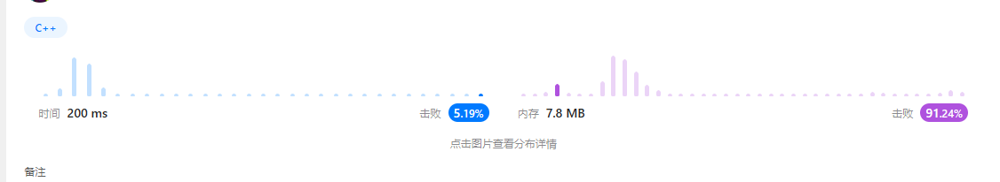

# 0 基础知识点


## 0.1 常用数据结构操作的复杂度


## 0.2 大O复杂度比较


## 0.3 常用C++处理函数

1. 判断是否为字母：`isalpha()`
2. 判断是否为数字：`isdigit()`
3. 判断是否是数字或字母：`isalnum()`
4. 判断是否是大/小写：`islower()`、`isupper()`
5. 大小写互转：`toupper`、`tolower()`

## 0.4 实现字符串相关的库函数

Reference: [C Programming/string.h - Wikibooks, open books for an open world](https://en.wikibooks.org/wiki/C_Programming/string.h)

[string.c source code linux/lib/string.c\] - Codebrowser](https://codebrowser.dev/linux/linux/lib/string.c.html#strlen)

### 0.4.1 strcpy

```c
char *strcpy(char *dest, const char *src)
{
	char *tmp = dest;
	while ((*dest++ = *src++) != '\0');
	return tmp;
}
```

### 0.4.2 strncpy

```c
char *strncpy(char *dest, const char *src, size_t n)
{
	char *tmp = dest;
	while (count--) 
    {
		if ((*tmp = *src) != 0)	src++;
		tmp++;
	}
	return dest;
}
```

### 0.4.3 strchr

```c
char *strchr(char *str, int c) 
{
    for(; *str != (char)c; ++str)
        if(*str == '\0')	return NULL;
    return str;
}
```

### 0.4.4 strcat

```c
char *strcat(char *dest, char *src)
{
    char *tmp = dest;
	while (*dest)	dest++;
	while ((*dest++ = *src++) != '\0');
	return tmp;
}
```

### 0.4.5 strncat

```c
char *strncat(char *dest, const char *src, size_t count)
{
	char *tmp = dest;
	if (count) 
    {
		while (*dest)	dest++;
		while ((*dest++ = *src++) != 0) 
        {
			if (--count == 0) 
            {
				*dest = '\0';
				break;
			}
		}
	}
	return tmp;
}
```

### 0.4.6 strncat

```c
int strcmp(const char *cs, const char *ct)
{
	unsigned char c1, c2;
	while (1) 
    {
		c1 = *cs++;
		c2 = *ct++;
		if (c1 != c2)
			return c1 < c2 ? -1 : 1;
		if (!c1)
			break;
	}
	return 0;
}
```

### 0.4.7 strncmp

```c
/**
 * strncmp - Compare two length-limited strings
 * @cs: One string
 * @ct: Another string
 * @count: The maximum number of bytes to compare
 */
int strncmp(const char *cs, const char *ct, size_t count)
{
	unsigned char c1, c2;
	while (count) 
    {
		c1 = *cs++;
		c2 = *ct++;
		if (c1 != c2)
			return c1 < c2 ? -1 : 1;
		if (!c1)
			break;
		count--;
	}
	return 0;
}
```

### 0.4.8 strchr

```c
/**
 * strchr - Find the first occurrence of a character in a string
 * @s: The string to be searched
 * @c: The character to search for
 *
 * Note that the %NUL-terminator is considered part of the string, and can
 * be searched for.
 */
char *strchr(const char *s, int c)
{
	for (; *s != (char)c; ++s)
		if (*s == '\0')
			return NULL;
	return (char *)s;
}
```

### 0.4.9 strchr

```c
/**
 * strrchr - Find the last occurrence of a character in a string
 * @s: The string to be searched
 * @c: The character to search for
 */
char *strrchr(const char *s, int c)
{
	const char *last = NULL;
	do 
    {
		if (*s == (char)c)
			last = s;
	} while (*s++);
	return (char *)last;
}
```

### 0.4.10 strlen

```
size_t strlen(const char *str)
{
    const char *s;
    for (s = str; *s; ++s);
    return(s - str);
}
```

### 0.4.11 strnlen

```c
size_t strnlen(const char *s, size_t count)
{
	const char *sc;
	for (sc = s; count-- && *sc != '\0'; ++sc);
	return sc - s;
}
```

### 0.4.12 strstr

```c
/**
 * strstr - Find the first substring in a %NUL terminated string
 * @s1: The string to be searched
 * @s2: The string to search for
 */
char *strstr(const char *s1, const char *s2)
{
	size_t l1, l2;
	l2 = strlen(s2);
	if (!l2)
		return (char *)s1;
	l1 = strlen(s1);
	while (l1 >= l2) {
		l1--;
		if (!memcmp(s1, s2, l2))
			return (char *)s1;
		s1++;
	}
	return NULL;
}
```

### 0.4.13 strnstr

```c
/**
 * strnstr - Find the first substring in a length-limited string
 * @s1: The string to be searched
 * @s2: The string to search for
 * @len: the maximum number of characters to search
 */
char *strnstr(const char *s1, const char *s2, size_t len)
{
	size_t l2;
	l2 = strlen(s2);
	if (!l2)
		return (char *)s1;
	while (len >= l2) {
		len--;
		if (!memcmp(s1, s2, l2))
			return (char *)s1;
		s1++;
	}
	return NULL;
}
```

### 0.4.14 memcmp

```c
/**
 * memcmp - Compare two areas of memory
 * @cs: One area of memory
 * @ct: Another area of memory
 * @count: The size of the area.
 */
int memcmp(const void *cs, const void *ct, size_t count)
{
	const unsigned char *su1, *su2;
	int res = 0;
#ifdef CONFIG_HAVE_EFFICIENT_UNALIGNED_ACCESS
	if (count >= sizeof(unsigned long)) 
    {
		const unsigned long *u1 = cs;
		const unsigned long *u2 = ct;
		do 
        {
			if (get_unaligned(u1) != get_unaligned(u2))
				break;
			u1++;
			u2++;
			count -= sizeof(unsigned long);
		} while (count >= sizeof(unsigned long));
		cs = u1;
		ct = u2;
	}
#endif
    for (su1 = cs, su2 = ct; 0 < count; ++su1, ++su2, count--)
		if ((res = *su1 - *su2) != 0)
			break;
	return res;		// 下面这种方法即可
}
```

### 0.4.15 memchr

```c
/**
 * memchr - Find a character in an area of memory.
 * @s: The memory area
 * @c: The byte to search for
 * @n: The size of the area.
 *
 * returns the address of the first occurrence of @c, or %NULL
 * if @c is not found
 */
void *memchr(const void *s, int c, size_t count)
{
	const unsigned char *p = s;
	while (count--)
		if ((unsigned char)c == *p++)
			return (void *)(p - 1);
	return NULL;
}
```

### 0.4.16 memset

```c
/**
 * memset - Fill a region of memory with the given value
 * @s: Pointer to the start of the area.
 * @c: The byte to fill the area with
 * @count: The size of the area.
 *
 * Do not use memset() to access IO space, use memset_io() instead.
 */
void *memset(void *s, int c, size_t count)
{
	char *xs = s;
	while (count--)
		*xs++ = c;
	return s;
}
```

### 0.4.17 memcpy

```c
/**
 * memcpy - Copy one area of memory to another
 * @dest: Where to copy to
 * @src: Where to copy from
 * @count: The size of the area.
 *
 * You should not use this function to access IO space, use memcpy_toio()
 * or memcpy_fromio() instead.
 */
void *memcpy(void *dest, const void *src, size_t count)
{
	char *tmp = dest;
	const char *s = src;
	while (count--)
		*tmp++ = *s++;
	return dest;
}
```

### 0.4.18 memchr

```c
/**
 * memchr - Find a character in an area of memory.
 * @s: The memory area
 * @c: The byte to search for
 * @n: The size of the area.
 *
 * returns the address of the first occurrence of @c, or %NULL
 * if @c is not found
 */
void *memchr(const void *s, int c, size_t n)
{
	const unsigned char *p = s;
	while (n-- != 0) {
        	if ((unsigned char)c == *p++) {
			return (void *)(p - 1);
		}
	}
	return NULL;
}
```

# 1 基本输入输出练习

[牛客竞赛_ACM/NOI/CSP/CCPC/ICPC算法编程高难度练习赛_牛客竞赛OJ (nowcoder.com)](https://ac.nowcoder.com/acm/contest/5652#question)

## 1.1 A+B(1)

计算a+b

数据范围： 数据组数$1≤t≤100$，数据大小满足 $1≤n≤1000$
输入描述:

```
输入包括两个正整数a,b(1 <= a, b <= 1000),输入数据包括多组。
```

输出描述:

```
输出a+b的结果
```

代码：

```c++
#include<iostream>
using namespace std;

int main()
{
	int m, n;
	while(cin >> m >> n)
	{
		cout << m + n << endl;
	}
	return 0;
}
```

## 1.2 A+B(2)

计算a+b

数据范围：数据组数满足$1 <= t <= 100$，数据大小满足 $1 <= a, b <= 1000$

输入描述:

```
输入第一行包括一个数据组数t(1 <= t <= 100)
接下来每行包括两个正整数a,b(1 <= a, b <= 1000)
```

输出描述:

```
输出a+b的结果
```

代码：

```c++
#include<iostream>
using namespace std;

int main()
{
	int line_num(0);
	int m(0), n(0);
	
	cin >> line_num;
	while(line_num--)
	{
		cin >> m >> n;
		cout << m + n << endl;
	}

	return 0;
}
```

## 1.3 A+B(3)

计算a+b

数据范围：数据组数满足$1≤t≤100$，数据大小满足$1≤n≤100$

输入描述:

```
输入包括两个正整数a,b(1 <= a, b <= 10^9),输入数据有多组, 如果输入为0 0则结束输入
```

输出描述:

```
输出a+b的结果
```

代码：

```c++
#include<iostream>  
using namespace std;  
  
int main()  
{  
    int m(0), n(0);  
  
    while(1)  
    {  
        cin >> m >> n;  
        if(m == 0 and n == 0)    break;  
        cout << m + n << endl;  
    }  
  
    return 0;  
}
```

## 1.4 A+B(4)

计算一系列数的和

数据范围：数据组数满足$1≤t≤100$，每组数据中整数个数满足 $1≤n≤100$  ，每组数据中的值满足 $1≤val≤100$

输入描述:

```
输入包括两个正整数a,b(1 <= a, b <= 10^9),输入数据有多组, 如果输入为0 0则结束输入
```

输出描述:

```
输出a+b的结果
```

代码：

```c++
#include<iostream>
using namespace std;  
  
int main()  
{  
    int n(0);  
    int temp(0);  
    int sum(0);  
  
    while(1)  
    {  
        cin >> n;  
        if(n == 0)    break;  
        while(n--)  
        {  
            cin >> temp;  
            sum += temp;  
        }  
                cout << sum << endl;  
        sum = 0;  
    }  
  
    return 0;  
}
```

## 1.5 A+B(5)

计算一系列数的和

数据范围：数据组数满足$1≤t≤100$，每组数据中整数个数满足 $1≤n≤100$  ，每组数据中的值满足 $1≤val≤100$

输入描述:

```
输入的第一行包括一个正整数t(1 <= t <= 100), 表示数据组数。  
接下来t行, 每行一组数据。  
每行的第一个整数为整数的个数n(1 <= n <= 100)。  
接下来n个正整数, 即需要求和的每个正整数。
```

输出描述:

```
每组数据输出求和的结果
```

代码：

```c++
#include<iostream>
using namespace std;

int main()
{
	int t(0);
	int n(0);
	int temp(0);
	int sum(0);

	cin >> t;
	while(t--)
	{
		cin >> n;
		if(n == 0)	break;
		while(n--)
		{
			cin >> temp;
			sum += temp;
		}
		
		cout << sum << endl;
		sum = 0;
	}

	return 0;
}
```

## 1.6 A+B(6)

计算一系列数的和

数据范围：$1≤n≤1000$，所有数都满足 $1≤val≤1000$

输入描述:

```
输入数据有多组, 每行表示一组输入数据。
每行的第一个整数为整数的个数n(1 <= n <= 100)。
接下来n个正整数, 即需要求和的每个正整数。
```

输出描述:

```
每组数据输出求和的结果
```

代码：

```c++
#include<iostream>
using namespace std;

int main()
{
	int n(0);
	int temp(0);
	int sum(0);

	while(cin >> n)
	{
		if(n == 0)	break;
		while(n--)
		{
			cin >> temp;
			sum += temp;
		}
		
		cout << sum << endl;
		sum = 0;
	}

	return 0;
}
```

## 1.7 A+B(7)

计算一系列数的和

输入描述:

```
输入数据有多组, 每行表示一组输入数据。

每行不定有n个整数，空格隔开。(1 <= n <= 100)。
```

输出描述:

```
每组数据输出求和的结果
```

代码：

```c++
#include<iostream>
using namespace std;

int main()
{
	int temp(0);
	int sum(0);
	
	while(cin >> temp)		// 遇到空格或换行符停止
	{	
		sum += temp;
		if(getchar() == '\n')	// 读取换行符
		{
			cout << sum << endl;
			sum = 0;
		}
	}
	
	return 0;
}
```

## 1.8 字符串排序(1)

对输入的字符串进行排序后输出

输入描述:

```
输入有两行，第一行n
第二行是n个字符串，字符串之间用空格隔开
```

输出描述:

```
输出一行排序后的字符串，空格隔开，无结尾空格
```

代码：

```c++
#include<iostream>
#include<algorithm>
#include<vector>
using namespace std;

int main()
{
	vector<string> res;
	string temp;
	int size(0);
	
	cin >> size;
	while(size--)
	{
		cin >> temp;
		res.emplace_back(temp);
	}
	
	sort(res.begin(), res.end());
	for(auto s : res)
		cout << s << " ";
	
	return 0;
}
```

## 1.9 字符串排序(2)

对输入的字符串进行排序后输出

输入描述:

```
多个测试用例，每个测试用例一行。
每行通过空格隔开，有n个字符，n＜100
```

输出描述:

```
对于每组测试用例，输出一行排序过的字符串，每个字符串通过空格隔开
```

代码：

```c++
#include<iostream>
#include<algorithm>
#include<vector>
using namespace std;

int main()
{
	vector<string> res;
	string temp;
	
	while(cin >> temp)
	{
		res.emplace_back(temp);
		if(getchar() == '\n')
		{
			sort(res.begin(), res.end());
			for(auto s : res)
				cout << s << " ";
			cout << endl;
			
			res.clear();
		}
	}
	
	return 0;
}
```

## 1.10 字符串排序(3)

对输入的字符串进行排序后输出

输入描述:

```
多个测试用例，每个测试用例一行。
每行通过空格隔开，有n个字符，n＜100
```

输出描述:

```
对于每组用例输出一行排序后的字符串，用','隔开，无结尾空格
```

代码：

```c++
#include<iostream>
#include<algorithm>
#include<vector>
#include<sstream>
using namespace std;

int main()
{
	string s;
	
	while(getline(cin, s))
	{
		vector<string>buf;
		stringstream ss(s);
		string temp;
		while(getline(ss, temp, ','))
		{
			buf.push_back(temp);
		}
		sort(buf.begin(), buf.end());
		for(decltype(buf.size()) i = 0; i < buf.size()-1; i++)
		{
			cout << buf[i] << ",";
		}
		cout << buf.back() << endl;
		
	}
	return 0;
}
```

## 1.11 自测本地通过提交为0

每年前几场在线笔试编程题的时候，总有同学询问为什么我本地测试通过，自测也通过，提交代码系统却返回通过率0。

这不是系统的错，可能是因为：
1.你对题目理解错了，你的代码只过了样例或你自己的数据
2.你的代码逻辑有问题，你的代码只过了样例或你自己的数据

总之就是你的代码只是过了样例和自测数据，后台的测试数据你根本不可见，要多自己思考。

这个题目如果你提交后通过率为0，又觉得自己代码是正确的，可以 点击查看 通过的代码

谨记：
当你笔试的时候怀疑系统或者题目数据有问题的时候请务必先怀疑自己的代码!

当你笔试的时候怀疑系统或者题目数据有问题的时候请务必先怀疑自己的代码!

数据范围： $0<a,b<2×10^{10}$

输入描述:

```
输入有多组测试用例，每组空格隔开两个整数
```

输出描述:

```
对于每组数据输出一行两个整数的和
```

代码：

```c++
#include<iostream>
using namespace std;

int main()
{
	int temp(0);
	int sum(0);
	
	while(cin >> temp)		// 遇到空格或换行符停止
	{	
		sum += temp;
		if(getchar() == '\n')	// 读取换行符
		{
			cout << sum << endl;
			sum = 0;
		}
	}
	
	return 0;
}
```

# 2 链表

## 2.1 删除单链表的重复节点

[面试题 02.01. 移除重复节点 - 力扣（Leetcode）](https://leetcode.cn/problems/remove-duplicate-node-lcci/)

### 2.1.1 双指针加二重循环

时间复杂度：$O(N^2)$，其中 $N$ 是给定链表中节点的数目。

空间复杂度：$O(1)$。

```c++
/**
 * Definition for singly-linked list.
 * struct ListNode {
 *     int val;
 *     ListNode *next;
 *     ListNode(int x) : val(x), next(NULL) {}
 * };
 */
class Solution {
public:
    ListNode* removeDuplicateNodes(ListNode* head) {
        ListNode* ob = head;
        while (ob != nullptr) {
            ListNode* oc = ob;
            while (oc->next != nullptr) {
                if (oc->next->val == ob->val) {
                    oc->next = oc->next->next;
                } else {
                    oc = oc->next;
                }
            }
            ob = ob->next;
        }
        return head;
    }
};
```

### 2.1.2 哈希表

时间复杂度：$O(N)$，其中$N$是给定链表中节点的数目。

空间复杂度：$O(N)$。在最坏情况下，给定链表中每个节点都不相同，哈希表中需要存储所有的$N$个值。

```c++
/**
 * Definition for singly-linked list.
 * struct ListNode {
 *     int val;
 *     ListNode *next;
 *     ListNode(int x) : val(x), next(NULL) {}
 * };
 */
class Solution {
public:
    ListNode* removeDuplicateNodes(ListNode* head) 
    {
        if (head == nullptr) return head;
        unordered_set<int> occurred = {head->val};
        ListNode* pos = head;
        // 枚举前驱节点
        while (pos->next != nullptr) {
            // 当前待删除节点
            ListNode* cur = pos->next;
            if (occurred.find(cur->val) == occurred.end()) {
                occurred.insert(cur->val);
                pos = pos->next;
            } else {
                pos->next = pos->next->next;
            }
        }
        pos->next = nullptr;
        return head;
    }
};
```

## 2.2 如何找出链表的倒数第K个元素

[剑指 Offer 22. 链表中倒数第k个节点 - 力扣（Leetcode）](https://leetcode.cn/problems/lian-biao-zhong-dao-shu-di-kge-jie-dian-lcof/)

### 2.2.1 快慢指针法

```c++
class Solution {
public:
    ListNode* getKthFromEnd(ListNode* head, int k) {
        ListNode *p = head, *q = head; //初始化
        while(k--) {   //将 p指针移动 k 次
            p = p->next;
        }
        while(p != nullptr) {//同时移动，直到 p == nullptr
            p = p->next;
            q = q->next;
        }
        return q;
    }
};
```

### 2.2.2 暴力解法

```c++
/**
 * Definition for singly-linked list.
 * struct ListNode {
 *     int val;
 *     ListNode *next;
 *     ListNode(int x) : val(x), next(NULL) {}
 * };
 */
class Solution {
public:
    ListNode* getKthFromEnd(ListNode* head, int k) {
        ListNode *temp = head;
        int size = 0;

        while(temp)
        {
            temp = temp->next;
            ++size;
        }

        temp = head;
        size = size - k;
        while(size)
        {
            temp = temp->next;
            size--;
        }

        return temp;
    }
};
```

## 2.3 如何找出链表的中间节点

[876. 链表的中间结点 - 力扣（Leetcode）](https://leetcode.cn/problems/middle-of-the-linked-list/)

### 2.3.1 暴力解法

```c++
/**
 * Definition for singly-linked list.
 * struct ListNode {
 *     int val;
 *     ListNode *next;
 *     ListNode() : val(0), next(nullptr) {}
 *     ListNode(int x) : val(x), next(nullptr) {}
 *     ListNode(int x, ListNode *next) : val(x), next(next) {}
 * };
 */
class Solution {
public:
    ListNode* middleNode(ListNode* head) {
        ListNode *temp = head;
        int size = 0;

        temp = head;
        while(temp)
        {
            temp = temp->next;
            ++size;
        }

        temp = head;
        size = size / 2;
        while(size)
        {
            --size;
            temp = temp->next;
        }

        return temp;
    }
};
```

### 2.3.2 快慢指针

```c++
class Solution {
public:
    ListNode* middleNode(ListNode* head) {
        ListNode *fast = head, *slow = head;
        while (fast != nullptr && fast->next != nullptr) {
            fast = fast->next->next;
            slow = slow->next;
        }
        return slow;
    }
};
```

## 2.4 反转链表（206）

[剑指 Offer 24. 反转链表 - 力扣（Leetcode）](https://leetcode.cn/problems/fan-zhuan-lian-biao-lcof/)

### 2.4.1 递归

1. 使用递归函数，一直递归到链表的最后一个结点，该结点就是反转后的头结点，记作 $ret$；
2. 此后，每次函数在返回的过程中，让当前结点的下一个结点的  $next$ 指针指向当前节点；
3. 同时让当前结点的  $next$ 指针指向 $nullptr$，从而实现从链表尾部开始的局部反转；
4. 当递归函数全部出栈后，链表反转完成。


```c++
/**
 * Definition for singly-linked list.
 * struct ListNode {
 *     int val;
 *     ListNode *next;
 *     ListNode(int x) : val(x), next(NULL) {}
 * };
 */
class Solution {
public:
    ListNode* reverseList(ListNode* head) {
        if(head == nullptr || head->next == nullptr)
            return head;

        ListNode *current = head;
        ListNode *later = head->next;

        head = reverseList(later);
        later->next = current;
        current->next = nullptr;
        return head;
    }
};
```

### 2.4.5 双指针

1. 定义两个指针： $pre$ 和 $cur$ ；$pre$在前 $cur$在后。
2. 每次让 $pre$的 $next$ 指向 $cur$，实现一次局部反转
3. 局部反转完成之后， $pre$和 $cur$同时往前移动一个位置
4. 循环上述过程，直至 $pre$到达链表尾部


```c++
/**
 * Definition for singly-linked list.
 * struct ListNode {
 *     int val;
 *     ListNode *next;
 *     ListNode() : val(0), next(nullptr) {}
 *     ListNode(int x) : val(x), next(nullptr) {}
 *     ListNode(int x, ListNode *next) : val(x), next(next) {}
 * };
 */
class Solution {
public:
    ListNode* reverseList(ListNode* head) {
        ListNode *cur = nullptr;
        ListNode *pre = head;
        
        while (pre != nullptr) {
            ListNode* t = pre->next;
            pre->next = cur;
            cur = pre;
            pre = t;
        }
        return cur;
    }
};
```

## 2.5 环形链表

[141. 环形链表 - 力扣（Leetcode）](https://leetcode.cn/problems/linked-list-cycle/)

### 2.5.1 快慢指针

时间复杂度：$O(N)$，其中 $N$是链表中的节点数。

当链表中不存在环时，快指针将先于慢指针到达链表尾部，链表中每个节点至多被访问两次。

当链表中存在环时，每一轮移动后，快慢指针的距离将减小一。而初始距离为环的长度，因此至多移动 $N$ 轮。

空间复杂度：$O(1)$。我们只使用了两个指针的额外空间。

```c++
/**
 * Definition for singly-linked list.
 * struct ListNode {
 *     int val;
 *     ListNode *next;
 *     ListNode(int x) : val(x), next(NULL) {}
 * };
 */
class Solution {
public:
    bool hasCycle(ListNode *head) {
        // 快慢指针
        ListNode * bike = head;
        ListNode * car = head;

        // 循环内 bike 每次后移一个结点， car 每次后移 2 个结点
        // car 和 car->next 需要不为空，否则会发生非法内存访问
        // car 不为空，那么 bike 肯定也不为空
        while(car != nullptr && car->next != nullptr) 
        {
            bike = bike->next;
            car = car->next->next;

            if(car == bike) return true;
        }
        return false;
    }
};
```

### 2.5.2 哈希表

**复杂度分析**

时间复杂度：$O(N)$，其中 $N$ 是链表中的节点数。最坏情况下我们需要遍历每个节点一次。

空间复杂度：$O(N)$，其中 $N$ 是链表中的节点数。主要为哈希表的开销，最坏情况下我们需要将每个节点插入到哈希表中一次。

```c++
class Solution {
public:
    bool hasCycle(ListNode *head) {
        unordered_set<ListNode*> seen;
        while (head != nullptr) {
            if (seen.count(head)) {
                return true;
            }
            seen.insert(head);
            head = head->next;
        }
        return false;
    }
};
```

## 2.6 链表相交

[面试题 02.07. 链表相交 - 力扣（Leetcode）](https://leetcode.cn/problems/intersection-of-two-linked-lists-lcci/)

### 2.6.1 双指针

复杂度分析：
时间复杂度 $O(a+b)$： 最差情况下（即 $∣a−b∣=1$， $c=0$ ），此时需遍历 $a+b$ 个节点。
空间复杂度 $O(1)$： 节点指针 A , B 使用常数大小的额外空间。

```c++
/**
 * Definition for singly-linked list.
 * struct ListNode {
 *     int val;
 *     ListNode *next;
 *     ListNode(int x) : val(x), next(NULL) {}
 * };
 */
class Solution {
public:
    ListNode *getIntersectionNode(ListNode *headA, ListNode *headB) {
        ListNode *tempA(headA), *tempB(headB);

        while(tempA != tempB)
        {
            if(tempA == nullptr)    tempA = headB;
            else    tempA = tempA->next;

            if(tempB == nullptr)    tempB = headA;
            else    tempB = tempB->next;
        }

        return tempA;
    }
};

// 更简洁一点
class Solution {
public:
    ListNode *getIntersectionNode(ListNode *headA, ListNode *headB) {
        ListNode *A = headA, *B = headB;
        while (A != B) {
            A = A != nullptr ? A->next : headB;
            B = B != nullptr ? B->next : headA;
        }
        return A;
    }
};
```

## 2.7 回文链表

[234. 回文链表 - 力扣（Leetcode）](https://leetcode.cn/problems/palindrome-linked-list/)

### 2.7.1 栈

```c++
/**
 * Definition for singly-linked list.
 * struct ListNode {
 *     int val;
 *     ListNode *next;
 *     ListNode() : val(0), next(nullptr) {}
 *     ListNode(int x) : val(x), next(nullptr) {}
 *     ListNode(int x, ListNode *next) : val(x), next(next) {}
 * };
 */
class Solution {
public:
    bool isPalindrome(ListNode* head) {
        stack<int> s;
        int size(0), i(0);
        ListNode *temp(head);

        while(temp)
        {
            s.push(temp->val);
            temp = temp->next;
            ++size;
        }

        temp = head;
        while(temp)
        {
            if(temp->val != s.top())    return false;
            temp = temp->next;
            s.pop();
            ++i;
            if(i == size / 2)   return true;
        }

        return true;
    }
};
```

### 2.7.2 快慢指针

破坏了原链表的结构。

```c++
class Solution {
public:
    bool isPalindrome(ListNode* head) {
        if(!head || !head->next)
            return 1;
        ListNode *fast = head, *slow = head;
        ListNode *p, *pre = NULL;
        while(fast && fast->next){
            p = slow;
            slow = slow->next;    //快慢遍历
            fast = fast->next->next;

            p->next = pre;  //翻转
            pre = p;
        }
        if(fast)  //奇数个节点时跳过中间节点
            slow = slow->next;

        while(p){       //前半部分和后半部分比较
            if(p->val != slow->val)
                return 0;
            p = p->next;
            slow = slow->next;
        }
        return 1;
    }
};
```

## 2.8 合并两个有序链表（21）

[21. 合并两个有序链表 - 力扣（Leetcode）](https://leetcode.cn/problems/merge-two-sorted-lists/)

### 2.8.1 迭代

```c++
/**
 * Definition for singly-linked list.
 * struct ListNode {
 *     int val;
 *     ListNode *next;
 *     ListNode() : val(0), next(nullptr) {}
 *     ListNode(int x) : val(x), next(nullptr) {}
 *     ListNode(int x, ListNode *next) : val(x), next(next) {}
 * };
 */
class Solution {
public:
    ListNode* mergeTwoLists(ListNode* list1, ListNode* list2) {
        ListNode *list = new ListNode(0);
        ListNode *next = list;

        while(list1 && list2)
        {
            if(list1->val <= list2->val)
            {
                next->next = list1;
                list1 = list1->next;
            }
            else
            {
                next->next = list2;
                list2 = list2->next;
            }
            next = next->next;
        }

        // l1 或 l2 可能还有剩余结点没有合并， 
        // 由于从上面的 while 循环中退出， 那么链表 l1 和 l2 至少有一个已经遍历结束
        if(list1 != nullptr) next->next = list1;
        if(list2 != nullptr) next->next = list2;
        
        return list->next;
    }
};
```

### 2.8.2 递归

```c++
class Solution {
public:
    ListNode* mergeTwoLists(ListNode* l1, ListNode* l2) {
        if (l1 == NULL) {
            return l2;
        }
        if (l2 == NULL) {
            return l1;
        }
        if (l1->val <= l2->val) {
            l1->next = mergeTwoLists(l1->next, l2);
            return l1;
        }
        l2->next = mergeTwoLists(l1, l2->next);
        return l2;
    }
};
```

# 3 数组

## 3.1 最大子数组和（53）

[53. 最大子数组和 - 力扣（Leetcode）](https://leetcode.cn/problems/maximum-subarray/)

### 3.1.1 暴力解法

时间复杂度：$O(N^2)$

空间复杂度：$O(1)$

```c++
class Solution {
public:
    int maxSubArray(vector<int>& nums) {
        int sum(INT_MIN);
        int temp(0);

        for(int i = 0; i < nums.size(); ++i)
        {
            for(int j = i; j < nums.size(); ++j)
            {
                temp += nums.at(j);
                sum = sum > temp ? sum : temp;
            }
            temp = 0;
        }

        return sum;
    }
};
```

### 3.1.2 分治

1. 取数组中心点为中心；
2. 最大子序要么全在中心左边，要么在右边，要么跨中心；
3. 分三种情况进行考虑 跨中心的情况，再分治成中心点左侧和右侧的最大子序和问题。

时间复杂度：$O(Nlog(N))$

空间复杂度：$O(log(N))$


```c++
class Solution {
public:
    int maxSubArray(vector<int>& nums) {
        return maxSubArrayHelper(nums, 0, nums.size() - 1);
    }

    int maxSubArrayHelper(vector<int>& nums, int left, int right)
    {
        if(left == right)   return nums[left];

        int center = (left + right) / 2;
        int leftMax = maxSubArrayHelper(nums, left, center);
        int rightMax = maxSubArrayHelper(nums, center + 1, right);

        int leftCrossMax = INT_MIN; // 初始化一个值
        int leftCrossSum = 0;
        for (int i = center ; i >= left ; i --) 
        {
            leftCrossSum += nums[i];
            leftCrossMax = max(leftCrossSum, leftCrossMax);
        }

        // 计算包含右侧子序列最后一个元素的子序列最大值
        int rightCrossMax = nums[center + 1];
        int rightCrossSum = 0;
        for (int i = center + 1; i <= right ; i ++) 
        {
            rightCrossSum += nums[i];
            rightCrossMax = max(rightCrossSum, rightCrossMax);
        }
        
        int crossMax = leftCrossMax + rightCrossMax;
        return max(crossMax, max(leftMax, rightMax));
    }
};
```

### 3.1.3 贪心法

时间复杂度：$O(N)$

空间复杂度：$O(1)$

```c++
class Solution
{
public:
    int maxSubArray(vector<int> &nums)
    {
        //类似寻找最大最小值的题目，初始值一定要定义成理论上的最小最大值
        int result = INT_MIN;
        int numsSize = int(nums.size());
        int sum = 0;
        for (int i = 0; i < numsSize; i++)
        {
            sum += nums[i];
            result = max(result, sum);
            //如果sum < 0，重新开始找子序串
            if (sum < 0)
            {
                sum = 0;
            }
        }

        return result;
    }
};
```

### 3.1.4 动态规划

时间复杂度：$O(N)$

空间复杂度：$O(1)$

```c++
class Solution
{
public:
    int maxSubArray(vector<int> &nums)
    {
        //类似寻找最大最小值的题目，初始值一定要定义成理论上的最小最大值
        int result = INT_MIN;
        int numsSize = int(nums.size());

        int sum = nums[0];
        result = nums[0];
        for (int i = 1; i < numsSize; i++)
        {
            sum = max(sum + nums[i], nums[i]);
            result = max(result, sum);
        }

        return result;
    }
};
```

## 3.2 原地移除元素（27）

[27. 移除元素 - 力扣（Leetcode）](https://leetcode.cn/problems/remove-element/)

### 3.2.1 通用解法（双指针）

时间复杂度：$O(N)$

空间复杂度：$O(1)$

```c++
class Solution {
public:
    int removeElement(vector<int>& nums, int val) {
        int slow = 0;

        for(int i = 0; i < nums.size(); i++)
        {
            if(nums[i] != val)
            {
                nums[slow++] = nums[i];
            }
        }

        return slow;
    }
};
```

### 3.2.2 优化后的双指针

```c++
class Solution {
public:
    int removeElement(vector<int>& nums, int val) {
        int left = 0, right = nums.size();
        while (left < right) {
            if (nums[left] == val) {
                nums[left] = nums[right - 1];
                right--;
            } else {
                left++;
            }
        }
        return left;
    }
};
```

## 3.3 合并两个有序数组（88）

[88. 合并两个有序数组 - 力扣（Leetcode）](https://leetcode.cn/problems/merge-sorted-array/)

### 3.3.1 STL库

```c++
class Solution {
public:
    void merge(vector<int>& nums1, int m, vector<int>& nums2, int n) {
        for(int i = 0; i < n; ++i)  nums1[m + i] = nums2[i];
        sort(nums1.begin(), nums1.begin() + m + n);
    }
};
```

### 3.3.2 从后面开始确定

时间复杂度：$O(M+N)$

空间复杂度：$O(1)$

如果两个数组从结尾向开头（数字从大到小）进行比较，那么每次把比较之后的数字放置到 nums1 中的后面，由于后面的数字本身就是提供出来的多余的位置，都是 0，因此不需要对 nums1 进行移动。

1. 当 $m > 0$ 并且 $n > 0 $ 时，从后向前比较  $num1[m−1]$ 和  $nums2[n−1] $ ：
   - 如果是  $nums1[m−1]$ 大，则把   $num1[m−1]$ 放到 $num1$ 的第 $m+n−1$ 位置，并让 $m-=1$。
   - 如果是 $nums2[n−1] $ 大，则把 $nums2[n−1]$ 放到 $num1$ 的第 $m+n−1$ 位置，并让 $n-=1$。
2. 当上面的遍历条件结束的时候，此时 m 和 n 至少有一个为 0。
   - 当 $m == 0$ 时，说明 num1 的数字恰好用完了，此时 nums2 可能还剩元素，需要复制到 nums1 的头部；
   - 当 $n == 0$ 时，说明 num2 的数字恰好用完了，此时 nums1 可能还剩元素，由于剩余的这些元素一定是 nums1 和 nums2 中最小的元素，所以不用动，直接留在原地就行。

```c++
class Solution {
public:
    void merge(vector<int>& nums1, int m, vector<int>& nums2, int n) {
        int k = m + n - 1;
        while (m > 0 && n > 0) {
            if (nums1[m - 1] > nums2[n - 1]) {
                nums1[k] = nums1[m - 1];
                m --;
            } else {
                nums1[k] = nums2[n - 1];
                n --;
            }
            k --;
        }
        for (int i = 0; i < n; ++i) {
            nums1[i] = nums2[i];
        }
    }
};
```

### 3.3.3 从前面开始确定（归并排序）

时间复杂度：$O(M+N)$

空间复杂度：$O(M+N)$

```c++
class Solution {
public:
    void merge(vector<int>& nums1, int m, vector<int>& nums2, int n) {   
        vector<int> temp(nums1);       //初始化m为nums1的拷贝
        int i = 0, j = 0, k = 0;

        while(i <= m-1 && j <= n-1)
        {
            if(temp[i] < nums2[j])                nums1[k++] = temp[i++];
            else               nums1[k++] = nums2[j++];
        }
        while(i <= m-1)         
        {
            nums1[n+i] = temp[i];
            i++;
        }
         while(j <= n-1)
        {
            nums1[m+j] = nums2[j];
            j++;
        }

    }
};
```

## 3.4 查找共用字符（1002）

[1002. 查找共用字符 - 力扣（Leetcode）](https://leetcode.cn/problems/find-common-characters/)

### 3.4.1 利用数组求解

```c++
class Solution {
public:
    vector<string> commonChars(vector<string>& A) {
        vector<string> out;
        int num[100][26]={0};                  //建立一个二维数组，标记所有出现的字母次数
        for(int i =0;i<A.size() ;i++)
            for(int j=0;j<A[i].size();j++)
                num[i][(A[i][j]-'a')]++;
        
        for(int j=0;j<26;j++)                  //将所有列的最小值存到第一行
            for(int i=1;i<A.size();i++)
                num[0][j] = min (num[0][j],num[i][j]);
                    
        string str;                           //按照第一行保存的次数输出相应字母
        for(int i=0;i<26;i++){
            while(num[0][i]--)
            {
                str.clear();
                str.push_back((char)('a'+i));
                out.push_back(str);
            }
        }
        return out;
    }
};

```

### 3.4.2 哈希

```c++
class Solution {
public:
    vector<string> commonChars(vector<string>& A) {
        vector<string> res;
        vector<unordered_map<char,int>> vum(A.size());
        for(int i = 0;i < A.size();++i)
            for(char c : A[i])
                vum[i][c]++;        // 对应key的value++
 
        for(pair<char, int> pair : vum[0])     // 将所有key的value的最小值选择出来放在第一个向量中
        {
            int n = pair.second;
            for(int i = 1;i < vum.size();++i)
                n = min(n,vum[i][pair.first]);
            while(n--) res.push_back(string(1, pair.first));       
        }
        return res;
    }
};
```

## 3.5 寻找数组的中心下标（寻找数组的中心下标）

[724. 寻找数组的中心下标 - 力扣（Leetcode）](https://leetcode.cn/problems/find-pivot-index/)

### 3.5.1 暴力解法

时间复杂度：$O(N^2)$

空间复杂度：$O(1)$

```c++
class Solution {
public:
    int pivotIndex(vector<int>& nums) {
        int middle_index(-1);
        int temp_index(0);

        while(temp_index < nums.size())
        {
            int left_sum(0), right_sum(0);
            for(int i = 0; i < temp_index; ++i)
                left_sum += nums.at(i);
            
            for(int i = temp_index + 1; i < nums.size(); ++i)
                right_sum += nums.at(i);

            if(left_sum == right_sum)   
            {
                middle_index = temp_index;
                return middle_index;
            }

            cout << "left_sum: " << left_sum << endl;
            cout << "right_sum: " << right_sum << endl;

            ++temp_index;
        }

        return middle_index;
    }
};
```

### 3.5.2 转换思想的简单思路（前缀和，类似滑动窗口）

时间复杂度：$O(N)$

空间复杂度：$O(1)$

```c++
class Solution {
public:
    int pivotIndex(vector<int>& nums) {
        int sumleft = 0, sumTotal = 0;
        for(int n : nums)   
            sumTotal += n;
        for(int i = 0; i < nums.size(); ++i)
        {
            if(sumleft * 2  == sumTotal - nums[i])  
                return i;       //如果i此时满足中心索引要求，return
            sumleft += nums[i];
        }
        return -1;
    }
};

// 另一种解法，原理上是一样的
class Solution {
public:
    int pivotIndex(vector<int>& nums) {
        int sumLeft = 0, sumRight = accumulate(nums.begin(), nums.end(), 0);
        for (int i = 0; i < nums.size(); i++) {
            sumRight -= nums[i];
            // 若左侧元素和等于右侧元素和，返回中心下标 i
            if (sumLeft == sumRight)
                return i;
            sumLeft += nums[i];
        }
        return -1;
    }
};
```

## 3.6 数组中数字出现的次数

[剑指 Offer 56 - I. 数组中数字出现的次数 - 力扣（Leetcode）](https://leetcode.cn/problems/shu-zu-zhong-shu-zi-chu-xian-de-ci-shu-lcof/)

### <span style="background:#FFFFBB;">3.6.1 位运算</span>

**参考题解：**[剑指 Offer 56 - I. 数组中数字出现的次数 - 力扣（Leetcode）](https://leetcode.cn/problems/shu-zu-zhong-shu-zi-chu-xian-de-ci-shu-lcof/solutions/572857/jian-zhi-offer-56-i-shu-zu-zhong-shu-zi-tykom/)

时间复杂度：$O(N)$

空间复杂度：$O(1)$

1. **遍历执行异或：**

   - 设整型数组 $nums = [a,a,b,b,...,x,y]$ ，对 $nums$ 中所有数字执行异或，得到的结果为 $x⊕y$

2. **循环左移计算 $m$** ：

   - 根据异或运算定义，若整数 $x⊕y$ 某二进制位为 $1$ ，则 $x$ 和 $y$ 的此二进制位一定不同。换言之，找到 $x⊕y$ 某位为 $1$ 的二进制位，即可将数组 $nums$ 拆分为上述的两个子数组。根据与运算特点，可知对于任意整数 $a$ 有：
     - 若 $a \& 0001=1$，则  $a$ 的第一位为 $1$  ；
     - 若 $a \& 0010=1$，则 $a$ 的第二位为 $1$ ；
     - 以此类推……
   - 因此，初始化一个辅助变量 $m=1$，通过与运算从右向左循环判断，可 获取整数 $x⊕y$首位 $1$  ，记录于 $m$ 中，代码如下：

   ```c++
   while(n & m == 0) // m 循环左移一位，直到 z & m ！= 0
       m <<= 1
   ```

3. **拆分 $nums$ 为两个子数组；**

4. 分别遍历两个子数组执行异或：

   - 通过遍历判断 $nums$ 中各数字和 $m$ 做与运算的结果，可将数组拆分为两个子数组，并分别对两个子数组遍历求异或，则可得到两个只出现一次的数字，代码如下：

   ```c++
   for(int num : nums) {
       if(num & m) x ^= num;   // 若 num & m != 0 , 划分至子数组 1 ，执行遍历异或
       else y ^= num;          // 若 num & m == 0 , 划分至子数组 2 ，执行遍历异或
   }
   return vector<int> {x, y};  // 遍历异或完毕，返回只出现一次的数字 x 和 y
   ```

5. **返回值**：返回只出现一次的数字 $x, y$ 即可。


```c++
class Solution {
public:
    vector<int> singleNumbers(vector<int>& nums) {
        int x = 0, y = 0, n = 0, mask(0);
        for(int num : nums)             // 1. 遍历异或
            n ^= num;         
        mask = n ^ (-n);                // 2. 获取mask，区分分别包含x和y的子数组
        for(int num : nums) {           // 3. 遍历 nums 分组
            if(num & mask) x ^= num;    // 4. 当 num & mask != 0
            else y ^= num;              // 5. 当 num & mask == 0
        }
        return vector<int> {x, y};      // 6. 返回出现一次的数字
    }
};

```


## 3.7 数组中数字出现的次数 II  

[剑指 Offer 56 - II. 数组中数字出现的次数 II - 力扣（Leetcode）](https://leetcode.cn/problems/shu-zu-zhong-shu-zi-chu-xian-de-ci-shu-ii-lcof/)

### 3.7.1 哈希

```c++
class Solution {
public:
    int singleNumber(vector<int>& nums) {
        unordered_map<int, int> hash;
        for(int i = 0; i < nums.size(); ++i)    ++hash[nums[i]];

        for(auto temp : hash)   if(temp.second == 1)   return temp.first;
        return 0;   // 结果必然不会走到这一步
    }
};
```

### 3.7.2 位运算

> 🫠🫠🫠🫠🫠🫠🫠，这到底是怎么用的位运算？什么脑子能想到啊？而且效率还真的nm的高。

时间复杂度：$O(N)$

空间复杂度：$O(1)$

```c++
class Solution {
public:
    int singleNumber(vector<int>& nums) {
        int ans = 0;
        for(int i = 0; i < 32; ++i){
            int cnt = 0;
            for(int n : nums){
                // n & 1 << i 的值大于0即为真
                if(n & (1 << i)) cnt++;
            }
            // 构造只出现一次的那个数字，采用异或的方法生成二进制中的每一位
            if(cnt % 3 == 1) ans ^= (1 << i);
        }
        return ans;
    }
};
```

## 3.8 剑指 Offer 53 - II. 0～n-1中缺失的数字

[剑指 Offer 53 - II. 0～n-1中缺失的数字 - 力扣（Leetcode）](https://leetcode.cn/problems/que-shi-de-shu-zi-lcof/)

### 3.8.1 二分法

时间复杂度：$O(logN)$

空间复杂度：$O(1)$

```c++
class Solution {
public:
    int missingNumber(vector<int>& nums) {
        int left = 0, right = nums.size();
        while(left < right){
            int mid = (left + right) / 2;
            if(mid == nums[mid]) left = mid + 1;
            else right = mid;
        }
        return left;
    }
};
```

### 3.8.2 问题转换法

时间复杂度：$O(N)$

空间复杂度：$O(1)$

```c++
class Solution {
public:
    int missingNumber(vector<int>& nums) {
        int n = nums.size();
        int sum = 0;
        for(int i = 0; i < n; i ++)
            sum += nums[i];
        return n*(n + 1)/2 - sum;
    }
};
```

### 3.8.3 哈希数组

```c++
class Solution {
public:
    int missingNumber(vector<int>& nums) {
        int hash[50000]{0};
        for(int i = 0; i < nums.size(); ++i)
        {
            ++hash[nums[i]];
        }
        for(int i = 0; i < nums.size(); ++i)
        {
            if(hash[i] == 0)
            {
                return i;
            }
        }

        return nums.size();
    }
};
```

## 3.9 按奇偶排序数组

[905. 按奇偶排序数组 - 力扣（Leetcode）](https://leetcode.cn/problems/sort-array-by-parity/)

### 3.9.1 暴力解法

```c++
class Solution {
public:
    vector<int> sortArrayByParity(vector<int>& nums) {
        vector<int> fore_res, back_res;
        for(int i = 0; i < nums.size(); ++i)
        {
            if(nums[i] % 2 == 0)    fore_res.emplace_back(nums[i]);
            else    back_res.emplace_back(nums[i]);
        }

        for(int i = 0; i < back_res.size(); ++i)
        {
            fore_res.emplace_back(back_res[i]);
        }

        return fore_res;
    }
};
```

### 3.9.2 左右指针

```c++
class Solution {
public:
    vector<int> sortArrayByParity(vector<int>& nums) {
        int left = 0, right = nums.size() - 1;

        while(left != right)
        {
            if(nums[left] % 2 != 0)
            {
                swap(nums[left], nums[right]);
                --right;
            }
            else    ++left;
        }

        return nums;
    }
};
```

## 3.10 存在重复元素 II

[219. 存在重复元素 II - 力扣（Leetcode）](https://leetcode.cn/problems/contains-duplicate-ii/)

### 3.10.1 哈希表

时间复杂度：$O(N)$

空间复杂度：$O(N)$

```c++
class Solution {
public:
    bool containsNearbyDuplicate(vector<int>& nums, int k) {
        unordered_map<int, int> map;
        int length = nums.size();
        for (int i = 0; i < length; i++) {
            int num = nums[i];
            if (map.count(num) && i - map[num] <= k) {
                return true;
            }
            map[num] = i;
        }
        return false;
    }
};
```

### 3.10.2 滑动窗口

时间复杂度：$O(N)$

空间复杂度：$O(k)$

```c++
class Solution {
public:
    bool containsNearbyDuplicate(vector<int>& nums, int k) {
        unordered_set<int> s;
        int length = nums.size();
        for (int i = 0; i < length; i++) {
            if (i > k) {
                s.erase(nums[i - k - 1]);   // 将该元素从滑动窗口移除，以保证滑动窗口恒定大小
            }
            if (s.count(nums[i])) {         
                return true;
            }
            s.insert(nums[i]);
        }
        return false;
    }
};
```

## 3.11 有序数组中出现次数超过25%的元素（1287）

[1287. 有序数组中出现次数超过25%的元素 - 力扣（Leetcode）](https://leetcode.cn/problems/element-appearing-more-than-25-in-sorted-array/)

### 3.11.1 哈希表

```c++
class Solution {
public:
    int findSpecialInteger(vector<int>& arr) {
        int size = arr.size();
        unordered_map<int, int> hash;
        for(int i = 0; i < size; ++i)
        {
            ++hash[arr[i]];
        }

        auto iter = hash.begin();
        while(iter != hash.end())
        {
            printf("iter%d: %d\r\n", iter->first, iter->second);
            if(iter->second * 100 > size * 25)  return iter->first;
            ++iter;
        }

        return -1;
    }
};
```

### 3.11.2 快慢指针

```c++
class Solution {
public:
    int findSpecialInteger(vector<int>& arr) {
        // 有序数组，无需sort
        int slow(0), fast(0), size(arr.size());
        while(fast < size)
        {
            if(arr[fast] == arr[slow])
            {
                ++fast;
                if(fast == size)    return arr[slow];       // 一定存在对应整数，到尾部则返回最后的元素
                continue;
            }

            if((fast - slow) * 100 > size * 25)    return arr[slow];
            slow = fast;
        }

        return -1;
    }
};
```

### 3.11.3 问题转换

> 思路牛逼：😰😰😰😰😰

1. 数组有序，且某元素出现次数超过25%
2. 那么对于此元素第1次出现位置，加25%数组长度，必定仍为它自身

```c++
class Solution {
public:
    int findSpecialInteger(vector<int>& arr) {
        for(int i = 0; i < arr.size(); ++i)
        {
            if(i + arr.size() / 4 < arr.size())
                if(arr[i] == arr[i + arr.size() / 4])   return arr[i];
        }

        return 0;  
    }
};
```

## 3.12 有效的山脉数组（941）

[941. 有效的山脉数组 - 力扣（Leetcode）](https://leetcode.cn/problems/valid-mountain-array/)

### 3.12.1 线性扫描（双指针）

时间复杂度：$O(N)$

空间复杂度：$O(1)$

```c++
class Solution {
public:
    bool validMountainArray(vector<int>& arr) {
        if(arr.size() < 3) return false;
        int slow(0), fast(0);

        for(fast = 0; fast < arr.size() - 1; ++fast)
        {
            if(slow == 0)
            {
                if(arr[fast] < arr[fast + 1])   continue;
                if(arr[fast] > arr[fast + 1])
                {
                    if(fast == 0)   return false;
                    slow = fast;
                    continue;
                }
               
                return false;
            }

            if(slow > 0)
            {
                if(arr[fast] > arr[fast + 1])   continue;
                return false;
            }
        }

        if(slow == 0)  return false;
        return true;
    }
};

// 换一种更简洁的写法
class Solution {
public:
    bool validMountainArray(vector<int>& arr) {
        int head(0), tail(arr.size() - 1);

        if(arr.size() < 3)  return false;
        for(; head < arr.size() - 1; ++head)
            if(arr[head] >= arr[head + 1])   break;
        for(; tail > 1; --tail)
            if(arr[tail] >= arr[tail - 1])  break;
        
        if(head == tail and head != 0 and tail != arr.size() - 1)    return true;
        return false;
    }
};
```

## 3.13 最长连续递增序列

[674. 最长连续递增序列 - 力扣（Leetcode）](https://leetcode.cn/problems/longest-continuous-increasing-subsequence/)

### 3.13.1 双指针（快慢指针、尺取法、贪心）

时间复杂度：$O(N)$

空间复杂度：$O(1)$

```c++
class Solution {
public:
    int findLengthOfLCIS(vector<int>& nums) {
        int slow(0), fast(0), size(nums.size()), max_size(1);
        
        while(fast < size - 1)
        {                
            if(nums[fast] < nums[fast + 1])
            {
                ++fast;
                max_size = max(max_size, fast - slow + 1);
                continue;
            }
            ++fast;
            slow = fast;
        }

        return max_size;
    }
};

// 更简洁的写法
class Solution {
public:
    int findLengthOfLCIS(vector<int>& nums) {
        int slow(0), fast(0), size(nums.size()), max_size(1);
        
        while(fast != size)
        {                
            while(fast != size - 1 and nums[fast] < nums[fast + 1])  ++fast;
            max_size = max(max_size, fast - slow + 1);
            slow = ++fast;
        }

        return max_size;
    }
};
```

### 3.13.2 动态规划

时间复杂度：$O(N)$

空间复杂度：$O(N)$

```c++
class Solution {
public:
    int findLengthOfLCIS(vector<int>& nums) {
        if (nums.size() == 0) return 0;
        int result = 1;
        vector<int> dp(nums.size() ,1);
        for (int i = 0; i < nums.size() - 1; i++) {
            if (nums[i + 1] > nums[i]) { // 连续记录
                dp[i + 1] = dp[i] + 1;
            }
            if (dp[i + 1] > result) result = dp[i + 1];
        }
        return result;
    }
};
```

# 4 字符串

## 4.1 有效的括号（20）

[20. 有效的括号 - 力扣（Leetcode）](https://leetcode.cn/problems/valid-parentheses/)

### 4.1.1 哈希与栈

时间复杂度：$O(N)$

空间复杂度：$O(N)$

```c++
class Solution {
public:
    bool isValid(string s) {
        unordered_map<char,int> m{{'(',1},{'[',2},{'{',3},
                                {')',4},{']',5},{'}',6}};
        stack<char> st;
        bool istrue=true;
        for(char c:s){
            int flag=m[c];
            if(flag>=1&&flag<=3) st.push(c);
            else if(!st.empty()&&m[st.top()]==flag-3) st.pop();
            else {istrue=false;break;}
        }
        if(!st.empty()) istrue=false;
        return istrue;
    }
};

// 另一种写法
class Solution {
public:
    bool isValid(string s) {
        stack<char> st;
        unordered_map<char, char>   hash{{'(', ')'}, {'[', ']'}, {'{', '}'}};
        for(int i(0); i < s.size(); ++i)
        {
            if(s[i] == '(' or s[i] == '[' or s[i] == '{')   st.push(s[i]);
            else if(!st.empty())
            {
                if(hash[st.top()] != s[i])  return false;
                st.pop();
            }
            else    return false;
        }
        if(!st.empty()) return false;
        return true;
    }
};
```

## 4.2 字符串相加（415）

[415. 字符串相加 - 力扣（Leetcode）](https://leetcode.cn/problems/add-strings/)

### 4.2.1 模拟

时间复杂度：$O(MAX(M, N))$

空间复杂度：$O(MAX(M, N))$

```c++
class Solution {
public:
    string addStrings(string num1, string num2) {
        int size1(num1.size() - 1), size2(num2.size() - 1);
        int carry(0);
        string res;

        while(size1 >= 0 or size2 >= 0)
        {
            int x = size1 >= 0 ? num1[size1] - '0' : 0;
            int y = size2 >= 0 ? num2[size2] - '0' : 0;
            int  temp = x + y + carry;

            res.push_back('0' + temp % 10);
            carry = temp / 10;
            --size1;
            --size2;
        }
        if(carry)   res.push_back('1');
        reverse(res.begin(), res.end());

        return res;
    }
};
```

## 4.3 二进制求和（67）

[67. 二进制求和 - 力扣（Leetcode）](https://leetcode.cn/problems/add-binary/)

### 4.3.1 模拟

```c++
class Solution {
public:
    string addBinary(string a, string b) {
        int size_a(a.size() - 1), size_b(b.size() - 1);
        int carry(0);
        string res;

        while(size_a >= 0 or size_b >= 0)
        {
            int temp_a = size_a >= 0 ? a[size_a] - '0' : 0;
            int temp_b = size_b >= 0 ? b[size_b] - '0' : 0;
            int temp = temp_a + temp_b + carry;
            if(temp >= 2)
            {
                temp = temp - 2;
                carry = 1;
            }
            else    carry = 0;

            res.push_back(temp + '0');
            --size_a, --size_b;
        }
        if(carry)   res.push_back('1');
        reverse(res.begin(), res.end());
        return res;
    }
};
```

## 4.4 反转字符串（344）

[344. 反转字符串 - 力扣（Leetcode）](https://leetcode.cn/problems/reverse-string/)

### 4.4.1 暴力解法（双指针）

时间复杂度：$O(N)$

空间复杂度：$O(1)$

```c++
class Solution {
public:
    void reverseString(vector<char>& s) {
        for(int i = 0; i < s.size() / 2; ++i)
            swap(s[i], s[s.size() - i - 1]);
    }
};

// 双指针
class Solution {
public:
    void reverseString(vector<char>& s) {
        int n = s.size();
        for (int left = 0, right = n - 1; left < right; ++left, --right) {
            swap(s[left], s[right]);
        }
    }
};
```

### 4.4.2 异或（可参考的写法，不使用STL库）

```c++
class Solution {
public:
    void reverseString(vector<char>& s) {
        for(int l = 0, r = s.size() - 1; l < r; ++l, --r)
        {
            s[l] ^= s[r];		//构造 a ^ b 的结果，并放在 a 中
        	s[r] ^= s[l];		//将 a ^ b 这一结果再 ^ b ，存入b中，此时 b = a, a = a ^ b
        	s[l] ^= s[r];		//a ^ b 的结果再 ^ a ，存入 a 中，此时 b = a, a = b 完成交换
        }
    }
};
```

## 4.5 反转字符串 II（541）

[541. 反转字符串 II - 力扣（Leetcode）](https://leetcode.cn/problems/reverse-string-ii/)

### 4.5.1 模拟

```c++
class Solution {
public:
    string reverseStr(string s, int k) {
        int n = s.length();
        for (int i = 0; i < n; i += 2 * k) {
            reverse(s.begin() + i, s.begin() + min(i + k, n));
        }
        return s;
    }
};
```

## 4.6 反转字符串中的单词 III（557）

[557. 反转字符串中的单词 III - 力扣（Leetcode）](https://leetcode.cn/problems/reverse-words-in-a-string-iii/)

### 4.6.1 快慢指针

时间复杂度：$O(N)$

空间复杂度：$O(1)$

```c++
class Solution {
public:
    string reverseWords(string s) {
        auto slow(s.begin());
        auto fast = s.begin();

        while(fast <= s.end())
        {
            if(*fast == ' ' || fast == s.end())
            {
                reverse(slow, fast);
                slow = fast + 1;
            }
            ++fast;
        }

        return s;
    }
};
```

### 4.6.2 使用额外空间

时间复杂度：$O(N)$

空间复杂度：$O(N)$

```c++
class Solution {
public:
    string reverseWords(string s) {
        string ret;
        int length = s.length();
        int i = 0;
        while (i < length) {
            int start = i;
            while (i < length && s[i] != ' ') {
                i++;
            }
            for (int p = start; p < i; p++) {
                ret.push_back(s[start + i - 1 - p]);
            }
            while (i < length && s[i] == ' ') {
                i++;
                ret.push_back(' ');
            }
        }
        return ret;
    }
};
```

## 4.7 反转字符串中的元音字母（345）

[345. 反转字符串中的元音字母 - 力扣（Leetcode）](https://leetcode.cn/problems/reverse-vowels-of-a-string/)

### 4.7.1 左右指针

```c++
class Solution {
    unordered_set<char> set{'a', 'e', 'i', 'o', 'u',
                            'A', 'E', 'I', 'O', 'U'};
public:
    string reverseVowels(string s) {
        int left(0), right(s.size() - 1);

        while(left < right)
        {
            if(set.count(s[left]) and set.count(s[right]))  
            {
                swap(s[left], s[right]);
                ++left;
                --right;
            }
                
            if(set.count(s[left]) == 0)     ++left;
            if(set.count(s[right]) == 0)    --right;
        }

        return s;
    }
};
```

## 4.8 验证回文串（125）

[125. 验证回文串 - 力扣（Leetcode）](https://leetcode.cn/problems/valid-palindrome/)

### 4.8.1 双指针

```c++
class Solution {
public:
    bool isPalindrome(string s) {
        int slow(0), fast(0);
        for(; fast < s.size(); ++fast)          // 快慢指针除去非字母符号
        {
            if((s[fast] <= 'z' and s[fast] >= 'a') or 
                (s[fast] <= 'Z' and s[fast] >= 'A'))
            {
                s[slow++] = tolower(s[fast]);
            }
            if((s[fast] <= '9' and s[fast] >= '0'))
            {
                s[slow++] = s[fast];
            }
        }

        int left(0), right(slow - 1);
        while(left < right)
        {
            if(s[left++] != s[right--]) return false;
        }
        return true;
    }
};

// 进一步优化
class Solution {
public:
    bool isPalindrome(string s) {
        int slow(0), fast(0);
        for(; fast < s.size(); ++fast)          // 快慢指针除去非字母数字符号
        {
            if(islower(s[fast]) or isupper(s[fast]) or isdigit(s[fast]))
            {
                s[slow++] = tolower(s[fast]);	// 对于数字，tolower会直接返回对应数字
            }
        }

        int left(0), right(slow - 1);
        while(left < right)
        {
            if(s[left++] != s[right--]) return false;
        }
        return true;
    }
};

// 更进一步
class Solution {
public:
    bool isPalindrome(string s) {
        int slow(0), fast(0);
        for(; fast < s.size(); ++fast)          // 快慢指针除去非字母数字符号
        {
            if(isalnum(s[fast]))				// 判断是否是字母或数字
            {
                s[slow++] = tolower(s[fast]); 	// 对于数字，tolower会直接返回对应数字
            }
        }

        int left(0), right(slow - 1);
        while(left < right)
        {
            if(s[left++] != s[right--]) return false;
        }
        return true;
    }
};
```

## 4.9 验证回文串 II（680）

[680. 验证回文串 II - 力扣（Leetcode）](https://leetcode.cn/problems/valid-palindrome-ii/)

### 4.9.1 动态规划

```c++
// 极低效率
class Solution {
public:
    bool validPalindrome(string s) {
        int left(0), right(s.size() - 1);
        int flag_l(0), flag_r(0);
        string temp;

        while(left < right)
        {
            if(s[left] != s[right])
            {
                if(left + 1 == right)   return true;
                else if(s[left + 1] == s[right] and s[left] == s[right - 1])
                {
                    flag_r = 1, flag_l = 1;
                    break;
                }
                else if(s[left + 1] == s[right])    
                {   
                    flag_l = 1;
                    break;
                }
                else if(s[left] == s[right - 1])    
                {
                    flag_r = 1;
                    break;
                }
                else    return false;
            }

            --right, ++left;
        }

        if(left >= right)  return true;  

        cout << "r: " << right << endl;
        cout << "l: " << left << endl;
        cout << "flagl: " << flag_l << endl;
        cout << "flagR: " << flag_r << endl;

        if(flag_l)
        {
            for(int i = 0; i < s.size(); ++i) 
                if(i != left)  temp.push_back(s[i]);
            
            int l = 0, r = temp.size() - 1;
            while(l < r)
            {
                if(temp[l] != temp[r]) break;
                ++l, --r;
            }

            if(l >= r)  return true;  
        }

        temp.clear();
        if(flag_r)
        {
            for(int i = 0; i < s.size(); ++i) 
                if(i != right)  temp.push_back(s[i]);
            
            int l = 0, r = temp.size() - 1;
            while(l < r)
            {
                if(temp[l] != temp[r]) break;
                ++l, --r;
            }

            if(l >= r)  return true;  
        }

        return false;
    }
};

// 参考别人的题解
class Solution {
public:
    bool check(string& ss, int left, int right){
        if (left >= right) return true;
        while (left < right){
            if (ss[left] != ss[right]) return false;
            ++ left, -- right;
        }
        return true;
    }

    bool validPalindrome(string s) {
        int l(0), r(s.size() - 1); 
        
        while (l < r){
            if (s[l] != s[r]){
                return check(s, l, r - 1) || check(s, l + 1, r);		// 这个处理很妙啊
            }
            ++ l, -- r;
        }

        return true;
    }
};
```

## 4.10 根据字符出现频率排序（451）

[451. 根据字符出现频率排序 - 力扣（Leetcode）](https://leetcode.cn/problems/sort-characters-by-frequency/)

### 4.10.1 使用Vector+自定义排序

```c++
// bool mysort(const pair<char, int> &p1, const pair<char, int> &p2)
// {
//     return p1.second > p2.second;
// }

class Solution {
public:
    static bool mysort(const pair<char, int> &p1, const pair<char, int> &p2)		
    {
        return p1.second > p2.second;
    }

    string frequencySort(string s) {
        unordered_map<char, int> map;
        for (const auto &c : s) {
            ++map[c];
        }
        vector<pair<char, int>> vec;
        for (const auto &m : map) {
            vec.push_back(m);
        }
        
        sort(vec.begin(), vec.end(), mysort);
        string ret;
        for (const auto &v : vec) {
            ret += string(v.second, v.first);
        }
        return ret;
    }
};
```

### 4.10.2 优先队列

```c++
class Solution {
public:
    string frequencySort(string s) {
        unordered_map<char, int> map;
        for (const auto &c : s) {
            ++map[c];
        }
        priority_queue<pair<int, char>> pq;     // 默认按第一个元素自动排序，从大到小
        for (const auto &m : map) {
            pq.push({m.second, m.first});
        }        
        string ret;
        while (!pq.empty()) {
            auto t = pq.top(); 
            pq.pop();
            ret.append(t.first, t.second);
        }
        return ret;
    }
};
```

### <span style="background:#FF9999;">4.10.3 利用lambda自定义排序</span>



```c++
class Solution {
public:
    string frequencySort(string s) {
        unordered_map<char, int> map;
        for (const auto &c : s) {
            ++map[c];
        }
        sort(s.begin(), s.end(), [&map](char &a, char &b)		// 此处只能用lambda的形式写 
             						{ return map[a] > map[b] || (map[a] == map[b] && a < b); });
        return s;
    }
};
```

### <span style="background:#FF9999;">4.10.4 数组下标索引</span>

> 🫥技不如人，甘拜下风

```c++
class Solution {
public:
    string frequencySort(string s) {
        unordered_map<char, int> map;
        for (const auto &c : s) {
            ++map[c];
        }
        vector<string> vec(s.size() + 1);
        string res;
        for (const auto &m : map) {
            vec[m.second].append(m.second, m.first);    // m.second个m.first
        }
        for (int i = s.size(); i > 0; --i) {
            if (!vec[i].empty()) {
                res.append(vec[i]);
            }
        }
        return res;
    }
};
```

### 4.10.5 哈希表

按理说，我觉得这个效率应该蛮低的，但实际还蛮高。


时间复杂度：$O(N^2)$

空间复杂度：$O(N)$

按理说，sort的效率应该比这个高，疑惑疑惑。

```c++
class Solution {
public:
    string frequencySort(string s) {
        int hash[128] = {0};
        
        if(s.size() <= 2)   return s;
        for(int i = 0; i < s.size(); ++i)   ++hash[s[i]];

        vector<pair<char, int>> p;   
        while(1)
        {
            int flag = 0;
            int max_size = 0;
            char max_ch = 0;
            for(int i = 0; i < 128; ++i)
            {
                if(hash[i]) flag = 1;
                if(max_size < hash[i])
                {
                    max_ch = i;
                    max_size = hash[i];
                }
            }

            if(flag == 1)   hash[max_ch] = 0;
            if(flag == 1)   p.emplace_back(pair{max_ch, max_size});    
            else    break;
        }

        s.clear();
        for(auto &iter : p)
        {
            while(iter.second--)
                s.push_back(iter.first);
        }

        return s;
    }
};
```

## 4.11 字符串中的单词数（434）

[434. 字符串中的单词数 - 力扣（Leetcode）](https://leetcode.cn/problems/number-of-segments-in-a-string/)

### 4.11.1 问题转换、

考虑到，最后一个字符后面跟的就是尾后迭代器，而不是`' '`，这会导致条件判断的复杂化，因此可以考虑直接在尾部添加一个`' '`。

```c++
class Solution {
public:
    int countSegments(string s) {
        int ans = 0;
        s += ' ';
        for (int i = 1; i < s.size(); i++) 
            if (s[i] == ' ' && s[i - 1] != ' ') ans++;
        return ans;
    }
};
```

### 4.11.2 原地法

满足单词的第一个下标有以下两个条件：

- 该下标对应的字符不为空格；
- 该下标为初始下标或者该下标的前下标对应的字符为空格；

```c++
class Solution {
public:
    int countSegments(string s) {
        int segmentCount = 0;

        for (int i = 0; i < s.size(); i++) {
            if ((i == 0 || s[i - 1] == ' ') && s[i] != ' ') {
                segmentCount++;
            }
        }

        return segmentCount;
    }
};
```

### <span style="background:#FF9999;">4.11.3 STL库</span>

```c++
class Solution {
public:
    int countSegments(string s) {
        /* 题目中的单词并不是严格意义上的单词, 说是一串连续的字符更合适。两种思路: 
        * 1、用空格做split, 把空的直接干掉, 剩下的统计一下数量. 
        * 2、使用istringstream处理
        */
        istringstream temp(s);   /* 类似于cin, 以空格(包括连续空格)为分隔符将原字符串中的子字符串保存 */
        int count = 0;
        while (temp >> s) 
            count++;
        
        return count;
    }
};
```

### 4.11.4 处理连续的0 + 基于split来做

> 想不到的，别看了。🐽

用空格做split, 把空的直接干掉, 剩下的统计一下数量。 C++中并没有库函数实现split, 故自己实现了一个split, 而Java、C#、Python等等可以使用库函数的split。

```c++
class Solution {
public:
    int countSegments(string s) {
        /* 题目中的单词并不是严格意义上的单词, 说是一串连续的字符更合适。思路2: 
        * 用空格做split, 把空的直接干掉, 剩下的统计一下数量. 
        */
        s.erase(s.find_last_not_of(' ')+1);         // 删除尾部连续空格
        s.erase(0, s.find_first_not_of(' '));       // 删除开头连续空格
        auto bothAreSpaces = [](char a, char b) 
        { 
            return isspace(a) && isspace(b); 
        };
        s.erase(unique(s.begin(), s.end(), bothAreSpaces), s.end());  /* 将中间连续的空格换成1个 */

        vector<string> parts = split(s, ' ');
        int len = parts.size();
        for (int i = 0; i < len; i++)
        {
            if (parts[i] == "") 
            {
                if (i < len - 1) parts.erase(parts.begin() + i);
                else parts.pop_back();
            }
        }
        
        return parts.size();
    }
    vector<string> split(const string& s, char separator)
    {
        vector<string> tokens;
        string token;
        istringstream tokenStream(s);
        while (getline(tokenStream, token, separator))
        {
            tokens.push_back(token);
        }
        return tokens;
    }
};
```

## 4.12 前K个高频单词（692）

[692. 前K个高频单词 - 力扣（Leetcode）](https://leetcode.cn/problems/top-k-frequent-words/)

### <span style="background:#FF9999;">4.12.1 利用lambda自定义排序</span>

```c++
class Solution {
public:
    vector<string> topKFrequent(vector<string>& words, int k) {
        unordered_map<string , int> hash;

        for(int i = 0; i < words.size(); ++i)
            ++hash[words[i]];

        sort(words.begin(), words.end(), [&hash](const string &a, const string &b) -> bool
                {
                    return (hash[a] > hash[b]) || (hash[a] == hash[b] && a < b);
                });

        vector<string> ans;
        int sum = 0;
        for(int i = 0; i < k; ++i)
        {
            ans.emplace_back(words[sum]);
            sum += hash[words[sum]];
        }
            

        return ans;
    }
};
```

### 4.12.2 使用Vector+自定义排序（待验证，做的时候给我报了超出内存限制，但理论上代码应该OK）


```c++
class Solution {
public:
    vector<string> topKFrequent(vector<string>& words, int k) {
        unordered_map<string, int> hash;
        for (const auto &c : words)     ++hash[c];
            
        vector<pair<string, int>> vec;
        for (const auto &h : hash)  vec.push_back(h);

        sort(vec.begin(), vec.end(), [](pair<string, int> &a, pair<string, int> &b) -> bool
                                    {
                                        return a.second > b.second || (a.second == b.second and a.first > b.first);
                                    });

        vector<string> res;
        for(int i = 0; i < k; ++k)  res.emplace_back(vec[i].first);

        return res;
    }
};
```

### 4.12.3 优先队列（堆排序+lambda表达式 + decltype）

```c++
class Solution {
public:
    vector<string> topKFrequent(vector<string>& words, int k) {
        unordered_map<string, int> hash;
        for (const auto &c : words)     ++hash[c];

        auto cmp = [](const pair<string, int>& a, const pair<string, int>& b) {
            return a.second == b.second ? a.first < b.first : a.second > b.second;
        };
            
        priority_queue<pair<string, int>, vector<pair<string, int>>, decltype(cmp)> pq(cmp);
        for(const auto &h: hash)
        {
            pq.push(h);
            if(pq.size() > k)   pq.pop();
        }

        vector<string> res(k);
        for (int i = k - 1; i >= 0; i--)
        {
            res[i] = pq.top().first;		// 先进先出，最大的在最前面
            pq.pop();
        }

        return res;
    }
};
```

#### 4.12.3.1 为什么`priority_queue`的第三个参数是`decltype(cmp)`，而不是对应的类型，比如`bool`或其他内容？

自定义`priority_queue`排序规则的时候，如果用`lambda`, 就需要用 `priority_queue<pair<string, int>, vector<pair<string, int>>, decltype(cmp)> que(cmp);`的形式。也可以使用结构体重载`operator()`的方法，这时不需要`decltype`。

```c++
typedef pair<string, int> p;
struct comp {
    bool operator() (p& a, p& b) {
         return a.second == b.second ? a.first < b.first : a.second > b.second;//小顶堆
    }
};
priority_queue<p, vector<p>, comp> pq;
```

也可以参考：

> priority_queue takes the comparator as a template argument. Lambda functions are objects, and thus can't be used as template arguments (only very few types can be, among them integral types). From [StackOverflow](https://leetcode.cn/link/?target=https%3A%2F%2Fstackoverflow.com%2Fquestions%2F5807735%2Fc-priority-queue-with-lambda-comparator-error)
>
> [deduction guides for std::priority_queue - cppreference.com](https://en.cppreference.com/w/cpp/container/priority_queue/deduction_guides)

### 4.12.4 优先队列（堆排序+ struct + 重载操作符`()`）

```c++
class Solution {
public:
    struct cmp {
        bool operator()(const pair<string, int> &a, const pair<string, int> &b) {
			return a.second == b.second ? a.first < b.first : a.second > b.second;
        }
    };
    
    vector<string> topKFrequent(vector<string>& words, int k) {
        unordered_map<string, int> hash;
        for (const auto &c : words)     ++hash[c];
            
        priority_queue<pair<string, int>, vector<pair<string, int>>, cmp> pq;
        for(const auto &h: hash)
        {
            pq.push(h);
            if(pq.size() > k)   pq.pop();
        }

        vector<string> res(k);
        for (int i = k - 1; i >= 0; i--)
        {
            res[i] = pq.top().first;		// 先进先出，最大的在最前面
            pq.pop();
        }

        return res;
    }
};
```

## 4.13 检测大写字母（520）

[520. 检测大写字母 - 力扣（Leetcode）](https://leetcode.cn/problems/detect-capital/)

### 4.13.1 模拟法（根据题目要求实现）

```c++
class Solution {
public:
    bool detectCapitalUse(string word) {
        int count(0);
        
        for(int i = 0; i < word.size(); ++i)
            if(isupper(word[i]))  ++count;
        
        if(isupper(word[0]))
        {
            if(count == 1)  return true;
            if(word.size() == count)    return true;
            return false;
        }

        if(count >= 1)  return false;
        return true;
    }
};

//官方题解
class Solution {
public:
    bool detectCapitalUse(string word) {
        // 若第 1 个字母为小写，则需额外判断第 2 个字母是否为小写
        if (word.size() >= 2 && islower(word[0]) && isupper(word[1])) {
            return false;
        }
        
        // 无论第 1 个字母是否大写，其他字母必须与第 2 个字母的大小写相同
        for (int i = 2; i < word.size(); ++i) {
            if (islower(word[i]) ^ islower(word[1])) {
                return false;
            }
        }
        return true;
    }
};
```

### 4.13.2 转换问题

这种方法已经见过不止一次了，转换问题往往是一种行之有效的方法（前提是……）。

```c++
class Solution {
public:
    bool detectCapitalUse(string word) {
        int uc = 0;
        for (int i = 0; i < word.size(); i++) {
            if (isupper(word[i]) && uc++ < i) {
                return false;
            }
        }
        
        return uc == word.size() || uc <= 1;
    }
};
```

……前提是，you can really understand it and realize or achieve it.

## 4.14 最长公共前缀（14）

[14. 最长公共前缀 - 力扣（Leetcode）](https://leetcode.cn/problems/longest-common-prefix/)

### 4.14.1 纵向扫描

```c++
class Solution {
public:
    string longestCommonPrefix(vector<string>& strs) {
        string res = strs[0];             //选择第一个字符串作为对照标准
        for(int i = 1; i < strs.size(); i++)
        {
            for(int j = 0; j < res.length(); j++)
            {
                if(res[j] == strs[i][j])    continue;
                else    res.erase(j);       //找到第一个不符合的字符位置，从pos=j处开始删除直至结尾
                break;
            }
        }
        return res;
    }
};

class Solution {
public:
    string longestCommonPrefix(vector<string>& strs) {
        //字符串数组为空则置res为空，否则置为第一个字符串
        string res = strs.empty() ? "" : strs[0]; 
        //遍历字符串数组
        for (string s : strs)
        {
            /*
            在字符串s中查找res并返回首字母的位置（find函数）
            如果首地址不为零，每次令res-1以缩短公共前缀
            比如说再flow中查找flower，没有找到，返回值为迭代器结尾（非0）
            公共前缀会减掉最后一个字母，为flowe。继续循环直到为flow

            如果是首字母不一样则公共前缀会清空
            */ 
            while (s.find(res) != 0) 
            {
                res = res.substr(0, res.length() - 1);
            }
        }
        return res;
    }
};
```

## 4.15 最长特殊序列 Ⅰ（521）

[521. 最长特殊序列 Ⅰ - 力扣（Leetcode）](https://leetcode.cn/problems/longest-uncommon-subsequence-i/)

### 4.15.1 简单题解

其实这题最重要的是看明白题目的意思：

1. 两字符串长度不等，特殊序列即为较大字符串；
2. 若长度相等且字符串相同返回-1；
3. 若长度相等，字符串不同，返回a或b长度。

```c++
class Solution {
public:
    int findLUSlength(string a, string b) {
        return a != b ? max(a.length(), b.length()) : -1;
    }
};
```

## 4.16 最长特殊序列 II（522）

[522. 最长特殊序列 II - 力扣（Leetcode）](https://leetcode.cn/problems/longest-uncommon-subsequence-ii/)

### 4.16.1 双指针

```c++
class Solution {
public:
    int findLUSlength(vector<string>& strs) {
        int i, j;
        int res, flag;
        res = -1;
        for(i = 0;i < strs.size(); i++){
            flag = 1;
            for(j = 0; j < strs.size(); j++){
                if(i == j)  continue;
                if(isSubseq(strs[i], strs[j]) == 1) flag = 0;
            }
            if (flag == 1 && res < (int)strs[i].size()){
                res = strs[i].size();
            }
        }
        return res;
    }
    bool isSubseq(string& s1, string& s2){
        int i = 0, j = 0;
        while (i < s1.size() && j < s2.size()){
            if(s2[j] != s1[i]){
                j++;
            }
            else{
                i++;
                j++;
            }
        }
        return i >= s1.size();
    }
};
```

### 4.16.2 开拓思路（反证法）

性质： 若 s 的子串是特殊序列，则s也是特殊序列，因此只需看整体字符就可以。

反证法：若字符串 s 不是特殊序列的话，则该字符串一定是其它某个字符串 t 的子序列，那么就可以通过删除 t 的部分字符，使得 t 的某个子序列是 s1 ，s1 不是特殊序列，故 s一定是特殊序列。

性质的使用：特殊序列只需要考虑整个字符串即可，不需要枚举子串，因为如果子串是特殊序列，那么字符串 s 本身也是特殊序列，且更长，因此**只需要对每个字符串 s 进行判断，是否是其他字符串的子串即可**。

```c++
class Solution {
public:
    bool isSubStr(string &a, string &b){//判断a是否为b的子串
        int i = 0;
        for (auto c: b)
            if (i < a.size() && c == a[i]) i++ ;
        return i == a.size();
    }
    int findLUSlength(vector<string>& strs) {
        sort(strs.begin(),strs.end(),[](string a, string b){    //按照长度从大到小排 
            return a.size()>b.size();
        });
        for(int i = 0; i < strs.size(); i++){   //按照长度从大到小枚举串i 判断i会否是特殊序列
            bool isSub = false;                 //先假设i不是任何串的子串
            for(int j = 0; j < strs.size() && strs[i].size() <= strs[j].size(); j++){   //判断i是否为j的子串
                if(i != j && isSubStr(strs[i], strs[j])){   //若i是j的子串 则i不是特殊序列 跳出即可 
                    isSub = true;
                    break;
                }
            }
            if(!isSub) return strs[i].size();       //i不是任何串的子串 则为特殊序列 直接返回即可 
        }
        return -1;
    }
};
```

## 4.17 计数二进制子串（696）

[696. 计数二进制子串 - 力扣（Leetcode）](https://leetcode.cn/problems/count-binary-substrings/)

### 4.17.1 暴力解法

超时了

- 时间复杂度：$O(n^2)$。
- 空间复杂度：$O(1)$。

```c++
class Solution {
public:
    int countBinarySubstrings(string s) {
        int res(0);

        if(s.size() == 1)   return 0;
        for(int i(0); i < s.size() - 1; ++i)
        {
            int sum(0);
            int flag(0);
            int size1(1), size2(0);
            for(int j(i + 1); j < s.size(); ++j)
            {
                if(s[j] == s[i] and flag == 0)  size1++;
                if(s[j] == s[i] and flag == 1)  break;
                if(s[j] != s[i])
                {
                    flag = 1;
                    size2++;
                }
                if(flag == 1 and size1 == size2)    res++;  
            }
        }

        return res;
    }
};
```

### 4.17.2 按字符分组、一次遍历

- 时间复杂度：$O(n)$。
- 空间复杂度：$O(1)$。

```c++
class Solution {
public:
    int countBinarySubstrings(string s) {
        int ptr = 0, n = s.size(), last = 0, ans = 0;
        while (ptr < n) {
            char c = s[ptr];
            int count = 0;
            while (ptr < n && s[ptr] == c) {
                ++ptr;				// 此处实现了ptr的一次遍历
                ++count;
            }
            ans += min(count, last);	// 此处转换了问题, 将计数与匹配问题, 转换为了有多少个1或0的最小值
            last = count;
        }
        return ans;
    }
};

// 优化算法
class Solution {
public:
    int countBinarySubstrings(string s) {
        int i = 0, pre = 0, cur = 1, ans = 0;
        for (int i = 0; i < s.size() - 1; ++i) {
            if(s[i] == s[i + 1]) ++cur;
            else
            {
                pre = cur;
                cur = 1;
            }
            if(pre >= cur)  ++ans;
        }
        return ans;
    }
};
```

# 5 树

## 5.0 遍历

> 以二叉树为例。

数据结构如下：

```c
struct BTree{
	int vertex;
	struct BTree *left;
	struct BTree *right;
};
typedef struct BTree *btlink;

//nodestack define
static btlink stack[STACKSIZE];
static int sp=-1;
static int empty(void){
	return sp==-1;
}
static void push(btlink item){
	stack[++sp]=item;
}
static btlink pop(void){
	return stack[sp--];
}
static btlink top(void){
	return stack[sp];
}

//statusstack define
static int stack2[STACKSIZE];
static int sp2=-1;
static int empty2(void){
	return sp2==-1;
}
static void push2(int status){
	stack2[++sp2]=status;
}
static int pop2(void){
	return stack2[sp2--];
}
static int top2(void){
	return stack2[sp2];
}
static void change2(int newstatus){
	stack2[sp]=newstatus;
}
```

Reference: [LeechanX/Data-Structures-and-Algorithms-in-C](https://github.com/LeechanX/Data-Structures-and-Algorithms-in-C)

> 前序、中序、后序都是DFS算法，层序遍历属于BFS算法。

### 5.0.1 先（前）序遍历（递归）

先序遍历：根结点 ---> 左子树 ---> 右子树

```c
void prefix_recursive(btlink root){
	if(root){
		printf("%d ",root->vertex );
		prefix_recursive(root->left);
		prefix_recursive(root->right);
	}
}
```

### 5.0.2 先（前）序遍历（迭代）


```c
void prefix_nonrecursive(btlink btree){
	printf("prefix_nonrecursive:\n");
	btlink cur=btree;
	while(cur || !empty()){
		while(cur){
			printf("%d ",cur->vertex);
			push(cur);
			cur=cur->left;
		}
		if(!cur){
			cur=pop();
			cur=cur->right;
		}
	}
	printf("\n");
}
```

### 5.0.3 中序遍历（递归）

中序遍历：左子树---> 根结点 ---> 右子树

```c
void infix_recursive(btlink root){
	if(root){
		infix_recursive(root->left);
		printf("%d ",root->vertex );
		infix_recursive(root->right);
	}
}
```

### 5.0.4 中序遍历（迭代）


```c
void infix_nonrecursive(btlink btree){
	printf("infix_nonrecursive:\n");
	btlink cur=btree;
	while(cur || !empty()){
		while(cur){
			push(cur);
			cur=cur->left;
		}
		if(!cur){
			cur=pop();
			printf("%d ",cur->vertex );
			cur=cur->right;
		}
	}
	printf("\n");
}
```

### 5.0.5 后序遍历（递归）

后序遍历：左子树 ---> 右子树 ---> 根结点

```c
void suffix_recursive(btlink root){
	if(root){
		suffix_recursive(root->left);
		suffix_recursive(root->right);
		printf("%d ",root->vertex );
	}
}
```

### 5.0.6 后序遍历（迭代）


```c
void suffix_nonrecursive(btlink btree){
	printf("suffix_nonrecursive:\n");
	btlink cur=btree;
	int status;
	push(cur);push2(0);
	while(!empty()){
		status=top2();
		switch(status){
			case 0:
				cur=top();
				change2(1);
				if(cur->left){
					push(cur->left);
					push2(0);
				}
				break;
			case 1:
				cur=top();
				change2(2);
				if(cur->right){
					push(cur->right);
					push2(0);
				}
				break;
			default:
				cur=pop();pop2();
				printf("%d ",cur->vertex);
		}
	}
	printf("\n");
}
```

### 5.0.7 层序遍历（递归，C++）

层序遍历：只需按层次，从左往右遍历即可。

```c++
void levelorder_recursive(TreeNode *root, size_t level, vector<vector<int>> &res){
	if(!root)	return;
    if(res.size() < level)	res.emplace_back();		// 使用默认的构造函数
    
    res[level - 1].push_back(root->val);
    levelorder_recursive(root->left, level + 1, res);
    levelorder_recursive(root->right, level + 1, res);
}
```

### 5.0.8 层序遍历（迭代，基于队列，C++）


```c++
/**
 * Definition for a binary tree node.
 * struct TreeNode {
 *     int val;
 *     TreeNode *left;
 *     TreeNode *right;
 *     TreeNode() : val(0), left(nullptr), right(nullptr) {}
 *     TreeNode(int x) : val(x), left(nullptr), right(nullptr) {}
 *     TreeNode(int x, TreeNode *left, TreeNode *right) : val(x), left(left), right(right) {}
 * };
 */
class Solution {
public:
vector<vector<int>> levelOrder(TreeNode *root) {
        vector<vector<int>> res;
        queue<TreeNode *> queue_;
        if(root)	queue_.push(root);

        while(!queue_.empty()){
            int size = queue_.size();
            vector<int> nums;
            for (size_t i = 0; i < size; i++){
                TreeNode* node = queue_.front();
                queue_.pop();
                nums.push_back(node->val);
                if(node->left){
                    queue_.push(node->left);
                }
                if(node->right){
                    queue_.push(node->right);
                }
            }
            res.push_back(move(nums));
        }

        return res;
    }
};
```

### 5.0.9 BFS（广度优先搜索，Breadth-First Search）

```c
void enqueue(btlink item){
	queue[rear]=item;
	rear=(rear+1)%QUEUESIZE;
}

btlink dequeue(){
	btlink retval=queue[head];
	head=(head+1)%QUEUESIZE;
	return retval;
}

void bfs(btlink tree){
	enqueue(tree);
	btlink cur;
	while(!empty_queue()){
		cur=dequeue();
		printf("%d ", cur->vertex);
		if(cur->left)
			enqueue(cur->left);
		if(cur->right)
			enqueue(cur->right);
	}
	printf("\n");
}
```

## 5.1 求二叉树的深度

[剑指 Offer 55 - I. 二叉树的深度 - 力扣（Leetcode）](https://leetcode.cn/problems/er-cha-shu-de-shen-du-lcof/)

### 5.1.1 DFS（深度优先搜索，Depth-First Search）

```c++
/**
 * Definition for a binary tree node.
 * struct TreeNode {
 *     int val;
 *     TreeNode *left;
 *     TreeNode *right;
 *     TreeNode(int x) : val(x), left(NULL), right(NULL) {}
 * };
 */
class Solution {
public:
    int maxDepth(struct TreeNode* root){
        if (root == nullptr) {
            return 0;
        }

        /* 当前节点的左子树的深度 */
        int lenLeft = maxDepth(root->left);

        /* 当前节点的右子树的深度 */
        int lenRight = maxDepth(root->right);

        /* 二叉树的深度等于左右子树深度的的较大者加 1（当前节点的深度）*/
        return lenLeft > lenRight ? lenLeft + 1 : lenRight + 1;
    }
};

// 进一步优化
class Solution {
public:
    int maxDepth(struct TreeNode* root){
		return root == nullptr ? 0 : max(maxDepth(root->left), maxDepth(root->right)) + 1;
    }
};
```

### 5.1.2 BFS（广度优先搜索，Breadth-First Search）

> 类似于层次遍历

```c++
class Solution {
public:
    int maxDepth(TreeNode* root) {
        queue<TreeNode*> q;
        if (root) q.push(root);
        int ans = 0;
        while (!q.empty()) {
            for (int i = q.size() - 1; i >= 0; --i) {
                TreeNode* cur = q.front();
                q.pop();
                if (cur->left) q.push(cur->left);
                if (cur->right) q.push(cur->right);
            }
            ++ans;
        }
        return ans;
    }
};
```

## 5.2 相同的树（100）

[100. 相同的树 - 力扣（Leetcode）](https://leetcode.cn/problems/same-tree/)

### 5.2.1 BFS+层次遍历+递归

```c++
/**
 * Definition for a binary tree node.
 * struct TreeNode {
 *     int val;
 *     TreeNode *left;
 *     TreeNode *right;
 *     TreeNode() : val(0), left(nullptr), right(nullptr) {}
 *     TreeNode(int x) : val(x), left(nullptr), right(nullptr) {}
 *     TreeNode(int x, TreeNode *left, TreeNode *right) : val(x), left(left), right(right) {}
 * };
 */
class Solution {
public:
    bool isSameTree(TreeNode* p, TreeNode* q) {
		if(p == nullptr and q == nullptr)   return true;

        if(p->val == q->val and p != nullptr and q != nullptr)
            return isSameTree(p->left, q->left) and isSameTree(p->right, q->right);
        
        return false;
    }
};
```

### 5.2.2 BFS+层次遍历+迭代

```c++
class Solution {
public:
    bool isSameTree(TreeNode* p, TreeNode* q) {
        if (p == NULL || q == NULL) return p == q;
        queue<TreeNode*> que;
        que.push(p);   
        que.push(q);  
        while (!que.empty()) {  
            TreeNode* leftNode = que.front(); que.pop();
            TreeNode* rightNode = que.front(); que.pop();
            if (!leftNode && !rightNode)    continue;
            
            if ((!leftNode || !rightNode || (leftNode->val != rightNode->val)))
                return false;
            
            que.push(leftNode->left);   
            que.push(rightNode->left); 
            que.push(leftNode->right);  
            que.push(rightNode->right); 
        }
        return true;
    }
};
```

## 5.3 平衡二叉树（AVL树）

[剑指 Offer 55 - II. 平衡二叉树 - 力扣（Leetcode）](https://leetcode.cn/problems/ping-heng-er-cha-shu-lcof/)

平衡二叉树也叫 **平衡二叉搜索树（Self-balancing binary search tree）**，又被称为 AVL 树，可以保证 **查询效率较高**。它是解决 **二叉排序** 可能出现的查询问题。

它的特点：是一颗空树或它的 **左右两个子树的高度差的绝对值不超过 1**，并且左右两个子树都是一颗平衡二叉树。

平衡二叉树的常用实现方法有：

- 红黑树
- AVL（算法）
- 替罪羊树
- Treap
- 伸展树

以下两种都可以称为AVL树。


### 5.3.1 DFS+后序遍历

```c++
/**
 * Definition for a binary tree node.
 * struct TreeNode {
 *     int val;
 *     TreeNode *left;
 *     TreeNode *right;
 *     TreeNode(int x) : val(x), left(NULL), right(NULL) {}
 * };
 */
/**
 * Definition for a binary tree node.
 * struct TreeNode {
 *     int val;
 *     TreeNode *left;
 *     TreeNode *right;
 *     TreeNode(int x) : val(x), left(NULL), right(NULL) {}
 * };
 */
class Solution {
public:
    int dfs(TreeNode* root) {
        if(root == nullptr) return 0;
        int left = dfs(root->left);
        if(left == -1)  return -1;
        int right = dfs(root->right);
        if(right == -1)  return -1;

        return abs(left - right) > 1 ? -1 : max(left, right) + 1;
    }

    bool isBalanced(TreeNode* root) {
        return dfs(root) != -1;
    }
};
```

### 5.3.2 DFS+前序遍历

```c++
class Solution {
public:
	bool isBalanced(TreeNode* root) {
		if (root == NULL) return true;//如果该子树为空，则一定是平衡的（因为没有左右子树）
		if (abs(getHeight(root->left) - getHeight(root->right)) > 1) return false;
		return isBalanced(root->left)&& isBalanced(root->right);
	}
	int getHeight(TreeNode* root)
	{
		if (root == NULL) return 0;
		int leftHeight = getHeight(root->left);
		int rightHeight = getHeight(root->right);
		return leftHeight > rightHeight ? leftHeight + 1 : rightHeight + 1;
	}
};
```

