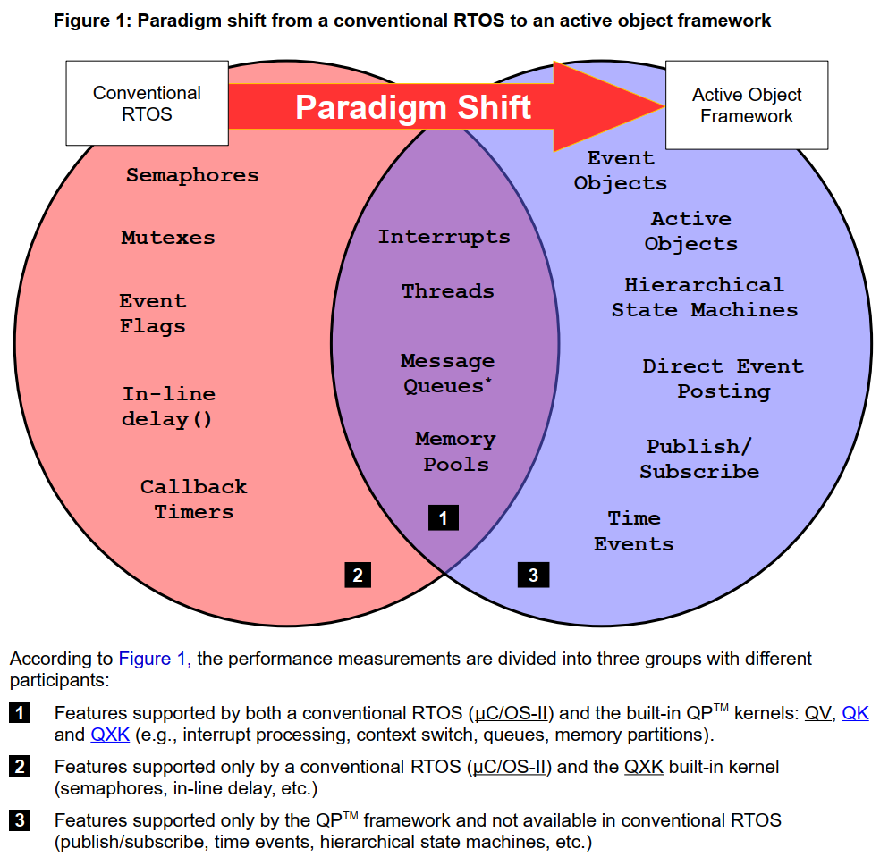
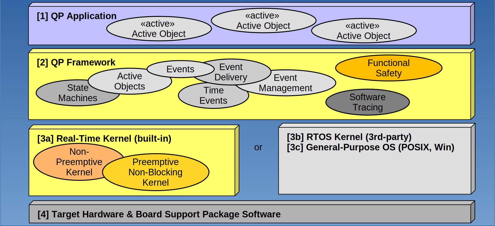

# 内建内核（Built-in Kernals）

1. 非抢占式内核  QV
2. 抢占式非阻塞内核 QK
3. 抢占式双模阻塞式内核 QXK

QXK 提供了用户期望从传统 RTOS 中获得的所有功能，并专门设计用于将事件驱动的活动对象与传统块代码混合，如商业中间件（TCP/IP 协议栈、UDP 协议栈、嵌入式文件系统等）。

# 大小/效率

尽管QP/C提供了比传统RTOS更高的抽象级别，但它通常在RAM/ROM占用和CPU效率方面都优于等效的传统RTOS应用程序。

[Application Note: - **QP**™ **Performance Tests and Results**](https://www.state-machine.com/doc/AN_QP_Performance.pdf)

# 支持常见应用和低功耗模式

# 使用环境

1. QP应用程序由事件驱动的活动对象组成，这些活动对象共同提供预期的功能。
2. QP框架：
   - 通过将事件分派到活动对象的内部状态机来执行活动对象；
   - 提供事件；
   - 管理用于互斥事件的内存；
   - 提供定时服务；
   - 为 QP 框架和 QP 应用提供自我监测、错误处理和故障预防的功能安全子系统；
   - 提供软件跟踪系统，用于调试、优化和测试。
3. 实时内核为活动对象提供调度和执行上下文。这可以是内置到QP框架（QV、QK或QXK）中的内核之一；
4. 或者，QP 框架可以在第三方 RTOS 内核上运行；
5. 或者，QP 框架可以在通用操作系统上运行（例如，Linux/POSIX或Windows）；
6. 目标系统包括硬件和 BSP。

# 控制反转

代码执行的控制驻留在 QP 框架中，而不是基于 QP 的 QP 应用程序中。具体来说，为了处理事件，QP 框架调用 QP 应用程序，而不是相反。当然，QP 应用程序也可以调用 QP 框架中提供的服务，但主要的控制流总是从 QP 框架开始。

事件驱动系统需要一种与传统顺序线程截然不同的思维方式。当一个顺序线程需要一些传入事件时，它显式地阻塞并在线等待，直到事件到达。因此，顺序线程始终保持“控制”，但在等待一种事件时，它不能响应（至少暂时）任何其他事件。

相比之下，大多数事件驱动的应用程序都是根据好莱坞原则构建的，这基本上意味着“不要打电话给我们，我们会打电话给你“。因此，事件驱动的活动对象在等待事件时不受控制；事实上，它甚至不是活动的。只有当事件到达时，事件驱动程序才会被调用来处理事件，然后它会很快再次放弃控制。这种安排允许事件驱动的程序并行地等待许多事件，因此系统对它需要处理的所有事件保持响应。这种模式意味着在事件驱动的系统中，控制驻留在事件驱动的基础设施（QP框架）中，而不是在应用程序中。换句话说，与传统的顺序线程相比，控制是反向的。

> 控制反转是 QP 框架设计的关键点之一。

