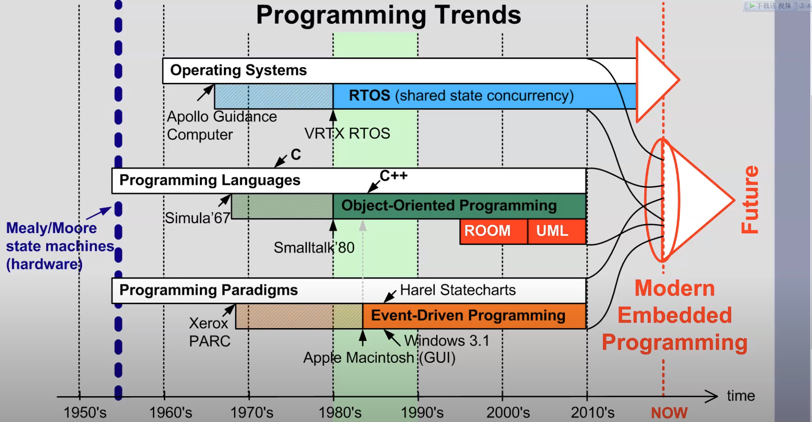
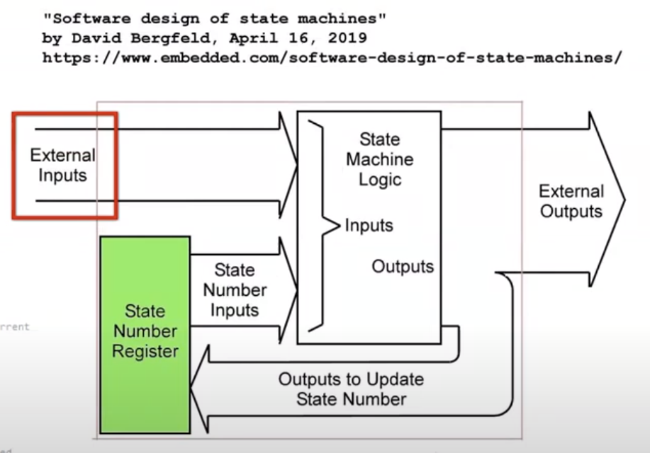
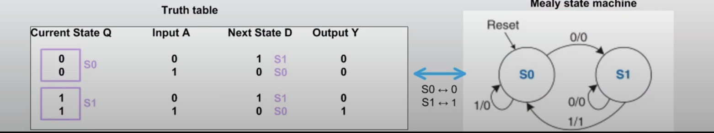
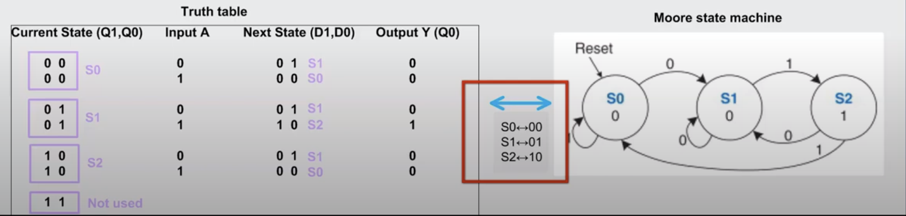

1. 事件驱动状态机（Event-Driven State Machine）
2. 输入驱动状态机（Input-Driven State Machine, Controller State Machine, Periodic  State Machine  =======>> Polled  State Machine）

3. Meely State Machine

4. Moore State Machine

