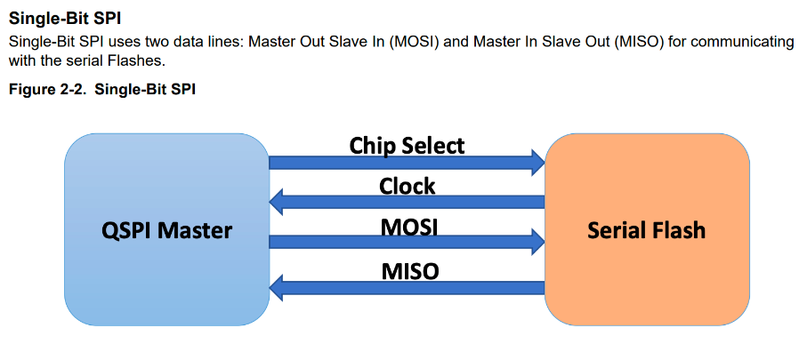
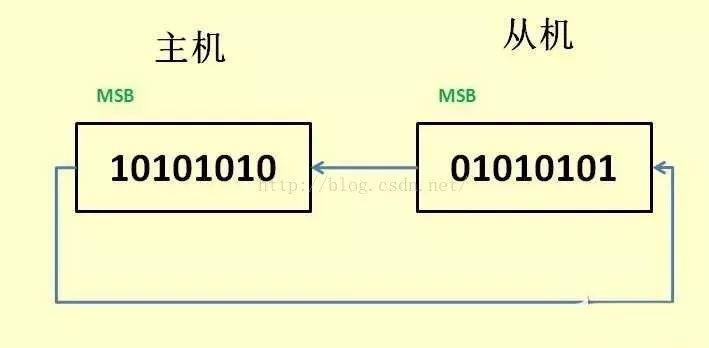
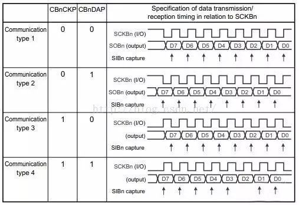
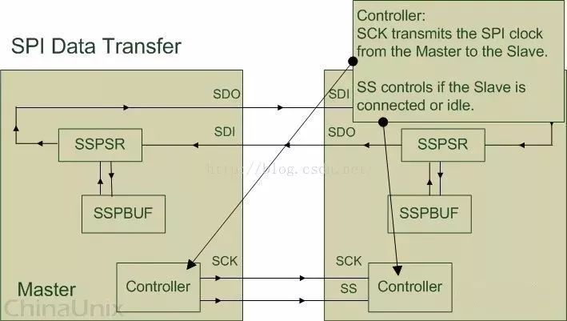
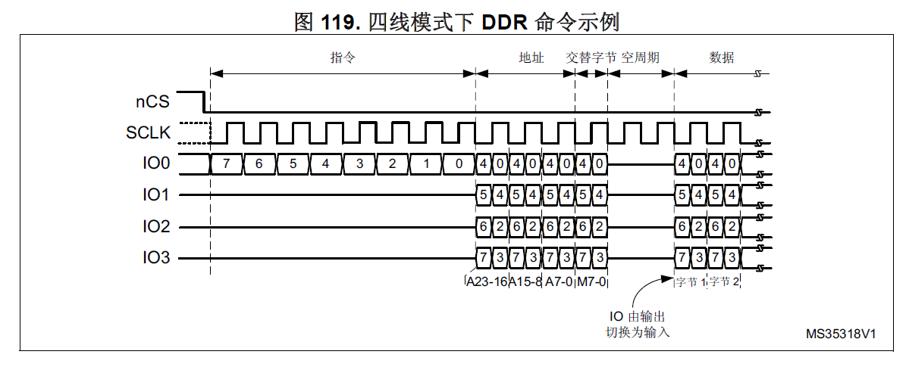
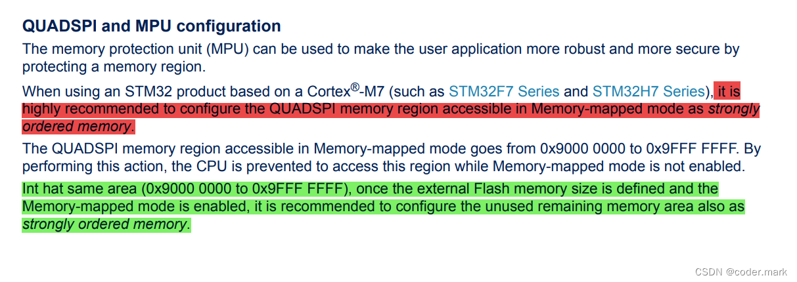
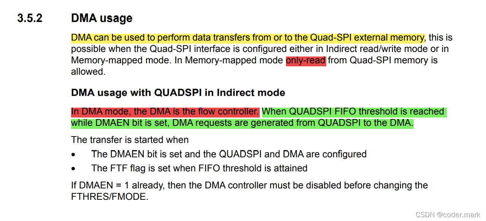

#  SPI、Dual SPI和Quad SPI接口

参考链接：[STMCU中文官网](https://www.stmcu.com.cn/Search/index?csrf_token=3981e95d41743701a4c30827ca792aa6&search_keywords=RM0433&type=design_resource&page=1)

[(2条消息) 标准SPI，Dual SPI和Qual SPI_山德鲁老师的博客-CSDN博客_dual spi](https://blog.csdn.net/miaokoko/article/details/79051209)

[(2条消息) 理解SPI/Dual SPI/Quad SPI/QPI之间的区别_coder.mark的博客-CSDN博客_spi和qpi](https://blog.csdn.net/tianizimark/article/details/124608851)

SPI接口通常指标准SPI，Dual SPI和Quad SPI通常是相对标准SPI提出的，在标准SPI的基础上，通过半双工的方式，增加了1根、3根数据线，以达到提高数据传输速度的作用。

> 需要注意的是，无论是哪种SPI，都是主从式接口，同一条总线上只能有一个主机，可以有一个或者多个从机；传输都是由主机发起的。
>
> 一般情况下，当主机的CS/SS引脚输出为高电平时，代表总线空闲。
>
> SPI Flash一般为NOR Flash。

# 1 标准SPI（serial peripheral interface）串行外设接口

参考链接：[[SPI\].SPI协议详解 - aaronGao - 博客园 (cnblogs.com)](https://www.cnblogs.com/aaronLinux/p/6219146.html)

标准SPI通常就称SPI，它是一种串行外设接口规范，有4根引脚信号：CS/SS（片选）、MISO（主机输入从机输出）、MOSI（主机输出从机输入）、CLK（串行时钟）。**四根线都是单向的**，主机通过MOSI发送数据给设备，设备通过MISO发送数据给主机。

标准SPI支持**全双工通信、半双工通信以及单工通信**。全工通信是指发送和接收同时进行；半双工是指某个时刻只能发送或者接收；单工指只能一个方向通信，要么主机只能发送，要么只能接收。

一般情况下硬件接线拓扑如下：




上图只是对 SPI 设备间通信的一个简单的描述, 下面就来解释一下图中所示的几个组件(Module):

- SSPBUF,Synchronous Serial Port Buffer, 泛指 SPI 设备里面的内部缓冲区, 一般在物理上是以 FIFO 的形式, 保存传输过程中的临时数据;
- SSPSR, Synchronous Serial Port Register, 泛指 SPI 设备里面的移位寄存器(Shift Regitser), 它的作用是根据设置好的数据位宽(bit-width) 把数据移入或者移出 SSPBUF;
- Controller, 泛指 SPI 设备里面的控制寄存器, 可以通过配置它们来设置 SPI 总线的传输模式。

**通常情况下, 我们只需要对上图所描述的四个管脚(pin) 进行编程即可控制整个 SPI 设备之间的数据通信:**

- SCK, Serial Clock, 主要的作用是 Master 设备往 Slave 设备传输时钟信号, 控制数据交换的时机以及速率;
- SS/CS, Slave Select/Chip Select, 用于 Master 设备片选 Slave 设备, 使被选中的 Slave 设备能够被 Master 设备所访问;
- SDO/MOSI, Serial Data Output/Master Out Slave In, 在 Master 上面也被称为 Tx-Channel, 作为数据的出口, 主要用于 SPI 设备发送数据;
- SDI/MISO, Serial Data Input/Master In Slave Out, 在 Master 上面也被称为 Rx-Channel, 作为数据的入口, 主要用于SPI 设备接收数据;

SPI 设备在进行通信的过程中, Master 设备和 Slave 设备之间会产生一个数据链路回环(Data Loop), 就像上图所画的那样, 通过 SDO 和 SDI 管脚, SSPSR 控制数据移入移出 SSPBUF, Controller 确定 SPI 总线的通信模式, SCK 传输时钟信号。

## 1.1 主-从模式(Master-Slave) 的控制方式

SPI 规定了两个 SPI 设备之间通信必须由主设备 (Master) 来控制次设备 (Slave)。一个 Master 设备可以通过提供 Clock 以及对 Slave 设备进行**片选 (Slave Select) 来控制多个 Slave 设备**, SPI 协议还规定 Slave 设备的 Clock 由 Master 设备通过 SCK 管脚提供给 Slave 设备, Slave 设备本身不能产生或控制 Clock, 没有 Clock 则 Slave 设备不能正常工作。

**SPI只有主模式和从模式之分，并没有读/写的说法**， 因为实质上每次SPI是主从设备在交换数据。也就是说，你发一个数据必然会收到一个数据；你要收一个数据必须也要先发一个数据。

## 1.2 同步方式(Synchronous)传输数据

Master 设备会根据将要交换的数据来产生相应的时钟脉冲(Clock Pulse), 时钟脉冲组成了时钟信号(Clock Signal) , **时钟信号通过时钟极性 (CPOL) 和 时钟相位 (CPHA) 控制着两个 SPI 设备间何时数据交换以及何时对接收到的数据进行采样, 来保证数据在两个设备之间是同步传输的**。


## 1.3 数据交换(Data Exchanges)

SPI 设备间的数据传输之所以又被称为**数据交换**, **是因为 SPI 协议规定一个 SPI 设备不能在数据通信过程中仅仅只充当一个 "发送者(Transmitter)" 或者 "接收者(Receiver)"**. 在每个 Clock 周期内, **SPI 设备都会发送并接收一个 bit 大小的数据(**不管主设备还是从设备**)**, 相当于该设备有一个 bit 大小的数据被交换了。 一个 Slave 设备要想能够接收到 Master 发过来的控制信号, 必须在此之前能够被 Master 设备进行访问 (Access). 所以, Master 设备必须首先通过 SS/CS pin 对 Slave 设备进行片选, 把想要访问的 Slave 设备选上。 在数据传输的过程中, 每次接收到的数据必须在下一次数据传输之前被采样. 如果之前接收到的数据没有被读取, 那么这些已经接收完成的数据将有可能会被丢弃, 导致 SPI 物理模块最终失效。**因此, 在程序中一般都会在 SPI 传输完数据后, 去读取 SPI 设备里的数据, 即使这些数据(Dummy Data)在我们的程序里是无用的(**虽然发送后紧接着的读取是无意义的，但仍然需要从寄存器中读出来**)**。




## 1.4 时钟极性CPOL（Clock Polarity）和时钟相位CPHA（Clock Phase）

SPI的极性Polarity和相位Phase，最常见的写法是CPOL和CPHA，不过也有一些其他写法，简单总结如下：

1. CKPOL (Clock Polarity) = CPOL = POL = Polarity = （时钟）极性 = Clock Polarity = IDLE state of SCK
2. CKPHA (Clock Phase) = CPHA = PHA = Phase = （时钟）相位
3. SCK=SCLK=SPI的时钟
4. Edge=边沿，即时钟电平变化的时刻，即上升沿(rising edge)或者下降沿(falling edge)

对于一个时钟周期内，有两个edge，分别称为：

- Leading edge=前一个边沿=第一个边沿，对于开始电压是1，那么就是1变成0的时候，对于开始电压是0，那么就是0变成1的时候；
- Trailing edge=后一个边沿=第二个边沿，对于开始电压是1，那么就是0变成1的时候（即在第一次1变成0之后，才可能有后面的0变成1），对于开始电压是0，那么就是1变成0的时候；

换句话说，根据CLK与MISO、MOSI在时间上的顺序关系，标准SPI具有4种模式。

1. **CPOL（Clock Polarity）时钟极性**直接影响SPI总线空闲时的时钟信号是高电平还是低电平；CPOL=1 表示空闲时是高电平，CPOL=0 表示空闲时是低电平；
2. **CPHA（Clock Phase）时钟相位**直接决定SPI总线从哪个跳变沿开始采样数据，CPHA=0 表示从第一个跳变沿开始采样，CPHA=1 表示从第二个跳变沿开始采样。

因此，SPI具有4种传输模式：**上升沿、下降沿、前沿、后沿触发**，当然也有MSB和LSB传输方式，只不过这与CPOL和CPHA无关。



模式0：CPOL= 0，CPHA=0。SCK串行时钟线空闲是为低电平，数据在SCK时钟的上升沿被采样，数据在SCK时钟的下降沿切换

模式1：CPOL= 0，CPHA=1。SCK串行时钟线空闲是为低电平，数据在SCK时钟的下降沿被采样，数据在SCK时钟的上升沿切换

模式2：CPOL= 1，CPHA=0。SCK串行时钟线空闲是为高电平，数据在SCK时钟的下降沿被采样，数据在SCK时钟的上升沿切换

模式3：CPOL= 1，CPHA=1。SCK串行时钟线空闲是为高电平，数据在SCK时钟的上升沿被采样，数据在SCK时钟的下降沿切换

|  mode  | CPOL | CPHA |
| :----: | :--: | :--: |
| mode 0 |  0   |  0   |
| mode 1 |  0   |  1   |
| mode 2 |  1   |  0   |
| mode 3 |  1   |  1   |

> **根据不同的设备，需要选择不同的模式。**

## 1.5 如何设置SPI的极性和相位

SPI分主设备和从设备，两者通过SPI协议通讯。

**而设置SPI的模式，是从设备的模式，决定了主设备的模式。**

所以要先去搞懂从设备的SPI是何种模式，然后再将主设备的SPI的模式，设置和从设备相同的模式，即可正常通讯。

对于从设备的SPI是什么模式，有两种：

**固定的，由SPI从设备硬件决定的**

SPI从设备，具体是什么模式，相关的datasheet中会有描述，需要自己去datasheet中找到相关的描述，即：

关于SPI从设备，在空闲的时候，是高电平还是低电平，**即决定了CPOL是0还是1；**

然后再找到关于设备是在上升沿还是下降沿去采样数据，这样就是，**在定了CPOL的值的前提下，对应着可以推算出CPHA是0还是1了。**

**可配置的，由软件自己设定**

从设备也是一个SPI控制器，4种模式都支持，此时只要自己设置为某种模式即可。

然后知道了从设备的模式后，再去将SPI主设备的模式，设置为和从设备模式一样，即可。

对于如何配置SPI的CPOL和CPHA的话，不多细说，多数都是直接去写对应的SPI控制器中对应寄存器中的CPOL和CPHA那两位，写0或写1即可。

## 1.6 SPI中的一些名词的具体解释

**SSPSR移位寄存器**


SSPSR 是 SPI 设备内部的移位寄存器(Shift Register). 它的主要作用是根据 SPI 时钟信号状态, 往 SSPBUF 里移入或者移出数据, 每次移动的数据大小由 Bus-Width 以及 Channel-Width 所决定。

Bus-Width 的作用是指定地址总线到 Master 设备之间数据传输的单位.

例如, 我们想要往 Master 设备里面的 SSPBUF 写入 16 Byte 大小的数据: 首先, 给 Master 设备的配置寄存器设置 Bus-Width 为 16Byte; 然后往 Master 设备的 Tx-Data 移位寄存器在地址总线的入口写入数据, 每次写入 1 Byte 大小的数据(使用 writeb 函数); 写完 1 Byte 数据之后, Master 设备里面的 Tx-Data 移位寄存器会自动把从地址总线传来的1 Byte 数据移入 SSPBUF 里; 上述动作一共需要重复执行 16 次.

Channel-Width 的作用是指定 Master 设备与 Slave 设备之间数据传输的单位. 与 Bus-Width 相似, Master 设备内部的移位寄存器会依据 Channel-Width 自动地把数据从 Master-SSPBUF 里通过 Master-SDO 管脚搬运到 Slave 设备里的 Slave-SDI 引脚, Slave－SSPSR 再把每次接收的数据移入 Slave-SSPBUF里.通常情况下, Bus-Width 总是会大于或等于 Channel-Width, 这样能保证不会出现因 Master 与 Slave 之间数据交换的频率比地址总线与 Master 之间的数据交换频率要快, 导致 SSPBUF 里面存放的数据为无效数据这样的情况.

**SSPBUF**


我们知道, 在每个时钟周期内, Master 与 Slave 之间交换的数据其实都是 SPI 内部移位寄存器从 SSPBUF 里面拷贝的. 我们可以通过往 SSPBUF 对应的寄存器 (Tx-Data / Rx-Data register) 里读写数据, 间接地操控 SPI 设备内部的 SSPBUF.

例如, 在发送数据之前, 我们应该先往 Master 的 Tx-Data 寄存器写入将要发送出去的数据, 这些数据会被 Master-SSPSR 移位寄存器根据 Bus-Width 自动移入 Master-SSPBUF 里, 然后这些数据又会被 Master-SSPSR 根据 Channel-Width 从 Master-SSPBUF 中移出, 通过 Master-SDO 管脚传 给 Slave-SDI 管脚, Slave-SSPSR 则把从 Slave-SDI 接收到的数据移入 Slave-SSPBUF 里. 与此同时, Slave-SSPBUF 里面的数据根据每次接收数据的大小(Channel-Width), 通过 Slave-SDO 发往 Master-SDI, Master-SSPSR 再把从 Master-SDI 接收的数据移入 Master-SSPBUF.在单次数据传输完成之后, 用户程序可以通过从 Master 设备的 Rx-Data 寄存器读取 Master 设备数据交换得到的数据.

**Controller**



Master 设备里面的 Controller 主要通过时钟信号(Clock Signal)以及片选信号(Slave Select Signal)来控制 Slave 设备. Slave 设备会一直等待, 直到接收到 Master 设备发过来的片选信号, 然后根据时钟信号来工作.

Master 设备的片选操作必须由程序所实现. 例如: 由程序把 SS/CS 管脚的时钟信号拉低电平, 完成 SPI 设备数据通信的前期工作; 当程序想让 SPI 设备结束数据通信时, 再把 SS/CS 管脚上的时钟信号拉高电平.Controller


Master 设备里面的 Controller 主要通过时钟信号(Clock Signal)以及片选信号(Slave Select Signal)来控制 Slave 设备. Slave 设备会一直等待, 直到接收到 Master 设备发过来的片选信号, 然后根据时钟信号来工作.

Master 设备的片选操作必须由程序所实现. 例如: 由程序把 SS/CS 管脚的时钟信号拉低电平, 完成 SPI 设备数据通信的前期工作; 当程序想让 SPI 设备结束数据通信时, 再把 SS/CS 管脚上的时钟信号拉高电平.

# 2 Dual SPI（Dual serial peripheral interface）双线串行外设接口 

Dual SPI一般针对SPI Flash，而不是针对所有SPI外设，对于SPI Flash，全双工并不常用，因此可以扩展了mosi和miso的用法，**让它们工作在半双工**，用以加倍数据传输速度。如下图的QIO0、QIO1总线，标准SPI通信时发送和接收时主机和从机都只能使用自己的那根数据线进行数据传输，Dual SPI无论是接收还是发送都是使用两根数据线进行的，所以**单向数据传输速度上是标准SPI的双倍（即一个时钟周期传输2bit数据）**。


# 3 Quad SPI（Quad serial peripheral interface）四线SPI，即数据线最多可以使用4根

参考链接：[(2条消息) 手把手系列--STM32 QSPI操作指南_coder.mark的博客-CSDN博客_qspi](https://blog.csdn.net/tianizimark/article/details/121718162)

与Dual SPI类似，也是**针对SPI Flash**，一般用于**数据存储或代码执行（XIP）**，Qual SPI Flash增加了两根I/O线（QIO2，QIO3），目的是一个时钟内传输4个bit，一般情况下用于**半双工通信**。

一般来说，Quad SPI外设可以使用任意一种SPI模式，具体要看从设备的要求。


## 3.1 主要特性

在STM32H7的应用手册中是这样解释的，QUADSPI 是一种专用的通信接口，连接单、双或四（条数据线）SPI FLASH 存储介质。该接口可以在以下三种模式下工作：

- **间接模式**：使用 QUADSPI 寄存器执行全部操作；
- **状态轮询模式**：周期性读取外部 FLASH 状态寄存器，而且标志位置 1 时会产生中断（如擦除或烧写完成，会产生中断）；
- **内存映射模式**：外部 FLASH 映射到微控制器地址空间，从而系统将其视作内部存储器。**（XIP启动模型的使用原理）**

**采用双闪存模式时，将同时访问两个 Quad-SPI FLASH，吞吐量和容量均可提高二倍。**

**STM32H7中集成的Quad SPI外设具有以下特性：**

1. 三种功能模式：间接模式、状态轮询模式和**内存映射模式**
2. 双闪存模式，通过并行访问两个 FLASH，可同时发送/接收 8 位数据
3. 支持 SDR 和 DDR 模式
4. 针对间接模式和内存映射模式，**完全可编程操作码**
5. 针对间接模式和内存映射模式，**完全可编程帧格式**
6. 集成 FIFO，用于发送和接收
7. 允许 8、16 和 32 位数据访问
8. 在达到 FIFO 阈值和传输完成时生成 MDMA 触发信号
9. 在达到 FIFO 阈值、超时、操作完成以及发生访问错误时产生中断

## 3.2 功能框图

**STM32H7中集成的Quad SPI外设的功能框图如下：**


## 3.3 引脚定义

**QUADSPI引脚定义如下：**

| 信号名称   | 信号类型      | 说明                                                         |
| ---------- | ------------- | ------------------------------------------------------------ |
| CLK        | 数字输出      | FLASH 1 和 FLASH 2 的时钟                                    |
| BK1_IO0/SO | 数字输入/输出 | 在双线/四线模式中为双向 IO，单线模式中为串行输出，适用于 FLASH 1 |
| BK1_IO1/SI | 数字输入/输出 | 在双线/四线模式中为双向 IO，单线模式中为串行输入，适用于 FLASH 1 |
| BK1_IO2    | 数字输入/输出 | 在四线模式中为双向 IO，适用于 FLASH 1                        |
| BK1_IO3    | 数字输入/输出 | 在四线模式中为双向 IO，适用于 FLASH 1                        |
| BK2_IO0/SO | 数字输入/输出 | 在双线/四线模式中为双向 IO，单线模式中为串行输出，适用于 FLASH 2 |
| BK2_IO1/SI | 数字输入/输出 | 在双线/四线模式中为双向 IO，单线模式中为串行输入，适用于 FLASH 2 |
| BK2_IO2    | 数字输入/输出 | 在四线模式中为双向 IO，适用于 FLASH 2                        |
| BK2_IO3    | 数字输入/输出 | 在四线模式中为双向 IO，适用于 FLASH 2                        |
| BK1_nCS    | 数字输出      | 片选（低电平有效），适用于 FLASH 1。如果QUADSPI 始终在双闪存模式下工作，则其也可用于 FLASH 2。 |
| BK2_nCS    | 数字输出      | 片选（低电平有效），适用于 FLASH 2。如果QUADSPI 始终在双闪存模式下工作，则其也可用于 FLASH 1。 |

## 3.4 命令序列

参考链接：[(2条消息) 手把手系列--STM32 QSPI操作指南_coder.mark的博客-CSDN博客_qspi](https://blog.csdn.net/tianizimark/article/details/121718162)

QUADSPI 通过命令与 FLASH 通信，每条命令包括**指令、地址、交替字节、空指令和数据**这五个阶段，任一阶段均可跳过，但**至少要包含指令、地址、交替字节或数据阶段之一**。
nCS 在每条指令开始前下降，在每条指令完成后再次上升。

<center><b>四线模式下的读命令示例</b></center>


<font size=5>**指令阶段**</font>

指令阶段只可以发送一个字节的数据，通过往寄存器QUADSPI_CCR[7:0]的INSTRUCTION字段写入即可。指令可以通过1/2/4线发送。一般1线的比较常见。


如下表所示，QUADSPI_CCR[9:8] 寄存器中的 IMODE[1:0]字段可用于配置指令阶段的位数（线数），**IMODE[1:0]=00代表没有指令阶段**。


<font size=5>**地址阶段**</font>

**地址阶段可以发送1/2/3/4个字节**，写入QUADSPI_AR寄存器即可，在内存映射模式下，则**通过 AXI（来自于 Cortex® 或 DMA）直接给出地址**。

可以通过1/2/4线发送，通过QUADSPI_CCR[13:12]寄存器中的ADSIZE[1:0]指定地址字节长度，通过可以通过QUADSPI_CCR[11:10]寄存器中的ADMODE[1:0]指定是否有地址/1线/2线/4线模式。

若 ADMODE = 00，则跳过地址阶段，命令序列直接进入下一阶段（如果存在）。


<font size=5>**交替字节阶段**</font>

在交替字节阶段，将 1-4 字节发送到 FLASH，一般用于控制操作模式。待发送的交替字节 数在 QUADSPI_CCR[17:16] 寄存器的 ABSIZE[1:0] 字段中进行配置。

**待发送的字节在 QUADSPI_ABR 寄存器中指定。**并通过 QUADSPI_CCR[15:14] 寄存器中的 ABMODE[1:0] 字段进行配置是否有交替字节、1/2/4线发送。

若 ABMODE = 00，则跳过交替字节阶段，命令序列直接进入下一阶段（如果存在）。

交替字节阶段存在**仅需发送单个半字节而不是一个全字节**的情况，比如采用双线模式并且仅使用两个周期发送交替字节时。在这种情况下，固件可采用四线模式 (ABMODE = 11) 并发 送一个字节，方法是 ALTERNATE 的位 7 和 3 置“1”（IO3 保持高电平）且位 6 和 2 置 “0”（IO2 线保持低电平）。此时，半字节的高 2 位存放在 ALTERNATE 的位 4:3，低 2 位存放在位 1 和 0 中。例如，如果半字节 2 (0010) 通过 IO0/IO1 发送，则 ALTERNATE 应 设置为 0x8A (1000_1010)。


<font size=5>**空指令周期阶段**</font>

在空指令周期阶段，给定的 1-31 个周期内不发送或接收任何数据，目的是当采用更高的时钟频 率时，需要给FLASH留出**准备数据阶段的时间**。

这一阶段中给定的周期数在 QUADSPI_CCR[22:18] 寄存器的 DCYC[4:0] 字段中指定（最大可以设置31个周期）。在 SDR 和 DDR 模式下，持续时间被指定为一定个数的全时钟周期。

若 DCYC 为零，则跳过空指令周期阶段，命令序列直接进入数据阶段（如果存在）。

空指令周期阶段的操作模式由 DMODE 确定。

> 为确保数据信号从输出模式转变为输入模式有足够的“周转”时间，使用双线和四线模式从FLASH 接收数据时，至少需要指定一个空指令周期。
>
> 如果使用了QUADSPI硬件配置并且此周期内使用Quad-SPI或者Dual-SPI模式，则IO2被硬件强制设置为0来禁用写保护功能，并且IO被硬件强制设置为1来禁用保持功能。


<font size=5>**数据阶段**</font>

在数据阶段，可从FLASH 接收或向其发送**任意数量**的字节。

在间接模式和自动轮询模式下，待发送/接收的字节数在 QUADSPI_DLR 寄存器中指定。

在间接写入模式下，发送到 FLASH 的数据必须写入 QUADSPI_DR 寄存器。在间接读取模式下，通过读取 QUADSPI_DR 寄存器获得从 FLASH 接收的数据。如果QUADSPI_DLR=0xFFFFFFFF且FSIZE=0x1F，则直到发送中止请求或失能QSPI后，结束数据传输。 

在内存映射模式下，只能读取数据，其通过QUADSPI FIFO进行读取，读取的数据通过 AXI 直接发送回 Cortex（即内核） 或 DMA，总线矩阵上的任意主机都可以将其当作内部存储进行读取数据。

数据阶段可一次发送/接收 1 位（在单线 SPI 模式中通过 SO）、2 位（在双线 SPI 模式中通过 IO0/IO1）或 4 位（在四线 SPI 模式中通过 IO0/IO1/IO2/IO3）。这可通过 QUADSPI_CCR[15:14] 寄存器中的 ABMODE[1:0] 字段进行配置。

若 DMODE = 00，则跳过数据阶段，命令序列在拉高 nCS 时立即完成。这一配置仅可用于仅间接写入模式。


## 3.5 信号接口协议模式

#### <font size=5>**单线（标准）SPI模式**</font>

传统 SPI 模式允许串行发送/接收单独的 1 位。在此模式下，数据通过 SO 信号（其 I/O 与 IO0 共享）发送到 FLASH。从 FLASH 接收到的数据通过 SI（其 I/O 与 IO1 共享）送达。

通过将（QUADSPI_CCR 中的）IMODE/ADMODE/ABMODE/DMODE 字段设置为 01，可 对不同的命令阶段分别进行配置，以使用此单个位模式。

在每个已配置为单线模式的阶段中：

- IO0 (SO) 处于输出模式
- IO1 (SI) 处于输入模式（高阻抗）
- IO2 处于输出模式并强制置“0”（以禁止“写保护”功能）
- IO3 处于输出模式并强制置“1”（以禁止“保持”功能）

若 DMODE = 01，这对于空指令阶段也同样如此。


#### <font size=5>**双线SPI模式**</font>

在双线模式下，通过 IO0/IO1 信号同时发送/接收两位。

通过将 QUADSPI_CCR 寄存器的 IMODE/ADMODE/ABMODE/DMODE 字段设置为 10，可 对不同的命令阶段分别进行配置，以使用双线 SPI 模式。

在每个已配置为双线模式的阶段中：

- IO0/IO1 在数据阶段进行读取操作时处于高阻态（输入），在其他情况下为输出
- IO2 处于输出模式并强制置“0”
- IO3 处于输出模式并强制置“1”

在空指令阶段，若 DMODE = 01，则 IO0/IO1 始终保持高阻态。


#### <font size=5>**QSPI模式**</font>

在四线模式下，通过 IO0/IO1/IO2/IO3 信号同时发送/接收四位。

通过将 QUADSPI_CCR 寄存器的 IMODE/ADMODE/ABMODE/DMODE 字段设置为 11，可 对不同的命令阶段分别进行配置，以使用四线 SPI 模式。

在每个已配置为四线模式的阶段中，IO0/IO1/IO2/IO3 在数据阶段进行读取操作时均处于高 阻态（输入），在其他情况下为输出。

在空指令阶段中，若 DMODE = 11，则 IO0/IO1/IO2/IO3 均为高阻态。

IO2 和 IO3 仅用于 Quad SPI 模式，如果未配置任何阶段使用四线 SPI 模式，即使 QUADSPI 激活，对应 IO2 和 IO3 的引脚也可用于其他功能。


#### <font size=5>**SDR模式（单倍数据速率模式，single data rate）**</font>

默认情况下，DDRM 位 (QUADSPI_CCR[31]) 为 0，QUADSPI 在单倍数据速率 (SDR) 模式 下工作。

在 SDR 模式下，当 QUADSPI 驱动 IO0/SO、IO1、IO2、IO3 信号时，这些信号仅在 CLK 的下降沿发生转变。

在 SDR 模式下接收数据时，QUADSPI 假定 FLASH 也通过 CLK 的下降沿发送数据。默认 情况下 (SSHIFT = 0 时)，将使用 CLK 后续的边沿（上升沿）对信号进行采样。

#### <font size=5>**DDR模式（双倍数据速率模式，dual data rate）**</font>

若 DDRM 位 (QUADSPI_CCR[31]) 置 1，则 QUADSPI 在双倍数据速率 (DDR) 模式下 工作。

在 DDR 模式下，当 QUADSPI 在地址/交替字节/数据阶段驱动 IO0/SO、IO1、IO2、IO3 信 号时，将在 CLK 的每个上升沿和下降沿发送 1 位。

指令阶段不受 DDRM 的影响。始终通过 CLK 的下降沿发送指令。

在 DDR 模式下接收数据时，QUADSPI 假定 FLASH 通过 CLK 的上升沿和下降沿均发送数 据。若 DDRM = 1，固件必须清零 SSHIFT 位（QUADSPI_CR 的位 4）。

因此，在半个 CLK 周期后（下一个反向边沿）对信号采样。



#### <font size=5>**双闪存模式**</font>

若 DFM 位（QUADSPI_CR 的位 6）为 1，QUADSPI 处于双闪存模式。QUADSPI 使用两 个外部四线 SPI FLASH（FLASH 1 和 FLASH 2），在每个周期中发送/接收 8 位（在 DDR 模式下为 16 位），能够有效地将吞吐量和容量扩大一倍。

每个 FLASH 使用同一个 CLK 并可选择使用同一个 nCS 信号，但其 IO0、IO1、IO2 和 IO3 信号是各自独立的。

双闪存模式**可与单比特模式、双比特模式以及四比特模式结合使用，也可与 SDR 或 DDR 模 式相结合**。

**FLASH 的大小在 FSIZE[4:0] (QUADSPI_DCR[20:16]) 中指定，指定的值应能够反映 FLASH 的总容量，即单个组件容量的 2 倍**。

如果地址 X 为偶数，QUADSPI 赋给地址 X 的字节是存放于 FLASH 1 的地址 X/2 中的字 节，QUADSPI 赋给地址 X+1 的字节是存放于 FLASH 2 的地址 X/2 中的字节。也就是说， 偶地址中的字节存储于 FLASH 1，奇地址中的字节存储于 FLASH 2。

**在双闪存模式下读取 FLASH 状态寄存器时，需要读取的字节数是单闪存模式下的 2 倍。这 意味着在状态寄存器获取指令到达后，如果每个 FLASH 给出 8 个有效位，则 QUADSPI 必 须配置为 2 个字节（16 位）的数据长度，它将从每个 FLASH 接收 1 个字节**。如果每个 FLASH 给出一个 16 位的状态，则 QUADSPI 必须配置为读取 4 字节，以在双闪存模式下可 获取两个 FLASH 的所有状态位 。结果（在数据寄存器中）的最低有效字节是 FLASH 1 状 态寄存器的最低有效字节，而下一个字节是 FLASH 2 状态寄存器的最低有效字节。数据寄 存器的第三个字节是 FLASH 1 的第二个字节，第四个字节是 FLASH 2 的第二个字节 （FLASH 具有 16 位状态寄存器时）。

**偶数个字节必须始终在双闪存模式下访问**。因此，若 DRM = 1，则数据长度字段 (QUADSPI_DLR[0]) 的位 0 始终保持为 1。

在双闪存模式下，FLASH 1 接口信号的行为基本上与正常模式下相同。在指令、地址、交替 字节以及空指令周期阶段，FLASH 2 接口信号具有与 FLASH 1 接口信号完全相同的波形。 也就是说，每个 FLASH 总是接收相同的指令与地址。然后，在数据阶段，BK1_IOx 和 BK2_IOx 总线并行传输数据，但发送到 FLASH 1（或从其接收）的数据与 FLASH 2 中的 不同。


双闪存模式下，指令、地址、交替字节、空指令周期**同时发送**给BINK1和BINK2。


## 3.6 功能说明

#### <font size=5>**间接模式**</font>

间接模式用于**读写、擦除操作**；所有的操作都是通过QUADSPI数据寄存器来执行，可以使用CPU也可以使用中断和DMA；也用于配置Quad-SPI Flash内存。

在间接模式下，**通过写入 QUADSPI 寄存器来触发命令**；并**通过读写数据寄存器来传输数据**，就如同对待其他通信外设那样。

若 FMODE = 00 (QUADSPI_CCR[27:26])，则 QUADSPI 处于间接写入模式，字节在数据阶段中发送到 FLASH。通过写入数据寄存器 (QUADSPI_DR) 的方式提供数据。

若 FMODE = 01，则 QUADSPI 处于间接读取模式，在数据阶段中从 FLASH 接收字节。通 过读取 QUADSPI_DR 来获取数据。

读取/写入的字节数在数据长度寄存器 (QUADSPI_DLR) 中指定。如果 QUADSPI_DLR = 0xFFFF_FFFF（全为“1”），则数据长度视为未定义，QUADSPI 将继续传输数据，直到到达 （由 FSIZE 定义的）FLASH 的结尾。如果不传输任何字节，DMODE (QUADSPI_CCR[25:24]) 应设置为 00。

如果 QUADSPI_DLR = 0xFFFF_FFFF 并且 FSIZE = 0x1F（最大值指示一个 4GB 的 FLASH），在此特殊情况下，传输将无限继续下去，仅在出现终止请求或 QUADSPI 被禁止后停止。在读取最后一个存储器地址后（地址为 0xFFFF_FFFF），将从地址 = 0x0000 0000 开始继续读取。

当发送或接收的字节数达到编程设定值时，如果 TCIE = 1，则 TCF 置 1 并产生中断。在数 据数量不确定的情况下，将根据 QUADSPI_CR 中定义的 FLASH 大小，在达到外部 SPI 的 限制时，TCF 置 1。


**触发命令启动**

从本质上讲，在固件给出命令所需的最后一点信息时，命令即会启动。根据 QUADSPI 的配 置，在间接模式下有三种触发命令启动的方式。在出现以下情形时，命令立即启动：

1. 对 INSTRUCTION[7:0] (QUADSPI_CCR) 执行写入操作，如果没有地址是必需的（当 ADMODE = 00）并且不需要固件提供数据（当 FMODE = 01 或 DMODE = 00）

2. 对 ADDRESS[31:0] (QUADSPI_AR) 执行写入操作，如果地址是必需的（当 ADMODE = 00）并且不需要固件提供数据（当 FMODE = 01 或 DMODE = 00）
3. 对 DATA[31:0] (QUADSPI_DR) 执行写入操作，如果地址是必需的（当 ADMODE != 00） 并且需要固件提供数据（当 FMODE = 00 并且 DMODE != 00）
   写入交替字节寄存器 (QUADSPI_ABR) 始终不会触发命令启动。如果需要交替字节，必须预 先进行编程。
     如果命令启动，BUSY 位（QUADSPI_SR 的位 5）将自动置 1。

**FIFO 和数据管理**

在间接模式中，数据将通过 QUADSPI 内部的一个 32 字节 FIFO。FLEVEL[5:0] (QUADSPI_SR[13:8]) 指示 FIFO 目前保存了多少字节。

在间接写入模式下 (FMODE = 00)，固件写入 QUADSPI_DR 时，将在 FIFO 中加入数据。 字写入将在 FIFO 中增加 4 个字节，半字写入增加 2 个字节，而字节写入仅增加 1 个字节。 如果固件在 FIFO 中加入的数据过多（超过 DL[31:0] 指示的值），将在写入操作结束（TCF 置 1）时从 FIFO 中清除超出的字节。

对 QUADSPI_DR 的字节/半字访问必须仅针对该 32 位寄存器的最低有效字节/半字。

FTHRES[3:0] 用于定义 FIFO 的阈值 如果达到阈值，FTF（FIFO 阈值标志）置 1 在间接读 取模式下，从 FIFO 中读取的有效字节数超过阈值时，FTF 置 1。从 FLASH 中读取最后一个 字节后，如果 FIFO 中依然有数据，则无论 FTHRES 的设置为何，FTF 也都会置 1。在间接 写入模式下，当 FIFO 中的空字节数超过阈值时，FTF 置 1。

如果 FTIE = 1，则 FTF 置 1 时产生中断。如果阈值条件不再为“真”（CPU 或 DMA 传输了 足够的数据后），则 FTF 由 HW 清零。

在间接模式下，当 FIFO 已满，QUADSPI 将暂时停止从 Flash 读取字节以避免上溢。请注 意，只有在 FIFO 中的 4 个字节为空 (FLEVEL ≤ 11) 时才会重新开始读取 FLASH。因此，若 FTHRES ≥ 13，应用程序必须读取足够的字节以确保 QUADSPI 再次从 FLASH 检索数据。 否则，只要 11 < FLEVEL < FTHRES，FTF 标志将保持为“0”。

#### <font size=5>**状态标志轮询模式**</font>

状态标志轮询模式用于**读取Quad-SPI Flash内存的状态以及用于检测擦除或者编程的完成**。开发者可以配置轮询周期以及轮询的掩码和匹配模式（与/或）；当匹配发生时，自动产生中断并且停止。  

在自动轮询模式下，QUADSPI 周期性启动命令以读取一定数量的状态字节（最多 4 个）。 可屏蔽接收的字节以隔离一些状态位，从而在所选的位具有定义的值时可产生中断。

对 FLASH 的访问最初与在间接读取模式下相同：如果不需要地址 (AMODE = 00)，则在写 入 QUADSPI_CCR 时即开始访问。否则，如果需要地址，则在写入 QUADSPI_AR 时开始 第一次访问。BUSY 在此时变为高电平，即使在周期性访问期间也保持不变。

在自动轮询模式下，MASK[31:0] (QUADSPI_PSMAR) 的内容用于屏蔽来自 FLASH 的数 据。如果 MASK[n] = 0，则屏蔽结果的位 n，从而不考虑该位。如果 MASK[n] = 1 并且位 [n] 的内容与 MATCH[n] (QUADSPI_PSMAR) 相同，说明存在位 n 匹配。

如果轮询匹配模式位（PMM, QUADSPI_CR 的位 23）为 0，将激活“AND”匹配模式。这 意味着状态匹配标志 (SMF) 仅在全部未屏蔽位均存在匹配时置 1 。
如果 PMM = 1，则激活“OR”匹配模式。这意味着 SMF 在任意未屏蔽位存在匹配时置 1。

如果 SMIE = 1，则在 SMF 置 1 时调用一个中断。

如果自动轮询模式停止 (APMS) 位置 1，则操作停止并且 BUSY 位在检测到匹配时清零。 否则，BUSY 位保持为“1”，在发生中止或禁止 QUADSPI (EN = 0) 前继续进行周期性 访问。

数据寄存器 (QUADSPI_DR) 包含最新接收的状态字节（FIFO 停用）。数据寄存器的内容不 受匹配逻辑所用屏蔽方法的影响。FTF 状态位在新一次状态读取完成后置 1，并且 FTF 在数 据读取后清零。


#### <font size=5>**内存映射模式**</font>

内存映射模式**用于读操作**；**将外部Quad-SPI Flash存储空间看作是内部空间**，这样**任何AHB主设备就可以自动读取**；使用内存映射模式，**QuadSPI自动管理预取机制，这可以优化外部Flash的读写执行性能** 。

在配置为内存映射模式时，外部 SPI 器件被视为是内部存储器。

QUADSPI 外设若没有正确配置并使能，禁止访问 QUADSPI Flash 的存储区域。

**即使 FLASH 容量更大，寻址空间也无法超过 256MB。**

如果**访问的地址超出 FSIZE 定义的范围但仍在 256 MB 范围内**，则生成总线错误。此错误的 影响具体取决于尝试进行访问的总线主器件：

- 如果为 Cortex® CPU，则会在使能总线故障时发生总线故障异常，在禁止总线故障时发生硬性故障 (hard fault) 异常。
- 如果为 DMA，则生成 DMA 传输错误，并自动禁用相应的 DMA 通道。

**支持字节、半字和字访问类型。**

<font color="#dd0000">**支持芯片内执行 (XIP) 操作**</font>，QUADSPI 接受下一个微控制器访问并提前加载后面地址中的 字节。如果之后访问的是连续地址，由于值已经预取，访问将更快完成。

默认情况下，即便在很长时间内不访问 FLASH，QUADSPI 也不会停止预取操作，之前的读取 操作将保持激活状态并且 nCS 保持低电平。由于 nCS 保持低电平时，FLASH 功耗增加，应用 程序可能会激活超时计数器（TCEN = 1, QUADSPI_CR 的位 3）。从而在 FIFO 中写满预取的 数据后，若在 TIMEOUT[15:0] (QUADSPI_LPTR) 个周期的时长内没有访问，则释放 nCS。

BUSY 在第一个存储器映射访问发生时变为高电平。由于进行预取操作，BUSY 在发生超时、中止或外设禁止前不会下降。


内存映射模式下最大访问大小为256Mbytes，访问地址为0x90000000 - 0x9FFFFFFF；

代码可以直接从外部Quad-SPI存储器里面执行。**(XIP)**

**<font color="#dd0000">不支持直接从外部Quad-SPI Flash启动</font>，但是可以先从内部Flash启动，然后配置Quad-SPI为内存映射模式，然后就可以从外部Quad-SPI Flash执行代码。**



上图是内存映射模式下建议的MPU设置为strongly-ordered类型。这个知识点请参考：

[(2条消息) 理解STM32上的MPU和Cache (一)_coder.mark的博客-CSDN博客_stm32的cache](https://blog.csdn.net/tianizimark/article/details/124698926)

#### <font size=5>**自由运行时钟模式**</font>

当配置为自由运行时钟模式时，QUADSPI 外设不断输出时钟以进行测试和校准。

QUADSPI 通信配置寄存器 (QUADSPI_CCR) 中的自由运行时钟模式位 (FRCM) 置 1 后立即 进入自由运行时钟模式。该模式的退出方式是将 QUADSPI 控制寄存器 (QUADSPI_CR) 的 ABORT 位置 1。

当 QUADSPI 以自由运行时钟模式运行时：

1. 时钟连续运行，
2. nCS 保持高电平（取消选择外部设备），
3. 释放数据线（高阻态），
4. QUADSPI 状态寄存器 (QUADSPI_SR) 的 BUSY 标志置 1。

#### <font size=5>**DMA描述**</font>

**间接模式下可以DMA读写外部Quad-SPI Flash，内存映射模式下只支持读取。**

在DMA模式下，DMA负责过程控制。

当QUADSPI FIFO达到阈值条件并且DMAEN位已经设置，则QUADSPI产生DMA请求到DMA控制器。

如果DMAEN已经为1，如果需要更改FTHRES/FMODE则DMA控制器必须先禁用。



#### <font size=5>**SPI FLASH 配置**</font>

设备配置寄存器 (QUADSPI_DCR) 可用于指定外部 SPI FLASH 的特性。

FSIZE[4:0] 字段使用下面的公式定义外部存储器的大小：

<center>FLASH 中的字节数 = 2<sup>[FSIZE+1]</sup></center>

FSIZE+1 是对 FLASH 寻址所需的地址位数。在间接模式下，FLASH 容量最高可达 4GB （使用 32 位进行寻址），但在内存映射模式下的可寻址空间限制为 256MB。

如果 DFM = 1，FSIZE 表示两个 FLASH 容量的总和。

QUADSPI 连续执行两条命令时，它在两条命令之间将片选信号 (nCS) 置为高电平默认仅一 个 CLK 周期时长。如果 FLASH 需要命令之间的时间更长，可使用片选高电平时间 (CSHT) 字段指定 nCS 必须保持高电平的最少 CLK 周期数（最大为 8）。

时钟模式 (CKMODE) 位指示命令之间的 CLK 信号逻辑电平（nCS = 1 时）。

#### **<font size=5>延迟数据采样</font>**

默认情况下，QUADSPI 在 FLASH 驱动信号后过半个 CLK 周期才对 FLASH 驱动的数据 采样。

在外部信号延迟时，这有利于推迟数据采样。使用 SSHIFT 位 （QUADSPI_CR 的位 4）， 可将数据采样移位半个 CLK 周期。

DDR 模式下不支持时钟移位：若 DDRM 位置 1，SSHIFT 位必须清零。

#### **<font size=5>QUADSPI 配置</font>**

QUADSPI 配置分两个阶段：

- QUADSPI IP 配置
- QUADSPI FLASH 配置

QUADSPI 在配置完毕并使能后，即可在间接模式、状态轮询模式和内存映射模式这三种操 作模式之一下工作。

**QUADSPI IP 配置**

通过 QUADSPI_CR 配置 QUADSPI IP。用户应配置传入数据的时钟预分频器的分频系数以 及采样移位设置。

DDR 模式可通过 DDRM 位进行设置。使能该模式后，在每个时钟的上升沿和下降沿都会发 送地址和交替字节以及发送/接收数据。无论 DDRM 位如何设置，都将在 SDR 模式下发送 指令。

生成 MDMA 触发信号或生成中断的 FIFO 电平在 FTHRES 位中进行编程。

如果需要超时计数器，则可将 TCEN 位置 1 并在 QUADSPI_LPTR 寄存器中编程超时值。

双闪存模式可通过将 DFM 置 1 来激活。

**QUADSPI FLASH 配置**

与外部目标 FLASH 相关的参数通过 QUADSPI_DCR 寄存器进行配置。用户应在 FSIZE 位 中编程 FLASH 的大小、在 CSHT 位中编程片选保持高电平的最短时间以及在 MODE 位中 编程功能模式（模式 0 或模式 3）。

#### **<font size=5>中断</font>**

发生如下事件时可生成中断： 

- 超时
- 状态匹配
- FIFO 阈值
- 传输完成
- 传输错误

可以使用单独的中断使能位以提高灵活性。


#### **<font size=5>更具体的内容参考数据手册</font>**

## 3.7 配置例程

以下例程来自ART-PI的例程art_pi_bootloader，主要负责初始化QUADSPI，W25Q64JV退出QSPI模式，复位W25Q64JV，W25Q64JV进入QSPI模式。

 关于W25Q64JV的描述可以参考《[手把手系列--华邦W25Q64JV Flash操作指南](https://blog.csdn.net/tianizimark/article/details/121712792)》。

```c
int main(void)
{
    /* set LED0 pin mode to output */
    rt_pin_mode(LED0_PIN, PIN_MODE_OUTPUT);

#ifndef FIRMWARE_EXEC_USING_QEMU
    W25QXX_Init();
    W25Q_Memory_Mapped_Enable();
#endif

    SCB_DisableICache();
    SCB_DisableDCache();

    SysTick->CTRL = 0;

    JumpToApplication = (pFunction)(*(__IO uint32_t *)(APPLICATION_ADDRESS + 4));
    __set_MSP(*(__IO uint32_t *)APPLICATION_ADDRESS);

    JumpToApplication();

    return RT_EOK;
}


//W25QXX_Init
void W25QXX_Init(void)
{
    MX_QUADSPI_Init();

    W25QXX_ExitQPIMode();
    W25QXX_Reset();
    W25QXX_EnterQPIMode();
}


//W25Q_Memory_Mapped_Enable
void W25Q_Memory_Mapped_Enable(void)
{
  QSPI_CommandTypeDef s_command;
  QSPI_MemoryMappedTypeDef s_mem_mapped_cfg;
 
  /* Configure the command for the read instruction */
  s_command.InstructionMode = QSPI_INSTRUCTION_4_LINES;
  s_command.Instruction = W25X_FastReadQuadIO;
  s_command.AddressMode = QSPI_ADDRESS_4_LINES;
  s_command.AddressSize = QSPI_ADDRESS_24_BITS;
  s_command.AlternateByteMode = QSPI_ALTERNATE_BYTES_NONE;
  s_command.DataMode = QSPI_DATA_4_LINES;
  s_command.DummyCycles = 8;
  s_command.DdrMode = QSPI_DDR_MODE_DISABLE;
  s_command.DdrHoldHalfCycle = QSPI_DDR_HHC_ANALOG_DELAY;
  s_command.SIOOMode = QSPI_SIOO_INST_EVERY_CMD;
 
  /* Configure the memory mapped mode */
  s_mem_mapped_cfg.TimeOutActivation = QSPI_TIMEOUT_COUNTER_DISABLE;
  s_mem_mapped_cfg.TimeOutPeriod = 0;
 
  if (HAL_QSPI_MemoryMapped(&hqspi, &s_command, &s_mem_mapped_cfg) != HAL_OK)
  {

  }
}
```

主要需要配置的结构体如下。

#### <font size=5>QSPI总线结构体QUADSPI_TypeDef</font>

QSPI总线相关的寄存器是通过HAL库中的结构体QUADSPI_TypeDef定义的，在stm32h743xx.h中可以找到这个类型定义：

```c
typedef struct
{
  __IO uint32_t CR;       /*!< QUADSPI Control register,                           Address offset: 0x00 */
  __IO uint32_t DCR;      /*!< QUADSPI Device Configuration register,              Address offset: 0x04 */
  __IO uint32_t SR;       /*!< QUADSPI Status register,                            Address offset: 0x08 */
  __IO uint32_t FCR;      /*!< QUADSPI Flag Clear register,                        Address offset: 0x0C */
  __IO uint32_t DLR;      /*!< QUADSPI Data Length register,                       Address offset: 0x10 */
  __IO uint32_t CCR;      /*!< QUADSPI Communication Configuration register,       Address offset: 0x14 */
  __IO uint32_t AR;       /*!< QUADSPI Address register,                           Address offset: 0x18 */
  __IO uint32_t ABR;      /*!< QUADSPI Alternate Bytes register,                   Address offset: 0x1C */
  __IO uint32_t DR;       /*!< QUADSPI Data register,                              Address offset: 0x20 */
  __IO uint32_t PSMKR;    /*!< QUADSPI Polling Status Mask register,               Address offset: 0x24 */
  __IO uint32_t PSMAR;    /*!< QUADSPI Polling Status Match register,              Address offset: 0x28 */
  __IO uint32_t PIR;      /*!< QUADSPI Polling Interval register,                  Address offset: 0x2C */
  __IO uint32_t LPTR;     /*!< QUADSPI Low Power Timeout register,                 Address offset: 0x30 */
} QUADSPI_TypeDef;
```

#### <font size=5>QSPI总线初始化结构体QSPI_InitTypeDef</font>

下面是QSPI总线的初始化结构体：

```c
/**
  * @brief  QSPI Init structure definition
  */

typedef struct
{
  uint32_t ClockPrescaler;     /* Specifies the prescaler factor for generating clock based on the AHB clock.
                                  This parameter can be a number between 0 and 255 
                                  设置时钟分频，参数范围0到255。特别注意，这里是针对HCLK3作为QSPI时钟来说的。
                                  */

  uint32_t FifoThreshold;      /* Specifies the threshold number of bytes in the FIFO (used only in indirect mode)
                                  This parameter can be a value between 1 and 32 
                                  用于设置FIFO阀值，仅用于间接模式，参数范围1到32，单位字节。
                                  */

  uint32_t SampleShifting;     /* Specifies the Sample Shift. The data is sampled 1/2 clock cycle delay later to
                                  take in account external signal delays. (It should be QSPI_SAMPLE_SHIFTING_NONE in DDR mode)
                                  This parameter can be a value of @ref QSPI_SampleShifting 
                                  QUADSPI在FLASH驱动信号后可以选择再过半个CLK周期后才对FLASH数据采样，这有利于推迟数据采样。
                                  */

  uint32_t FlashSize;          /* Specifies the Flash Size. FlashSize+1 is effectively the number of address bits
                                  required to address the flash memory. The flash capacity can be up to 4GB
                                  (addressed using 32 bits) in indirect mode, but the addressable space in
                                  memory-mapped mode is limited to 256MB
                                  This parameter can be a number between 0 and 31 
                                  Flash大小是2^(FlashSize + 1)，单位字节。
                                  间接模式下，最大支持的Flash大小是4GB，内存映射模式，最大支持256MB。
                                  */

  uint32_t ChipSelectHighTime; /* Specifies the Chip Select High Time. ChipSelectHighTime+1 defines the minimum number
                                  of clock cycles which the chip select must remain high between commands.
                                  This parameter can be a value of @ref QSPI_ChipSelectHighTime 
                                  命令之间的CS片选至少保持的高电平时钟周期ChipSelectHighTime+1。
                                  */

  uint32_t ClockMode;          /* Specifies the Clock Mode. It indicates the level that clock takes between commands.
                                  This parameter can be a value of @ref QSPI_ClockMode 
								*/

  uint32_t FlashID;            /* Specifies the Flash which will be used,
                                  This parameter can be a value of @ref QSPI_Flash_Select 
                                  用于选择要操作的BANK，即用BANK1还是BANK2操作Flash。
                                  */

  uint32_t DualFlash;          /* Specifies the Dual Flash Mode State
                                  This parameter can be a value of @ref QSPI_DualFlash_Mode 
                                  用于选择是否使用双BANK。
                                  */
}QSPI_InitTypeDef;
```

#### <font size=5>QSPI总线句柄结构体QSPI_HandleTypeDef</font>

下面是QSPI总线的初始化结构体：

```c
typedef struct
{
  QUADSPI_TypeDef            *Instance;        /* QSPI registers base address        
  												这个参数是寄存器的例化，方便操作寄存器，比如使能QUADSPI。
  												*/
  QSPI_InitTypeDef           Init;             /* QSPI communication parameters      这个参数是用户接触最多的*/
  uint8_t                    *pTxBuffPtr;      /* Pointer to QSPI Tx transfer Buffer */
  __IO uint32_t              TxXferSize;       /* QSPI Tx Transfer size              */
  __IO uint32_t              TxXferCount;      /* QSPI Tx Transfer Counter           */
  uint8_t                    *pRxBuffPtr;      /* Pointer to QSPI Rx transfer Buffer */
  __IO uint32_t              RxXferSize;       /* QSPI Rx Transfer size              */
  __IO uint32_t              RxXferCount;      /* QSPI Rx Transfer Counter           */
  MDMA_HandleTypeDef         *hmdma;           /* QSPI Rx/Tx MDMA Handle parameters  用于QSPI句柄关联MDMA句柄，方便操作调用。*/
  __IO HAL_LockTypeDef       Lock;             /* Locking object                     */
  __IO HAL_QSPI_StateTypeDef State;            /* QSPI communication state           */
  __IO uint32_t              ErrorCode;        /* QSPI Error code                    */
  uint32_t                   Timeout;          /* Timeout for the QSPI memory access */ 
}QSPI_HandleTypeDef;

//其它参数基本都是在函数内部调用，用户基本不用管。
```

#### <font size=5>QSPI命令结构体QSPI_CommandTypeDef</font>

QSPI_CommandTypeDef结构体的定义如下。**<font color="#dd0000">其实也就是Quad-SPI间接模式的使用（即通过STM32 Quad-SPI寄存器来控制W25Q64JV）。</font>**

```c
/**
  * @brief  QSPI Command structure definition
  */
typedef struct
{
  uint32_t Instruction;        /* Specifies the Instruction to be sent
                                  This parameter can be a value (8-bit) between 0x00 and 0xFF */
  uint32_t Address;            /* Specifies the Address to be sent (Size from 1 to 4 bytes according AddressSize)
                                  This parameter can be a value (32-bits) between 0x0 and 0xFFFFFFFF */
  uint32_t AlternateBytes;     /* Specifies the Alternate Bytes to be sent (Size from 1 to 4 bytes according AlternateBytesSize)
                                  This parameter can be a value (32-bits) between 0x0 and 0xFFFFFFFF */
  uint32_t AddressSize;        /* Specifies the Address Size
                                  This parameter can be a value of @ref QSPI_AddressSize */
  uint32_t AlternateBytesSize; /* Specifies the Alternate Bytes Size
                                  This parameter can be a value of @ref QSPI_AlternateBytesSize */
  uint32_t DummyCycles;        /* Specifies the Number of Dummy Cycles.
                                  This parameter can be a number between 0 and 31 */
  uint32_t InstructionMode;    /* Specifies the Instruction Mode
                                  This parameter can be a value of @ref QSPI_InstructionMode */
  uint32_t AddressMode;        /* Specifies the Address Mode
                                  This parameter can be a value of @ref QSPI_AddressMode */
  uint32_t AlternateByteMode;  /* Specifies the Alternate Bytes Mode
                                  This parameter can be a value of @ref QSPI_AlternateBytesMode */
  uint32_t DataMode;           /* Specifies the Data Mode (used for dummy cycles and data phases)
                                  This parameter can be a value of @ref QSPI_DataMode */
  uint32_t NbData;             /* Specifies the number of data to transfer.
                                  This parameter can be any value between 0 and 0xFFFFFFFF (0 means undefined length
                                  until end of memory)*/
  uint32_t DdrMode;            /* Specifies the double data rate mode for address, alternate byte and data phase
                                  This parameter can be a value of @ref QSPI_DdrMode */
  uint32_t DdrHoldHalfCycle;   /* Specifies the DDR hold half cycle. It delays the data output by one half of
                                  system clock in DDR mode.
                                  This parameter can be a value of @ref QSPI_DdrHoldHalfCycle */
  uint32_t SIOOMode;           /* Specifies the send instruction only once mode
                                  This parameter can be a value of @ref QSPI_SIOOMode */
}QSPI_CommandTypeDef;

//Instruction字段设定我们需要发送的指令，当前我们设定为W25X_WriteEnable（0x06）或W25X_WriteDisable(0x04);

//Address字段设定我们需要发送的地址（当前指令下不需要发送地址，设置为0x00）；

//AlternateBytes字段设定交替字节阶段的数据（当前指令下不需要交替字节，QSPI_ALTERNATE_BYTES_NONE）；

//AddressSize字段设定地址阶段的字节数（当前指令下不需要地址，QSPI_ADDRESS_24_BITS）；

//AlternateBytesSize字段设定交替字节阶段的字节数（当前指令下不需要交替字节，0）；

//DummyCycles字段设定空指令阶段的周期数（当前指令下不需要空指令，0）；

//InstructionMode字段设定指令的发送方式，即选用1/2/4线进行指令的发送；根据W25Q64JV芯片手册说明，进行选择，QSPI_INSTRUCTION_1_LINE或QSPI_INSTRUCTION_4_LINES；

//AddressMode字段设定地址的发送方式，即选用1/2/4线进行地址的发送（当前指令下不需要发送地址字节，QSPI_ADDRESS_NONE）；

//AlternateByteMode字段设定交替字节的发送方式，即选用1/2/4线进行交替字节的发送（当前指令下不需要发送交替字节，QSPI_ALTERNATE_BYTES_NONE）；

//DataMode字段设定数据的发送方式，即选用1/2/4线进行交替字节的发送（当前指令下不需要发送数据，QSPI_DATA_NONE）；

//NbData字段设定需要发送的数据字节的数量（当前指令下不需要发送数据，0）；

//DdrMode字段设定使用double date rate，即双数据速率，即一个时钟周期内发送两个bit（当前指令下不需要，QSPI_DDR_MODE_DISABLE）；

//当我们设定好结构体相关字段后，我们就可以调用HAL_QSPI_Command接口发送请求，由于这条指令只有发送没有接收，所以我们不需要调用HAL_QSPI_Receive获取数据。
```

#### <font size=5>QSPI自动查询结构体QSPI_AutoPollingTypeDef</font>

下面是QSPI总线自动查询结构体：

```c
/**
  * @brief  QSPI Auto Polling mode configuration structure definition
  */
typedef struct
{
  uint32_t Match;              /* Specifies the value to be compared with the masked status register to get a match.
                                  This parameter can be any value between 0 and 0xFFFFFFFF 
                                  参数成员Mask屏蔽了状态寄存器的某些位后，状态寄存器的值与此参数成员值做匹配。
                                  */
  uint32_t Mask;               /* Specifies the mask to be applied to the status bytes received.
                                  This parameter can be any value between 0 and 0xFFFFFFFF 
                                  用于设置屏蔽位，比如Mask = 0x01，表示仅保留bit0的数值，其它bit忽略。
                                  */
  uint32_t Interval;           /* Specifies the number of clock cycles between two read during automatic polling phases.
                                  This parameter can be any value between 0 and 0xFFFF 
                                  指定自动轮询阶段两次读取之间的时钟周期数。
                                  */
  uint32_t StatusBytesSize;    /* Specifies the size of the status bytes received.
                                  This parameter can be any value between 1 and 4 
                                  用于设置状态寄存器大小。
                                  */
  uint32_t MatchMode;          /* Specifies the method used for determining a match.
                                  This parameter can be a value of @ref QSPI_MatchMode 
                                  参数成员Mask屏蔽了状态寄存器的某些位后，状态寄存器完全与参数成员Match一样（与操作的含义）或者任意一个bit的值与参数								   成员Match中一个bit的值一样（或操作的含义），比如Mask = 0x01，Match=0x00，MatchMode=与操作，表示不断查询状态								  寄存器bit0，等待其为0。
                                  */
  uint32_t AutomaticStop;      /* Specifies if automatic polling is stopped after a match.
                                  This parameter can be a value of @ref QSPI_AutomaticStop 
                                  当与参数成员Match匹配时，自动停止检测。
                                  */
}QSPI_AutoPollingTypeDef;
```

#### <font size=5>QSPI自动查询结构体QSPI_AutoPollingTypeDef</font>

```c
/**
  * @brief  QSPI Memory Mapped mode configuration structure definition
  */
typedef struct
{
  uint32_t TimeOutPeriod;      /* Specifies the number of clock to wait when the FIFO is full before to release the chip select.
                                  This parameter can be any value between 0 and 0xFFFF */
  uint32_t TimeOutActivation;  /* Specifies if the time out counter is enabled to release the chip select.
                                  This parameter can be a value of @ref QSPI_TimeOutActivation */
}QSPI_MemoryMappedTypeDef;

//TimeOutPeriod FIFO满时，释放芯片选择之前要等待的时钟周期数。

//TimeOutActivation指定是否启用超时计数器以释放芯片选择
```

